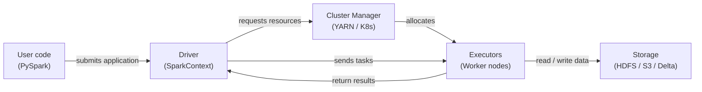

# Apache Spark

## Définition

Apache Spark est un moteur de calcul distribué open source conçu pour le traitement de données à grande échelle. Il a été créé à l'AMPLab de UC Berkeley en 2009 et donné à l'Apache Software Foundation, où il est devenu le framework dominant pour l'analytique big data. Spark exécute des calculs en mémoire sur un cluster de machines, surpassant largement les prédécesseurs basés sur le disque comme Hadoop MapReduce pour les charges de travail itératives — une propriété qui le rend particulièrement bien adapté à l'apprentissage automatique.

Spark fournit une API unifiée sur quatre charges de travail principales : le traitement par lots, l'analytique SQL, le streaming (Structured Streaming) et l'apprentissage automatique (MLlib). Cette unification signifie que les équipes peuvent utiliser un seul cluster et un seul modèle de programmation pour l'ensemble du pipeline de données ML — depuis l'ingestion brute de logs et l'ingénierie de features à l'échelle du pétaoctet jusqu'à l'entraînement distribué de modèles avec MLlib. PySpark, l'API Python, est l'interface la plus utilisée dans la communauté de data science.

Le modèle de programmation est construit autour de transformations et d'actions sur des collections distribuées. Les transformations (map, filter, join, groupBy) sont paresseuses — elles construisent un plan d'exécution mais ne s'exécutent pas jusqu'à ce qu'une action (count, collect, write) soit appelée. L'optimiseur de Spark (Catalyst) réécrit et optimise ce plan avant l'exécution, surpassant souvent du SQL ajusté manuellement. Le résultat est une API expressive et de haut niveau qui évolue d'un ordinateur portable (mode local) à des milliers de cœurs sans modifications de code.

## Fonctionnement

### RDDs et DataFrames

Les Resilient Distributed Datasets (RDDs) sont l'abstraction de bas niveau de Spark : des collections immuables, tolérantes aux pannes et partitionnées d'enregistrements distribuées sur un cluster. Les RDDs supportent des transformations arbitraires en Python, Scala ou Java mais n'offrent aucune information de schéma, de sorte que l'optimiseur a une visibilité limitée sur les données. Les **DataFrames** (et leur homologue typé, les Datasets en Scala/Java) ajoutent un schéma nommé au-dessus des RDDs et exposent une API de type SQL. L'optimiseur Catalyst peut appliquer le pushdown de prédicats, l'élagage de colonnes et la réorganisation des jointures aux requêtes DataFrame d'une manière qui n'est pas possible avec les RDDs bruts. En pratique, utilisez les DataFrames sauf si vous avez besoin de fonctionnalités que seuls les RDDs exposent.

### Spark SQL

Spark SQL vous permet d'interroger des DataFrames avec la syntaxe SQL standard, en mélangeant les appels SQL et API DataFrame dans le même programme. Il se connecte au metastore Hive, Delta Lake, Iceberg et d'autres formats de tables, permettant à Spark d'agir comme moteur de requête sur un data lakehouse. Dans les pipelines ML, Spark SQL est utilisé pour les requêtes d'agrégation de features — fenêtres glissantes, agrégations au niveau des utilisateurs et opérations de jointure sur de grandes tables — qui seraient prohibitivement lentes sur une seule machine.

### MLlib

MLlib est la bibliothèque d'apprentissage automatique distribué de Spark. Elle fournit des algorithmes pour la classification, la régression, le clustering, le filtrage collaboratif et l'ingénierie de features, tous implémentés pour s'exécuter en parallèle sur le cluster. L'API Pipeline (`pyspark.ml`) reprend la conception de scikit-learn : les étapes `Transformer` (scalers, encodeurs) et les étapes `Estimator` (ajustement de modèle) sont enchaînées dans un objet `Pipeline` qui peut être ajusté et sérialisé. MLlib est mieux utilisé lorsque les données d'entraînement sont trop volumineuses pour tenir en mémoire sur une seule machine, ou lorsque vous avez besoin d'une optimisation distribuée d'hyperparamètres via `CrossValidator`.

### Architecture driver et executor

Une application Spark a un processus **driver** et un ou plusieurs processus **executor**. Le driver exécute le programme de l'utilisateur, construit le plan logique, négocie les ressources avec le gestionnaire de cluster (YARN, Kubernetes ou Spark Standalone) et divise le travail en **tâches**. Les executors sont des processus JVM fonctionnant sur des nœuds workers ; chaque executor contient un nombre configurable de cœurs CPU et de slots mémoire (slots de tâches). Les tâches sont sérialisées et envoyées aux executors, qui traitent leurs partitions de données assignées et écrivent les résultats en mémoire, sur disque ou dans un sink de sortie. La tolérance aux pannes est obtenue en recalculant les partitions perdues à partir de leur lignage (la séquence de transformations qui les a produites).



## Quand utiliser / Quand NE PAS utiliser

| Utiliser quand | Éviter quand |
|----------|------------|
| Le jeu de données ne tient pas dans la RAM d'une seule machine (> ~50 Go) | Les données tiennent confortablement en mémoire — pandas ou Polars seront plus rapides |
| L'ingénierie de features nécessite des jointures ou agrégations sur des milliards de lignes | Votre équipe manque d'expérience avec les systèmes distribués et la gestion de clusters |
| Vous avez besoin d'entraînement ML distribué (MLlib) ou de recherche d'hyperparamètres | La surcharge de démarrage des jobs (JVM, allocation de cluster) est inacceptable pour les tâches sensibles à la latence |
| Vous avez déjà un cluster Spark (Databricks, EMR, Dataproc) | Vous avez besoin d'un traitement en temps réel sub-seconde (utilisez Flink ou Kafka Streams) |
| Vous souhaitez un moteur unifié pour le batch, le SQL et le streaming sur les mêmes données | Vos transformations sont une logique personnalisée complexe qui bénéficie du débogage mono-thread |

## Comparaisons

| Critère | Apache Spark | Pandas |
|-----------|-------------|--------|
| Échelle des données | Pétaoctets — partitionnés sur un cluster | Gigaoctets — limités par la RAM d'une seule machine |
| Modèle d'exécution | Distribué, parallèle, évaluation paresseuse | En processus, eager, mono-thread par défaut |
| Complexité de configuration | Élevée — cluster, JVM, gestion des dépendances | Faible — `pip install pandas` et exécuter |
| Performance sur petites données | Lente en raison de la sérialisation et de la surcharge de planification des tâches | Rapide — surcharge minimale, favorable au cache |
| Familiarité de l'API | PySpark est similaire à pandas mais avec une sémantique distribuée | Largement connu ; le standard pour la data science en Python |
| Intégration ML | MLlib pour l'entraînement distribué ; s'intègre avec XGBoost sur Spark | Écosystème scikit-learn ; le meilleur pour le ML sur une seule machine |

## Avantages et inconvénients

| Avantages | Inconvénients |
|------|------|
| Évolue jusqu'aux pétaoctets sans modifications de code | Infrastructure et complexité opérationnelle significatives |
| Moteur unifié pour le batch, le SQL et le streaming | Le démarrage de la JVM et la planification des tâches ajoutent de la latence — pas adapté aux petits jobs |
| Le traitement en mémoire est considérablement plus rapide que MapReduce basé sur le disque | La gestion de la mémoire (débordements, pression GC) nécessite un réglage attentif |
| Écosystème riche : Delta Lake, Iceberg, Hudi, intégration MLflow | PySpark sérialise les UDFs Python via Py4J — peut être lent pour la logique personnalisée |
| Tolérance aux pannes via le recalcul du lignage | Le débogage des jobs distribués est plus difficile que le code pandas sur une seule machine |

## Exemples de code

```python
"""
PySpark examples:
  1. DataFrame operations for feature engineering at scale
  2. MLlib Pipeline for training a logistic regression model

Requires: pyspark >= 3.4
Run locally with: spark-submit spark_ml_example.py
  or in a notebook with a SparkSession already available.
"""

from pyspark.sql import SparkSession
from pyspark.sql import functions as F
from pyspark.sql.types import DoubleType
from pyspark.ml import Pipeline
from pyspark.ml.feature import VectorAssembler, StandardScaler, StringIndexer
from pyspark.ml.classification import LogisticRegression
from pyspark.ml.evaluation import BinaryClassificationEvaluator


# --- 1. Create a SparkSession (local mode for demo) ---
spark = (
    SparkSession.builder
    .appName("MLPipelineExample")
    .master("local[*]")           # Use all local CPU cores
    .config("spark.sql.shuffle.partitions", "8")  # Reduce for small data
    .getOrCreate()
)

spark.sparkContext.setLogLevel("WARN")


# --- 2. Load raw data ---
# In production: spark.read.parquet("s3://bucket/path/") or .format("delta")
raw_df = spark.createDataFrame(
    [
        (1, 25.0, "engineer", 55000.0, 0),
        (2, 32.0, "manager", 85000.0, 1),
        (3, 28.0, "engineer", 62000.0, 0),
        (4, 45.0, "manager", 110000.0, 1),
        (5, 38.0, "analyst", 72000.0, 1),
        (6, 22.0, "analyst", 48000.0, 0),
        (7, 51.0, "manager", 125000.0, 1),
        (8, 29.0, "engineer", 59000.0, 0),
    ],
    schema=["id", "age", "role", "salary", "high_earner"],
)

print("=== Raw data ===")
raw_df.show()


# --- 3. DataFrame feature engineering ---
feature_df = (
    raw_df
    # Log-transform salary to reduce skew
    .withColumn("log_salary", F.log1p(F.col("salary")))
    # Normalized age within role group (window function)
    .withColumn(
        "age_norm",
        (F.col("age") - F.mean("age").over(
            __import__("pyspark.sql.window", fromlist=["Window"])
            .Window.partitionBy("role")
        )).cast(DoubleType())
    )
    # Drop the original salary column (replaced by log_salary)
    .drop("salary")
)

print("=== Engineered features ===")
feature_df.show()


# --- 4. MLlib Pipeline: encode → assemble → scale → train ---

# 4a. Encode categorical column 'role' to numeric index
role_indexer = StringIndexer(inputCol="role", outputCol="role_idx")

# 4b. Assemble feature columns into a single vector
assembler = VectorAssembler(
    inputCols=["age", "log_salary", "role_idx"],
    outputCol="raw_features",
)

# 4c. Standardize feature vector (zero mean, unit variance)
scaler = StandardScaler(
    inputCol="raw_features",
    outputCol="features",
    withMean=True,
    withStd=True,
)

# 4d. Logistic regression classifier
lr = LogisticRegression(
    featuresCol="features",
    labelCol="high_earner",
    maxIter=100,
    regParam=0.01,
)

# 4e. Build and fit the pipeline
pipeline = Pipeline(stages=[role_indexer, assembler, scaler, lr])

# Use the raw_df (with salary) because VectorAssembler picks log_salary after transform
train_df, test_df = raw_df.randomSplit([0.8, 0.2], seed=42)
model = pipeline.fit(train_df)

# --- 5. Evaluate ---
predictions = model.transform(test_df)
evaluator = BinaryClassificationEvaluator(labelCol="high_earner")
auc = evaluator.evaluate(predictions)
print(f"=== AUC on test set: {auc:.4f} ===")

predictions.select("id", "high_earner", "prediction", "probability").show()

# --- 6. Save model for serving ---
model.write().overwrite().save("/tmp/spark_lr_model")
print("Model saved to /tmp/spark_lr_model")

spark.stop()
```

## Ressources pratiques

- [Documentation Apache Spark](https://spark.apache.org/docs/latest/) — Référence officielle pour toutes les APIs incluant PySpark, SQL, Streaming et MLlib
- [Référence API PySpark](https://spark.apache.org/docs/latest/api/python/) — Documentation complète de l'API Python pour les DataFrames, SQL et MLlib
- [Databricks — Tutoriels Spark](https://docs.databricks.com/en/getting-started/index.html) — Notebooks pratiques couvrant Spark à grande échelle avec Delta Lake
- [Learning Spark, 2e édition (O'Reilly)](https://www.oreilly.com/library/view/learning-spark-2nd/9781492050032/) — Livre complet couvrant Spark 3.x, Structured Streaming et Delta Lake

## Voir aussi

- [Pipelines de données](/docs/mlops/data-engineering)
- [Apache Kafka](/docs/mlops/data-engineering/kafka)
- [Apache Airflow](/docs/mlops/data-engineering/airflow)
