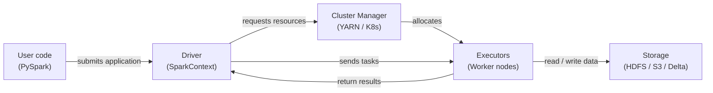

# Apache Spark

## Définition

Apache Spark est un moteur de calcul distribué open source conçu pour le traitement de données à grande échelle. Il a été créé à l'AMPLab de UC Berkeley en 2009 et donné à la Apache Software Foundation, où il est devenu le framework dominant pour l'analyse big data. Spark exécute des calculs en mémoire sur un cluster de machines, surpassant drastiquement les prédécesseurs basés sur le disque comme Hadoop MapReduce pour les charges de travail itératives — une propriété qui le rend particulièrement adapté au machine learning.

Spark fournit une API unifiée pour quatre charges de travail principales : traitement batch, analyses SQL, streaming (Structured Streaming) et machine learning (MLlib).

## Fonctionnement

### RDDs et DataFrames

Les Resilient Distributed Datasets (RDDs) sont l'abstraction de bas niveau de Spark. Les **DataFrames** ajoutent un schéma nommé sur les RDDs et exposent une API similaire à SQL. L'optimiseur Catalyst peut appliquer le predicate pushdown, l'élagage de colonnes et la réorganisation des jointures.

### Spark SQL

Spark SQL permet d'interroger les DataFrames avec la syntaxe SQL standard, en mélangeant les appels SQL et DataFrame API dans le même programme.

### MLlib

MLlib est la bibliothèque de machine learning distribué de Spark. L'API Pipeline (`pyspark.ml`) reflète la conception de scikit-learn.

### Architecture driver et executor

Une application Spark a un processus **driver** et un ou plusieurs processus **executor**. Le driver exécute le programme de l'utilisateur, construit le plan logique et divise le travail en **tâches**.



## Quand utiliser / Quand NE PAS utiliser

| Utiliser quand | Éviter quand |
|---|---|
| Le jeu de données ne tient pas dans la RAM d'une seule machine (> ~50 Go) | Les données tiennent confortablement en mémoire — pandas ou Polars seront plus rapides |
| L'ingénierie de features nécessite des jointures ou agrégations sur des milliards de lignes | Votre équipe manque d'expérience avec les systèmes distribués |
| Vous avez besoin d'entraînement ML distribué (MLlib) ou de recherche d'hyperparamètres | L'overhead de démarrage du job est inacceptable pour les tâches sensibles à la latence |
| Vous avez déjà un cluster Spark (Databricks, EMR, Dataproc) | Vous avez besoin d'un traitement temps réel sub-seconde |

## Comparaisons

| Critère | Apache Spark | Pandas |
|---|---|---|
| Échelle de données | Pétaoctets — partitionné sur un cluster | Gigaoctets — limité par la RAM d'une machine |
| Modèle d'exécution | Distribué, parallèle, évaluation lazy | In-process, eager, single-threaded par défaut |
| Complexité de configuration | Haute | Faible |
| Performance sur petites données | Lent dû à l'overhead de sérialisation | Rapide |

## Avantages et inconvénients

| Avantages | Inconvénients |
|---|---|
| Passe à l'échelle des pétaoctets sans changement de code | Complexité d'infrastructure et opérationnelle significative |
| Moteur unifié pour batch, SQL et streaming | Démarrage JVM et ordonnancement des tâches ajoutent de la latence |
| Traitement en mémoire dramatiquement plus rapide que MapReduce basé sur disque | La gestion de la mémoire nécessite un réglage soigneux |
| Riche écosystème : Delta Lake, Iceberg, Hudi, MLflow | PySpark sérialise les UDFs Python via Py4J |

## Exemple de code

```python
from pyspark.sql import SparkSession
from pyspark.sql import functions as F
from pyspark.ml import Pipeline
from pyspark.ml.feature import VectorAssembler, StandardScaler, StringIndexer
from pyspark.ml.classification import LogisticRegression
from pyspark.ml.evaluation import BinaryClassificationEvaluator

spark = (
    SparkSession.builder
    .appName("MLPipelineExample")
    .master("local[*]")
    .config("spark.sql.shuffle.partitions", "8")
    .getOrCreate()
)

raw_df = spark.createDataFrame(
    [(1, 25.0, "engineer", 55000.0, 0), (2, 32.0, "manager", 85000.0, 1),
     (3, 28.0, "engineer", 62000.0, 0), (4, 45.0, "manager", 110000.0, 1),
     (5, 38.0, "analyst", 72000.0, 1), (6, 22.0, "analyst", 48000.0, 0)],
    schema=["id", "age", "role", "salary", "high_earner"],
)

feature_df = raw_df.withColumn("log_salary", F.log1p(F.col("salary"))).drop("salary")

role_indexer = StringIndexer(inputCol="role", outputCol="role_idx")
assembler = VectorAssembler(inputCols=["age", "log_salary", "role_idx"], outputCol="raw_features")
scaler = StandardScaler(inputCol="raw_features", outputCol="features", withMean=True, withStd=True)
lr = LogisticRegression(featuresCol="features", labelCol="high_earner", maxIter=100, regParam=0.01)

pipeline = Pipeline(stages=[role_indexer, assembler, scaler, lr])
train_df, test_df = raw_df.randomSplit([0.8, 0.2], seed=42)
model = pipeline.fit(train_df)

predictions = model.transform(test_df)
evaluator = BinaryClassificationEvaluator(labelCol="high_earner")
auc = evaluator.evaluate(predictions)
print(f"=== AUC on test set: {auc:.4f} ===")

model.write().overwrite().save("/tmp/spark_lr_model")
spark.stop()
```

## Ressources pratiques

- [Documentation Apache Spark](https://spark.apache.org/docs/latest/) — Référence officielle pour toutes les APIs.
- [Référence API PySpark](https://spark.apache.org/docs/latest/api/python/) — Documentation complète de l'API Python.
- [Databricks — Tutoriels Spark](https://docs.databricks.com/en/getting-started/index.html) — Notebooks pratiques avec Spark et Delta Lake.
- [Learning Spark, 2nd edition (O'Reilly)](https://www.oreilly.com/library/view/learning-spark-2nd/9781492050032/) — Livre complet sur Spark 3.x.

## Voir aussi

- [Pipelines de données](/docs/mlops/data-engineering)
- [Apache Kafka](/docs/mlops/data-engineering/kafka)
- [Apache Airflow](/docs/mlops/data-engineering/airflow)
