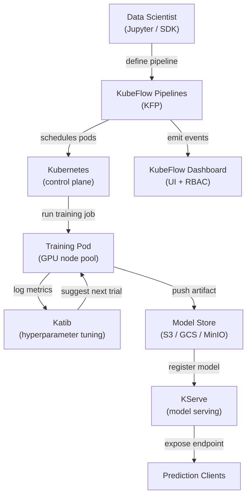

# KubeFlow

## Définition

KubeFlow est un kit d'outils ML open source conçu pour rendre le déploiement de workflows ML sur Kubernetes simple, portable et évolutif. Il a été créé à l'origine par Google et est maintenant un projet de la Cloud Native Computing Foundation (CNCF) avec une large adoption industrielle. KubeFlow n'essaie pas d'être une plateforme monolithique unique ; c'est plutôt une collection soigneusement sélectionnée de composants natifs Kubernetes qui résolvent chacun un problème distinct d'infrastructure ML.

Les composants principaux sont : **KubeFlow Pipelines (KFP)** pour définir et exécuter des workflows ML basés sur des DAGs en tant que travaux Kubernetes ; **Katib** pour le réglage automatisé des hyperparamètres et la recherche d'architecture neuronale utilisant l'optimisation bayésienne, la recherche aléatoire ou l'apprentissage par renforcement ; **KFServing (maintenant KServe)** pour le service de modèles évolutif avec mise à l'échelle sans serveur, déploiements canary et support de plusieurs runtimes de service ; et des **serveurs Jupyter Notebook** gérés par le tableau de bord KubeFlow pour le développement interactif dans un environnement multi-locataires. L'ensemble de la plateforme est installé via un ensemble unique de manifestes Kubernetes et géré via une interface web.

La force de KubeFlow est qu'il fonctionne sur n'importe quel cluster Kubernetes — on-premises, GKE, EKS, AKS ou un cluster kind local —, ce qui le rend adapté aux organisations qui exigent que les données restent dans leur propre infrastructure. Son principal coût est la complexité opérationnelle : la courbe d'apprentissage est abrupte, et opérer KubeFlow en production nécessite une solide expertise Kubernetes.

## Fonctionnement



### KubeFlow Pipelines (KFP)

KFP permet aux data scientists de définir des pipelines ML comme code Python en utilisant le SDK KFP. Chaque étape du pipeline est un composant conteneurisé : une fonction Python décorée avec `@dsl.component` est compilée en une spécification de conteneur que KFP exécute comme un pod Kubernetes. Le DAG du pipeline est compilé en un fichier de Représentation Intermédiaire (IR YAML) que le contrôleur backend de KFP planifie sur le cluster. Cette approche signifie que chaque étape est entièrement reproductible : l'image du conteneur est épinglée, les entrées et sorties sont des artefacts suivis dans le store de métadonnées de KFP (ML Metadata / MLMD), et l'ensemble du graphe d'exécution est visible dans l'interface avec les logs, entrées, sorties et statut par étape.

### Katib — Réglage des hyperparamètres

Katib est le composant AutoML de KubeFlow. Il définit une ressource personnalisée Kubernetes `Experiment` qui spécifie l'espace de recherche (plages et types de paramètres), la métrique objective (minimiser la perte, maximiser la précision) et l'algorithme de recherche (optimisation bayésienne via Processus Gaussien, CMA-ES, recherche aléatoire ou recherche en grille). Katib exécute des essais en parallèle — chaque essai est un travail d'entraînement complet — et utilise les résultats pour suggérer de meilleures configurations pour les essais suivants. L'intégration avec KFP signifie qu'un pipeline complet (données → ingénierie des features → entraînement → évaluation) peut être traité comme un seul essai Katib, permettant l'AutoML de bout en bout sur des pipelines complexes.

### KServe (anciennement KFServing)

KServe étend Kubernetes avec des ressources personnalisées `InferenceService` qui définissent de manière déclarative les déploiements de service de modèles. On spécifie le framework (sklearn, xgboost, pytorch, tensorflow, custom) et l'URI du modèle (chemin S3, PVC) et KServe gère : le téléchargement du modèle, la sélection du bon runtime de service, la configuration du proxy sidecar, l'exposition du point de terminaison via Istio et la mise à l'échelle des réplicas à zéro lorsqu'inactif (mode sans serveur). Les déploiements canary divisent le trafic entre deux versions du modèle par pourcentage, permettant des déploiements sécurisés. Les composants transformer et explainer permettent de connecter une logique de prétraitement et une explicabilité basée sur SHAP à côté du prédicteur.

### Multi-location et RBAC

Le tableau de bord KubeFlow implémente la multi-location via les espaces de noms Kubernetes : chaque utilisateur ou équipe obtient un espace de noms isolé avec ses propres quotas de ressources, serveurs de notebooks et exécutions de pipeline. Le Contrôle d'Accès Basé sur les Rôles (RBAC) restreint quels utilisateurs peuvent voir, exécuter ou gérer les pipelines et les modèles. Cela rend KubeFlow adapté aux grandes organisations où plusieurs équipes partagent un seul cluster GPU et ont besoin d'isolation sans clusters séparés.

## Quand utiliser / Quand NE PAS utiliser

| Utiliser quand | Éviter quand |
|---|---|
| Les charges de travail ML s'exécutent sur un cluster Kubernetes existant | L'équipe n'a pas d'expertise Kubernetes et pas d'ingénieur de plateforme dédié |
| L'orchestration complète de pipelines, l'AutoML et le service dans une plateforme sont nécessaires | Un service géré (SageMaker, Vertex AI) correspond à la stratégie du fournisseur cloud |
| Les exigences de résidence des données empêchent l'utilisation de services ML cloud gérés | Seul le service de modèles est nécessaire, pas l'orchestration complète de pipeline |
| L'organisation opère un cluster GPU partagé avec des besoins de multi-location | Les workflows ML sont suffisamment simples pour un seul script d'entraînement |
| Des fonctionnalités de service avancées (mise à l'échelle sans serveur, canary, transformers) sont requises | La rapidité de mise en production est plus importante que le contrôle de l'infrastructure |

## Comparaisons

| Critère | KubeFlow | ML sur Kubernetes (vanilla) |
|---|---|---|
| Complexité | Élevée — nombreux CRDs, contrôleurs et dépendances Istio | Moyenne — uniquement des objets Kubernetes standards |
| Fonctionnalités | Pipelines, AutoML (Katib), service (KServe), gestion des notebooks | Ce que l'on construit et configure manuellement |
| Courbe d'apprentissage | Abrupte — nécessite une connaissance du domaine Kubernetes + KubeFlow | Moyenne — connaissance K8s standard suffisante |
| Flexibilité | Modérée — extensible mais lié aux abstractions KubeFlow | Élevée — contrôle total sur chaque ressource Kubernetes |
| Options gérées | KubeFlow sur GKE (Vertex AI Pipelines), AWS Managed KubeFlow | N'importe quel Kubernetes géré (EKS, GKE, AKS) |
| Temps de configuration | Jours à semaines pour une installation de grade production | Heures à jours selon la complexité de la charge de travail |

## Avantages et inconvénients

| Avantages | Inconvénients |
|---|---|
| Plateforme ML unifiée — pipelines, réglage, service en un système | Complexité opérationnelle très élevée et grand nombre de pièces mobiles |
| Agnostique au cloud — fonctionne sur n'importe quel cluster Kubernetes | Courbe d'apprentissage abrupte ; nécessite une expertise Kubernetes pour opérer |
| Service de modèles sans serveur avec mise à l'échelle automatique à zéro | Installation gourmande en ressources (Istio, Argo Workflows, MLMD, Knative) |
| Multi-location solide avec isolation des espaces de noms et RBAC | Les mises à niveau entre les versions KubeFlow peuvent être complexes |
| Communauté CNCF active et larges intégrations d'écosystème | Le débogage des échecs nécessite souvent de comprendre plusieurs couches (K8s → Argo → Python SDK) |

## Exemples de code

```python
# kubeflow_pipeline.py
# KubeFlow Pipelines v2 SDK — defines a two-step ML pipeline:
#   1. Data preprocessing component
#   2. Training component
# Requires: pip install kfp==2.*

from kfp import dsl
from kfp.client import Client


# --- Component 1: Preprocess raw CSV data ---

@dsl.component(
    base_image="python:3.11-slim",
    packages_to_install=["pandas==2.2.0", "scikit-learn==1.4.0"],
)
def preprocess(
    raw_data_path: str,
    output_features: dsl.Output[dsl.Dataset],
) -> None:
    """
    Reads raw CSV, applies feature engineering, and writes features as Parquet.
    KFP tracks output_features as a Dataset artifact with URI and metadata.
    """
    import pandas as pd
    from sklearn.preprocessing import StandardScaler

    df = pd.read_csv(raw_data_path)

    # Simple feature engineering: scale numeric columns
    scaler = StandardScaler()
    numeric_cols = df.select_dtypes("number").columns.tolist()
    df[numeric_cols] = scaler.fit_transform(df[numeric_cols])

    # KFP provides output_features.path — write artifact there
    df.to_parquet(output_features.path, index=False)
    print(f"Wrote {len(df)} rows to {output_features.path}")


# --- Component 2: Train a model on the preprocessed features ---

@dsl.component(
    base_image="python:3.11-slim",
    packages_to_install=["pandas==2.2.0", "scikit-learn==1.4.0", "joblib==1.3.0"],
)
def train(
    features: dsl.Input[dsl.Dataset],
    n_estimators: int,
    model_output: dsl.Output[dsl.Model],
    metrics_output: dsl.Output[dsl.Metrics],
) -> None:
    """
    Trains a RandomForestClassifier and writes the model artifact + metrics.
    """
    import json
    import joblib
    import pandas as pd
    from sklearn.ensemble import RandomForestClassifier
    from sklearn.model_selection import train_test_split
    from sklearn.metrics import accuracy_score

    df = pd.read_parquet(features.path)
    X = df.drop(columns=["label"]).values
    y = df["label"].values
    X_train, X_test, y_train, y_test = train_test_split(X, y, test_size=0.2, random_state=42)

    clf = RandomForestClassifier(n_estimators=n_estimators, random_state=42)
    clf.fit(X_train, y_train)

    accuracy = float(accuracy_score(y_test, clf.predict(X_test)))

    # Write model artifact (KFP tracks the URI and lineage)
    joblib.dump(clf, model_output.path)

    # Log metrics — visible in the KubeFlow Pipelines UI
    metrics_output.log_metric("accuracy", accuracy)
    metrics_output.log_metric("n_estimators", n_estimators)
    print(f"Accuracy: {accuracy:.4f}")


# --- Pipeline definition ---

@dsl.pipeline(
    name="fraud-detection-pipeline",
    description="Two-stage pipeline: preprocess CSV data, then train RandomForest.",
)
def fraud_pipeline(
    raw_data_path: str = "gs://my-bucket/data/train.csv",
    n_estimators: int = 100,
) -> None:
    # Step 1: preprocess — runs in its own pod
    preprocess_task = preprocess(raw_data_path=raw_data_path)

    # Step 2: train — depends on the Dataset artifact from step 1
    train_task = train(
        features=preprocess_task.outputs["output_features"],
        n_estimators=n_estimators,
    )
    # Assign this task to a node pool with GPU (optional resource request)
    train_task.set_accelerator_type("NVIDIA_TESLA_T4").set_accelerator_limit(1)


# --- Submit the pipeline to a running KubeFlow Pipelines instance ---

if __name__ == "__main__":
    # Connect to KFP backend (port-forward: kubectl port-forward -n kubeflow svc/ml-pipeline 8888:8888)
    client = Client(host="http://localhost:8888")

    run = client.create_run_from_pipeline_func(
        pipeline_func=fraud_pipeline,
        arguments={
            "raw_data_path": "gs://my-bucket/data/train.csv",
            "n_estimators": 200,
        },
        run_name="fraud-pipeline-run-v1",
        experiment_name="fraud-detection",
    )
    print(f"Pipeline run created: {run.run_id}")
    print(f"View at: http://localhost:8888/#/runs/details/{run.run_id}")
```

## Ressources pratiques

- [Documentation officielle KubeFlow](https://www.kubeflow.org/docs/) — Vue d'ensemble de l'architecture, guides des composants et instructions d'installation.
- [Référence SDK KubeFlow Pipelines](https://kubeflow-pipelines.readthedocs.io/) — Référence complète de l'API pour le SDK Python KFP v2.
- [Documentation KServe](https://kserve.github.io/website/) — Runtime de service, spécification InferenceService et guide de déploiement canary.
- [Guide de réglage des hyperparamètres Katib](https://www.kubeflow.org/docs/components/katib/overview/) — Spécification des expériences, algorithmes de recherche et intégration avec les opérateurs d'entraînement.

## Voir aussi

- [ML sur Kubernetes](/docs/mlops/deployment/ml-kubernetes)
- [Service de modèles](/docs/mlops/deployment/model-serving)
- [Surveillance](/docs/mlops/monitoring)
