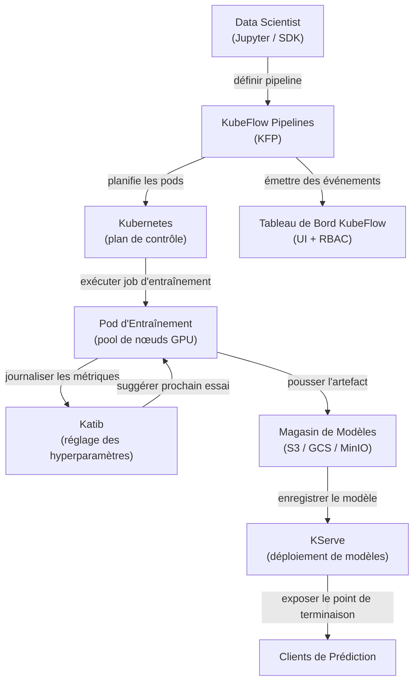

# KubeFlow

## Définition

KubeFlow est un kit d'outils ML open source conçu pour rendre le déploiement de flux de travail ML sur Kubernetes simple, portable et évolutif. Il a été créé à l'origine par Google et est maintenant un projet de la Cloud Native Computing Foundation (CNCF) avec une large adoption dans l'industrie. KubeFlow ne cherche pas à être une plateforme monolithique unique ; il s'agit plutôt d'une collection organisée de composants natifs Kubernetes qui résolvent chacun un problème d'infrastructure ML distinct.

Les composants principaux sont : **KubeFlow Pipelines (KFP)** pour définir et exécuter des flux de travail ML basés sur des DAG en tant que jobs Kubernetes ; **Katib** pour le réglage automatisé des hyperparamètres et la recherche d'architecture neuronale en utilisant l'optimisation bayésienne, la recherche aléatoire ou l'apprentissage par renforcement ; **KFServing (maintenant KServe)** pour le déploiement de modèles évolutif avec une mise à l'échelle sans serveur, des déploiements canary et la prise en charge de plusieurs runtimes de service ; et des **Jupyter Notebook Servers** gérés par le tableau de bord KubeFlow pour le développement interactif dans un environnement multi-locataire. Toute la plateforme est installée via un seul ensemble de manifestes Kubernetes et gérée via une interface web.

La force de KubeFlow est qu'il fonctionne sur n'importe quel cluster Kubernetes — on-premises, GKE, EKS, AKS ou un cluster kind local — ce qui le rend adapté aux organisations qui exigent que les données restent dans leur propre infrastructure. Son principal coût est la complexité opérationnelle : la courbe d'apprentissage est raide, et l'exploitation de KubeFlow en production nécessite une solide expertise Kubernetes.

## Fonctionnement



### KubeFlow Pipelines (KFP)

KFP permet aux data scientists de définir des pipelines ML en tant que code Python en utilisant le SDK KFP. Chaque étape du pipeline est un composant conteneurisé : une fonction Python décorée avec `@dsl.component` est compilée en une spécification de conteneur que KFP exécute en tant que pod Kubernetes. Le DAG du pipeline est compilé dans un fichier de Représentation Intermédiaire (IR YAML) que le contrôleur backend de KFP planifie sur le cluster. Cette approche signifie que chaque étape est entièrement reproductible : l'image du conteneur est épinglée, les entrées et sorties sont des artefacts suivis dans le magasin de métadonnées de KFP (ML Metadata / MLMD), et l'intégralité du graphe d'exécution est visible dans l'interface avec les journaux, les entrées, les sorties et le statut par étape.

### Katib — Réglage des hyperparamètres

Katib est le composant AutoML de KubeFlow. Il définit une ressource personnalisée Kubernetes `Experiment` qui spécifie l'espace de recherche (plages et types de paramètres), la métrique objectif (minimiser la perte, maximiser la précision) et l'algorithme de recherche (optimisation bayésienne via Processus Gaussien, CMA-ES, recherche aléatoire ou recherche par grille). Katib exécute des essais parallèles — chaque essai est un job d'entraînement complet — et utilise les résultats pour suggérer de meilleures configurations pour les essais suivants. L'intégration avec KFP signifie qu'un pipeline complet (données → ingénierie de caractéristiques → entraînement → évaluation) peut être traité comme un seul essai Katib, permettant l'AutoML de bout en bout sur des pipelines complexes.

### KServe (anciennement KFServing)

KServe étend Kubernetes avec des ressources personnalisées `InferenceService` qui définissent de manière déclarative les déploiements de service de modèles. On spécifie le framework (sklearn, xgboost, pytorch, tensorflow, personnalisé) et l'URI du modèle (chemin S3, PVC) et KServe gère : télécharger le modèle, sélectionner le bon runtime de service, configurer le proxy sidecar, exposer le point de terminaison via Istio et mettre à l'échelle les répliques à zéro lorsqu'elles sont inactives (mode sans serveur). Les déploiements canary divisent le trafic entre deux versions du modèle par pourcentage, permettant des déploiements sécurisés. Les composants de transformateur et d'explicateur permettent de connecter une logique de prétraitement et une explicabilité basée sur SHAP aux côtés du prédicteur.

### Multi-locataire et RBAC

Le tableau de bord KubeFlow implémente la multi-location via les namespaces Kubernetes : chaque utilisateur ou équipe obtient un namespace isolé avec ses propres quotas de ressources, serveurs de notebooks et exécutions de pipelines. Le Contrôle d'Accès Basé sur les Rôles (RBAC) restreint quels utilisateurs peuvent voir, exécuter ou gérer les pipelines et les modèles. Cela rend KubeFlow adapté aux grandes organisations où plusieurs équipes partagent un seul cluster GPU et ont besoin d'isolation sans clusters séparés.

## Quand utiliser / Quand NE PAS utiliser

| Utiliser quand | Éviter quand |
|---|---|
| Des charges de travail ML sont exécutées sur un cluster Kubernetes existant | L'équipe n'a pas d'expertise Kubernetes ni d'ingénieur de plateforme dédié |
| Une orchestration complète de pipelines, AutoML et service dans une plateforme sont nécessaires | Un service géré (SageMaker, Vertex AI) correspond à la stratégie du fournisseur cloud |
| Les exigences de résidence des données empêchent d'utiliser les services ML cloud gérés | Seul le service de modèles est nécessaire, pas l'orchestration complète de pipelines |
| L'organisation exploite un cluster GPU partagé avec des besoins multi-locataires | Les flux de travail ML sont suffisamment simples pour un seul script d'entraînement |
| Des fonctionnalités de service avancées (mise à l'échelle sans serveur, canary, transformateurs) sont requises | La rapidité de mise en production est plus importante que le contrôle de l'infrastructure |

## Comparaisons

| Critère | KubeFlow | ML sur Kubernetes (vanilla) |
|---|---|---|
| Complexité | Élevée — nombreux CRDs, contrôleurs et dépendances Istio | Moyenne — uniquement des objets Kubernetes standard |
| Fonctionnalités | Pipelines, AutoML (Katib), service (KServe), gestion des notebooks | Ce que l'on construit et configure manuellement |
| Courbe d'apprentissage | Raide — nécessite des connaissances spécifiques à Kubernetes + KubeFlow | Moyenne — connaissance standard de K8s suffisante |
| Flexibilité | Modérée — extensible mais lié aux abstractions de KubeFlow | Élevée — contrôle total sur chaque ressource Kubernetes |
| Options gérées | Kubeflow sur GKE (Vertex AI Pipelines), AWS Managed KubeFlow | Tout Kubernetes géré (EKS, GKE, AKS) |
| Temps de configuration | Jours à semaines pour une installation de niveau production | Heures à jours selon la complexité de la charge de travail |

## Avantages et inconvénients

| Avantages | Inconvénients |
|---|---|
| Plateforme ML unifiée — pipelines, réglage, service dans un seul système | Très haute complexité opérationnelle et grand nombre de composants mobiles |
| Agnostique au cloud — fonctionne sur n'importe quel cluster Kubernetes | Courbe d'apprentissage raide ; nécessite une expertise Kubernetes pour opérer |
| Service de modèles sans serveur avec mise à l'échelle automatique à zéro | Installation gourmande en ressources (Istio, Argo Workflows, MLMD, Knative) |
| Multi-location robuste avec isolation des namespaces et RBAC | Les mises à niveau entre les versions de KubeFlow peuvent être complexes |
| Communauté CNCF active et intégrations larges de l'écosystème | Le débogage des pannes nécessite souvent de comprendre plusieurs couches (K8s → Argo → Python SDK) |

## Exemples de code

```python
# kubeflow_pipeline.py
# SDK KubeFlow Pipelines v2 — définit un pipeline ML en deux étapes :
#   1. Composant de prétraitement des données
#   2. Composant d'entraînement
# Nécessite : pip install kfp==2.*

from kfp import dsl
from kfp.client import Client


# --- Composant 1 : Prétraiter les données CSV brutes ---

@dsl.component(
    base_image="python:3.11-slim",
    packages_to_install=["pandas==2.2.0", "scikit-learn==1.4.0"],
)
def preprocess(
    raw_data_path: str,
    output_features: dsl.Output[dsl.Dataset],
) -> None:
    """
    Lit le CSV brut, applique l'ingénierie des caractéristiques et écrit les caractéristiques en Parquet.
    KFP suit output_features comme un artefact Dataset avec URI et métadonnées.
    """
    import pandas as pd
    from sklearn.preprocessing import StandardScaler

    df = pd.read_csv(raw_data_path)

    # Ingénierie des caractéristiques simple : mise à l'échelle des colonnes numériques
    scaler = StandardScaler()
    numeric_cols = df.select_dtypes("number").columns.tolist()
    df[numeric_cols] = scaler.fit_transform(df[numeric_cols])

    # KFP fournit output_features.path — écrire l'artefact là
    df.to_parquet(output_features.path, index=False)
    print(f"Wrote {len(df)} rows to {output_features.path}")


# --- Composant 2 : Entraîner un modèle sur les caractéristiques prétraitées ---

@dsl.component(
    base_image="python:3.11-slim",
    packages_to_install=["pandas==2.2.0", "scikit-learn==1.4.0", "joblib==1.3.0"],
)
def train(
    features: dsl.Input[dsl.Dataset],
    n_estimators: int,
    model_output: dsl.Output[dsl.Model],
    metrics_output: dsl.Output[dsl.Metrics],
) -> None:
    """
    Entraîne un RandomForestClassifier et écrit l'artefact du modèle + les métriques.
    """
    import json
    import joblib
    import pandas as pd
    from sklearn.ensemble import RandomForestClassifier
    from sklearn.model_selection import train_test_split
    from sklearn.metrics import accuracy_score

    df = pd.read_parquet(features.path)
    X = df.drop(columns=["label"]).values
    y = df["label"].values
    X_train, X_test, y_train, y_test = train_test_split(X, y, test_size=0.2, random_state=42)

    clf = RandomForestClassifier(n_estimators=n_estimators, random_state=42)
    clf.fit(X_train, y_train)

    accuracy = float(accuracy_score(y_test, clf.predict(X_test)))

    # Écrire l'artefact du modèle (KFP suit l'URI et la lignée)
    joblib.dump(clf, model_output.path)

    # Journaliser les métriques — visibles dans l'UI KubeFlow Pipelines
    metrics_output.log_metric("accuracy", accuracy)
    metrics_output.log_metric("n_estimators", n_estimators)
    print(f"Accuracy: {accuracy:.4f}")


# --- Définition du pipeline ---

@dsl.pipeline(
    name="fraud-detection-pipeline",
    description="Pipeline en deux étapes : prétraiter les données CSV, puis entraîner RandomForest.",
)
def fraud_pipeline(
    raw_data_path: str = "gs://my-bucket/data/train.csv",
    n_estimators: int = 100,
) -> None:
    # Étape 1 : prétraitement — s'exécute dans son propre pod
    preprocess_task = preprocess(raw_data_path=raw_data_path)

    # Étape 2 : entraînement — dépend de l'artefact Dataset de l'étape 1
    train_task = train(
        features=preprocess_task.outputs["output_features"],
        n_estimators=n_estimators,
    )
    # Assigner cette tâche à un pool de nœuds avec GPU (demande de ressources optionnelle)
    train_task.set_accelerator_type("NVIDIA_TESLA_T4").set_accelerator_limit(1)


# --- Soumettre le pipeline à une instance KubeFlow Pipelines en cours d'exécution ---

if __name__ == "__main__":
    # Se connecter au backend KFP (port-forward : kubectl port-forward -n kubeflow svc/ml-pipeline 8888:8888)
    client = Client(host="http://localhost:8888")

    run = client.create_run_from_pipeline_func(
        pipeline_func=fraud_pipeline,
        arguments={
            "raw_data_path": "gs://my-bucket/data/train.csv",
            "n_estimators": 200,
        },
        run_name="fraud-pipeline-run-v1",
        experiment_name="fraud-detection",
    )
    print(f"Pipeline run created: {run.run_id}")
    print(f"View at: http://localhost:8888/#/runs/details/{run.run_id}")
```

## Ressources pratiques

- [Documentation officielle de KubeFlow](https://www.kubeflow.org/docs/) — Vue d'ensemble de l'architecture, guides des composants et instructions d'installation.
- [Référence du SDK KubeFlow Pipelines](https://kubeflow-pipelines.readthedocs.io/) — Référence complète de l'API pour le SDK Python KFP v2.
- [Documentation de KServe](https://kserve.github.io/website/) — Runtime de service, spécification InferenceService et guide de déploiement canary.
- [Guide de réglage des hyperparamètres Katib](https://www.kubeflow.org/docs/components/katib/overview/) — Spécification des expériences, algorithmes de recherche et intégration avec les opérateurs d'entraînement.

## Voir aussi

- [ML sur Kubernetes](/docs/mlops/deployment/ml-kubernetes)
- [Déploiement de modèles](/docs/mlops/deployment/model-serving)
- [Surveillance](/docs/mlops/monitoring)
