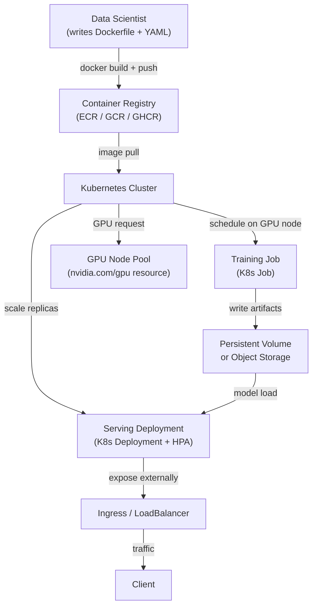

# ML sur Kubernetes

## Définition

Kubernetes (K8s) est une plateforme d'orchestration de conteneurs qui automatise le déploiement, la mise à l'échelle et la gestion des charges de travail conteneurisées. Bien que Kubernetes ait été conçu pour les services web sans état, la communauté ML l'a largement adopté comme infrastructure de base pour les travaux d'entraînement, le scoring par lots et le service de modèles — car il résout les problèmes d'infrastructure ML les plus difficiles : isolation des ressources, environnements reproductibles, ordonnancement GPU et mise à l'échelle horizontale.

Exécuter du ML sur Kubernetes vanilla — sans abstraction de niveau supérieur comme [KubeFlow](/docs/mlops/deployment/kubeflow) — signifie composer des primitives Kubernetes standards : `Job` pour les exécutions d'entraînement ponctuelles, `CronJob` pour le réentraînement programmé, `Deployment` pour les instances de service à longue durée de vie, et `HorizontalPodAutoscaler` pour l'autoscaling. Cette approche donne aux équipes un contrôle total sur chaque aspect de leurs charges de travail, au prix d'une création YAML plus importante et de moins d'outillage ML spécifique intégré.

La différence essentielle par rapport à l'exécution de ML sur des VMs bare-metal est que Kubernetes fournit une gestion déclarative des ressources : on spécifie combien de CPU, RAM et GPU un travail d'entraînement nécessite, et l'ordonnanceur le place automatiquement sur un nœud approprié. Kubernetes gère également les défaillances de nœuds, les redémarrages de pods et les déploiements continus sans intervention manuelle. Pour les équipes ML qui opèrent déjà un cluster Kubernetes (ou dont l'organisation en possède un), c'est souvent le chemin pragmatique vers la production avant d'investir dans une plateforme complète comme KubeFlow.

## Fonctionnement



### Conteneurisation des modèles ML

La première étape pour exécuter du ML sur Kubernetes consiste à empaqueter le code du modèle et ses dépendances dans une image Docker. Un Dockerfile ML bien structuré utilise des builds multi-étapes pour séparer la couche d'installation des dépendances (qui change rarement et est cacheable) de la couche de code applicatif (qui change fréquemment). L'image de base doit être épinglée à une version spécifique — pour les charges de travail GPU, NVIDIA fournit des images de base `nvcr.io/nvidia/pytorch` et `nvcr.io/nvidia/tensorflow` qui incluent CUDA, cuDNN et NCCL préinstallés et validés ensemble. L'image résultante est poussée vers un registre de conteneurs et référencée par nom et condensé (pas `latest`) dans les manifestes Kubernetes, garantissant que le même environnement exact est utilisé à chaque fois.

### Ordonnancement GPU et gestion des ressources

Kubernetes prend en charge l'ordonnancement GPU via le plugin de périphériques NVIDIA, qui expose les GPU comme une ressource ordonnançable (`nvidia.com/gpu`). Un pod demandant `nvidia.com/gpu: 1` ne sera planifié que sur un nœud disposant d'un GPU libre, et le GPU est alloué exclusivement à ce pod pendant toute sa durée de vie. Les pools de nœuds sont généralement configurés avec différents types de GPU (T4 pour l'inférence, A100 pour les grands travaux d'entraînement) et étiquetés en conséquence, permettant aux pods d'utiliser `nodeSelector` ou `nodeAffinity` pour cibler le matériel approprié. Les quotas de ressources au niveau de l'espace de noms empêchent qu'une seule équipe monopolise la capacité GPU du cluster.

### Travaux d'entraînement

Les exécutions d'entraînement ponctuelles sont exprimées comme des objets `Job` Kubernetes. Un Job crée un ou plusieurs pods, attend leur complétion réussie (code de sortie 0) et enregistre le résultat. Pour l'entraînement distribué sur plusieurs GPU ou nœuds, le `training-operator` (anciennement le Kubeflow Training Operator, mais déployable de manière autonome) étend Kubernetes avec les ressources personnalisées `PyTorchJob` et `TFJob` qui coordonnent l'entraînement multi-nœuds, multi-GPU avec PyTorch DDP ou Horovod. Chaque pod worker reçoit la même image de conteneur mais différentes variables d'environnement de rang et de taille de monde, permettant l'entraînement parallèle de données avec rendezvous automatique.

### Déploiements de service et autoscaling

Le service de modèles est exprimé comme un `Deployment` Kubernetes avec un nombre de réplicas souhaité et des demandes/limites de ressources. Un `Service` de type `ClusterIP` achemine le trafic entre les réplicas, et un service `Ingress` ou `LoadBalancer` expose le point de terminaison en externe. Le `HorizontalPodAutoscaler` (HPA) met à l'échelle le nombre de réplicas selon l'utilisation CPU, les métriques personnalisées (ex. : requêtes par seconde de Prometheus) ou les métriques externes (ex. : profondeur de file SQS pour les workers batch). Pour le service sensible à la latence, les `PodDisruptionBudgets` garantissent que les mises à jour continues ne mettent jamais hors service plus d'une fraction configurable de réplicas simultanément.

## Quand utiliser / Quand NE PAS utiliser

| Utiliser quand | Éviter quand |
|---|---|
| L'organisation opère déjà un cluster Kubernetes | L'équipe n'a pas d'expérience Kubernetes et aucune équipe de plateforme pour la soutenir |
| Un contrôle total sur l'infrastructure est requis (on-premises, air-gapped) | Un service ML géré (SageMaker, Vertex AI) est disponible et correspond au cas d'usage |
| Les charges de travail ML doivent partager un cluster avec d'autres charges de travail d'ingénierie | La simplicité d'une VM ou d'un travail d'entraînement cloud est suffisante |
| L'ordonnancement GPU sans la surcharge d'une plateforme ML complète est nécessaire | Le coût de configuration et de maintenance de K8s dépasse les bénéfices opérationnels |
| La portabilité entre fournisseurs cloud est une exigence stricte | AutoML, le suivi d'expériences ou la multi-location sont nécessaires (considérer KubeFlow) |

## Comparaisons

| Critère | ML sur Kubernetes (vanilla) | KubeFlow |
|---|---|---|
| Complexité | Moyenne — objets K8s standards | Élevée — nombreux CRDs, Istio, Argo, MLMD |
| Fonctionnalités | Manuel — construire ce dont on a besoin | Intégrées : pipelines, AutoML (Katib), service (KServe), notebooks |
| Courbe d'apprentissage | Moyenne — connaissances K8s suffisantes | Abrupte — nécessite une connaissance spécifique KubeFlow en plus de K8s |
| Flexibilité | Élevée — utilisation sans restriction des primitives K8s | Modérée — liée aux abstractions KubeFlow |
| Options gérées | EKS, GKE, AKS (tout K8s géré) | Vertex AI Pipelines (basé GKE), AWS Managed KubeFlow |
| Temps de configuration | Heures à jours | Jours à semaines |

## Avantages et inconvénients

| Avantages | Inconvénients |
|---|---|
| Contrôle total — utiliser n'importe quelle ressource K8s sans contraintes de framework | Tous les outils ML spécifiques (UI de pipeline, suivi d'expériences) doivent être ajoutés séparément |
| Ordonnancement GPU et entraînement multi-nœuds avec le training-operator | Lourd en YAML — la création de manifestes peut être fastidieuse et sujette aux erreurs |
| Fonctionne sur n'importe quel cloud ou cluster on-premises (sans dépendance fournisseur) | Le débogage GPU sur K8s nécessite une familiarité avec les taints de nœuds, les limites et le plugin de périphériques |
| Déploiements continus et autoscaling avec le HPA K8s standard | La configuration des quotas de ressources et de l'affinité de nœuds nécessite l'implication de l'équipe de plateforme |
| S'intègre aux workflows GitOps existants (Argo CD, Flux) | Pas de registre de modèles, de suivi d'expériences ni d'UI de pipeline intégrés |

## Exemples de code

```dockerfile
# Dockerfile — Multi-stage build for an ML model serving image
# Stage 1: install Python dependencies (cacheable layer)
# Stage 2: copy application code on top

# --- Stage 1: dependency builder ---
FROM python:3.11-slim AS builder

WORKDIR /build

# Install build tools and compile dependencies
RUN apt-get update && apt-get install -y --no-install-recommends \
    gcc \
    libgomp1 \
 && rm -rf /var/lib/apt/lists/*

COPY requirements.txt .
# Install dependencies into an isolated prefix so we can copy only them to the final image
RUN pip install --prefix=/install --no-cache-dir -r requirements.txt


# --- Stage 2: lean runtime image ---
FROM python:3.11-slim AS runtime

WORKDIR /app

# Copy only the installed packages from the builder (keeps image small)
COPY --from=builder /install /usr/local

# Copy application source code
COPY src/ ./src/

# The model artifact is mounted via a Kubernetes PersistentVolumeClaim or downloaded at startup
# It is NOT baked into the image to keep image size manageable
ENV MODEL_PATH=/models/model.joblib
ENV MODEL_VERSION=unknown
ENV PORT=8080

EXPOSE 8080

# Run as non-root for security best practices
RUN useradd -m appuser
USER appuser

CMD ["python", "-m", "uvicorn", "src.fastapi_serving:app", "--host", "0.0.0.0", "--port", "8080"]
```

```yaml
# k8s-manifests.yaml
# Three Kubernetes resources:
#   1. Deployment — runs the model serving pods
#   2. Service — routes traffic to the pods
#   3. HorizontalPodAutoscaler — scales replicas based on CPU usage

---
apiVersion: apps/v1
kind: Deployment
metadata:
  name: fraud-detector
  namespace: ml-serving
  labels:
    app: fraud-detector
    version: v1
spec:
  replicas: 2
  selector:
    matchLabels:
      app: fraud-detector
  strategy:
    type: RollingUpdate
    rollingUpdate:
      maxSurge: 1          # allow one extra pod during rollout
      maxUnavailable: 0    # never take a pod down before a new one is ready
  template:
    metadata:
      labels:
        app: fraud-detector
        version: v1
    spec:
      # Pull the model from an init container instead of baking it into the image
      initContainers:
        - name: download-model
          image: amazon/aws-cli:2.15.0
          command:
            - aws
            - s3
            - cp
            - s3://my-ml-bucket/models/fraud-detector/v1/model.joblib
            - /models/model.joblib
          env:
            - name: AWS_REGION
              value: us-east-1
          volumeMounts:
            - name: model-volume
              mountPath: /models

      containers:
        - name: serving
          image: ghcr.io/org/fraud-detector:sha-abc1234  # pinned by digest, not latest
          ports:
            - containerPort: 8080
          env:
            - name: MODEL_PATH
              value: /models/model.joblib
            - name: MODEL_VERSION
              value: v1
          resources:
            requests:
              cpu: "500m"
              memory: "512Mi"
            limits:
              cpu: "1"
              memory: "1Gi"
              # Uncomment for GPU-based inference:
              # nvidia.com/gpu: "1"
          volumeMounts:
            - name: model-volume
              mountPath: /models
          # Liveness probe — restart if the app hangs
          livenessProbe:
            httpGet:
              path: /health
              port: 8080
            initialDelaySeconds: 15
            periodSeconds: 10
          # Readiness probe — do not send traffic until model is loaded
          readinessProbe:
            httpGet:
              path: /health
              port: 8080
            initialDelaySeconds: 10
            periodSeconds: 5

      volumes:
        - name: model-volume
          emptyDir: {}  # ephemeral volume shared between init and main containers

---
apiVersion: v1
kind: Service
metadata:
  name: fraud-detector
  namespace: ml-serving
spec:
  selector:
    app: fraud-detector
  ports:
    - name: http
      port: 80
      targetPort: 8080
  type: ClusterIP

---
apiVersion: autoscaling/v2
kind: HorizontalPodAutoscaler
metadata:
  name: fraud-detector-hpa
  namespace: ml-serving
spec:
  scaleTargetRef:
    apiVersion: apps/v1
    kind: Deployment
    name: fraud-detector
  minReplicas: 2
  maxReplicas: 10
  metrics:
    - type: Resource
      resource:
        name: cpu
        target:
          type: Utilization
          averageUtilization: 70   # scale out when average CPU exceeds 70%
```

```bash
# Useful kubectl commands for ML workloads on Kubernetes

# Check GPU node availability and allocatable GPUs
kubectl get nodes -l accelerator=nvidia-tesla-t4 -o custom-columns="NODE:.metadata.name,GPU:.status.allocatable.nvidia\.com/gpu"

# Watch pod startup (useful for debugging model download in init containers)
kubectl logs -n ml-serving deploy/fraud-detector -c download-model --follow

# View resource usage of serving pods
kubectl top pods -n ml-serving -l app=fraud-detector

# Scale the deployment manually (overrides HPA temporarily)
kubectl scale deploy/fraud-detector -n ml-serving --replicas=4

# Trigger a rolling update with a new image
kubectl set image deploy/fraud-detector serving=ghcr.io/org/fraud-detector:sha-def5678 -n ml-serving

# Watch rollout status
kubectl rollout status deploy/fraud-detector -n ml-serving
```

## Ressources pratiques

- [Documentation officielle Kubernetes](https://kubernetes.io/docs/) — Référence complète pour tous les concepts Kubernetes et les objets API.
- [NVIDIA GPU Operator pour Kubernetes](https://docs.nvidia.com/datacenter/cloud-native/gpu-operator/overview.html) — Automatise la configuration des pilotes GPU, des plugins de périphériques et de la surveillance sur les nœuds K8s.
- [Kubeflow Training Operator](https://www.kubeflow.org/docs/components/training/) — CRDs autonomes pour PyTorchJob, TFJob et l'entraînement distribué MPI (déployable sans KubeFlow complet).
- [Documentation HPA Kubernetes](https://kubernetes.io/docs/tasks/run-application/horizontal-pod-autoscale/) — Guide officiel pour l'autoscaling CPU, mémoire et métriques personnalisées.

## Voir aussi

- [KubeFlow](/docs/mlops/deployment/kubeflow)
- [Service de modèles](/docs/mlops/deployment/model-serving)
- [Terraform pour l'infrastructure ML](/docs/mlops/iac/terraform)
