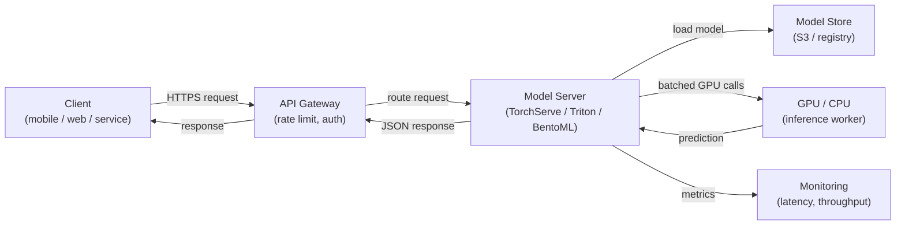

# Service de modèles

## Définition

Le service de modèles est le processus qui consiste à rendre un modèle ML entraîné disponible pour l'inférence — accepter des données d'entrée, exécuter une prédiction et retourner les résultats aux appelants. C'est le pont entre le monde hors ligne de l'entraînement et de l'expérimentation et le monde en ligne des applications en production. Une couche de service bien conçue est aussi importante que la qualité du modèle : un modèle à 98 % de précision déployé avec une latence de 10 secondes est souvent inutile dans un contexte produit.

Le service de modèles englobe trois paradigmes distincts qui diffèrent fondamentalement dans leur latence, leur débit et leurs exigences d'infrastructure. L'**inférence par lots** traite de grands volumes de données selon un calendrier, en écrivant les prédictions dans une base de données ou un fichier ; c'est l'option à débit le plus élevé mais elle ne peut pas répondre aux demandes individuelles en temps réel. L'**inférence en temps réel (en ligne)** expose un point de terminaison API qui retourne les prédictions en millisecondes ; elle priorise la faible latence sur le débit. L'**inférence par streaming** traite les événements d'une file ou d'un flux au fur et à mesure de leur arrivée, se situant entre le batch et le temps réel en termes de latence et de complexité.

La mise à l'échelle d'un système de service de modèles implique des défis spécifiques au ML : les modèles sont généralement de grands fichiers chargés en mémoire (ou VRAM GPU), le temps de démarrage est important pour l'autoscaling, l'utilisation GPU doit être maximisée pour être rentable, et la latence de prédiction a une distribution de queue qui peut être imprévisible sous charge. Des frameworks comme NVIDIA Triton Inference Server, TorchServe et BentoML existent spécifiquement pour relever ces défis.

## Fonctionnement



### Inférence par lots

Dans l'inférence par lots, un travail programmé (cron, DAG Airflow ou un planificateur cloud) lit un jeu de données depuis le stockage, exécute des prédictions sur l'ensemble, et écrit les résultats en retour. Le modèle est chargé une fois par exécution du travail, de sorte que le coût amorti de chargement par prédiction est négligeable. Ce modèle convient aux cas d'usage comme la génération de recommandations nocturnes, le scoring de tous les clients pour le risque de désabonnement, ou l'annotation d'un entrepôt de données avec le sentiment prédit. Le principal levier de mise à l'échelle est le parallélisme entre les partitions de données — chaque partition peut être traitée par un worker séparé. Un écueil courant est le biais entraînement-service : le script de scoring par lots utilise une logique de prétraitement différente de celle du pipeline d'entraînement.

### Inférence d'API en temps réel

Le service en temps réel expose le modèle derrière un point de terminaison HTTP (ou gRPC) qui répond de manière synchrone aux demandes individuelles. Le principal défi d'ingénierie est la latence : le chargement du modèle est lent (secondes à minutes pour les grands modèles), donc les instances doivent être maintenues chaudes ou pré-mises à l'échelle. Des frameworks comme TorchServe et BentoML gèrent le chargement du modèle, la désérialisation des requêtes, le regroupement des requêtes concurrentes (batching dynamique) et les vérifications de santé. La mise à l'échelle horizontale via Kubernetes ou des services gérés (AWS SageMaker Endpoints, GCP Vertex AI Endpoints) ajoute des réplicas lorsque le débit dépasse un seuil. La mémoire GPU détermine combien de réplicas de modèles tiennent sur un seul nœud, ce qui impacte directement les coûts.

### Inférence par streaming

L'inférence par streaming connecte le serveur de modèles à un flux d'événements (Kafka, Kinesis, Pub/Sub). Les événements arrivent en continu et les prédictions sont émises vers un topic de sortie. Ce modèle convient à la détection de fraude sur les flux de transactions, la détection d'anomalies en temps réel sur les données de capteurs, ou tout cas d'usage où un nouvel événement doit être scoré en quelques centaines de millisecondes mais le volume est trop élevé pour HTTP synchrone. Le serveur de modèles agit comme consumer-producer : il lit depuis le topic d'entrée, exécute l'inférence et écrit dans le topic de sortie. La gestion de la contre-pression est critique — le consumer ne doit pas prendre du retard sur le producer lors des pics de trafic.

### Considérations de mise à l'échelle

L'ordonnancement GPU est le facteur de coût dominant pour les grands modèles. Les principaux leviers comprennent : le **batching dynamique** (accumulation de plusieurs requêtes en un seul appel GPU), la **quantification de modèles** (réduction de la précision de FP32 à INT8 pour faire tenir plus de modèles par GPU), la **mise en cache des modèles** (maintien du modèle en VRAM entre les requêtes) et l'**autoscaling** (ajout ou suppression de réplicas selon la profondeur de file ou les SLOs de latence). Triton Inference Server prend en charge tout cela avec un fichier de configuration déclaratif par modèle, ce qui en fait le premier choix pour les flottes de modèles hétérogènes en production.

## Quand utiliser / Quand NE PAS utiliser

| Utiliser quand | Éviter quand |
|---|---|
| Une application en aval a besoin de prédictions au moment de la requête | Tous les consommateurs peuvent tolérer des prédictions calculées des heures à l'avance |
| Les prédictions doivent refléter immédiatement la dernière version du modèle | Le jeu de données est suffisamment petit pour être scoré nuitamment par lot à faible coût |
| Un scoring piloté par événements est nécessaire (streaming) | Le modèle n'est utilisé que pour des analyses hors ligne sans système en aval |
| Le coût d'inférence du modèle est élevé et l'utilisation GPU doit être maximisée | En phase de prototype où un script simple appelé directement est suffisant |

## Comparaisons

| Critère | TorchServe | TF Serving | NVIDIA Triton | BentoML | FastAPI (custom) |
|---|---|---|---|---|---|
| Support de framework | PyTorch natif | TensorFlow / Keras | Multi-framework (ONNX, TF, PyTorch, TensorRT) | Agnostique au framework | Agnostique au framework |
| Batching dynamique | Oui | Oui | Oui (hautement configurable) | Oui | Implémentation manuelle |
| Support gRPC | Oui | Oui | Oui | Oui | Via grpcio |
| Optimisation GPU | Bonne | Bonne | Meilleure de sa catégorie | Bonne | Manuelle |
| Facilité de configuration | Moyenne | Moyenne | Élevée (configuration complexe) | Faible (natif Python) | Très faible |
| Maturité production | Élevée | Élevée | Très élevée | Élevée | Dépend de l'implémentation |

## Avantages et inconvénients

| Avantages | Inconvénients |
|---|---|
| Découple les mises à jour du modèle des livraisons du code applicatif | Ajoute de la complexité d'infrastructure par rapport à l'inférence inline |
| Permet la mise à l'échelle indépendante de la capacité d'inférence | La latence de démarrage à froid peut être significative pour les grands modèles |
| Les frameworks dédiés gèrent le batching, les vérifications de santé et le versionnement | Les instances GPU sont coûteuses ; la gestion des coûts nécessite de l'attention |
| Prend en charge nativement les tests A/B et les déploiements canary | L'inférence par streaming nécessite une expertise Kafka/Kinesis en plus du ML |
| Hooks de surveillance pour la latence, le débit et la dérive des prédictions | Le biais modèle-service (prétraitement différent) est un risque persistant |

## Exemples de code

```python
# fastapi_serving.py
# Production-ready FastAPI model serving endpoint with dynamic model loading,
# input validation via Pydantic, and health check endpoint.

from __future__ import annotations

import os
from contextlib import asynccontextmanager
from typing import List

import joblib
import numpy as np
import uvicorn
from fastapi import FastAPI, HTTPException
from pydantic import BaseModel, Field

# --- Input/output schemas ---

class PredictionRequest(BaseModel):
    """Input features for a single inference request."""
    features: List[float] = Field(
        ...,
        min_length=20,
        max_length=20,
        description="Exactly 20 numerical features (must match training schema).",
        example=[0.1, -0.5, 1.2] + [0.0] * 17,
    )


class PredictionResponse(BaseModel):
    label: int
    probability: float
    model_version: str


# --- Model lifecycle management ---

MODEL: dict = {}  # holds the loaded model and metadata


@asynccontextmanager
async def lifespan(app: FastAPI):
    """Load model at startup; release resources on shutdown."""
    model_path = os.environ.get("MODEL_PATH", "models/model.joblib")
    model_version = os.environ.get("MODEL_VERSION", "unknown")

    if not os.path.exists(model_path):
        raise RuntimeError(f"Model file not found at {model_path}")

    MODEL["clf"] = joblib.load(model_path)
    MODEL["version"] = model_version
    print(f"Model v{model_version} loaded from {model_path}")
    yield
    MODEL.clear()
    print("Model unloaded.")


# --- API definition ---

app = FastAPI(
    title="ML Model Serving API",
    description="Real-time inference endpoint for the fraud detection model.",
    version="1.0.0",
    lifespan=lifespan,
)


@app.get("/health")
def health() -> dict:
    """Liveness probe — returns 200 when the model is loaded."""
    if "clf" not in MODEL:
        raise HTTPException(status_code=503, detail="Model not loaded")
    return {"status": "ok", "model_version": MODEL["version"]}


@app.post("/predict", response_model=PredictionResponse)
def predict(request: PredictionRequest) -> PredictionResponse:
    """
    Run inference on a single input vector.
    Returns the predicted label and the positive-class probability.
    """
    clf = MODEL.get("clf")
    if clf is None:
        raise HTTPException(status_code=503, detail="Model not ready")

    X = np.array(request.features).reshape(1, -1)
    label = int(clf.predict(X)[0])
    probability = float(clf.predict_proba(X)[0][label])

    return PredictionResponse(
        label=label,
        probability=probability,
        model_version=MODEL["version"],
    )


if __name__ == "__main__":
    # For local testing: MODEL_PATH=models/model.joblib MODEL_VERSION=v1 python fastapi_serving.py
    uvicorn.run(app, host="0.0.0.0", port=8080, log_level="info")
```

```python
# client_example.py
# Simple client that calls the FastAPI serving endpoint

import httpx

BASE_URL = "http://localhost:8080"

# Health check
response = httpx.get(f"{BASE_URL}/health")
print(response.json())  # {"status": "ok", "model_version": "v1"}

# Prediction
payload = {"features": [0.1, -0.5, 1.2] + [0.0] * 17}
response = httpx.post(f"{BASE_URL}/predict", json=payload)
print(response.json())
# {"label": 1, "probability": 0.87, "model_version": "v1"}
```

## Ressources pratiques

- [Documentation BentoML](https://docs.bentoml.com/) — Service de modèles agnostique au framework avec batching intégré, conteneurisation et intégrations de déploiement.
- [NVIDIA Triton Inference Server](https://docs.nvidia.com/deeplearning/triton-inference-server/user-guide/docs/index.html) — Service haute performance pour les flottes de modèles multi-framework avec optimisation GPU.
- [Documentation TorchServe](https://pytorch.org/serve/) — Solution officielle de service de modèles PyTorch avec personnalisation des gestionnaires.
- [Documentation FastAPI](https://fastapi.tiangolo.com/) — Framework web Python moderne et haute performance largement utilisé pour les APIs de service ML personnalisées.

## Voir aussi

- [KubeFlow](/docs/mlops/deployment/kubeflow)
- [ML sur Kubernetes](/docs/mlops/deployment/ml-kubernetes)
- [Surveillance](/docs/mlops/monitoring)
