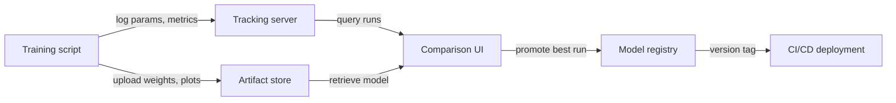

# Suivi d'expériences

## Définition

Le suivi d'expériences est la pratique consistant à enregistrer systématiquement chaque détail d'une exécution d'entraînement ML afin que les résultats puissent être reproduits, comparés et audités. Sans cela, les équipes perdent la trace des hyperparamètres qui ont produit quels résultats, gaspillent du calcul à redécouvrir des configurations et ne peuvent pas démontrer leur conformité lorsque les modèles influencent des décisions à enjeux élevés.

Un enregistrement complet d'expérience capture quatre catégories d'informations. Les **paramètres** sont les entrées de l'entraînement : taux d'apprentissage, taille de batch, choix d'architecture de modèle, ensembles de features. Les **métriques** sont les sorties : courbes de perte, précision, F1, AUC, latence. Les **artefacts** sont les fichiers produits : poids du modèle entraîné, datasets prétraités, graphiques d'évaluation, matrices de confusion. Les **métadonnées** sont le contexte : version du code (commit git), environnement (versions des bibliothèques, matériel), version du dataset, temps d'horloge murale et le nom de la personne qui l'a exécuté.

Le versionnage de modèles est l'extension naturelle : une fois que vous suivez les expériences, vous pouvez promouvoir l'artefact de la meilleure exécution vers un registre de modèles, le tagger avec une version sémantique et lier chaque déploiement de serving à une expérience spécifique. Cela ferme la boucle entre expérimentation et production, rendant les rollbacks simples et les audits possibles.

## Fonctionnement

### Instrumentation

Le script d'entraînement est instrumenté avec quelques lignes de code SDK qui ouvrent un contexte d'"exécution" et journalisent des données vers un serveur central pendant l'entraînement. La plupart des frameworks (PyTorch Lightning, Hugging Face Trainer, Keras) ont des intégrations natives qui journalisent automatiquement les métriques courantes sans code supplémentaire.

### Stockage centralisé

Les données journalisées sont persistées dans un magasin backend — un système de fichiers local, une base de données cloud gérée ou une plateforme SaaS. Les paramètres et les métriques sont stockés comme des enregistrements structurés ; les artefacts sont poussés vers le stockage d'objets (S3, GCS, Azure Blob). Le backend est interrogé par l'UI et le SDK.

### Comparaison et analyse

L'UI de suivi permet de filtrer, trier et comparer les exécutions selon les quatre dimensions. Vous pouvez tracer des courbes de métriques pour de nombreuses exécutions sur le même graphique, regrouper par valeurs de paramètres et exporter les résultats vers un dataframe pour une analyse personnalisée. Cela facilite l'identification des exécutions Pareto-optimales (meilleure précision pour un budget de latence donné, par exemple).

### Promotion de modèles

L'artefact de la meilleure exécution est enregistré dans un registre de modèles avec un numéro de version et un état de transition (Staging → Production → Archived). Les systèmes CI/CD en aval interrogent le registre pour savoir quelle version du modèle déployer, créant une passation propre entre expérimentation et serving.





## Quand utiliser / Quand NE PAS utiliser

| Vous exécutez plus d... | Vous effectuez un en... |
|----------|------------|
| Vous exécutez plus d'une poignée d'expériences et devez comparer les résultats | Vous effectuez un entraînement unique ponctuel que vous ne revisiterez jamais |
| La reproductibilité est requise (secteur réglementé, publication de recherche) | L'expérience est triviale (p. ex., une recherche en grid à deux paramètres avec des résultats évidents) |
| Plusieurs membres de l'équipe partagent les résultats d'expériences | L'équipe travaille seule et tient des notes dans un tableur personnel qui suffit |
| Vous souhaitez promouvoir systématiquement des versions de modèles en production | Le modèle n'est jamais déployé et les résultats n'ont pas besoin d'être audités |

## Exemples de code

```python
# generic_tracking.py
# Framework-agnostic experiment tracking pattern.
# Works with any ML library; swap out the model training code as needed.
# pip install mlflow scikit-learn pandas

import mlflow
from sklearn.linear_model import LogisticRegression
from sklearn.datasets import make_classification
from sklearn.model_selection import train_test_split
from sklearn.metrics import accuracy_score, roc_auc_score
import numpy as np

# --- Configuration ---
EXPERIMENT_NAME = "binary-classification-demo"
PARAMS = {
    "C": 0.1,           # Regularization strength
    "max_iter": 1000,
    "solver": "lbfgs",
    "random_state": 42,
}

# --- Data preparation ---
X, y = make_classification(
    n_samples=2000, n_features=20, n_informative=10, random_state=42
)
X_train, X_test, y_train, y_test = train_test_split(
    X, y, test_size=0.2, random_state=42
)

mlflow.set_experiment(EXPERIMENT_NAME)

with mlflow.start_run(run_name=f"logreg-C{PARAMS['C']}") as run:
    mlflow.log_params(PARAMS)

    model = LogisticRegression(**PARAMS)
    model.fit(X_train, y_train)

    y_pred = model.predict(X_test)
    y_prob = model.predict_proba(X_test)[:, 1]

    metrics = {
        "accuracy": accuracy_score(y_test, y_pred),
        "roc_auc": roc_auc_score(y_test, y_prob),
        "n_train": len(X_train),
        "n_test": len(X_test),
    }
    mlflow.log_metrics(metrics)

    mlflow.sklearn.log_model(model, artifact_path="model")

    import json, tempfile, os
    with tempfile.TemporaryDirectory() as tmp:
        meta_path = os.path.join(tmp, "run_metadata.json")
        with open(meta_path, "w") as f:
            json.dump({"git_commit": "abc1234", "dataset_version": "v1.3"}, f)
        mlflow.log_artifact(meta_path)

    print(f"Run ID : {run.info.run_id}")
    print(f"Accuracy: {metrics['accuracy']:.4f} | ROC-AUC: {metrics['roc_auc']:.4f}")
```


## Comparaisons

| Critère | MLflow | Weights & Biases (W&B) |
|-----------|--------|------------------------|
| Facilité de configuration | Auto-hébergeable avec `mlflow ui` ; installation pip uniquement | Compte SaaS requis ; installation CLI ; niveau gratuit disponible |
| Qualité de l'UI | Fonctionnelle mais austère ; bonne pour la comparaison tabulaire | Soignée, interactive ; excellente pour les médias et les superpositions de courbes |
| Collaboration | Serveur partagé requis ; pas de contrôle d'accès intégré dans l'OSS | Espaces de travail d'équipe, accès basé sur les rôles et partage intégrés |
| Tarification | Gratuit et open source ; offre gérée via Databricks | Niveau gratuit pour les individus ; payant pour les grandes équipes |
| Intégrations | Intégration profonde avec Databricks, Spark, sklearn, PyTorch | Intégrations larges ; fort dans la recherche et l'académie |

## Ressources pratiques

- [MLflow Tracking Documentation](https://mlflow.org/docs/latest/tracking.html) — Guide officiel couvrant l'API de tracking, les backends, les magasins d'artefacts et l'autologging.
- [Weights & Biases – Experiment Tracking Quickstart](https://docs.wandb.ai/quickstart) — Guide étape par étape pour journaliser votre première exécution W&B en moins de cinq minutes.
- [Neptune.ai – Experiment Tracking Guide](https://neptune.ai/blog/ml-experiment-tracking) — Vue d'ensemble neutre par rapport aux fournisseurs sur ce qu'il faut suivre, pourquoi et comment comparer les outils.
- [Made With ML – Experiment Tracking](https://madewithml.com/courses/mlops/experiment-tracking/) — Guide pratique basé sur des notebooks intégrant MLflow dans une vraie boucle d'entraînement.

## Voir aussi

- [MLflow](/docs/mlops/mlflow)
- [Weights & Biases](/docs/mlops/wandb)
- [MLOps](/docs/mlops)
