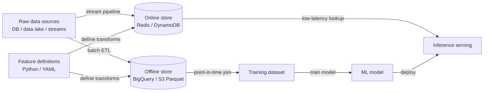

# Feature stores

## Définition

Un feature store est un système de données spécifiquement conçu pour gérer le cycle de vie des features ML — de la transformation des données brutes, en passant par le stockage, jusqu'au service à faible latence — de manière cohérente entre l'entraînement du modèle et l'inférence en production. Sans feature store, les équipes rencontrent fréquemment le **biais entraînement-service** : la logique de calcul des features exécutée hors ligne lors de l'entraînement diffère subtilement de la logique utilisée au moment du service, ce qui fait que les modèles en production sous-performent par rapport à l'évaluation hors ligne.

Les feature stores y remédient en stockant les définitions de features comme du code et en exécutant la même logique de transformation dans les deux contextes. Ils maintiennent deux couches de stockage complémentaires : un **store hors ligne** (un entrepôt de données ou un lac de données, ex. BigQuery, Redshift, fichiers Parquet sur S3) qui contient de grands ensembles de données historiques utilisés pour l'entraînement et le scoring par lots, et un **store en ligne** (une base de données clé-valeur à faible latence, ex. Redis, DynamoDB, Cassandra) qui sert des valeurs de features précalculées aux modèles au moment de l'inférence avec une latence de sous-milliseconde.

Le problème du biais entraînement-service et le besoin de réutilisation des features deviennent aigus à grande échelle. Une grande organisation peut avoir des dizaines d'équipes calculant chacune des features similaires (dépenses client sur les 7 derniers jours, durée de session, type d'appareil) de manière indépendante, avec de subtiles différences dans la logique métier. Un feature store fournit un catalogue gouverné où les features sont définies une fois, validées et réutilisées entre les équipes et les modèles, réduisant considérablement l'effort d'ingénierie dupliqué et le risque d'une logique de features incohérente.

## Fonctionnement

### Définition des features et pipelines de transformation

Les features sont définies comme du code — classes Python ou manifestes YAML — qui spécifient la source de données, la logique de transformation et la clé d'entité (l'identifiant utilisé pour rechercher des features, ex. `user_id`, `product_id`). Les pipelines de transformation par lots s'exécutent selon un calendrier pour matérialiser les features dans le store hors ligne. Les pipelines de transformation par stream (ex. utilisant Flink ou Spark Structured Streaming) maintiennent le store en ligne à jour pour les features sensibles au temps comme les signaux de fraude en temps réel.

### Store hors ligne : récupération des données d'entraînement

Lors de l'entraînement d'un modèle, un ensemble de données est généré en fournissant une liste de clés d'entité et un ensemble d'horodatages (une « jointure point dans le temps »). Le feature store récupère les valeurs de features qui étaient correctes à chaque horodatage, évitant ainsi la fuite de données futures. Cette correction point dans le temps est l'une des choses les plus difficiles à implémenter correctement sans feature store et l'une des garanties les plus précieuses qu'il fournit.

### Store en ligne : service à faible latence

Avant qu'un modèle serve une prédiction, il a besoin des valeurs de features pour l'entité en cours de scoring (ex. l'utilisateur faisant une requête). Le client du feature store interroge le store en ligne par clé d'entité et retourne un vecteur de features en millisecondes. Comme les mêmes définitions de features sous-tendent à la fois les stores hors ligne et en ligne, les valeurs sont garanties d'être calculées de manière identique.

### Registre de features et gouvernance

Un catalogue de features documente chaque feature : sa définition, son propriétaire, son type de données, sa garantie de fraîcheur et quels modèles la consomment. Cette couche de gouvernance permet la découvrabilité — une nouvelle équipe peut parcourir les features existantes avant d'écrire les siennes — et l'analyse d'impact — comprendre quels modèles sont affectés si la source de données en amont d'une feature change.

### Travaux de matérialisation

La matérialisation est le processus d'exécution des pipelines de transformation et d'écriture des résultats dans les stores. La matérialisation hors ligne s'exécute comme un travail par lots planifié. La matérialisation en ligne copie un sous-ensemble de données hors ligne dans le store en ligne pour une récupération rapide, ou est pilotée par des pipelines de streaming lorsqu'une fraîcheur en temps réel est requise. Feast, Tecton et Hopsworks fournissent tous des commandes CLI ou des intégrations d'orchestration pour déclencher et surveiller la matérialisation.



## Quand utiliser / Quand NE PAS utiliser

| Utiliser quand | Éviter quand |
|----------|------------|
| Plusieurs équipes ou modèles partagent la même logique de features et la cohérence est critique | On dispose d'un seul modèle avec un petit ensemble de features stable qui ne change jamais |
| Le biais entraînement-service a causé des incidents en production ou des écarts de précision | Les exigences de latence d'inférence sont relaxées et le scoring par lots est suffisant |
| Des ensembles de données d'entraînement corrects point dans le temps sont nécessaires pour éviter les fuites de données | La surcharge d'ingénierie d'exploiter un feature store dépasse l'échelle du projet |
| Les features doivent être servies avec une latence de sous-milliseconde pour les prédictions en temps réel | On est en exploration précoce et les features ne sont pas encore suffisamment stables pour être formalisées |
| Les exigences réglementaires imposent un catalogue de features gouverné et auditable | L'équipe de data science est petite et manque de support d'ingénierie ML pour gérer l'infrastructure |

## Comparaisons

| Critère | Feast | Tecton | Hopsworks |
|-----------|-------|--------|-----------|
| Open source | Oui (Apache 2.0) | Non (SaaS / géré) | Oui noyau ; entreprise payant |
| Offre gérée | Non (auto-hébergé uniquement) | Oui (entièrement géré) | Oui (cloud ou on-prem) |
| Features de streaming | Limité (via source Kafka) | Natif, grade production | Natif avec intégration Flink |
| Surveillance des features | Basique | Avancée (dérive intégrée) | Avancée |
| Meilleur pour | Équipes voulant le contrôle OSS | Entreprises ayant besoin de features temps réel gérées | Équipes voulant de l'open source full-stack |

## Avantages et inconvénients

| Avantages | Inconvénients |
|------|------|
| Élimine le biais entraînement-service en partageant la logique de transformation | Investissement d'ingénierie significatif pour mettre en place et opérer |
| Permet la réutilisation des features entre équipes, réduisant l'effort dupliqué | Ajoute une dépendance opérationnelle dans le chemin de service (disponibilité du store en ligne) |
| Les jointures point dans le temps évitent les fuites de données dans les données d'entraînement | Les définitions de features peuvent devenir un goulot d'étranglement si la gouvernance est trop rigide |
| Centralise la gouvernance et la documentation des features | Courbe d'apprentissage pour les data scientists non familiers avec l'abstraction |
| Prend en charge le service de features par lots et en temps réel | Excessif pour les équipes avec peu de modèles et des features stables |

## Exemples de code

```python
# feast_feature_store_example.py
# Demonstrates defining, materializing, and retrieving features with Feast.
# Prerequisites:
#   pip install feast pandas scikit-learn
#   feast init my_feature_repo && cd my_feature_repo
#   (Adjust the data source path below to match your environment.)

# ── feature_repo/features.py ──────────────────────────────────────────────────
# This file defines the feature views and entities in your Feast registry.

from datetime import timedelta
import pandas as pd
from feast import (
    Entity,
    FeatureStore,
    FeatureView,
    Field,
    FileSource,
)
from feast.types import Float32, Int64

# 1. Define the entity — the primary key used to look up features
driver = Entity(
    name="driver",
    description="A taxi driver identified by driver_id",
)

# 2. Define the data source (parquet file for local demo; swap for BigQuery etc.)
driver_stats_source = FileSource(
    path="data/driver_stats.parquet",   # generated below
    timestamp_field="event_timestamp",
    created_timestamp_column="created",
)

# 3. Define a FeatureView — the transformation and storage spec
driver_stats_fv = FeatureView(
    name="driver_hourly_stats",
    entities=[driver],
    ttl=timedelta(days=7),              # how long features stay valid
    schema=[
        Field(name="conv_rate", dtype=Float32),
        Field(name="acc_rate", dtype=Float32),
        Field(name="avg_daily_trips", dtype=Int64),
    ],
    online=True,                        # materialize to online store
    source=driver_stats_source,
)


# ── generate_sample_data.py ───────────────────────────────────────────────────
# Run this once to create sample data before materializing.
def generate_driver_stats(path: str = "data/driver_stats.parquet") -> None:
    import os
    os.makedirs("data", exist_ok=True)

    rng = pd.date_range(end=pd.Timestamp.now(tz="UTC"), periods=48, freq="h")
    df = pd.DataFrame({
        "driver_id": [1001, 1002, 1003] * 16,
        "event_timestamp": list(rng[:48]),
        "created": pd.Timestamp.now(tz="UTC"),
        "conv_rate": [0.8, 0.6, 0.9] * 16,
        "acc_rate": [0.95, 0.88, 0.92] * 16,
        "avg_daily_trips": [150, 200, 175] * 16,
    })
    df.to_parquet(path, index=False)
    print(f"Sample data written to {path}")


# ── training_data_retrieval.py ────────────────────────────────────────────────
# Retrieve a point-in-time correct training dataset.
def get_training_data(repo_path: str = ".") -> pd.DataFrame:
    store = FeatureStore(repo_path=repo_path)

    # Entity DataFrame: the entities and timestamps we want features for
    entity_df = pd.DataFrame({
        "driver_id": [1001, 1002, 1003],
        "event_timestamp": [
            pd.Timestamp("2024-01-15 10:00:00", tz="UTC"),
            pd.Timestamp("2024-01-15 11:00:00", tz="UTC"),
            pd.Timestamp("2024-01-15 12:00:00", tz="UTC"),
        ],
        "label": [1, 0, 1],   # target variable for supervised training
    })

    # Point-in-time join: retrieves feature values as-of each row's timestamp
    training_df = store.get_historical_features(
        entity_df=entity_df,
        features=[
            "driver_hourly_stats:conv_rate",
            "driver_hourly_stats:acc_rate",
            "driver_hourly_stats:avg_daily_trips",
        ],
    ).to_df()

    print("Training dataset:")
    print(training_df.to_string())
    return training_df


# ── online_serving.py ─────────────────────────────────────────────────────────
# Retrieve features for real-time inference after materialization.
def get_online_features(driver_ids: list, repo_path: str = ".") -> dict:
    store = FeatureStore(repo_path=repo_path)

    # Materialize features to the online store first:
    # store.materialize_incremental(end_date=pd.Timestamp.now(tz="UTC"))

    feature_vector = store.get_online_features(
        features=[
            "driver_hourly_stats:conv_rate",
            "driver_hourly_stats:acc_rate",
            "driver_hourly_stats:avg_daily_trips",
        ],
        entity_rows=[{"driver_id": did} for did in driver_ids],
    ).to_dict()

    print("Online feature vector:")
    for key, values in feature_vector.items():
        print(f"  {key}: {values}")
    return feature_vector


# ── main ──────────────────────────────────────────────────────────────────────
if __name__ == "__main__":
    generate_driver_stats()
    # After running `feast apply` to register the feature views:
    # training_df = get_training_data()
    # online_fv   = get_online_features([1001, 1002])
    print("Feature definitions ready. Run `feast apply` to register them.")
```

## Ressources pratiques

- [Documentation Feast](https://docs.feast.dev/) — Documentation officielle du feature store open source le plus largement utilisé, incluant démarrage rapide, API de vues de features et guides de déploiement.
- [Tecton – Concepts de feature store](https://docs.tecton.ai/docs/introduction/feature-store-concepts) — Vue d'ensemble conceptuelle neutre sur les stores en ligne/hors ligne, les jointures point dans le temps et les pipelines de features.
- [Documentation Hopsworks](https://docs.hopsworks.ai/) — Feature store full-stack avec streaming Flink natif, surveillance des features et registre de modèles.
- [Feature Store pour ML – O'Reilly](https://www.featurestore.org/) — Ressource communautaire agrégeant recherche, articles de blog et conférences sur les patterns de conception de feature stores.
- [Chip Huyen – Ingénierie des features pour les systèmes ML](https://huyenchip.com/2022/01/02/real-time-machine-learning-challenges-and-solutions.html) — Analyse approfondie des défis d'ingénierie du calcul de features en temps réel et comment les feature stores les résolvent.

## Voir aussi

- [MLOps](/docs/mlops)
- [MLflow](/docs/mlops/mlflow)
- [Suivi d'expériences](/docs/mlops/experiment-tracking)
