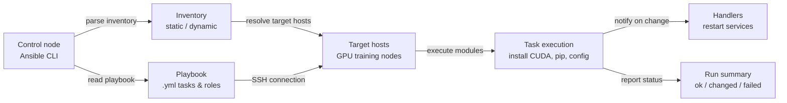

# Ansible

## Définition

Ansible est un outil d'automatisation open source créé par Red Hat qui gère la configuration, le déploiement d'applications et l'automatisation des tâches sur une flotte de serveurs à l'aide de fichiers YAML simples et lisibles par l'humain appelés **playbooks**. Son choix architectural déterminant est d'être **agentless** : Ansible se connecte aux nœuds gérés via SSH (Linux) ou WinRM (Windows) et exécute des tâches directement, sans démon ni logiciel agent requis sur les machines cibles. Cela le rend considérablement plus facile à adopter que les outils basés sur des agents — vous pouvez commencer à gérer des serveurs existants sans aucun logiciel pré-installé au-delà de Python et d'un serveur SSH.

Ansible fonctionne sur un **modèle push** : un opérateur exécute un playbook depuis un nœud de contrôle, Ansible se connecte à l'inventaire cible d'hôtes et exécute les tâches dans l'ordre. Les tâches appellent des **modules** — des unités de travail idempotentes qui savent comment installer des packages, gérer des fichiers, démarrer des services, exécuter des commandes et interagir avec les API cloud. Les modules communautaires et officiels couvrent pratiquement tous les gestionnaires de packages Linux, services, fournisseurs cloud, appareils réseau et applications. Les rôles regroupent les tâches, fichiers, templates et variables liés en unités réutilisables et partageables pouvant être publiées sur Ansible Galaxy ou maintenues dans des dépôts Git internes.

Dans les contextes ML et ingénierie des données, Ansible comble le vide que [Terraform](/docs/mlops/iac/terraform) laisse. Terraform provisionne l'infrastructure (crée l'instance GPU, le VPC, le bucket S3) ; Ansible configure ce qui s'exécute sur cette infrastructure (installe la bonne version CUDA, configure l'environnement Python, configure les dépendances d'entraînement distribué et s'assure que les outils de surveillance GPU fonctionnent). Les deux outils sont complémentaires plutôt que concurrents : un workflow MLOps typique utilise Terraform pour provisionner les ressources cloud et Ansible pour bootstrapper ces ressources dans un état prêt à l'entraînement.

## Fonctionnement

### Inventaire

L'inventaire définit quels hôtes Ansible gère. Un inventaire statique est un fichier INI ou YAML listant des noms d'hôtes ou des adresses IP regroupés par rôle (par exemple, `[gpu_training_nodes]`, `[model_serving]`). Les inventaires dynamiques interrogent les API cloud (AWS EC2, GCP Compute, Azure VMs) à l'exécution pour construire la liste d'hôtes depuis l'infrastructure en direct — essentiel pour les environnements auto-scaling. Les variables d'hôte et de groupe définissent les valeurs de configuration par hôte ou par groupe qui sont référencées dans les playbooks.

### Playbooks et tâches

Un playbook est un fichier YAML contenant un ou plusieurs **plays**. Chaque play cible un groupe d'hôtes et une liste de **tâches**. Chaque tâche appelle un module avec des arguments et définit optionnellement des conditions (`when`), des boucles (`loop`) et des handlers déclenchés lors d'un changement. Les tâches sont exécutées séquentiellement au sein d'un play ; les plays peuvent s'exécuter en parallèle sur les hôtes. Le résultat de chaque tâche est l'un de : `ok` (aucun changement nécessaire), `changed` (changement effectué), `failed` ou `skipped`. Ansible affiche un résumé de ces résultats après chaque exécution de playbook.

### Rôles

Les rôles fournissent une structure de répertoire standardisée pour organiser l'automatisation liée : `tasks/`, `handlers/`, `templates/`, `files/`, `vars/`, `defaults/` et `meta/`. Un rôle peut être appliqué à plusieurs plays dans plusieurs playbooks, et les rôles peuvent dépendre d'autres rôles. Ansible Galaxy héberge des milliers de rôles communautaires (par exemple, `geerlingguy.docker`, `nvidia.nvidia_driver`) pouvant être installés avec `ansible-galaxy install` et utilisés directement dans les playbooks.

### Variables et templating

Ansible utilise le moteur de template Jinja2 partout dans les playbooks et les fichiers de template. Les variables peuvent être définies à plusieurs niveaux (valeurs par défaut du rôle, vars de groupe, vars d'hôte, vars de playbook, vars supplémentaires passées avec `-e`) avec un ordre de précédence clair. Les templates (fichiers `.j2`) génèrent des fichiers de configuration dynamiquement — par exemple, générer un fichier de configuration d'entraînement distribué avec l'IP correcte du nœud maître, le nombre de GPUs et la taille de lot pour chaque environnement.

### Idempotence et handlers

Les modules Ansible sont conçus pour être idempotents : exécuter un playbook plusieurs fois produit le même état final sans provoquer d'effets secondaires non désirés. Si un package est déjà installé à la bonne version, la tâche signale `ok` et ne fait rien. Les **handlers** sont des tâches spéciales qui s'exécutent à la fin d'un play uniquement si notifiées par une tâche qui a résulté en `changed` — utilisés pour redémarrer les services (comme un démon d'entraînement accéléré par CUDA) uniquement lorsque leur configuration change réellement.



## Quand utiliser / Quand NE PAS utiliser

| Utiliser quand | Éviter quand |
|----------|------------|
| Configuration de logiciels sur des serveurs existants : installation de CUDA, Python, packages pip, services système | Provisionnement de nouvelle infrastructure cloud depuis zéro (utilisez Terraform pour ça) |
| Bootstrap des nœuds d'entraînement GPU après que Terraform les a créés | Vous avez besoin d'un suivi d'état précis sur des centaines de ressources (Ansible n'a pas de fichier d'état) |
| Configuration d'environnements ML cohérents sur les machines de développement, staging et production | Vous avez besoin de graphes de dépendances complexes entre les ressources cloud avec ordonnancement automatique |
| Exécution de commandes ad hoc sur une flotte de serveurs (par exemple, mettre à jour un fichier de config partout) | Les machines cibles ne peuvent pas être atteintes via SSH ou WinRM depuis le nœud de contrôle |
| Déploiement de mises à jour d'application ou déploiement de changements de configuration sur de nombreux nœuds | Vous provisionnez des ressources cloud natives (VPCs, rôles IAM, buckets S3) — utilisez Terraform |
| Équipes ayant besoin d'outillage IaC à faible barrière avec une courbe d'apprentissage YAML peu profonde | Vous avez besoin d'une exécution parallèle très rapide ; la surcharge SSH d'Ansible limite la scalabilité à des milliers de nœuds |

## Comparaisons

| Critère | Ansible | Terraform |
|-----------|---------|-----------|
| Paradigme | Procédural avec modules idempotents — les tâches s'exécutent dans l'ordre | Déclaratif — décrire l'état souhaité, Terraform calcule le diff |
| Gestion d'état | Sans état — pas de suivi intégré de ce qui a été appliqué précédemment | Fichier d'état explicite qui mappe la configuration aux IDs de ressources réelles |
| Cas d'utilisation principal | Gestion de configuration et déploiement de logiciels sur des hôtes existants | Provisionnement d'infrastructure cloud (instances, réseaux, stockage) |
| Support des fournisseurs cloud | Des modules cloud existent mais sont moins complets que les providers Terraform | 1 000+ providers avec une couverture API approfondie et versionnée |
| Idempotence | Au niveau des tâches — chaque module doit être écrit de manière idempotente | Native — plan/apply converge toujours vers l'état déclaré |
| Courbe d'apprentissage | Faible — les tâches YAML sont lisibles ; pas de nouveau langage requis | Modérée — syntaxe HCL + modèle mental état/plan à apprendre |
| Agent requis | Non — agentless, se connecte via SSH | Non — Terraform s'exécute sur la machine de contrôle, appelle les API cloud |
| Quand utiliser ensemble | Ansible configure les logiciels sur l'infrastructure que Terraform a provisionnée | Terraform provisionne les ressources ; Ansible gère la config OS et application |

## Avantages et inconvénients

| Aspect | Avantages | Inconvénients |
|--------|------|------|
| Architecture agentless | Pas de logiciel à installer sur les nœuds cibles ; fonctionne avec SSH existant | La surcharge SSH limite les performances à très grande échelle (10 000+ nœuds) |
| Playbooks YAML | Automation lisible et auto-documentée | La logique complexe (boucles, conditions) devient verbeuse en YAML |
| Modules idempotents | Sûr à ré-exécuter ; correction de dérive sans effets secondaires | L'idempotence dépend de la qualité du module ; les modules shell/command ne sont pas intrinsèquement idempotents |
| Ansible Galaxy | Grand écosystème de rôles communautaires pour les logiciels courants | La qualité des rôles communautaires varie ; l'épinglage des versions des rôles est critique pour la reproductibilité |
| Pas de fichier d'état | Simple, pas de surcharge de gestion d'état | Pas de détection de dérive intégrée entre les exécutions ; outillage manuel ou tiers requis |
| Templating Jinja2 | Génération de configuration dynamique puissante | Le débogage des templates est plus difficile que le code natif ; les erreurs apparaissent à l'exécution |

## Exemples de code

```yaml
# ml_environment_setup.yml
# Ansible playbook to configure a GPU training node for ML workloads.
# Installs CUDA toolkit, cuDNN, Python 3.11, pip packages, and sets up
# a systemd service for the Prometheus node exporter.
#
# Usage:
#   ansible-playbook -i inventory.ini ml_environment_setup.yml
#
# inventory.ini example:
#   [gpu_training_nodes]
#   10.0.1.10 ansible_user=ubuntu ansible_ssh_private_key_file=~/.ssh/ml-key.pem
#   10.0.1.11 ansible_user=ubuntu ansible_ssh_private_key_file=~/.ssh/ml-key.pem

---
- name: Configure GPU training nodes for ML workloads
  hosts: gpu_training_nodes
  become: true  # Run tasks as root via sudo
  vars:
    cuda_version: "12.1"
    python_version: "3.11"
    pip_packages:
      - torch==2.3.0
      - torchvision==0.18.0
      - torchaudio==2.3.0
      - numpy==1.26.4
      - pandas==2.2.2
      - scikit-learn==1.4.2
      - mlflow==2.13.0
      - evidently==0.4.30
      - prometheus-client==0.20.0
    node_exporter_version: "1.8.1"
    ml_user: "mlops"
    ml_workdir: "/opt/ml"

  handlers:
    - name: restart node_exporter
      ansible.builtin.systemd:
        name: node_exporter
        state: restarted
        daemon_reload: true

  tasks:
    # --- System prerequisites ---

    - name: Update apt package cache
      ansible.builtin.apt:
        update_cache: true
        cache_valid_time: 3600  # Skip update if cache is less than 1 hour old

    - name: Install system dependencies
      ansible.builtin.apt:
        name:
          - build-essential
          - git
          - wget
          - curl
          - htop
          - nvtop          # GPU monitoring in terminal
          - python{{ python_version }}
          - python{{ python_version }}-dev
          - python{{ python_version }}-venv
          - python3-pip
        state: present

    # --- CUDA installation ---

    - name: Check if CUDA {{ cuda_version }} is already installed
      ansible.builtin.command: nvcc --version
      register: nvcc_check
      changed_when: false
      failed_when: false

    - name: Add CUDA repository keyring
      ansible.builtin.shell: |
        wget -qO /tmp/cuda-keyring.deb \
          https://developer.download.nvidia.com/compute/cuda/repos/ubuntu2204/x86_64/cuda-keyring_1.1-1_all.deb
        dpkg -i /tmp/cuda-keyring.deb
      when: cuda_version not in (nvcc_check.stdout | default(''))
      args:
        creates: /usr/share/keyrings/cuda-archive-keyring.gpg

    - name: Install CUDA toolkit {{ cuda_version }}
      ansible.builtin.apt:
        name: cuda-toolkit-{{ cuda_version | replace('.', '-') }}
        state: present
        update_cache: true
      when: cuda_version not in (nvcc_check.stdout | default(''))

    - name: Set CUDA environment variables in /etc/environment
      ansible.builtin.lineinfile:
        path: /etc/environment
        line: "{{ item }}"
        state: present
      loop:
        - 'CUDA_HOME=/usr/local/cuda'
        - 'PATH=/usr/local/cuda/bin:$PATH'
        - 'LD_LIBRARY_PATH=/usr/local/cuda/lib64:$LD_LIBRARY_PATH'

    # --- ML user and workspace ---

    - name: Create dedicated ML user
      ansible.builtin.user:
        name: "{{ ml_user }}"
        shell: /bin/bash
        home: "/home/{{ ml_user }}"
        create_home: true
        state: present

    - name: Create ML working directory
      ansible.builtin.file:
        path: "{{ ml_workdir }}"
        state: directory
        owner: "{{ ml_user }}"
        group: "{{ ml_user }}"
        mode: "0755"

    # --- Python virtual environment and packages ---

    - name: Create Python virtual environment
      ansible.builtin.command:
        cmd: python{{ python_version }} -m venv {{ ml_workdir }}/venv
        creates: "{{ ml_workdir }}/venv/bin/python"
      become_user: "{{ ml_user }}"

    - name: Upgrade pip in virtual environment
      ansible.builtin.pip:
        name: pip
        state: latest
        virtualenv: "{{ ml_workdir }}/venv"
      become_user: "{{ ml_user }}"

    - name: Install ML Python packages
      ansible.builtin.pip:
        name: "{{ pip_packages }}"
        virtualenv: "{{ ml_workdir }}/venv"
        state: present
      become_user: "{{ ml_user }}"

    - name: Write requirements.txt for reproducibility
      ansible.builtin.copy:
        dest: "{{ ml_workdir }}/requirements.txt"
        content: "{{ pip_packages | join('\n') }}\n"
        owner: "{{ ml_user }}"
        group: "{{ ml_user }}"
        mode: "0644"

    # --- Prometheus Node Exporter for infrastructure monitoring ---

    - name: Check if node_exporter is already installed
      ansible.builtin.stat:
        path: /usr/local/bin/node_exporter
      register: node_exporter_stat

    - name: Download Prometheus node_exporter {{ node_exporter_version }}
      ansible.builtin.get_url:
        url: "https://github.com/prometheus/node_exporter/releases/download/v{{ node_exporter_version }}/node_exporter-{{ node_exporter_version }}.linux-amd64.tar.gz"
        dest: /tmp/node_exporter.tar.gz
        mode: "0644"
      when: not node_exporter_stat.stat.exists

    - name: Extract and install node_exporter
      ansible.builtin.unarchive:
        src: /tmp/node_exporter.tar.gz
        dest: /tmp
        remote_src: true
      when: not node_exporter_stat.stat.exists

    - name: Copy node_exporter binary to /usr/local/bin
      ansible.builtin.copy:
        src: "/tmp/node_exporter-{{ node_exporter_version }}.linux-amd64/node_exporter"
        dest: /usr/local/bin/node_exporter
        mode: "0755"
        remote_src: true
      when: not node_exporter_stat.stat.exists
      notify: restart node_exporter

    - name: Create node_exporter systemd service
      ansible.builtin.copy:
        dest: /etc/systemd/system/node_exporter.service
        content: |
          [Unit]
          Description=Prometheus Node Exporter
          After=network.target

          [Service]
          User=nobody
          ExecStart=/usr/local/bin/node_exporter \
            --collector.systemd \
            --collector.processes
          Restart=on-failure

          [Install]
          WantedBy=multi-user.target
        mode: "0644"
      notify: restart node_exporter

    - name: Enable and start node_exporter
      ansible.builtin.systemd:
        name: node_exporter
        enabled: true
        state: started
        daemon_reload: true

    # --- Verification ---

    - name: Verify GPU is visible to CUDA
      ansible.builtin.command: nvidia-smi
      register: nvidia_smi_output
      changed_when: false
      failed_when: nvidia_smi_output.rc != 0

    - name: Print GPU info
      ansible.builtin.debug:
        var: nvidia_smi_output.stdout_lines

    - name: Verify PyTorch can see the GPU
      ansible.builtin.command:
        cmd: "{{ ml_workdir }}/venv/bin/python -c \"import torch; print('CUDA available:', torch.cuda.is_available()); print('GPU count:', torch.cuda.device_count())\""
      register: torch_check
      changed_when: false
      become_user: "{{ ml_user }}"

    - name: Print PyTorch GPU availability
      ansible.builtin.debug:
        var: torch_check.stdout_lines
```

## Ressources pratiques

- [Documentation Ansible](https://docs.ansible.com/ansible/latest/index.html) — Documentation officielle couvrant les playbooks, les modules, les rôles, l'inventaire et les bonnes pratiques.
- [Ansible Galaxy](https://galaxy.ansible.com/) — Hub communautaire pour les rôles et collections Ansible réutilisables, incluant les pilotes GPU NVIDIA, Docker et les rôles Kubernetes.
- [Jeff Geerling — Ansible for DevOps](https://www.ansiblefordevops.com/) — Livre complet et dépôt GitHub accompagnant couvrant Ansible des bases aux modèles de production.
- [Collection Ansible NVIDIA](https://github.com/nvidia/ansible-collection-nvidia-gpu) — Collection Ansible officielle NVIDIA pour la gestion des pilotes GPU, CUDA et des installations NCCL.
- [Guide des bonnes pratiques Ansible](https://docs.ansible.com/ansible/latest/tips_tricks/ansible_tips_tricks.html) — Conseils et astuces officiels couvrant la structure des répertoires, la gestion des variables et l'optimisation des performances.

## Voir aussi

- [Terraform](/docs/mlops/iac/terraform)
- [ML sur Kubernetes](/docs/mlops/deployment/ml-kubernetes)
- [MLOps](/docs/mlops)
