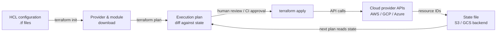

# Terraform

## Définition

Terraform est un outil d'Infrastructure as Code (IaC) open source créé par HashiCorp qui vous permet de définir, provisionner et gérer l'infrastructure cloud et sur site à l'aide d'un langage de configuration déclaratif appelé HCL (HashiCorp Configuration Language). Vous décrivez l'état final souhaité de votre infrastructure — quelles ressources doivent exister, comment elles doivent être configurées et comment elles sont liées les unes aux autres — et Terraform détermine ce qu'il faut créer, mettre à jour ou supprimer pour atteindre cet état. Ce modèle déclaratif est fondamentalement différent des approches de scripting impératif où vous décrivez la séquence d'étapes à exécuter.

La pierre angulaire de l'architecture de Terraform est son écosystème de **providers**. Un provider est un plugin qui traduit les définitions de ressources HCL en appels API contre une plateforme spécifique : AWS, Google Cloud, Azure, Kubernetes, Datadog, GitHub et des centaines d'autres. Chaque provider maintient son propre cycle de release versionné, et Terraform télécharge les providers automatiquement en fonction des blocs `required_providers`. Cela signifie qu'une seule configuration Terraform peut simultanément provisionner un cluster d'entraînement GPU AWS, un bucket GCS pour les données d'entraînement, un namespace Kubernetes pour le service de modèles et un tableau de bord Grafana pour la surveillance — avec un outillage cohérent sur toutes les plateformes.

La **gestion d'état** est ce qui rend Terraform idempotent et planifiable. Terraform maintient un fichier d'état qui mappe chaque ressource de la configuration à son équivalent dans le monde réel (identifié par les IDs de ressources du fournisseur cloud). Lorsque vous exécutez `terraform plan`, Terraform compare le fichier d'état actuel avec votre configuration et l'infrastructure en direct, produisant un diff qui montre exactement ce qui changera avant tout changement. Pour les workflows d'équipe, l'état est stocké dans un backend partagé (S3, GCS, Terraform Cloud) avec verrouillage pour prévenir les modifications concurrentes. Cette auditabilité et cette prévisibilité font de Terraform l'outil IaC dominant pour le provisionnement d'infrastructure d'entraînement et de service ML dans les environnements réglementés et collaboratifs.

## Fonctionnement

### Écriture de la configuration

Les ingénieurs écrivent des fichiers HCL (`.tf`) qui déclarent des ressources, des sources de données, des variables, des sorties et des modules. Les ressources correspondent à des objets d'infrastructure (une instance EC2, un bucket S3, un déploiement Kubernetes). Les sources de données lisent l'infrastructure existante sans la gérer. Les variables paramétrisent les configurations pour leur réutilisation entre les environnements. Les modules encapsulent des ensembles réutilisables de ressources — un module « cluster d'entraînement GPU » peut être instancié plusieurs fois avec différents types d'instances et régions.

### Initialisation et plan

L'exécution de `terraform init` télécharge les providers et modules requis et initialise le backend. L'exécution de `terraform plan` produit un plan d'exécution lisible par l'humain : une liste de ressources à ajouter (+), modifier (~) ou supprimer (−). La phase de plan est en lecture seule — elle n'apporte aucune modification à l'infrastructure. Les équipes intègrent généralement `terraform plan` dans les pipelines CI pour examiner les changements dans les pull requests avant la fusion.

### Application et gestion d'état

`terraform apply` exécute le plan, appelant les API des providers pour créer, mettre à jour ou supprimer des ressources dans l'ordre des dépendances. Terraform résout automatiquement le graphe de dépendances en fonction des références entre les ressources (par exemple, un sous-réseau qui référence un ID de VPC). Après l'application, le fichier d'état est mis à jour pour refléter le nouvel état de l'infrastructure. Pour l'infrastructure ML, cela signifie que les instances GPU, les buckets de stockage, les rôles IAM et les clusters Kubernetes sont tous créés dans le bon ordre avec les bonnes configurations en une seule commande.

### Destruction et gestion du cycle de vie

`terraform destroy` supprime toutes les ressources gérées par la configuration — utile pour les environnements d'entraînement éphémères qui ne devraient pas fonctionner (et coûter de l'argent) entre les jobs d'entraînement. Les méta-arguments de cycle de vie (`create_before_destroy`, `prevent_destroy`, `ignore_changes`) donnent un contrôle précis sur la façon dont Terraform gère les ressources sensibles comme les buckets de stockage d'artefacts de modèles qui ne doivent jamais être accidentellement supprimés.



## Quand utiliser / Quand NE PAS utiliser

| Utiliser quand | Éviter quand |
|----------|------------|
| Provisionnement d'infrastructure cloud devant être reproductible entre les environnements | Configuration de logiciels dans des instances existantes (utilisez Ansible pour ça) |
| Gestion d'infrastructure ML à grande échelle : clusters GPU, stockage, réseau, Kubernetes | Votre équipe n'a pas d'infrastructure cloud à gérer (pas de serveurs, pas de comptes cloud) |
| Plusieurs membres de l'équipe doivent collaborer sur la même infrastructure | Vous devez exécuter des commandes shell arbitraires ou configurer des paramètres au niveau OS sur les instances |
| Vous voulez que les changements d'infrastructure soient revus via des pull requests avant application | Votre infrastructure existante n'a pas été créée avec Terraform et le coût de migration est prohibitif |
| L'infrastructure doit être versionnée, auditée et annulable de manière fiable | Vous avez besoin de changements rapides et itératifs de la config application pendant le développement |
| Vous opérez dans plusieurs fournisseurs cloud et voulez un workflow unifié | Votre organisation standardise déjà sur un outil IaC concurrent (Pulumi, CDK) avec une connaissance institutionnelle |

## Comparaisons

| Critère | Terraform | Ansible |
|-----------|-----------|---------|
| Paradigme | Déclaratif — décrire l'état souhaité | Procédural — décrire les étapes pour atteindre l'état |
| Gestion d'état | Fichier d'état explicite ; suit les IDs de ressources | Sans état — pas de suivi d'état intégré |
| Cas d'utilisation principal | Provisionnement de ressources cloud (instances, réseaux, stockage) | Gestion de configuration et déploiement d'application sur des instances existantes |
| Support des fournisseurs cloud | 1 000+ providers via l'écosystème de plugins | Modules pour les grands clouds ; moins complet que Terraform |
| Idempotence | Native — plan/apply converge toujours vers l'état souhaité | Au niveau des tâches — chaque tâche doit être écrite pour être idempotente |
| Courbe d'apprentissage | Syntaxe HCL + modèle mental état/plan | Playbooks YAML ; barrière initiale plus faible |
| Quand utiliser les deux | Terraform provisionne l'infrastructure ; Ansible configure les logiciels dessus — ils se complètent | Voir ci-dessus |

## Avantages et inconvénients

| Aspect | Avantages | Inconvénients |
|--------|------|------|
| Modèle déclaratif | L'intention est claire ; le plan montre les changements exacts avant application | Ne peut pas facilement exprimer la logique conditionnelle ou les boucles complexes (bien que HCL se soit amélioré) |
| Fichier d'état | Permet une planification précise et la détection de dérive | Le fichier d'état est sensible ; la corruption ou la perte est un incident grave |
| Écosystème de providers | Couvre pratiquement tous les services cloud et outils SaaS | La qualité des providers varie ; certains providers communautaires sont mal maintenus |
| Workflow plan/apply | Les changements sont revoyables avant l'exécution | Cycle d'itération plus lent que les scripts impératifs pour le prototypage rapide |
| Réutilisation de modules | Modèles d'infrastructure DRY via des modules publiés ou internes | Les grands graphes de modules peuvent être lents à initialiser et planifier |
| Idempotence | Sûr à exécuter plusieurs fois ; comportement convergent | Des cycles destroy/recreate pour certains changements de ressources (par exemple, renommage) causent des interruptions |

## Exemples de code

```hcl
# ml_infrastructure.tf
# Provisions an AWS GPU training instance and S3 bucket for ML artifacts.
# Prerequisites: AWS CLI configured, Terraform >= 1.5, appropriate IAM permissions.
# Run: terraform init && terraform plan && terraform apply

terraform {
  required_version = ">= 1.5"
  required_providers {
    aws = {
      source  = "hashicorp/aws"
      version = "~> 5.0"
    }
  }
  # Remote state backend — replace with your bucket and key
  backend "s3" {
    bucket         = "my-org-terraform-state"
    key            = "mlops/training/terraform.tfstate"
    region         = "us-east-1"
    dynamodb_table = "terraform-state-lock"
    encrypt        = true
  }
}

provider "aws" {
  region = var.aws_region
}

# --- Variables ---

variable "aws_region" {
  description = "AWS region for all resources"
  type        = string
  default     = "us-east-1"
}

variable "environment" {
  description = "Deployment environment: dev, staging, prod"
  type        = string
  default     = "dev"
}

variable "gpu_instance_type" {
  description = "EC2 instance type for GPU training. p3.2xlarge has 1x V100."
  type        = string
  default     = "p3.2xlarge"
}

variable "key_pair_name" {
  description = "Name of an existing EC2 key pair for SSH access"
  type        = string
}

# --- Data sources ---

# Use the latest Deep Learning AMI (GPU) for the region
data "aws_ami" "dl_ami" {
  most_recent = true
  owners      = ["amazon"]

  filter {
    name   = "name"
    values = ["Deep Learning AMI GPU PyTorch*"]
  }

  filter {
    name   = "architecture"
    values = ["x86_64"]
  }
}

# Default VPC for simplicity — use a dedicated VPC in production
data "aws_vpc" "default" {
  default = true
}

# --- S3 bucket for training artifacts ---

resource "aws_s3_bucket" "ml_artifacts" {
  bucket = "ml-artifacts-${var.environment}-${random_id.suffix.hex}"

  tags = {
    Environment = var.environment
    Purpose     = "ml-training-artifacts"
    ManagedBy   = "terraform"
  }
}

resource "random_id" "suffix" {
  byte_length = 4
}

# Block all public access to the artifacts bucket
resource "aws_s3_bucket_public_access_block" "ml_artifacts" {
  bucket                  = aws_s3_bucket.ml_artifacts.id
  block_public_acls       = true
  block_public_policy     = true
  ignore_public_acls      = true
  restrict_public_buckets = true
}

# Enable versioning so artifact overwrites can be recovered
resource "aws_s3_bucket_versioning" "ml_artifacts" {
  bucket = aws_s3_bucket.ml_artifacts.id
  versioning_configuration {
    status = "Enabled"
  }
}

# --- IAM role for the training instance ---

resource "aws_iam_role" "ml_training" {
  name = "ml-training-role-${var.environment}"

  assume_role_policy = jsonencode({
    Version = "2012-10-17"
    Statement = [{
      Action    = "sts:AssumeRole"
      Effect    = "Allow"
      Principal = { Service = "ec2.amazonaws.com" }
    }]
  })

  tags = {
    Environment = var.environment
    ManagedBy   = "terraform"
  }
}

resource "aws_iam_role_policy" "ml_s3_access" {
  name = "ml-s3-access"
  role = aws_iam_role.ml_training.id

  policy = jsonencode({
    Version = "2012-10-17"
    Statement = [{
      Effect = "Allow"
      Action = [
        "s3:GetObject",
        "s3:PutObject",
        "s3:ListBucket",
        "s3:DeleteObject"
      ]
      Resource = [
        aws_s3_bucket.ml_artifacts.arn,
        "${aws_s3_bucket.ml_artifacts.arn}/*"
      ]
    }]
  })
}

resource "aws_iam_instance_profile" "ml_training" {
  name = "ml-training-profile-${var.environment}"
  role = aws_iam_role.ml_training.name
}

# --- Security group for training instance ---

resource "aws_security_group" "ml_training" {
  name        = "ml-training-sg-${var.environment}"
  description = "Security group for ML GPU training instances"
  vpc_id      = data.aws_vpc.default.id

  # SSH access — restrict to your IP in production
  ingress {
    from_port   = 22
    to_port     = 22
    protocol    = "tcp"
    cidr_blocks = ["0.0.0.0/0"]
    description = "SSH — restrict to known IPs in production"
  }

  # JupyterLab access
  ingress {
    from_port   = 8888
    to_port     = 8888
    protocol    = "tcp"
    cidr_blocks = ["0.0.0.0/0"]
    description = "JupyterLab — restrict to known IPs in production"
  }

  egress {
    from_port   = 0
    to_port     = 0
    protocol    = "-1"
    cidr_blocks = ["0.0.0.0/0"]
    description = "Allow all outbound traffic"
  }

  tags = {
    Environment = var.environment
    ManagedBy   = "terraform"
  }
}

# --- GPU Training EC2 instance ---

resource "aws_instance" "ml_training" {
  ami                    = data.aws_ami.dl_ami.id
  instance_type          = var.gpu_instance_type
  key_name               = var.key_pair_name
  iam_instance_profile   = aws_iam_instance_profile.ml_training.name
  vpc_security_group_ids = [aws_security_group.ml_training.id]

  # 100 GB root volume for datasets and model checkpoints
  root_block_device {
    volume_type           = "gp3"
    volume_size           = 100
    delete_on_termination = true
    encrypted             = true
  }

  # Bootstrap script: export the S3 bucket name as an environment variable
  user_data = <<-EOF
    #!/bin/bash
    echo "export ML_ARTIFACTS_BUCKET=${aws_s3_bucket.ml_artifacts.bucket}" >> /etc/environment
    echo "export AWS_DEFAULT_REGION=${var.aws_region}" >> /etc/environment
  EOF

  tags = {
    Name        = "ml-training-${var.environment}"
    Environment = var.environment
    Purpose     = "gpu-training"
    ManagedBy   = "terraform"
  }

  # Prevent accidental destruction in production
  lifecycle {
    prevent_destroy = false # Set to true for production instances
  }
}

# --- Outputs ---

output "training_instance_id" {
  description = "EC2 instance ID of the GPU training instance"
  value       = aws_instance.ml_training.id
}

output "training_instance_public_ip" {
  description = "Public IP address of the GPU training instance"
  value       = aws_instance.ml_training.public_ip
}

output "ml_artifacts_bucket_name" {
  description = "Name of the S3 bucket for ML artifacts"
  value       = aws_s3_bucket.ml_artifacts.bucket
}

output "ml_artifacts_bucket_arn" {
  description = "ARN of the S3 bucket for ML artifacts"
  value       = aws_s3_bucket.ml_artifacts.arn
}
```

## Ressources pratiques

- [Documentation Terraform](https://developer.hashicorp.com/terraform/docs) — Documentation officielle HashiCorp couvrant la syntaxe HCL, les providers, l'état, les workspaces et les modules.
- [Documentation du provider Terraform AWS](https://registry.terraform.io/providers/hashicorp/aws/latest/docs) — Référence complète pour toutes les ressources et sources de données AWS disponibles dans le provider Terraform AWS.
- [Bonnes pratiques Terraform](https://developer.hashicorp.com/terraform/language/style) — Guide de style officiel couvrant la structure des modules, les conventions de nommage et les modèles de gestion d'état.
- [Gruntwork — Terraform: Up and Running](https://www.terraformupandrunning.com/) — Livre largement recommandé sur les modèles Terraform de production, les modules et les tests.
- [Terraform Registry](https://registry.terraform.io/) — Registre officiel des providers et modules publiés, incluant des modules communautaires pour Kubernetes, EKS et les configurations d'instances GPU.

## Voir aussi

- [Ansible](/docs/mlops/iac/ansible)
- [ML sur Kubernetes](/docs/mlops/deployment/ml-kubernetes)
- [MLOps](/docs/mlops)
