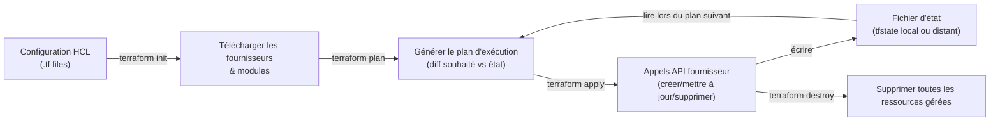

# Terraform

## Définition

Terraform est un outil d'infrastructure en tant que code (IaC) open source développé par HashiCorp qui permet de provisionner et gérer l'infrastructure cloud à l'aide d'un langage de configuration déclaratif appelé HCL (HashiCorp Configuration Language). Plutôt que d'exécuter des commandes impératives pour créer des ressources — « lancer une VM, puis attacher un disque, puis configurer le réseau » —, on déclare l'état final souhaité dans des fichiers `.tf`, et Terraform détermine quelles appels API effectuer pour atteindre cet état.

La valeur fondamentale de Terraform pour les équipes ML est la reproductibilité de l'infrastructure. Les clusters GPU pour l'entraînement, les registres de conteneurs, les buckets de stockage pour les artefacts de modèles, les clusters Kubernetes pour le service et les pipelines de données peuvent tous être définis comme du code, stockés dans un dépôt Git, révisés en pull requests et appliqués de manière cohérente dans les environnements de développement, staging et production. Cela élimine la configuration manuelle hasardeuse qui conduit à la dégradation de l'environnement au fil du temps.

Terraform maintient un **fichier d'état** (localement dans `terraform.tfstate` ou à distance dans S3, GCS ou Terraform Cloud) qui mappe les ressources définies dans votre configuration aux objets réels dans le fournisseur cloud. Cet état permet à Terraform de calculer des plans différentiels — il ne recrée pas toutes les ressources à chaque `apply`, il compare uniquement l'état souhaité à l'état actuel et n'effectue que les changements nécessaires.

## Fonctionnement



### Écrire la configuration

La configuration Terraform est organisée en **ressources**, **sources de données**, **variables** et **sorties**. Une ressource représente un objet d'infrastructure (une VM, un bucket S3, un groupe de nœuds Kubernetes). Une source de données interroge l'infrastructure existante sans la gérer. Les variables paramètrent la configuration pour différents environnements. Les sorties exposent les valeurs pour que d'autres modules ou opérateurs lisent.

### Initialisation, planification et application

`terraform init` télécharge les plugins fournisseurs (AWS, GCP, Azure, Kubernetes, etc.) spécifiés dans la configuration. `terraform plan` effectue un essai à sec — il lit l'état actuel, interroge les APIs du fournisseur pour voir ce qui existe réellement, compare à la configuration souhaitée et affiche un diff lisible par l'humain indiquant ce qui sera créé, modifié ou détruit. `terraform apply` exécute le plan après confirmation. Ces trois étapes forment le cycle fondamental de Terraform.

### Gestion de l'état

Le fichier d'état est le modèle de données critique qui rend Terraform idempotent. Pour les équipes, l'état doit être stocké à distance (S3, GCS, Terraform Cloud) avec le verrouillage d'état activé pour éviter que plusieurs opérateurs appliquent simultanément des modifications conflictuelles. L'état contient des métadonnées sur chaque ressource gérée, notamment les IDs qui permettent à Terraform de la retrouver lors des futurs `plan`.

### Destruction et cycle de vie des ressources

`terraform destroy` supprime toutes les ressources gérées dans l'état. Des règles de cycle de vie sur les ressources individuelles peuvent prévenir la destruction accidentelle (`prevent_destroy = true`), forcer le remplacement lors de certains changements de configuration (`replace_triggered_by`), ou créer de nouvelles ressources avant de supprimer les anciennes lors des mises à jour (`create_before_destroy = true`).

## Quand utiliser / Quand NE PAS utiliser

| Utiliser quand | Éviter quand |
|---|---|
| L'infrastructure ML doit être reproductible dans plusieurs environnements | Gérer un environnement local de développement ou des scripts ad hoc ponctuels |
| Plusieurs ressources cloud doivent être provisionnées ensemble (cluster GPU + stockage + réseau) | L'équipe utilise déjà des outils IaC spécifiques au fournisseur (CloudFormation, Deployment Manager) et la migration n'apporte pas de valeur |
| Les changements d'infrastructure doivent passer par des revues de code et des pipelines CI | La configuration s'exécute une seule fois et ne sera jamais mise à jour ou réutilisée |
| Les ressources doivent être détruites et recréées de façon cohérente (ex. : environnements de test éphémères) | Les ingénieurs préfèrent une approche de configuration procédurale (considérer Ansible ou des scripts shell) |
| Gouvernance et audit de l'infrastructure cloud au fil du temps | Les besoins d'infrastructure sont très simples et ne justifient pas l'apprentissage de HCL |

## Comparaisons

| Critère | Terraform | Ansible |
|---|---|---|
| Paradigme | Déclaratif — définir l'état souhaité | Procédural — définir les étapes pour y parvenir |
| Modèle d'état | Fichier d'état explicite (tfstate) | Sans état (idempotence via des modules conditionnels) |
| Force principale | Provisionnement d'infrastructure cloud | Gestion de configuration et déploiement d'applications |
| Support multi-cloud | Excellent (fournisseurs pour tout) | Bon (modules pour les principaux clouds) |
| Courbe d'apprentissage | Modérée — syntaxe HCL relativement simple | Modérée — YAML et logique de module peuvent être complexes |
| Maturité | Très élevée (écosystème large, HashiCorp) | Très élevée (Red Hat, large base d'utilisateurs) |

## Avantages et inconvénients

| Avantages | Inconvénients |
|---|---|
| L'infrastructure en tant que code rend les environnements reproductibles et auditables | La gestion de l'état peut devenir complexe dans les grandes équipes ou organisations |
| La planification avant application réduit les surprises des changements d'infrastructure | La dérive de l'état (changements manuels hors de Terraform) crée des incohérences difficiles à réconcilier |
| Excellent support multi-cloud avec des centaines de fournisseurs | HCL peut devenir verbeux pour des infrastructures complexes |
| L'architecture de modules permet la réutilisation et la standardisation | La courbe d'apprentissage pour les bonnes pratiques (backends distants, workspaces) prend du temps |
| Ecosystem riche : registre de modules Terraform, Terraform Cloud, Atlantis pour les PR | `terraform destroy` peut supprimer des ressources de production si exécuté sans précaution |

## Exemples de code

```hcl
# ml_infrastructure.tf
# Provisions the core ML infrastructure on AWS:
#   - S3 bucket for model artifacts and training data
#   - ECR repository for ML container images
#   - EKS cluster for model training and serving
#   - GPU node group for training workloads
#
# Prerequisites:
#   terraform init   (downloads AWS provider)
#   terraform plan   (preview changes)
#   terraform apply  (create resources)

terraform {
  required_version = ">= 1.6"
  required_providers {
    aws = {
      source  = "hashicorp/aws"
      version = "~> 5.0"
    }
  }

  # Remote state backend — shared state for teams.
  # Create the S3 bucket and DynamoDB table before running init.
  backend "s3" {
    bucket         = "my-org-terraform-state"
    key            = "mlops/infrastructure/terraform.tfstate"
    region         = "us-east-1"
    dynamodb_table = "terraform-state-lock"   # prevents concurrent applies
    encrypt        = true
  }
}

provider "aws" {
  region = var.aws_region
}

# ── Variables ──────────────────────────────────────────────────────────────────

variable "aws_region" {
  description = "AWS region for all resources"
  type        = string
  default     = "us-east-1"
}

variable "environment" {
  description = "Deployment environment (dev | staging | prod)"
  type        = string
  default     = "dev"
}

variable "project_name" {
  description = "Project prefix used in resource names"
  type        = string
  default     = "ml-platform"
}

variable "gpu_instance_type" {
  description = "EC2 instance type for the GPU node group"
  type        = string
  default     = "g4dn.xlarge"   # 1× NVIDIA T4 — good for inference and small training
}

variable "gpu_node_desired" {
  description = "Desired number of GPU nodes"
  type        = number
  default     = 1
}

# ── Local values (computed from variables) ────────────────────────────────────

locals {
  name_prefix = "${var.project_name}-${var.environment}"

  common_tags = {
    Project     = var.project_name
    Environment = var.environment
    ManagedBy   = "terraform"
  }
}

# ── S3 bucket — model artifacts & training data ───────────────────────────────

resource "aws_s3_bucket" "ml_artifacts" {
  bucket = "${local.name_prefix}-artifacts-${data.aws_caller_identity.current.account_id}"
  tags   = local.common_tags
}

resource "aws_s3_bucket_versioning" "ml_artifacts" {
  bucket = aws_s3_bucket.ml_artifacts.id
  versioning_configuration {
    status = "Enabled"   # keeps every version of every model artifact
  }
}

resource "aws_s3_bucket_server_side_encryption_configuration" "ml_artifacts" {
  bucket = aws_s3_bucket.ml_artifacts.id
  rule {
    apply_server_side_encryption_by_default {
      sse_algorithm = "AES256"
    }
  }
}

# Prevent accidental deletion of the artifact bucket in production
resource "aws_s3_bucket_lifecycle_configuration" "ml_artifacts" {
  bucket = aws_s3_bucket.ml_artifacts.id
  rule {
    id     = "expire-old-versions"
    status = "Enabled"
    noncurrent_version_expiration {
      noncurrent_days = 90   # delete non-current versions after 90 days
    }
  }
}

# ── ECR — container registry for ML images ───────────────────────────────────

resource "aws_ecr_repository" "ml_images" {
  name                 = "${local.name_prefix}-images"
  image_tag_mutability = "IMMUTABLE"   # tags like "v1.0.0" cannot be overwritten
  tags                 = local.common_tags

  image_scanning_configuration {
    scan_on_push = true   # automatic vulnerability scanning on every push
  }
}

resource "aws_ecr_lifecycle_policy" "ml_images" {
  repository = aws_ecr_repository.ml_images.name
  policy = jsonencode({
    rules = [{
      rulePriority = 1
      description  = "Keep only the 30 most recent images"
      selection = {
        tagStatus   = "any"
        countType   = "imageCountMoreThan"
        countNumber = 30
      }
      action = { type = "expire" }
    }]
  })
}

# ── Data sources — look up existing AWS resources ────────────────────────────

data "aws_caller_identity" "current" {}   # retrieves the AWS account ID

data "aws_eks_cluster_auth" "cluster" {
  name = aws_eks_cluster.ml_cluster.name
}

# ── EKS cluster — Kubernetes for training + serving ──────────────────────────

resource "aws_eks_cluster" "ml_cluster" {
  name     = "${local.name_prefix}-cluster"
  role_arn = aws_iam_role.eks_cluster.arn
  version  = "1.29"
  tags     = local.common_tags

  vpc_config {
    subnet_ids = aws_subnet.private[*].id
  }

  depends_on = [aws_iam_role_policy_attachment.eks_cluster_policy]
}

# GPU node group — runs training and GPU-based inference workloads
resource "aws_eks_node_group" "gpu_nodes" {
  cluster_name    = aws_eks_cluster.ml_cluster.name
  node_group_name = "${local.name_prefix}-gpu-nodes"
  node_role_arn   = aws_iam_role.eks_node.arn
  subnet_ids      = aws_subnet.private[*].id
  instance_types  = [var.gpu_instance_type]
  tags            = local.common_tags

  scaling_config {
    desired_size = var.gpu_node_desired
    min_size     = 0   # scale to zero when idle to save cost
    max_size     = 4
  }

  # GPU AMI — Amazon Linux 2 with NVIDIA drivers pre-installed
  ami_type = "AL2_x86_64_GPU"

  # Taint GPU nodes so only GPU-requesting pods land here
  taint {
    key    = "nvidia.com/gpu"
    value  = "true"
    effect = "NO_SCHEDULE"
  }

  depends_on = [
    aws_iam_role_policy_attachment.eks_worker_node_policy,
    aws_iam_role_policy_attachment.eks_cni_policy,
    aws_iam_role_policy_attachment.ecr_read_only,
  ]

  # Prevent accidental destruction of the node group in production
  lifecycle {
    prevent_destroy = false   # set true in prod
    ignore_changes  = [scaling_config[0].desired_size]   # managed by cluster autoscaler
  }
}

# ── Networking — VPC, subnets, and NAT gateway ───────────────────────────────

resource "aws_vpc" "ml_vpc" {
  cidr_block           = "10.0.0.0/16"
  enable_dns_hostnames = true
  tags                 = merge(local.common_tags, { Name = "${local.name_prefix}-vpc" })
}

resource "aws_subnet" "private" {
  count             = 2
  vpc_id            = aws_vpc.ml_vpc.id
  cidr_block        = "10.0.${count.index}.0/24"
  availability_zone = data.aws_availability_zones.available.names[count.index]
  tags              = merge(local.common_tags, { Name = "${local.name_prefix}-private-${count.index}" })
}

data "aws_availability_zones" "available" {}

# ── IAM roles — minimal permissions for EKS ──────────────────────────────────

resource "aws_iam_role" "eks_cluster" {
  name = "${local.name_prefix}-eks-cluster-role"
  assume_role_policy = jsonencode({
    Version = "2012-10-17"
    Statement = [{
      Action    = "sts:AssumeRole"
      Effect    = "Allow"
      Principal = { Service = "eks.amazonaws.com" }
    }]
  })
}

resource "aws_iam_role_policy_attachment" "eks_cluster_policy" {
  role       = aws_iam_role.eks_cluster.name
  policy_arn = "arn:aws:iam::aws:policy/AmazonEKSClusterPolicy"
}

resource "aws_iam_role" "eks_node" {
  name = "${local.name_prefix}-eks-node-role"
  assume_role_policy = jsonencode({
    Version = "2012-10-17"
    Statement = [{
      Action    = "sts:AssumeRole"
      Effect    = "Allow"
      Principal = { Service = "ec2.amazonaws.com" }
    }]
  })
}

resource "aws_iam_role_policy_attachment" "eks_worker_node_policy" {
  role       = aws_iam_role.eks_node.name
  policy_arn = "arn:aws:iam::aws:policy/AmazonEKSWorkerNodePolicy"
}

resource "aws_iam_role_policy_attachment" "eks_cni_policy" {
  role       = aws_iam_role.eks_node.name
  policy_arn = "arn:aws:iam::aws:policy/AmazonEKS_CNI_Policy"
}

resource "aws_iam_role_policy_attachment" "ecr_read_only" {
  role       = aws_iam_role.eks_node.name
  policy_arn = "arn:aws:iam::aws:policy/AmazonEC2ContainerRegistryReadOnly"
}

# ── Outputs — values to use in downstream configurations ─────────────────────

output "artifact_bucket_name" {
  description = "S3 bucket name for ML artifacts"
  value       = aws_s3_bucket.ml_artifacts.bucket
}

output "ecr_repository_url" {
  description = "ECR repository URL for pushing ML images"
  value       = aws_ecr_repository.ml_images.repository_url
}

output "eks_cluster_name" {
  description = "EKS cluster name for kubectl configuration"
  value       = aws_eks_cluster.ml_cluster.name
}

output "eks_cluster_endpoint" {
  description = "EKS API server endpoint"
  value       = aws_eks_cluster.ml_cluster.endpoint
  sensitive   = true
}
```

## Ressources pratiques

- [Documentation officielle Terraform](https://developer.hashicorp.com/terraform/docs) — Guides du langage, références des commandes CLI et tutoriels pour tous les fournisseurs cloud.
- [Registre de modules Terraform](https://registry.terraform.io/) — Modules communautaires et officiels pour AWS, GCP, Azure, Kubernetes, et bien plus.
- [Référence du fournisseur AWS Terraform](https://registry.terraform.io/providers/hashicorp/aws/latest/docs) — Documentation complète pour toutes les ressources AWS.
- [Meilleures pratiques Terraform](https://developer.hashicorp.com/terraform/language/style) — Style de code, structure des modules et recommandations de gestion d'état de l'équipe officielle.
- [Atlantis](https://www.runatlantis.io/) — Automatisation des pull requests Terraform permettant les plans et applications depuis les commentaires GitHub/GitLab.

## Voir aussi

- [Ansible](/docs/mlops/iac/ansible)
- [ML sur Kubernetes](/docs/mlops/deployment/ml-kubernetes)
- [KubeFlow](/docs/mlops/deployment/kubeflow)
