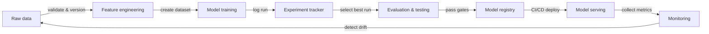

# MLOps

## Définition

MLOps — Machine Learning Operations — est la discipline qui consiste à appliquer les principes et pratiques DevOps au cycle de vie de l'apprentissage automatique. Il fournit l'outillage, les processus et les normes culturelles nécessaires pour construire, déployer et maintenir de manière fiable des modèles ML en production. Sans MLOps, les équipes expédient régulièrement des modèles qui fonctionnent dans des notebooks mais se dégradent silencieusement en production, ne peuvent pas être reproduits six mois plus tard, ou prennent des semaines à mettre à jour.

Les principes fondamentaux du MLOps sont la **reproductibilité** (chaque expérience et déploiement peut être recréé exactement), l'**automatisation** (les pipelines de données, l'entraînement, l'évaluation et le déploiement sont déclenchés par du code, et non par des étapes manuelles), la **surveillance** (les performances du modèle sont suivies en continu en production) et la **collaboration** (les data scientists, les ingénieurs ML et les équipes de plateforme partagent des outils, des normes et des responsabilités). Ces principes correspondent directement aux piliers DevOps — intégration continue, livraison continue et feedback continu — appliqués aux données et aux artefacts de modèles plutôt qu'au seul code.

Le MLOps est apparu lorsque les équipes ont découvert que les pratiques d'ingénierie logicielle qui domptent la complexité des logiciels ne se transfèrent pas automatiquement au ML. Le code n'est qu'une entrée parmi d'autres : les distributions de données évoluent, la précision des modèles se dégrade, les expériences prolifèrent, et un modèle qui performait bien sur un ensemble de validation en janvier peut se comporter de manière imprévisible en juillet. Le MLOps fournit l'échafaudage pour détecter ces problèmes et y répondre de manière systématique.

## Fonctionnement

### Gestion des données

Les données brutes sont ingérées, validées, versionnées et stockées dans un feature store ou un data lake. La validation des données détecte la dérive de schéma et la dérive de distribution avant qu'elles ne corrompent un cycle d'entraînement. Le versionnage garantit que les modèles peuvent être réentraînés sur exactement les données qui ont produit une version précédente.

### Expérimentation et entraînement

Les data scientists mènent des expériences — en faisant varier les hyperparamètres, les architectures et les ensembles de features — et toutes les exécutions sont enregistrées dans un outil de suivi d'expériences. La meilleure exécution est promue pour une évaluation approfondie. Les pipelines d'entraînement automatisés (déclenchés par de nouvelles données ou un commit de code) suppriment les étapes manuelles et permettent un réentraînement continu.

### Évaluation et validation

Les modèles candidats sont évalués sur des ensembles de test réservés, des vérifications d'équité et des budgets de latence avant la promotion. Les portes d'évaluation empêchent les régressions d'atteindre la production. Les tests A/B ou les déploiements en mode shadow peuvent comparer les modèles candidats et de production sur du trafic réel.

### Déploiement et service

Les modèles approuvés sont empaquetés, enregistrés dans un registre de modèles et déployés via des pipelines CI/CD vers l'infrastructure de service. Les déploiements canary et les mécanismes de rollback réduisent les risques. L'infrastructure-as-code garantit la reproductibilité des environnements de service.

### Surveillance et feedback

Les métriques de production — distributions des prédictions, dérive des données, latence, taux d'erreur — sont collectées et transmises à l'équipe. Les alertes déclenchent des pipelines de réentraînement ou des rollbacks de modèles. Les boucles de feedback ferment le cycle de vie ML, transformant les signaux de production en nouvelles données d'entraînement.



## Quand utiliser / Quand NE PAS utiliser

| Utiliser quand | Éviter quand |
|----------|------------|
| Les modèles sont déployés en production et servent de vrais utilisateurs | Le projet est une analyse ponctuelle ou un prototype de recherche |
| Plusieurs membres de l'équipe collaborent sur les mêmes modèles | L'équipe compte moins de deux personnes et un seul modèle |
| Les modèles nécessitent un réentraînement périodique au fur et à mesure que les données évoluent | Le modèle est statique et ne sera jamais mis à jour |
| Des exigences réglementaires ou d'audit imposent la reproductibilité | La rapidité d'exploration est la seule priorité et aucun déploiement en production n'est prévu |
| Vous avez plus d'un modèle en production à gérer | La surcharge des outils dépasse la durée de vie prévue du projet |

## Exemples de code

```python
# mlflow_quickstart.py
# Demonstrates basic MLflow experiment tracking for a simple classifier.
# Run: pip install mlflow scikit-learn

import mlflow
import mlflow.sklearn
from sklearn.datasets import load_iris
from sklearn.ensemble import RandomForestClassifier
from sklearn.model_selection import train_test_split
from sklearn.metrics import accuracy_score, f1_score

# Load data
X, y = load_iris(return_X_y=True)
X_train, X_test, y_train, y_test = train_test_split(
    X, y, test_size=0.2, random_state=42
)

# Define hyperparameters to log
params = {
    "n_estimators": 100,
    "max_depth": 5,
    "random_state": 42,
}

# Start an MLflow experiment run
mlflow.set_experiment("iris-classification")

with mlflow.start_run(run_name="random-forest-baseline"):
    # Log hyperparameters
    mlflow.log_params(params)

    # Train the model
    clf = RandomForestClassifier(**params)
    clf.fit(X_train, y_train)

    # Evaluate
    y_pred = clf.predict(X_test)
    accuracy = accuracy_score(y_test, y_pred)
    f1 = f1_score(y_test, y_pred, average="weighted")

    # Log metrics
    mlflow.log_metric("accuracy", accuracy)
    mlflow.log_metric("f1_score", f1)

    # Log the trained model with a registered name
    mlflow.sklearn.log_model(
        clf,
        artifact_path="model",
        registered_model_name="iris-random-forest",
    )

    print(f"Accuracy: {accuracy:.4f} | F1: {f1:.4f}")
    print(f"Run ID: {mlflow.active_run().info.run_id}")
```

## Ressources pratiques

- [Google – Guide pratique du MLOps](https://services.google.com/fh/files/misc/practitioners_guide_to_mlops_whitepaper.pdf) — Livre blanc complet couvrant les niveaux de maturité MLOps, les choix d'outils et les modèles organisationnels de Google Cloud.
- [Documentation MLflow](https://mlflow.org/docs/latest/index.html) — Documentation officielle de la plateforme MLOps open source la plus adoptée, couvrant le tracking, le registre, les projets et le déploiement.
- [Made With ML – Cours MLOps](https://madewithml.com/) — Cours MLOps gratuit et basé sur des projets, qui parcourt l'ensemble du cycle de vie avec du vrai code.
- [Chip Huyen – Concevoir des systèmes d'apprentissage automatique](https://www.oreilly.com/library/view/designing-machine-learning/9781098107956/) — Livre O'Reilly sur la conception de systèmes ML de production, les pipelines de données, les feature stores et la surveillance.
- [CD Foundation – MLOps SIG](https://github.com/cdfoundation/sig-mlops) — Définitions, panorama et bonnes pratiques pour le MLOps pilotés par la communauté.

## Voir aussi

- [Suivi d'expériences](/docs/mlops/experiment-tracking)
- [MLflow](/docs/mlops/mlflow)
- [Weights & Biases](/docs/mlops/wandb)
- [Feature stores](/docs/mlops/feature-stores)
