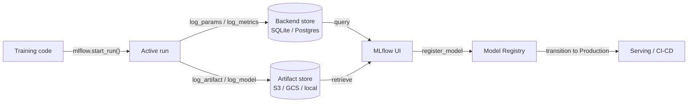

# MLflow

## Définition

MLflow est une plateforme open source conçue pour gérer le cycle de vie complet du machine learning. Initialement publiée par Databricks en 2018, elle est devenue l'un des outils MLOps les plus adoptés grâce à sa simplicité, son indépendance vis-à-vis des frameworks et au fait qu'elle peut fonctionner entièrement on-premise sans aucune dépendance au cloud. Un simple `pip install mlflow` et une modification de deux lignes de code suffisent pour commencer à suivre des expériences.

MLflow organise ses fonctionnalités en quatre composants étroitement intégrés. **Tracking** enregistre les paramètres, les métriques et les artefacts pour chaque exécution d'entraînement. **Projects** conditionne le code ML en unités reproductibles et exécutables définies par un fichier `MLproject`. **Models** fournit un format standard pour conditionner les modèles pouvant être servis par n'importe quelle cible de déploiement compatible. **Model Registry** offre un magasin de modèles centralisé avec une gestion du cycle de vie (états Staging, Production, Archived) et un historique des versions. Ensemble, ces composants couvrent le parcours de l'expérience brute au déploiement en production.

MLflow peut être exécuté localement (backend SQLite, artefacts sur le système de fichiers local), sur un serveur autogéré (PostgreSQL + S3), ou en tant que service entièrement géré via Databricks Managed MLflow. Le cœur open source est sous licence Apache 2.0, ce qui le rend adapté aux secteurs réglementés où les données ne peuvent pas quitter l'infrastructure propre.

## Fonctionnement

### Serveur de tracking

Lorsque vous appelez `mlflow.start_run()`, le client ouvre une exécution sur le serveur de tracking et commence à mettre les logs en tampon. Les paramètres (`log_param`, `log_params`) et les métriques (`log_metric`, `log_metrics`) sont écrits dans le magasin backend (SQLite ou PostgreSQL). Les artefacts sont chargés dans le magasin d'artefacts (système de fichiers local, S3, GCS, Azure Blob, HDFS). Le serveur expose une API REST consommée par le SDK client et l'interface web.

### MLflow Projects

Un projet est un répertoire (ou dépôt git) avec un fichier YAML `MLproject` qui déclare les points d'entrée, les paramètres et l'environnement conda/pip. L'exécution de `mlflow run . -P lr=0.01` résout l'environnement, définit les paramètres et lance le point d'entrée — produisant automatiquement une exécution suivie. Cela rend les expériences reproductibles pour quiconque a accès au dépôt.

### MLflow Models

Un modèle sauvegardé avec `mlflow.<flavor>.log_model()` est stocké au format MLmodel : un répertoire contenant le modèle sérialisé, un descripteur YAML `MLmodel` et un `conda.yaml` / `requirements.txt`. Le flavor `pyfunc` fournit une interface uniforme `model.predict(data)` quel que soit le framework sous-jacent, permettant au même modèle d'être chargé par différents backends de serving.

### Model Registry

Le registre stocke des versions de modèles nommées avec des états de transition. Les systèmes CI/CD automatisés interrogent le registre pour obtenir la dernière version `Production` à déployer. Les approbateurs humains ou les travaux de validation automatisés font transiter les versions entre les états. Chaque version renvoie à son exécution source, préservant la traçabilité complète.



## Quand utiliser / Quand NE PAS utiliser

| Utiliser quand | Éviter quand |
|----------|------------|
| Une plateforme MLOps entièrement auto-hébergée et open source est nécessaire | L'équipe a besoin de riches fonctionnalités collaboratives (rapports partagés, notifications Slack) nativement |
| Les données ne peuvent pas quitter l'infrastructure propre (secteurs réglementés) | Un produit SaaS sans infrastructure à gérer est préféré |
| Databricks est déjà utilisé et une intégration native est souhaitée | Le flux de travail est uniquement basé sur des notebooks sans déploiement en production prévu |
| L'indépendance vis-à-vis des frameworks est importante (sklearn, XGBoost, PyTorch, TF, etc.) | Une optimisation avancée des hyperparamètres intégrée est nécessaire |
| Le contrôle des coûts est critique et une licence open source est requise | L'équipe manque de ressources d'ingénierie pour gérer un serveur et un magasin d'artefacts |

## Comparaisons

| Critère | MLflow | Weights & Biases (W&B) |
|-----------|--------|------------------------|
| Facilité de configuration | Auto-hébergeable avec une commande ; aucun compte requis | SaaS ; compte gratuit requis ; aucune infrastructure à gérer |
| Qualité de l'UI | Propre mais basique ; axée sur les métriques tabulaires et la comparaison des exécutions | Très soignée ; excellent journalisation des médias, graphiques personnalisés, rapports |
| Collaboration | Serveur partagé requis ; pas de RBAC intégré dans l'OSS | Espaces de travail d'équipe intégrés, liens de partage et accès basé sur les rôles |
| Tarification | Gratuit et open source ; Databricks Managed MLflow coûte plus cher | Gratuit pour les individus ; plans payants pour les équipes |
| Optimisation des hyperparamètres | S'intègre avec Optuna, Ray Tune en externe | Sweeps intégrés avec recherche Bayésienne/grid/aléatoire |

## Exemples de code

```python
# mlflow_full_example.py
# Full MLflow tracking example: logs params, metrics, a custom artifact,
# and registers the model in the Model Registry.
# pip install mlflow scikit-learn matplotlib

import mlflow
import mlflow.sklearn
import matplotlib.pyplot as plt
import numpy as np
from sklearn.ensemble import GradientBoostingClassifier
from sklearn.datasets import load_breast_cancer
from sklearn.model_selection import train_test_split, cross_val_score
from sklearn.metrics import (
    accuracy_score, roc_auc_score, classification_report
)
import os, tempfile, json

X, y = load_breast_cancer(return_X_y=True)
X_train, X_test, y_train, y_test = train_test_split(
    X, y, test_size=0.2, stratify=y, random_state=0
)

params = {
    "n_estimators": 200,
    "learning_rate": 0.05,
    "max_depth": 4,
    "subsample": 0.8,
    "random_state": 0,
}

mlflow.set_experiment("breast-cancer-gbt")

with mlflow.start_run(run_name="gbt-tuned") as run:

    mlflow.log_params(params)

    clf = GradientBoostingClassifier(**params)
    clf.fit(X_train, y_train)

    y_pred = clf.predict(X_test)
    y_prob = clf.predict_proba(X_test)[:, 1]
    cv_scores = cross_val_score(clf, X_train, y_train, cv=5, scoring="roc_auc")

    metrics = {
        "accuracy": accuracy_score(y_test, y_pred),
        "roc_auc": roc_auc_score(y_test, y_prob),
        "cv_roc_auc_mean": cv_scores.mean(),
        "cv_roc_auc_std": cv_scores.std(),
    }
    mlflow.log_metrics(metrics)

    with tempfile.TemporaryDirectory() as tmp:
        fig, ax = plt.subplots(figsize=(8, 5))
        feat_imp = clf.feature_importances_
        top_idx = np.argsort(feat_imp)[-10:]
        ax.barh(range(10), feat_imp[top_idx])
        ax.set_title("Top 10 feature importances")
        fig.tight_layout()
        plot_path = os.path.join(tmp, "feature_importance.png")
        fig.savefig(plot_path)
        plt.close(fig)
        mlflow.log_artifact(plot_path, artifact_path="plots")

        report = classification_report(y_test, y_pred, output_dict=True)
        report_path = os.path.join(tmp, "classification_report.json")
        with open(report_path, "w") as f:
            json.dump(report, f, indent=2)
        mlflow.log_artifact(report_path, artifact_path="evaluation")

    mlflow.sklearn.log_model(
        clf,
        artifact_path="model",
        registered_model_name="breast-cancer-gbt",
    )

    print(f"Run ID  : {run.info.run_id}")
    for k, v in metrics.items():
        print(f"  {k}: {v:.4f}")
```

## Ressources pratiques

- [MLflow Official Documentation](https://mlflow.org/docs/latest/index.html) — Référence complète des quatre composants, de l'API REST et des cibles de déploiement.
- [MLflow GitHub Repository](https://github.com/mlflow/mlflow) — Code source, gestionnaire d'incidents et exemples ; utile pour comprendre les mécanismes internes et contribuer.
- [Databricks – MLflow Tutorials](https://docs.databricks.com/en/mlflow/index.html) — Utilisation de MLflow en production sur Databricks avec intégration Unity Catalog.
- [Towards Data Science – MLflow in Production](https://towardsdatascience.com/deploy-mlflow-with-docker-compose-8059f16b6039) — Guide communautaire pour déployer un serveur MLflow auto-hébergé avec Docker Compose, PostgreSQL et MinIO.

## Voir aussi

- [Experiment tracking](/docs/mlops/experiment-tracking)
- [Weights & Biases](/docs/mlops/wandb)
- [MLOps](/docs/mlops)
