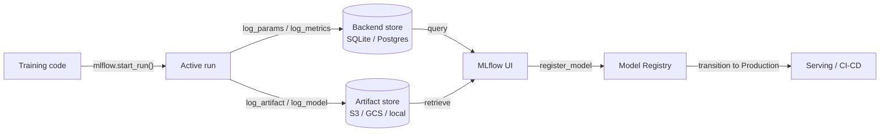

# MLflow

## Définition

MLflow est une plateforme open source conçue pour gérer le cycle de vie de bout en bout de l'apprentissage automatique. Initialement publié par Databricks en 2018, il est devenu l'un des outils MLOps les plus adoptés grâce à sa simplicité, son indépendance vis-à-vis des frameworks et le fait qu'il peut être exécuté entièrement sur site sans dépendance cloud. Un simple `pip install mlflow` et une modification de deux lignes de code suffisent pour commencer à suivre des expériences.

MLflow organise ses fonctionnalités en quatre composants étroitement intégrés. Le **Tracking** enregistre les paramètres, métriques et artefacts pour chaque exécution d'entraînement. Les **Projects** empaquettent le code ML en unités reproductibles et exécutables définies par un fichier `MLproject`. Les **Models** fournissent un format standard pour l'empaquetage des modèles pouvant être servis par n'importe quelle cible de déploiement prise en charge. Le **Model Registry** offre un store de modèles centralisé avec gestion du cycle de vie (états Staging, Production, Archivé) et historique des versions. Ensemble, ces composants couvrent le parcours depuis l'expérience brute jusqu'au déploiement en production.

MLflow peut être exécuté localement (backend SQLite, artefacts sur système de fichiers local), sur un serveur auto-géré (PostgreSQL + S3), ou comme service entièrement géré via Databricks Managed MLflow. Le noyau open source est sous licence Apache 2.0, ce qui le rend adapté aux industries réglementées où les données ne peuvent pas quitter l'infrastructure sur site.

## Fonctionnement

### Serveur de tracking

Lorsque vous appelez `mlflow.start_run()`, le client ouvre une exécution sur le serveur de tracking et commence à mettre en mémoire tampon les logs. Les paramètres (`log_param`, `log_params`) et les métriques (`log_metric`, `log_metrics`) sont écrits dans le backend store (SQLite ou PostgreSQL). Les artefacts sont téléchargés vers le store d'artefacts (système de fichiers local, S3, GCS, Azure Blob, HDFS). Le serveur expose une API REST consommée par le SDK client et l'interface web.

### MLflow Projects

Un projet est un répertoire (ou un dépôt git) avec un fichier YAML `MLproject` qui déclare les points d'entrée, les paramètres et l'environnement conda/pip. L'exécution de `mlflow run . -P lr=0.01` résout l'environnement, définit les paramètres et lance le point d'entrée — produisant automatiquement une exécution tracée. Cela rend les expériences reproductibles par toute personne ayant accès au dépôt.

### MLflow Models

Un modèle sauvegardé avec `mlflow.<flavor>.log_model()` est stocké au format MLmodel : un répertoire contenant le modèle sérialisé, un descripteur YAML `MLmodel` et un `conda.yaml` / `requirements.txt`. La saveur `pyfunc` fournit une interface uniforme `model.predict(data)` indépendamment du framework sous-jacent, permettant au même modèle d'être chargé par différents backends de service.

### Model Registry

Le registre stocke des versions de modèles nommées avec des états de transition. Les systèmes CI/CD automatisés interrogent le registre pour la dernière version en `Production` à déployer. Des approbateurs humains ou des jobs de validation automatisés font passer les versions d'un état à l'autre. Chaque version renvoie à son exécution source, préservant la provenance complète.



## Quand utiliser / Quand NE PAS utiliser

| Utiliser quand | Éviter quand |
|----------|------------|
| Vous avez besoin d'une plateforme MLOps entièrement auto-hébergée et open source | Votre équipe a besoin de fonctionnalités collaboratives riches (rapports partagés, notifications Slack) dès le départ |
| Les données ne peuvent pas quitter votre infrastructure (industries réglementées) | Vous préférez un produit SaaS sans infrastructure à gérer |
| Vous utilisez déjà Databricks et souhaitez une intégration native | Votre workflow est uniquement notebook sans déploiement en production prévu |
| L'indépendance vis-à-vis des frameworks est importante (sklearn, XGBoost, PyTorch, TF, etc.) | Vous avez besoin d'une optimisation avancée des hyperparamètres/sweep intégrée |
| Le contrôle des coûts est critique ; une licence open source est requise | Votre équipe manque de bande passante d'ingénierie pour gérer un serveur et un store d'artefacts |

## Comparaisons

| Critère | MLflow | Weights & Biases (W&B) |
|-----------|--------|------------------------|
| Facilité de configuration | Auto-hébergeable en une commande ; pas de compte nécessaire | SaaS ; compte gratuit requis ; pas d'infrastructure à gérer |
| Qualité de l'interface | Propre mais basique ; axée sur les métriques tabulaires et la comparaison d'exécutions | Très soignée ; excellent logging de médias, graphiques personnalisés, rapports |
| Collaboration | Serveur partagé requis ; pas de RBAC intégré en OSS | Espaces de travail d'équipe intégrés, liens de partage et accès basé sur les rôles |
| Tarification | Gratuit et open source ; Databricks Managed MLflow coûte plus cher | Gratuit pour les particuliers ; plans payants pour les équipes |
| Optimisation des hyperparamètres | S'intègre avec Optuna, Ray Tune en externe | Sweeps intégrés avec recherche bayésienne/grille/aléatoire |

## Exemples de code

```python
# mlflow_full_example.py
# Full MLflow tracking example: logs params, metrics, a custom artifact,
# and registers the model in the Model Registry.
# pip install mlflow scikit-learn matplotlib

import mlflow
import mlflow.sklearn
import matplotlib.pyplot as plt
import numpy as np
from sklearn.ensemble import GradientBoostingClassifier
from sklearn.datasets import load_breast_cancer
from sklearn.model_selection import train_test_split, cross_val_score
from sklearn.metrics import (
    accuracy_score, roc_auc_score, classification_report
)
import os, tempfile, json

# ── 1. Data ──────────────────────────────────────────────────────────────────
X, y = load_breast_cancer(return_X_y=True)
X_train, X_test, y_train, y_test = train_test_split(
    X, y, test_size=0.2, stratify=y, random_state=0
)

# ── 2. Hyperparameters ────────────────────────────────────────────────────────
params = {
    "n_estimators": 200,
    "learning_rate": 0.05,
    "max_depth": 4,
    "subsample": 0.8,
    "random_state": 0,
}

# ── 3. MLflow run ─────────────────────────────────────────────────────────────
mlflow.set_experiment("breast-cancer-gbt")

with mlflow.start_run(run_name="gbt-tuned") as run:

    # Log hyperparameters
    mlflow.log_params(params)

    # Train
    clf = GradientBoostingClassifier(**params)
    clf.fit(X_train, y_train)

    # Evaluate
    y_pred = clf.predict(X_test)
    y_prob = clf.predict_proba(X_test)[:, 1]
    cv_scores = cross_val_score(clf, X_train, y_train, cv=5, scoring="roc_auc")

    metrics = {
        "accuracy": accuracy_score(y_test, y_pred),
        "roc_auc": roc_auc_score(y_test, y_prob),
        "cv_roc_auc_mean": cv_scores.mean(),
        "cv_roc_auc_std": cv_scores.std(),
    }
    mlflow.log_metrics(metrics)

    # Log a feature importance plot as an artifact
    with tempfile.TemporaryDirectory() as tmp:
        fig, ax = plt.subplots(figsize=(8, 5))
        feat_imp = clf.feature_importances_
        top_idx = np.argsort(feat_imp)[-10:]
        ax.barh(range(10), feat_imp[top_idx])
        ax.set_title("Top 10 feature importances")
        fig.tight_layout()
        plot_path = os.path.join(tmp, "feature_importance.png")
        fig.savefig(plot_path)
        plt.close(fig)
        mlflow.log_artifact(plot_path, artifact_path="plots")

        # Log classification report as JSON
        report = classification_report(y_test, y_pred, output_dict=True)
        report_path = os.path.join(tmp, "classification_report.json")
        with open(report_path, "w") as f:
            json.dump(report, f, indent=2)
        mlflow.log_artifact(report_path, artifact_path="evaluation")

    # Log and register the model
    mlflow.sklearn.log_model(
        clf,
        artifact_path="model",
        registered_model_name="breast-cancer-gbt",  # creates registry entry
    )

    print(f"Run ID  : {run.info.run_id}")
    for k, v in metrics.items():
        print(f"  {k}: {v:.4f}")

# ── 4. Load a registered model (simulates downstream serving) ─────────────────
# model_uri = "models:/breast-cancer-gbt/1"
# loaded = mlflow.sklearn.load_model(model_uri)
# print(loaded.predict(X_test[:3]))
```

## Ressources pratiques

- [Documentation officielle MLflow](https://mlflow.org/docs/latest/index.html) — Référence complète couvrant les quatre composants, l'API REST et les cibles de déploiement.
- [Dépôt GitHub MLflow](https://github.com/mlflow/mlflow) — Code source, suivi des problèmes et exemples ; utile pour comprendre les mécanismes internes et contribuer.
- [Databricks – Tutoriels MLflow](https://docs.databricks.com/en/mlflow/index.html) — Utilisation de MLflow en production sur Databricks avec intégration Unity Catalog.
- [Towards Data Science – MLflow en production](https://towardsdatascience.com/deploy-mlflow-with-docker-compose-8059f16b6039) — Présentation communautaire du déploiement d'un serveur MLflow auto-hébergé avec Docker Compose, PostgreSQL et MinIO.

## Voir aussi

- [Suivi d'expériences](/docs/mlops/experiment-tracking)
- [Weights & Biases](/docs/mlops/wandb)
- [MLOps](/docs/mlops)
