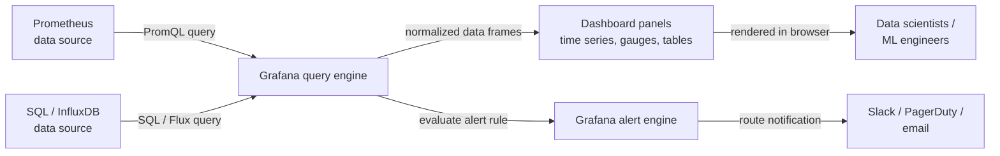

# Grafana

## Définition

Grafana est une plateforme d'analytique et de visualisation interactive open source qui se connecte à un large éventail de sources de données — [Prometheus](/docs/mlops/monitoring/prometheus), InfluxDB, Elasticsearch, Loki, PostgreSQL, API de surveillance cloud natives et des dizaines d'autres — et rend les données sous forme de tableaux de bord interactifs et partageables. Elle ne fournit aucun stockage propre ; c'est purement une couche de requête et de visualisation qui se place devant l'infrastructure de données existante. Cette conception rend Grafana complémentaire à chaque système de stockage de séries temporelles ou de logs plutôt que de remplacer l'un d'eux.

Dans les contextes ML et MLOps, Grafana sert d'interface d'observabilité unifiée. Les data scientists et les ingénieurs ML l'utilisent pour suivre les métriques de performance des modèles (précision, F1, AUC) au fil du temps, visualiser la latence et le débit des prédictions aux côtés de l'utilisation des ressources d'infrastructure, et surveiller les signaux de qualité des données tels que les scores de dérive des features. Comme Grafana supporte plusieurs sources de données simultanément, un seul tableau de bord peut combiner des métriques Prometheus, des logs d'application de Loki et des KPIs métier d'une base de données SQL — donnant une vue complète et contextualisée du comportement d'un modèle en production.

Grafana est disponible en tant que distribution open source auto-hébergée, en tant que Grafana Cloud (une offre SaaS gérée) et en tant que Grafana Enterprise avec des fonctionnalités entreprise supplémentaires. La distribution open source est entièrement fonctionnelle et est le choix le plus courant pour les équipes qui exploitent déjà Kubernetes ou qui ont des workflows infrastructure-as-code, puisque les tableaux de bord Grafana, les configurations de sources de données et les règles d'alerte peuvent tous être gérés en JSON ou via les providers Terraform.

## Fonctionnement

### Configuration des sources de données

Grafana se connecte aux sources de données via des plugins. Un plugin de source de données traduit le modèle de requête interne de Grafana dans le langage de requête natif du backend (PromQL pour Prometheus, SQL pour les bases de données relationnelles, Lucene pour Elasticsearch, etc.) et retourne les données dans un format normalisé. Les sources de données sont configurées dans l'interface Grafana ou via des fichiers de provisionnement (YAML), ce qui permet de gérer les configurations comme du code dans un dépôt Git. L'authentification, le TLS et les paramètres de timeout sont tous configurables par source de données.

### Composition des tableaux de bord et des panneaux

Un tableau de bord Grafana est un document JSON contenant une liste ordonnée de panneaux. Chaque panneau définit une requête contre une source de données, un type de visualisation (séries temporelles, jauge, graphique à barres, tableau, heatmap, stat, etc.) et des options d'affichage (axes, seuils, légendes, remplacements). Les panneaux peuvent être liés à d'autres tableaux de bord, supportent des variables (les variables de template permettent à un seul tableau de bord de basculer entre des environnements, des versions de modèles ou des services via un menu déroulant) et peuvent référencer des annotations — des événements superposés sur des graphiques de séries temporelles pour marquer les déploiements, les exécutions de réentraînement ou les débuts d'incidents.

### Variables et templating

Les variables de template transforment un tableau de bord statique en un tableau de bord dynamique. Une variable interroge la source de données pour une liste de valeurs (par exemple, toutes les valeurs distinctes d'étiquette `model_version` de Prometheus) et insère la valeur sélectionnée dans chaque requête de panneau du tableau de bord. Cela permet de construire un seul tableau de bord de modèle ML qui fonctionne pour tous les modèles et versions plutôt que de maintenir un tableau de bord par modèle.

### Alertes

Les alertes Grafana (introduites dans Grafana 8+) fournissent des règles d'alerte unifiées et multi-sources de données qui évaluent les requêtes de panneaux selon un calendrier et routent les alertes déclenchées vers des points de contact (Slack, PagerDuty, email, webhooks). Les règles d'alerte sont regroupées en politiques de notification qui déterminent le comportement de routage, de regroupement et de silence. Les alertes Grafana peuvent coexister avec Prometheus Alertmanager ou le remplacer entièrement, selon les préférences de l'équipe.

### Provisionnement et infrastructure as code

Grafana supporte le provisionnement déclaratif des sources de données, des tableaux de bord et des règles d'alerte via des fichiers YAML et JSON chargés au démarrage. Combiné avec le provider Terraform Grafana, l'ensemble de la configuration Grafana peut être versionné et déployé via des pipelines CI/CD — une capacité critique pour les équipes qui gèrent plusieurs environnements ou souhaitent une infrastructure de surveillance reproductible.



## Quand utiliser / Quand NE PAS utiliser

| Utiliser quand | Éviter quand |
|----------|------------|
| Vous avez besoin de tableaux de bord interactifs et partageables sur Prometheus ou d'autres données de séries temporelles | Vous avez besoin d'une interface de suivi d'expériences ML complète (utilisez plutôt MLflow ou W&B) |
| Vous souhaitez corréler les métriques d'infrastructure avec les performances des modèles dans une seule vue | Votre équipe n'a pas de source de données de séries temporelles existante à connecter à Grafana |
| Vous avez plusieurs sources de données (Prometheus, SQL, Loki) à unifier dans un tableau de bord | Un résumé textuel ou tabulaire simple est suffisant et un tableau de bord n'ajoute pas de valeur |
| Vous souhaitez gérer les tableaux de bord comme du code via JSON ou Terraform | Votre organisation est déjà standardisée sur une plateforme d'observabilité propriétaire |
| Vous avez besoin d'alertes couvrant plusieurs sources de données | Vous devez stocker ou analyser des logs de prédictions bruts (Grafana interroge, il ne stocke pas) |

## Comparaisons

Grafana et Prometheus sont complémentaires — Prometheus collecte et stocke les métriques ; Grafana les visualise. Le tableau ci-dessous les compare pour clarifier leurs rôles distincts.

| Critère | Grafana | Prometheus |
|-----------|---------|-----------|
| Rôle principal | Visualisation et création de tableaux de bord | Collecte, stockage et alertes sur les métriques |
| Stockage des données | Aucun — interroge des backends externes | TSDB locale (scraping pull-based) |
| Langage de requête | Dépend de la source de données (PromQL, SQL, etc.) | PromQL |
| Alertes | Alertes unifiées multi-sources de données (Grafana 8+) | Règles basées sur PromQL + Alertmanager |
| Sources de données | 50+ plugins (Prometheus, SQL, Loki, cloud, etc.) | Soi-même uniquement (TSDB) |
| Quand utiliser ensemble | Toujours — Grafana est l'interface pour les données Prometheus | Toujours — Prometheus est le backend pour les tableaux de bord Grafana |

## Avantages et inconvénients

| Aspect | Avantages | Inconvénients |
|--------|------|------|
| Multi-sources de données | Unifie métriques, logs et SQL dans un tableau de bord | La complexité de configuration augmente avec le nombre de sources de données |
| Tableau de bord as code | L'export JSON et le provider Terraform permettent les workflows GitOps | Les tableaux de bord JSON sont verbeux et difficiles à différencier manuellement |
| Variables de template | Un tableau de bord couvre tous les modèles, environnements et versions | Les requêtes de variables ajoutent de la latence au chargement du tableau de bord |
| Bibliothèque de visualisations | Types de panneaux riches et personnalisables | Certains types de graphiques avancés nécessitent des plugins ou Grafana Enterprise |
| Alertes | Règles d'alerte unifiées et multi-sources de données | Courbe d'apprentissage pour les politiques de notification et les arbres de routage |
| Option auto-hébergée | Contrôle total, les données ne quittent pas votre infrastructure | Nécessite un effort opérationnel : mises à niveau, sauvegardes, gestion des plugins |

## Exemples de code

```json
// grafana_ml_dashboard.json
// Grafana dashboard definition for monitoring an ML model serving endpoint.
// Import this JSON via Grafana UI: Dashboards → Import → Upload JSON file.
// Prerequisites: Prometheus data source named "Prometheus" with ml_* metrics.
{
  "title": "ML Model Monitoring",
  "description": "Dashboard for monitoring ML model latency, throughput, confidence distribution, and data drift.",
  "uid": "ml-model-monitoring-v1",
  "schemaVersion": 36,
  "version": 1,
  "refresh": "30s",
  "time": { "from": "now-3h", "to": "now" },
  "templating": {
    "list": [
      {
        "name": "model_name",
        "label": "Model",
        "type": "query",
        "datasource": { "type": "prometheus", "uid": "Prometheus" },
        "query": "label_values(ml_predictions_total, model_name)",
        "includeAll": false,
        "multi": false,
        "current": {}
      },
      {
        "name": "model_version",
        "label": "Version",
        "type": "query",
        "datasource": { "type": "prometheus", "uid": "Prometheus" },
        "query": "label_values(ml_predictions_total{model_name=\"$model_name\"}, model_version)",
        "includeAll": true,
        "multi": true,
        "current": {}
      }
    ]
  },
  "panels": [
    {
      "id": 1,
      "title": "Prediction Throughput (req/s)",
      "type": "timeseries",
      "gridPos": { "x": 0, "y": 0, "w": 12, "h": 8 },
      "datasource": { "type": "prometheus", "uid": "Prometheus" },
      "targets": [
        {
          "expr": "sum(rate(ml_predictions_total{model_name=\"$model_name\", status=\"success\"}[2m])) by (model_version)",
          "legendFormat": "{{model_version}} — success",
          "refId": "A"
        },
        {
          "expr": "sum(rate(ml_predictions_total{model_name=\"$model_name\", status=\"error\"}[2m])) by (model_version)",
          "legendFormat": "{{model_version}} — error",
          "refId": "B"
        }
      ],
      "fieldConfig": {
        "defaults": {
          "unit": "reqps",
          "custom": { "lineWidth": 2, "fillOpacity": 10 }
        }
      }
    },
    {
      "id": 2,
      "title": "P50 / P95 / P99 Prediction Latency",
      "type": "timeseries",
      "gridPos": { "x": 12, "y": 0, "w": 12, "h": 8 },
      "datasource": { "type": "prometheus", "uid": "Prometheus" },
      "targets": [
        {
          "expr": "histogram_quantile(0.50, sum(rate(ml_prediction_latency_seconds_bucket{model_name=\"$model_name\"}[2m])) by (le, model_version))",
          "legendFormat": "p50 {{model_version}}",
          "refId": "A"
        },
        {
          "expr": "histogram_quantile(0.95, sum(rate(ml_prediction_latency_seconds_bucket{model_name=\"$model_name\"}[2m])) by (le, model_version))",
          "legendFormat": "p95 {{model_version}}",
          "refId": "B"
        },
        {
          "expr": "histogram_quantile(0.99, sum(rate(ml_prediction_latency_seconds_bucket{model_name=\"$model_name\"}[2m])) by (le, model_version))",
          "legendFormat": "p99 {{model_version}}",
          "refId": "C"
        }
      ],
      "fieldConfig": {
        "defaults": {
          "unit": "s",
          "thresholds": {
            "mode": "absolute",
            "steps": [
              { "color": "green", "value": null },
              { "color": "yellow", "value": 0.1 },
              { "color": "red", "value": 0.5 }
            ]
          }
        }
      }
    },
    {
      "id": 3,
      "title": "Data Drift Score",
      "type": "gauge",
      "gridPos": { "x": 0, "y": 8, "w": 8, "h": 6 },
      "datasource": { "type": "prometheus", "uid": "Prometheus" },
      "targets": [
        {
          "expr": "ml_data_drift_score{model_name=\"$model_name\"}",
          "legendFormat": "{{feature_set}}",
          "refId": "A"
        }
      ],
      "fieldConfig": {
        "defaults": {
          "unit": "none",
          "min": 0,
          "max": 1,
          "thresholds": {
            "mode": "absolute",
            "steps": [
              { "color": "green", "value": null },
              { "color": "yellow", "value": 0.1 },
              { "color": "red", "value": 0.25 }
            ]
          }
        }
      }
    },
    {
      "id": 4,
      "title": "Prediction Confidence Distribution (heatmap)",
      "type": "heatmap",
      "gridPos": { "x": 8, "y": 8, "w": 16, "h": 6 },
      "datasource": { "type": "prometheus", "uid": "Prometheus" },
      "targets": [
        {
          "expr": "sum(rate(ml_prediction_confidence_bucket{model_name=\"$model_name\"}[5m])) by (le)",
          "legendFormat": "{{le}}",
          "refId": "A",
          "format": "heatmap"
        }
      ]
    }
  ]
}
```

## Ressources pratiques

- [Documentation Grafana](https://grafana.com/docs/grafana/latest/) — Documentation officielle couvrant l'installation, les sources de données, les tableaux de bord, les alertes et le provisionnement.
- [Bonnes pratiques des tableaux de bord Grafana](https://grafana.com/docs/grafana/latest/dashboards/build-dashboards/best-practices/) — Guide officiel sur la structuration de tableaux de bord efficaces, l'utilisation de variables de template et l'organisation des panneaux.
- [Provider Terraform Grafana](https://registry.terraform.io/providers/grafana/grafana/latest/docs) — Gérer les sources de données Grafana, les tableaux de bord et les règles d'alerte comme infrastructure-as-code.
- [Awesome Grafana](https://github.com/monitoringartist/grafana-aws-cloudwatch-dashboards) — Collection de tableaux de bord Grafana pré-construits pour les piles d'infrastructure communes, curatée par la communauté.
- [Blog Grafana Labs — Observabilité ML](https://grafana.com/blog/2021/08/09/how-to-monitor-machine-learning-models-with-grafana/) — Présentation pratique de la configuration de tableaux de bord de surveillance de modèles ML avec Grafana et Prometheus.

## Voir aussi

- [Prometheus](/docs/mlops/monitoring/prometheus)
- [Surveillance ML](/docs/mlops/monitoring)
- [MLOps](/docs/mlops)
