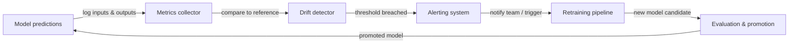

# Surveillance ML

## Définition

La surveillance ML est la pratique d'observation continue des modèles de machine learning et des données sur lesquelles ils opèrent après le déploiement. Contrairement aux logiciels traditionnels, qui fonctionnent soit correctement, soit génèrent une erreur, un modèle peut se dégrader silencieusement : il continue à produire des résultats, mais ceux-ci deviennent de plus en plus incorrects à mesure que le monde change. La surveillance ML fournit les systèmes d'alerte précoce qui détectent cette dégradation avant qu'elle ne cause des préjudices commerciaux.

Trois phénomènes sont à l'origine de la plupart des dégradations de modèles en production. La **dérive conceptuelle** survient lorsque la relation statistique entre les features d'entrée et la variable cible change — par exemple, un modèle de détection de fraude entraîné avant l'apparition d'un nouveau vecteur d'attaque manquera systématiquement le nouveau schéma. La **dérive des données** (également appelée glissement de covariables) survient lorsque la distribution des features d'entrée change sans changement correspondant dans la relation cible — les schémas saisonniers, les changements démographiques et les modifications des pipelines de données en amont causent tous une dérive des données. La **dégradation du modèle** est la perte de performance cumulative résultant d'une ou des deux dérives ; si elle n'est pas contrôlée, elle se manifeste par des taux d'erreur croissants, une baisse des revenus et une dégradation de l'expérience utilisateur.

Une surveillance ML efficace couvre trois couches : la **surveillance de la qualité des données** (schéma, taux de valeurs nulles, plages de valeurs), la **surveillance des distributions** (tests statistiques pour la dérive des features et des prédictions) et la **surveillance des performances des modèles** (métriques métier et ML calculées par rapport aux vérités terrain lorsque les labels sont disponibles). La combinaison des trois couches offre une défense en profondeur — détectant les problèmes tôt, à leur source et dans leurs effets en aval.

## Fonctionnement

### Collecte des données et des prédictions

Chaque requête de prédiction passe par une couche de service instrumentée qui enregistre les entrées, les sorties, les horodatages et les métadonnées dans un store centralisé (stockage objet, entrepôt de données ou plateforme de streaming comme Kafka). Les jeux de données de référence — généralement le jeu de données d'entraînement ou de validation — sont stockés aux côtés des logs de production pour servir de référence statistique de base pour les calculs de dérive. Les pipelines de labels ingèrent les vérités terrain retardées (les labels arrivent souvent des heures ou des semaines après la prédiction) et les joignent aux prédictions enregistrées.

### Détection de dérive

Les détecteurs de dérive comparent la distribution actuelle en production à la référence de base en utilisant des tests statistiques. Pour les features continues, l'Indice de Stabilité de Population (PSI), le test de Kolmogorov-Smirnov ou la distance de Wasserstein mesurent le changement distributional. Pour les features catégorielles, les tests du chi carré ou la divergence de Jensen-Shannon sont courants. Les prédictions elles-mêmes sont traitées comme une feature : un glissement dans la distribution des prédictions (par exemple, un classifieur qui soudainement produit « positif » 80% du temps alors que la référence était 30%) est un signal précoce puissant avant l'arrivée des labels de vérité terrain.

### Calcul des métriques de performance

Lorsque les labels de vérité terrain sont disponibles, les métriques de performance sont calculées sur des fenêtres glissantes ou des cohortes temporelles. La précision, la précision de classe positive, le rappel, le F1, le RMSE et l'AUC-ROC sont des métriques ML courantes. Les métriques métier — revenus attribués aux décisions pilotées par le modèle, taux de déviation des appels, taux de clics sur les recommandations — sont souvent plus actionnables. La latence, le débit et les taux d'erreur sont des métriques d'infrastructure qui indiquent la santé du service et doivent être surveillées conjointement avec la qualité du modèle.

### Alertes et escalade

Les seuils et les règles de détection d'anomalies déclenchent des alertes lorsqu'une métrique dépasse une limite. Les seuils statiques sont simples mais fragiles ; le contrôle statistique des processus (par exemple, les graphiques de contrôle) et la détection d'anomalies basée sur le ML s'adaptent à la saisonnalité. Les alertes sont acheminées vers PagerDuty, Slack ou email selon la gravité. Les hiérarchies d'alertes bien conçues distinguent entre les événements informatifs (log uniquement), les avertissements (notifier l'équipe ML) et les événements critiques (page de garde, déclencher un rollback automatique ou un réentraînement).

### Boucle de rétroaction du réentraînement

La surveillance est l'entrée de la boucle de réentraînement. Lorsqu'une dérive est détectée ou que les performances se dégradent au-delà d'un seuil, un pipeline automatisé (ou une décision humaine) déclenche un travail de réentraînement sur des données fraîches. Après le réentraînement, le nouveau candidat de modèle passe des portes d'évaluation avant la promotion, fermant ainsi la boucle.



## Quand utiliser / Quand NE PAS utiliser

| Utiliser quand | Éviter quand |
|----------|------------|
| Un modèle est déployé en production et sert de vrais utilisateurs | Le modèle est une analyse ponctuelle qui ne sera jamais réutilisée |
| Les décisions du modèle ont un impact commercial mesurable | Le volume de prédictions est si faible que les tests statistiques manquent de puissance |
| Les labels de vérité terrain sont finalement disponibles | Il n'y a aucun mécanisme de rétroaction pour collecter les labels ou les résultats métier |
| Les exigences réglementaires imposent une performance de modèle auditable | Le coût des outils de surveillance dépasse la valeur attendue du modèle déployé |
| Le processus de génération des données est connu pour changer au fil du temps | Le modèle est réentraîné en continu de toute façon et la dérive est implicitement gérée |
| Plusieurs modèles sont en production simultanément | Un humain examine chaque prédiction individuellement, rendant la surveillance automatisée redondante |

## Comparaisons

| Outil | Focus principal | Détection de dérive | Suivi des performances | Hébergement |
|-------|----------------|---------------------|----------------------|-------------|
| Evidently AI | Rapports de qualité des données et des modèles | Oui (30+ tests) | Oui | Auto-hébergé / Cloud |
| WhyLabs | Observabilité LLM et ML | Oui (statistique) | Oui | SaaS |
| Arize AI | Plateforme d'observabilité ML | Oui | Oui | SaaS |
| Tableaux de bord personnalisés | Entièrement sur mesure | Implémentation manuelle | Implémentation manuelle | Auto-hébergé |
| MLflow | Suivi d'expériences + surveillance basique | Limité | Oui (hors ligne) | Auto-hébergé / Cloud |

## Avantages et inconvénients

| Aspect | Avantages | Inconvénients |
|--------|-----------|---------------|
| Détection de dérive conceptuelle | Détecte la dégradation du modèle avant l'impact commercial | Nécessite des labels de vérité terrain, qui arrivent avec retard |
| Détection de dérive des données | Fonctionne sans labels — détecte les problèmes tôt | Peut produire des faux positifs sur des glissements distributionnels bénins |
| Alertes automatisées | Réduit le temps de détection de semaines à minutes | Des seuils mal réglés causent de la fatigue aux alertes |
| Écosystème d'outils | Nombreuses options open source et SaaS | Ajoute de la complexité d'infrastructure et une charge de maintenance |
| Déclencheurs de réentraînement | Ferme la boucle automatiquement | Risque d'instabilité d'entraînement si le réentraînement se déclenche trop fréquemment |

## Exemples de code

```python
# drift_detection.py
# Demonstrates concept and data drift detection using Evidently AI.
# Run: pip install evidently scikit-learn pandas numpy

import numpy as np
import pandas as pd
from sklearn.datasets import make_classification
from sklearn.ensemble import RandomForestClassifier
from sklearn.model_selection import train_test_split

from evidently.report import Report
from evidently.metric_preset import DataDriftPreset, ClassificationPreset
from evidently import ColumnMapping

# --- 1. Simulate reference (training) data ---
X, y = make_classification(
    n_samples=1000,
    n_features=10,
    n_informative=5,
    random_state=42,
)
feature_names = [f"feature_{i}" for i in range(10)]
df = pd.DataFrame(X, columns=feature_names)
df["target"] = y

X_train, X_test, y_train, y_test = train_test_split(
    df[feature_names], df["target"], test_size=0.2, random_state=42
)

# --- 2. Train a simple classifier ---
clf = RandomForestClassifier(n_estimators=100, random_state=42)
clf.fit(X_train, y_train)

# Build reference DataFrame with predictions
reference = X_test.copy()
reference["target"] = y_test.values
reference["prediction"] = clf.predict(X_test)

# --- 3. Simulate production data with drift ---
# Introduce feature shift: scale feature_0 to simulate distribution change
X_prod, y_prod = make_classification(
    n_samples=500,
    n_features=10,
    n_informative=5,
    random_state=99,  # Different seed = different distribution
)
df_prod = pd.DataFrame(X_prod, columns=feature_names)
df_prod["feature_0"] = df_prod["feature_0"] * 3.0  # Artificial drift on feature_0
df_prod["target"] = y_prod

production = df_prod[feature_names].copy()
production["target"] = df_prod["target"].values
production["prediction"] = clf.predict(df_prod[feature_names])

# --- 4. Run Evidently drift + performance report ---
column_mapping = ColumnMapping(
    target="target",
    prediction="prediction",
    numerical_features=feature_names,
)

report = Report(metrics=[DataDriftPreset(), ClassificationPreset()])
report.run(
    reference_data=reference,
    current_data=production,
    column_mapping=column_mapping,
)

# Save HTML report for inspection
report.save_html("drift_report.html")
print("Drift report saved to drift_report.html")

# --- 5. Extract drift results programmatically ---
result = report.as_dict()
drift_summary = result["metrics"][0]["result"]
n_drifted = drift_summary.get("number_of_drifted_columns", 0)
total = drift_summary.get("number_of_columns", 0)
share = drift_summary.get("share_of_drifted_columns", 0)

print(f"Drifted columns: {n_drifted}/{total} ({share:.1%})")
if share > 0.3:
    print("WARNING: Significant drift detected — consider retraining.")
else:
    print("Drift within acceptable bounds.")
```

## Ressources pratiques

- [Documentation Evidently AI](https://docs.evidentlyai.com/) — Documentation officielle pour la principale bibliothèque de surveillance ML open source, couvrant les tests de dérive, les rapports et la surveillance en temps réel.
- [Plateforme d'observabilité ML WhyLabs](https://whylabs.ai/docs) — Documentation de la plateforme SaaS pour la surveillance des modèles LLM et ML avec profilage statistique et alertes.
- [Chip Huyen — Surveillance des modèles ML en production](https://huyenchip.com/2022/02/07/data-distribution-shifts-and-monitoring.html) — Article de blog approfondi couvrant les glissements de distribution des données, les stratégies de surveillance et les compromis pratiques.
- [Google — Règles du machine learning : section surveillance](https://developers.google.com/machine-learning/guides/rules-of-ml#monitoring) — Conseils d'ingénierie de Google sur ce qu'il faut surveiller et comment configurer des alertes pour le ML en production.
- [Arize AI — Guide d'observabilité ML](https://arize.com/ml-observability/) — Guide du praticien couvrant la dérive, la surveillance des embeddings et la stack d'observabilité pour le ML.

## Voir aussi

- [Prometheus](/docs/mlops/monitoring/prometheus)
- [Grafana](/docs/mlops/monitoring/grafana)
- [Service de modèles](/docs/mlops/deployment/model-serving)
