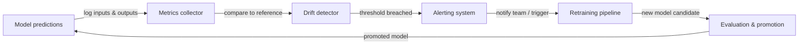

# Surveillance ML

## Définition

La surveillance ML est la pratique d'observer en continu les modèles d'apprentissage automatique et les données sur lesquelles ils opèrent après le déploiement. Contrairement aux logiciels traditionnels, qui soit fonctionnent soit génèrent une erreur, un modèle peut se dégrader silencieusement : il produit toujours des sorties, mais ces sorties deviennent de plus en plus incorrectes à mesure que le monde change. La surveillance ML fournit les systèmes d'alerte précoce qui détectent cette dégradation avant qu'elle ne cause des préjudices aux activités.

Trois phénomènes sont à l'origine de la plupart des dégradations de modèles en production. La **dérive de concept** se produit lorsque la relation statistique entre les features d'entrée et la variable cible change — par exemple, un modèle de détection de fraude entraîné avant l'apparition d'un nouveau vecteur d'attaque manquera systématiquement le nouveau modèle. La **dérive des données** (également appelée dérive de covariate) se produit lorsque la distribution des features d'entrée change sans changement correspondant dans la relation cible — les modèles saisonniers, les évolutions démographiques et les changements de pipeline de données en amont provoquent tous une dérive des données. La **dégradation du modèle** est la perte de performance cumulative résultant de l'une ou l'autre de ces dérives ; laissée sans contrôle, elle se manifeste par des taux d'erreur croissants, des revenus en baisse et des expériences utilisateur dégradées.

Une surveillance ML efficace couvre trois couches : la **surveillance de la qualité des données** (schéma, taux de nulls, plages de valeurs), la **surveillance de la distribution** (tests statistiques pour la dérive dans les features et les prédictions) et la **surveillance des performances du modèle** (métriques métier et ML calculées par rapport à la vérité terrain lorsque les étiquettes sont disponibles). La combinaison des trois couches fournit une défense en profondeur — détectant les problèmes tôt, à leur source et dans leur effet en aval.

## Fonctionnement

### Collecte des données et des prédictions

Chaque requête de prédiction passe par une couche de service instrumentée qui enregistre les entrées, les sorties, les horodatages et les métadonnées dans un store centralisé (stockage objet, un entrepôt de données ou une plateforme de streaming comme Kafka). Les jeux de données de référence — typiquement le jeu de données d'entraînement ou de validation — sont stockés aux côtés des logs de production pour servir de baseline statistique pour les calculs de dérive. Les pipelines d'étiquettes ingèrent la vérité terrain différée (les étiquettes arrivent souvent des heures ou des semaines après la prédiction) et les rejoignent aux prédictions enregistrées.

### Détection de dérive

Les détecteurs de dérive comparent la distribution de production actuelle à la baseline de référence à l'aide de tests statistiques. Pour les features continues, l'Indice de Stabilité de Population (PSI), le test de Kolmogorov-Smirnov ou la distance de Wasserstein mesurent le changement distributionnel. Pour les features catégorielles, les tests du chi-carré ou la divergence de Jensen-Shannon sont courants. Les prédictions elles-mêmes sont traitées comme une feature : un changement dans la distribution des prédictions (par exemple, un classificateur qui produit soudainement "positif" 80% du temps alors que la baseline était de 30%) est un signal précoce puissant avant l'arrivée des étiquettes de vérité terrain.

### Calcul des métriques de performance

Lorsque les étiquettes de vérité terrain sont disponibles, les métriques de performance sont calculées sur des fenêtres glissantes ou des cohortes basées sur le temps. La précision, la précision de classe positive, le rappel, le F1, le RMSE et l'AUC-ROC sont des métriques ML courantes. Les métriques métier — revenus attribués aux décisions pilotées par les modèles, taux de déviation des appels, taux de clics sur les recommandations — sont souvent plus actionnables. La latence, le débit et les taux d'erreur sont des métriques d'infrastructure qui indiquent la santé du service et doivent être surveillées aux côtés de la qualité du modèle.

### Alertes et escalade

Des seuils et des règles de détection d'anomalies déclenchent des alertes lorsqu'une métrique franchit une limite. Les seuils statiques sont simples mais fragiles ; le contrôle statistique des processus (par exemple, les cartes de contrôle) et la détection d'anomalies basée sur le ML s'adaptent à la saisonnalité. Les alertes sont routées vers PagerDuty, Slack ou email selon la gravité. Des hiérarchies d'alertes bien conçues distinguent entre les événements informationnels (log uniquement), les avertissements (notifier l'équipe ML) et les événements critiques (page on-call, déclencher un rollback automatique ou un réentraînement).

### Boucle de feedback de réentraînement

La surveillance est l'entrée de la boucle de réentraînement. Lorsque la dérive est détectée ou que les performances se dégradent en dessous d'un seuil, un pipeline automatisé (ou une décision humaine) déclenche un job de réentraînement sur des données récentes. Après le réentraînement, le nouveau modèle candidat passe des portes d'évaluation avant la promotion, bouclant la boucle.



## Quand utiliser / Quand NE PAS utiliser

| Utiliser quand | Éviter quand |
|----------|------------|
| Un modèle est déployé en production et sert de vrais utilisateurs | Le modèle est une analyse ponctuelle qui ne sera plus jamais utilisée |
| Les décisions du modèle ont un impact métier mesurable | Le volume de prédictions est si faible que les tests statistiques manquent de puissance |
| Les étiquettes de vérité terrain sont éventuellement disponibles | Vous n'avez pas de mécanisme de feedback pour collecter les étiquettes ou les résultats métier |
| Les exigences réglementaires imposent des performances de modèle auditables | Le coût de l'outillage de surveillance dépasse la valeur attendue du modèle déployé |
| Le processus de génération de données est connu pour changer au fil du temps | Le modèle est de toute façon réentraîné en continu et la dérive est implicitement gérée |
| Plusieurs modèles sont en production simultanément | Un humain examine chaque prédiction individuellement, rendant la surveillance automatisée redondante |

## Comparaisons

| Outil | Focus principal | Détection de dérive | Suivi des performances | Hébergement |
|------|--------------|-----------------|---------------------|---------|
| Evidently AI | Qualité des données et des modèles | Oui (30+ tests) | Oui | Auto-hébergé / Cloud |
| WhyLabs | Observabilité LLM et ML | Oui (statistique) | Oui | SaaS |
| Arize AI | Plateforme d'observabilité ML | Oui | Oui | SaaS |
| Tableaux de bord personnalisés | Entièrement personnalisé | Implémentation manuelle | Implémentation manuelle | Auto-hébergé |
| MLflow | Suivi d'expériences + surveillance basique | Limité | Oui (hors ligne) | Auto-hébergé / Cloud |

## Avantages et inconvénients

| Aspect | Avantages | Inconvénients |
|--------|------|------|
| Détection de dérive de concept | Détecte la dégradation du modèle avant l'impact métier | Nécessite des étiquettes de vérité terrain, qui arrivent avec un délai |
| Détection de dérive des données | Fonctionne sans étiquettes — détecte les problèmes tôt | Peut produire des faux positifs sur des dérives distributionnelles bénignes |
| Alertes automatisées | Réduit le temps de détection de semaines à minutes | Des seuils mal réglés causent de la fatigue des alertes |
| Écosystème d'outillage | Options open source et SaaS riches | Ajoute une complexité d'infrastructure et une charge de maintenance |
| Déclencheurs de réentraînement | Boucle la boucle automatiquement | Risque d'instabilité d'entraînement si le réentraînement se déclenche trop fréquemment |

## Exemples de code

```python
# drift_detection.py
# Demonstrates concept and data drift detection using Evidently AI.
# Run: pip install evidently scikit-learn pandas numpy

import numpy as np
import pandas as pd
from sklearn.datasets import make_classification
from sklearn.ensemble import RandomForestClassifier
from sklearn.model_selection import train_test_split

from evidently.report import Report
from evidently.metric_preset import DataDriftPreset, ClassificationPreset
from evidently import ColumnMapping

# --- 1. Simulate reference (training) data ---
X, y = make_classification(
    n_samples=1000,
    n_features=10,
    n_informative=5,
    random_state=42,
)
feature_names = [f"feature_{i}" for i in range(10)]
df = pd.DataFrame(X, columns=feature_names)
df["target"] = y

X_train, X_test, y_train, y_test = train_test_split(
    df[feature_names], df["target"], test_size=0.2, random_state=42
)

# --- 2. Train a simple classifier ---
clf = RandomForestClassifier(n_estimators=100, random_state=42)
clf.fit(X_train, y_train)

# Build reference DataFrame with predictions
reference = X_test.copy()
reference["target"] = y_test.values
reference["prediction"] = clf.predict(X_test)

# --- 3. Simulate production data with drift ---
# Introduce feature shift: scale feature_0 to simulate distribution change
X_prod, y_prod = make_classification(
    n_samples=500,
    n_features=10,
    n_informative=5,
    random_state=99,  # Different seed = different distribution
)
df_prod = pd.DataFrame(X_prod, columns=feature_names)
df_prod["feature_0"] = df_prod["feature_0"] * 3.0  # Artificial drift on feature_0
df_prod["target"] = y_prod

production = df_prod[feature_names].copy()
production["target"] = df_prod["target"].values
production["prediction"] = clf.predict(df_prod[feature_names])

# --- 4. Run Evidently drift + performance report ---
column_mapping = ColumnMapping(
    target="target",
    prediction="prediction",
    numerical_features=feature_names,
)

report = Report(metrics=[DataDriftPreset(), ClassificationPreset()])
report.run(
    reference_data=reference,
    current_data=production,
    column_mapping=column_mapping,
)

# Save HTML report for inspection
report.save_html("drift_report.html")
print("Drift report saved to drift_report.html")

# --- 5. Extract drift results programmatically ---
result = report.as_dict()
drift_summary = result["metrics"][0]["result"]
n_drifted = drift_summary.get("number_of_drifted_columns", 0)
total = drift_summary.get("number_of_columns", 0)
share = drift_summary.get("share_of_drifted_columns", 0)

print(f"Drifted columns: {n_drifted}/{total} ({share:.1%})")
if share > 0.3:
    print("WARNING: Significant drift detected — consider retraining.")
else:
    print("Drift within acceptable bounds.")
```

## Ressources pratiques

- [Documentation Evidently AI](https://docs.evidentlyai.com/) — Documentation officielle de la principale bibliothèque de surveillance ML open source, couvrant les tests de dérive, les rapports et la surveillance en temps réel.
- [Plateforme d'observabilité ML WhyLabs](https://whylabs.ai/docs) — Documentation de la plateforme SaaS pour la surveillance des modèles LLM et ML avec profilage statistique et alertes.
- [Chip Huyen — Surveillance des modèles ML en production](https://huyenchip.com/2022/02/07/data-distribution-shifts-and-monitoring.html) — Article de blog approfondi couvrant les changements de distribution des données, les stratégies de surveillance et les compromis pratiques.
- [Google — Règles de l'apprentissage automatique : section surveillance](https://developers.google.com/machine-learning/guides/rules-of-ml#monitoring) — Conseils d'ingénierie de Google sur ce qu'il faut surveiller et comment configurer des alertes pour le ML en production.
- [Arize AI — Guide d'observabilité ML](https://arize.com/ml-observability/) — Guide de praticien couvrant la dérive, la surveillance des embeddings et la pile d'observabilité pour le ML.

## Voir aussi

- [Prometheus](/docs/mlops/monitoring/prometheus)
- [Grafana](/docs/mlops/monitoring/grafana)
- [Service de modèles](/docs/mlops/deployment/model-serving)
