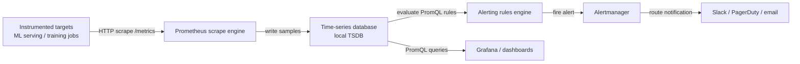

# Prometheus

## Définition

Prometheus est une boîte à outils de surveillance et d'alertes de systèmes open source, construite à l'origine chez SoundCloud et maintenant un projet diplômé de la CNCF. Elle stocke toutes les données sous forme de séries temporelles : des flux de valeurs flottantes horodatées identifiées par un nom de métrique et un ensemble de paires clé-valeur d'étiquettes. Ce modèle est naturellement adapté aux données opérationnelles — utilisation du CPU, comptages de requêtes, taux d'erreur — et aux signaux spécifiques au ML comme la latence de prédiction, le débit et les distributions de valeurs de features au fil du temps.

Le choix architectural déterminant de Prometheus est son **modèle de scraping pull-based**. Plutôt que d'exiger que les applications instrumentées poussent des métriques vers un collecteur central, Prometheus scrape périodiquement des endpoints HTTP (par défaut `/metrics`) exposés par les cibles. Cette inversion du contrôle rend la découverte de services, le contrôle d'accès et le débogage considérablement plus simples : vous pouvez curl l'endpoint de métriques de n'importe quelle cible directement pour voir ce que Prometheus collectera. Les cibles sont découvertes via une configuration statique ou une découverte de services dynamique (Kubernetes, Consul, EC2, etc.).

Prometheus n'est pas une solution de stockage à long terme par conception. Sa base de données de séries temporelles locale (TSDB) est optimisée pour l'ingestion et les requêtes rapides des données récentes, conservant typiquement 15 jours. Pour le stockage à long terme, Prometheus peut écrire à distance vers des systèmes comme Thanos, Cortex ou VictoriaMetrics. Dans les contextes ML, Prometheus est la couche de collecte et d'alertes ; [Grafana](/docs/mlops/monitoring/grafana) fournit la couche de visualisation et de création de tableaux de bord au-dessus.

## Fonctionnement

### Instrumentation des cibles

Les applications exposent des métriques via un endpoint HTTP `/metrics` au format d'exposition Prometheus — un format en texte brut de lignes `metric_name{label="value"} numeric_value timestamp`. En Python, la bibliothèque `prometheus_client` fournit des types Counter, Gauge, Histogram et Summary qui gèrent automatiquement le format d'exposition. Un processus de service ML expose typiquement des compteurs pour les requêtes de prédiction totales, des histogrammes pour la latence des requêtes et des jauges pour les versions de modèles actuellement chargées et l'utilisation des ressources.

### Scraping et stockage

Prometheus évalue son fichier de configuration pour déterminer quelles cibles scraper et à quel intervalle (par défaut : 15 secondes). À chaque scrape, il récupère l'endpoint `/metrics`, analyse le format d'exposition et écrit les échantillons dans sa TSDB locale en blocs compressés. La TSDB utilise un journal d'écriture anticipée (WAL) pour la durabilité et compacte les données en blocs au fil du temps. La cardinalité des étiquettes est le principal levier de performance : chaque combinaison unique de valeurs d'étiquettes crée une série temporelle séparée, donc les étiquettes non bornées (par exemple, les IDs d'utilisateurs) doivent être évitées.

### Requêtes PromQL et alertes

PromQL (Prometheus Query Language) est un langage de requête fonctionnel pour sélectionner et agréger des données de séries temporelles. Les vecteurs instantanés sélectionnent la valeur actuelle d'un ensemble de séries ; les vecteurs de plage sélectionnent une fenêtre d'échantillons ; les fonctions calculent des taux, moyennes, quantiles et prédictions sur ces vecteurs. Les règles d'alerte sont des expressions PromQL évaluées à un intervalle configurable ; lorsqu'une expression retourne un résultat non vide, l'alerte se déclenche et est envoyée à Alertmanager.

### Alertmanager

Alertmanager reçoit des alertes de Prometheus (et d'autres sources), les déduplique, applique des règles de regroupement et de routage, et expédie des notifications aux récepteurs (PagerDuty, Slack, email, webhooks). Les silences et les règles d'inhibition préviennent les tempêtes d'alertes pendant les fenêtres de maintenance connues ou les défaillances en cascade. Dans les systèmes ML, Alertmanager route les alertes de dégradation de modèles vers le canal Slack de l'équipe ML tandis que les alertes d'infrastructure (CPU élevé, OOM kills) vont à l'équipe de plateforme.

### Stockage distant et fédération

Pour les scénarios multi-cluster ou à long terme, Prometheus écrit à distance des échantillons vers un backend durable. La fédération permet à un Prometheus global de scraper des métriques agrégées depuis des instances Prometheus régionales. Ces deux modèles sont courants dans les grandes plateformes ML où les clusters d'entraînement et les clusters de service exécutent chacun leur propre Prometheus, et une instance centrale agrège les métriques de niveau service.



## Quand utiliser / Quand NE PAS utiliser

| Utiliser quand | Éviter quand |
|----------|------------|
| Vous avez besoin de métriques opérationnelles pour l'infrastructure de service ML (latence, débit, taux d'erreur) | Vous devez stocker des logs de prédictions bruts ou des données d'événements à haute cardinalité |
| Vous souhaitez une pile de surveillance pull-based et auto-hébergée sans verrouillage fournisseur | Votre équipe manque d'expérience infrastructure pour exploiter et régler une pile Prometheus |
| Vous exécutez sur Kubernetes et voulez une découverte de services native | Vous avez besoin d'une rétention à long terme (>15 jours) sans configuration supplémentaire de stockage distant |
| Vous avez besoin d'alertes puissantes avec déduplication et routage via Alertmanager | Vous avez besoin d'intervalles de scraping inférieurs à la seconde ; Prometheus est conçu pour des intervalles de 10 à 60 secondes |
| Vous souhaitez un backend standard pour les tableaux de bord Grafana | Votre application génère une cardinalité d'étiquettes non bornée, ce qui dégradera les performances de la TSDB |

## Comparaisons

Prometheus et Grafana sont complémentaires, pas concurrents. Le tableau ci-dessous décrit quand les utiliser ensemble ou alternatives.

| Critère | Prometheus | Grafana |
|-----------|-----------|---------|
| Rôle | Collecter, stocker et alerter sur les métriques | Visualiser et explorer les métriques depuis n'importe quelle source de données |
| Langage de requête | PromQL (langage fonctionnel optimisé pour les métriques) | Par source de données (PromQL pour Prometheus, SQL pour les autres) |
| Alertes | Règles d'alerte intégrées + Alertmanager | Alertes Grafana (unifiées, multi-sources de données) |
| Sources de données | Soi-même (TSDB) | Prometheus, InfluxDB, Loki, Elasticsearch, bases de données, etc. |
| Stockage | TSDB locale, remote-write pour le long terme | Pas de stockage — purement une couche de requête et de visualisation |
| Quand utiliser ensemble | Toujours — Prometheus collecte, Grafana montre | Toujours — utilisez Grafana comme interface pour les données Prometheus |

## Avantages et inconvénients

| Aspect | Avantages | Inconvénients |
|--------|------|------|
| Architecture pull-based | Débogage simple, contrôle d'accès au niveau de la cible | Nécessite que les cibles exposent des endpoints HTTP |
| PromQL | Expressif, composable, conçu pour les métriques | Courbe d'apprentissage abrupte comparée à SQL |
| TSDB locale | Ingestion et requête rapides pour les données récentes | Rétention limitée ; nécessite un stockage distant pour le long terme |
| Modèle d'étiquettes | Filtrage et agrégation multi-dimensionnels flexibles | Les étiquettes à haute cardinalité causent des problèmes de mémoire et de performances de requête |
| Alertmanager | Routage, regroupement et silence riches | Composant séparé à exploiter ; la configuration peut devenir complexe |
| Écosystème | Grande bibliothèque d'exporters et de bibliothèques clientes | Surcharge opérationnelle pour les déploiements auto-hébergés |

## Exemples de code

```python
# ml_metrics_server.py
# Exposes ML model metrics via prometheus_client for Prometheus scraping.
# Run: pip install prometheus_client flask scikit-learn numpy
# Then configure Prometheus to scrape localhost:8000

import time
import threading
import random
import numpy as np
from prometheus_client import (
    Counter,
    Histogram,
    Gauge,
    start_http_server,
    REGISTRY,
)
from sklearn.datasets import load_iris
from sklearn.ensemble import RandomForestClassifier

# --- Define metrics ---

PREDICTION_COUNTER = Counter(
    "ml_predictions_total",
    "Total number of prediction requests",
    ["model_name", "model_version", "status"],  # labels
)

PREDICTION_LATENCY = Histogram(
    "ml_prediction_latency_seconds",
    "Prediction request latency in seconds",
    ["model_name", "model_version"],
    buckets=[0.005, 0.01, 0.025, 0.05, 0.1, 0.25, 0.5, 1.0, 2.5],
)

MODEL_CONFIDENCE = Histogram(
    "ml_prediction_confidence",
    "Distribution of model prediction confidence scores",
    ["model_name", "model_version"],
    buckets=[0.1, 0.2, 0.3, 0.4, 0.5, 0.6, 0.7, 0.8, 0.9, 1.0],
)

ACTIVE_MODEL_VERSION = Gauge(
    "ml_active_model_version",
    "Currently active model version (encoded as numeric)",
    ["model_name"],
)

DATA_DRIFT_SCORE = Gauge(
    "ml_data_drift_score",
    "Current data drift score (PSI) for the primary feature set",
    ["model_name", "feature_set"],
)

# --- Load and train a simple model ---
X, y = load_iris(return_X_y=True)
clf = RandomForestClassifier(n_estimators=50, random_state=42)
clf.fit(X, y)

MODEL_NAME = "iris-classifier"
MODEL_VERSION = "1.0.0"
ACTIVE_MODEL_VERSION.labels(model_name=MODEL_NAME).set(1)


def simulate_prediction(features: np.ndarray) -> dict:
    """Run a prediction and record Prometheus metrics."""
    start = time.time()
    try:
        proba = clf.predict_proba(features.reshape(1, -1))[0]
        predicted_class = int(np.argmax(proba))
        confidence = float(np.max(proba))

        # Record latency and confidence
        duration = time.time() - start
        PREDICTION_LATENCY.labels(
            model_name=MODEL_NAME, model_version=MODEL_VERSION
        ).observe(duration)
        MODEL_CONFIDENCE.labels(
            model_name=MODEL_NAME, model_version=MODEL_VERSION
        ).observe(confidence)
        PREDICTION_COUNTER.labels(
            model_name=MODEL_NAME,
            model_version=MODEL_VERSION,
            status="success",
        ).inc()

        return {"class": predicted_class, "confidence": confidence}
    except Exception as exc:
        PREDICTION_COUNTER.labels(
            model_name=MODEL_NAME,
            model_version=MODEL_VERSION,
            status="error",
        ).inc()
        raise exc


def simulate_drift_monitoring():
    """Periodically update a synthetic drift score gauge."""
    while True:
        # In production this would run a real PSI/KS test
        drift_score = random.uniform(0.01, 0.35)
        DATA_DRIFT_SCORE.labels(
            model_name=MODEL_NAME, feature_set="sepal"
        ).set(drift_score)
        time.sleep(30)


def simulate_traffic():
    """Generate synthetic prediction traffic for demonstration."""
    samples = X[np.random.choice(len(X), size=10)]
    for sample in samples:
        simulate_prediction(sample)
        time.sleep(random.uniform(0.05, 0.3))


if __name__ == "__main__":
    # Start Prometheus metrics HTTP server on port 8000
    start_http_server(8000)
    print("Prometheus metrics server running on http://localhost:8000/metrics")
    print("Configure Prometheus to scrape this endpoint.")

    # Start background drift monitor
    drift_thread = threading.Thread(target=simulate_drift_monitoring, daemon=True)
    drift_thread.start()

    # Simulate continuous prediction traffic
    print("Simulating prediction traffic...")
    while True:
        simulate_traffic()
        time.sleep(1)
```

## Ressources pratiques

- [Documentation Prometheus](https://prometheus.io/docs/introduction/overview/) — Documentation officielle couvrant l'architecture, la configuration, PromQL, les alertes et les bonnes pratiques.
- [Bibliothèque Python prometheus_client](https://github.com/prometheus/client_python) — Client Python officiel pour instrumenter les applications ; couvre tous les types de métriques et le format d'exposition.
- [Aide-mémoire PromQL](https://promlabs.com/promql-cheat-sheet/) — Référence concise pour les opérateurs, fonctions et modèles courants PromQL.
- [Robust Perception — Surveillance avec Prometheus](https://www.robustperception.io/blog/) — Blog approfondi de Brian Brazil couvrant les mécanismes internes de Prometheus, les modèles PromQL et les conseils opérationnels.
- [Awesome Prometheus](https://github.com/roaldnefs/awesome-prometheus) — Liste curatée d'exporters Prometheus, de tableaux de bord et de ressources communautaires.

## Voir aussi

- [Grafana](/docs/mlops/monitoring/grafana)
- [Surveillance ML](/docs/mlops/monitoring)
- [Service de modèles](/docs/mlops/deployment/model-serving)
