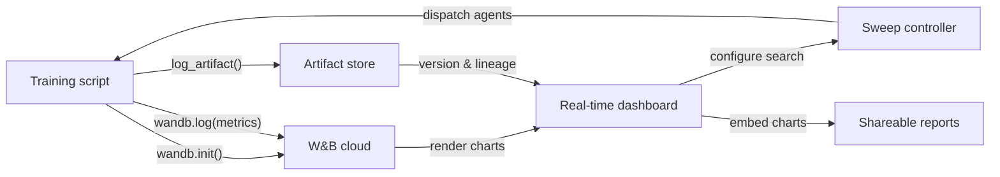

# Weights & Biases (W&B)

## Définition

Weights & Biases (communément abrégé W&B ou wandb) est une plateforme MLOps cloud-native qui fournit le suivi d'expériences, le versionnage de jeux de données et de modèles, l'optimisation d'hyperparamètres et des rapports interactifs dans un seul produit intégré. Fondée en 2017 et largement adoptée tant dans la recherche académique que dans l'industrie, W&B est particulièrement populaire parmi les équipes qui entraînent des modèles de deep learning produisant des sorties médias riches — images, audio, vidéo, nuages de points — qui bénéficient d'une inspection visuelle pendant l'entraînement.

La proposition de valeur principale de W&B est qu'elle nécessite presque aucune infrastructure pour commencer : vous créez un compte gratuit, installez le package Python `wandb`, ajoutez `wandb.init()` à votre script, et tout est automatiquement enregistré dans le cloud de W&B. La plateforme est organisée en **projets** (collections d'exécutions liées), **exécutions** (exécutions d'entraînement individuelles), **artefacts** (jeux de données et fichiers de modèles versionnés), **sweeps** (recherche automatisée d'hyperparamètres) et **rapports** (documents narratifs partageables intégrant des graphiques en direct).

Contrairement aux solutions auto-hébergées comme MLflow, W&B gère toute l'infrastructure backend. Cela élimine la charge opérationnelle mais signifie que les données quittent vos locaux — une considération pertinente pour les industries réglementées. W&B propose des options de déploiement en cloud privé et sur site pour les clients entreprise qui ont besoin de garanties de résidence des données, bien que celles-ci nécessitent un plan payant.

## Fonctionnement

### Initialisation et auto-logging

L'appel de `wandb.init(project="...", config={...})` démarre une exécution, envoie la configuration à W&B et retourne un objet d'exécution. De nombreux frameworks populaires (PyTorch Lightning, Hugging Face Trainer, Keras, XGBoost, scikit-learn) proposent des callbacks ou des intégrations W&B qui enregistrent automatiquement les gradients, les plannings de taux d'apprentissage et les métriques d'évaluation sans code supplémentaire. En coulisses, un thread de fond regroupe et compresse les données de log avant de les envoyer via HTTPS, minimisant la surcharge d'entraînement.

### Tableaux de bord en temps réel

L'interface W&B rend les courbes de métriques, l'utilisation système (GPU/CPU/mémoire) et les médias au fur et à mesure de la progression de l'exécution. Plusieurs exécutions peuvent être superposées sur le même graphique avec un codage couleur automatique. Les exécutions peuvent être filtrées et regroupées par n'importe quelle dimension de configuration (par exemple, regrouper par taux d'apprentissage pour voir son effet sur toutes les expériences à la fois), permettant un diagnostic visuel rapide.

### Sweeps

Un sweep est défini par un YAML ou un dictionnaire Python spécifiant l'espace de recherche, la stratégie de recherche (grille, aléatoire ou bayésienne) et les critères d'arrêt (par exemple, arrêt anticipé des exécutions sous-performantes). Le contrôleur de sweep W&B coordonne plusieurs agents fonctionnant en parallèle, chacun sélectionnant des combinaisons d'hyperparamètres du contrôleur et enregistrant les résultats en retour. La recherche bayésienne s'adapte en fonction des résultats observés, convergeant plus rapidement que la recherche sur grille.

### Artefacts

Les artefacts W&B versionnent les jeux de données, les points de contrôle de modèles et les sorties d'évaluation en tant qu'objets adressés par contenu. Un artefact est lié à l'exécution qui l'a produit et aux exécutions qui l'ont consommé, créant un graphe de lignage des données. Vous pouvez télécharger une version spécifique d'artefact en deux lignes de Python, rendant la reproductibilité des jeux de données et des modèles aussi simple que la spécification d'une chaîne de version.

### Rapports

Les rapports sont des documents interactifs qui intègrent des graphiques W&B en direct, des comparaisons d'exécutions et une narration en markdown. Ils constituent la principale surface de collaboration : un chercheur peut partager un rapport dans un message Slack ou une PR GitHub pour partager des preuves expérimentales reproductibles sans exporter des images statiques.



## Quand utiliser / Quand NE PAS utiliser

| Utiliser quand | Éviter quand |
|----------|------------|
| Vous entraînez des modèles de deep learning et avez besoin d'un logging de médias riches (images, audio, embeddings) | Les données ne peuvent pas quitter vos locaux et vous ne pouvez pas vous permettre le plan entreprise sur site |
| La collaboration en équipe, le partage des résultats et les rapports narratifs sont importants | Vous avez besoin d'une solution entièrement open source et auto-hébergée sans dépendance SaaS |
| Vous souhaitez une optimisation d'hyperparamètres intégrée sans outillage supplémentaire | Vos expériences sont simples et la surcharge d'un compte SaaS n'est pas justifiée |
| Votre équipe travaille en recherche ou académie et bénéficie de l'accès au niveau gratuit | Vous avez un budget serré et les fonctionnalités du niveau payant sont nécessaires pour la taille de votre équipe |

## Comparaisons

| Critère | W&B | MLflow |
|-----------|-----|--------|
| Facilité de configuration | Compte SaaS gratuit ; pas d'infra ; `wandb login` + deux lignes de code | Auto-hébergeable localement ; pas de compte nécessaire ; `mlflow ui` pour démarrer |
| Qualité de l'interface | Soignée, interactive ; conçue pour les charges de travail visuelles et lourdes en médias | Propre et fonctionnelle ; meilleure pour la comparaison de métriques tabulaires |
| Collaboration | Espaces de travail d'équipe natifs, rapports, liens de partage, intégration Slack | Serveur partagé requis ; pas de fonctionnalités de collaboration intégrées en OSS |
| Tarification | Gratuit pour les particuliers ; payant pour les grandes équipes ; entreprise pour sur site | Gratuit et open source ; Databricks Managed MLflow coûte plus cher |
| Optimisation des hyperparamètres | Sweeps intégrés avec bayésienne/grille/aléatoire + arrêt anticipé | Nécessite des outils externes (Optuna, Ray Tune) |

## Exemples de code

```python
# wandb_tracking_example.py
# W&B experiment tracking: logs config, metrics, images, and registers a model artifact.
# pip install wandb scikit-learn matplotlib Pillow

import wandb
import numpy as np
import matplotlib.pyplot as plt
from sklearn.ensemble import RandomForestClassifier
from sklearn.datasets import load_digits
from sklearn.model_selection import train_test_split
from sklearn.metrics import (
    accuracy_score, f1_score, confusion_matrix, ConfusionMatrixDisplay
)
import os, tempfile

# ── 1. Initialize the W&B run ─────────────────────────────────────────────────
run = wandb.init(
    project="digits-classification",
    name="random-forest-v1",
    config={                         # All hyperparameters go here
        "n_estimators": 150,
        "max_depth": 12,
        "min_samples_split": 4,
        "random_state": 7,
        "dataset": "sklearn-digits",
    },
)
cfg = wandb.config  # Access config values through this proxy

# ── 2. Data ───────────────────────────────────────────────────────────────────
X, y = load_digits(return_X_y=True)
X_train, X_test, y_train, y_test = train_test_split(
    X, y, test_size=0.2, stratify=y, random_state=cfg.random_state
)

# ── 3. Train ──────────────────────────────────────────────────────────────────
clf = RandomForestClassifier(
    n_estimators=cfg.n_estimators,
    max_depth=cfg.max_depth,
    min_samples_split=cfg.min_samples_split,
    random_state=cfg.random_state,
)
clf.fit(X_train, y_train)

# ── 4. Evaluate and log metrics ───────────────────────────────────────────────
y_pred = clf.predict(X_test)
metrics = {
    "accuracy": accuracy_score(y_test, y_pred),
    "f1_macro": f1_score(y_test, y_pred, average="macro"),
    "n_train": len(X_train),
    "n_test": len(X_test),
}
wandb.log(metrics)

# ── 5. Log a confusion matrix image ──────────────────────────────────────────
cm = confusion_matrix(y_test, y_pred)
fig, ax = plt.subplots(figsize=(8, 8))
ConfusionMatrixDisplay(cm).plot(ax=ax)
ax.set_title("Confusion Matrix – digits RF")
wandb.log({"confusion_matrix": wandb.Image(fig)})
plt.close(fig)

# ── 6. Save model as a versioned W&B Artifact ─────────────────────────────────
import joblib

with tempfile.TemporaryDirectory() as tmp:
    model_path = os.path.join(tmp, "model.joblib")
    joblib.dump(clf, model_path)

    artifact = wandb.Artifact(
        name="digits-rf-model",
        type="model",
        description="Random Forest trained on sklearn digits dataset",
        metadata=dict(metrics),
    )
    artifact.add_file(model_path)
    run.log_artifact(artifact)

# ── 7. Finish the run ─────────────────────────────────────────────────────────
run.finish()
print(f"Accuracy: {metrics['accuracy']:.4f} | F1 macro: {metrics['f1_macro']:.4f}")
print(f"View run at: {run.url}")
```

## Ressources pratiques

- [Documentation officielle W&B](https://docs.wandb.ai/) — Référence complète couvrant le SDK Python, les intégrations, les sweeps, les artefacts et les rapports.
- [Démarrage rapide W&B](https://docs.wandb.ai/quickstart) — Enregistrez votre première exécution W&B en moins de cinq minutes avec un exemple minimal.
- [Documentation des sweeps W&B](https://docs.wandb.ai/guides/sweeps) — Guide complet pour configurer et exécuter des recherches d'hyperparamètres distribuées.
- [Blog W&B Fully Connected](https://wandb.ai/fully-connected) — Blog de praticiens avec des tutoriels approfondis, des rapports de benchmarks et des articles d'ingénierie ML.
- [Intégration Hugging Face + W&B](https://docs.wandb.ai/guides/integrations/huggingface) — Guide pour enregistrer automatiquement toutes les métriques du Hugging Face Trainer avec un seul argument `report_to="wandb"`.

## Voir aussi

- [Suivi d'expériences](/docs/mlops/experiment-tracking)
- [MLflow](/docs/mlops/mlflow)
- [MLOps](/docs/mlops)
