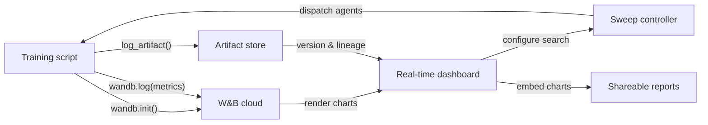

# Weights & Biases (W&B)

## Définition

Weights & Biases (communément abrégé W&B ou wandb) est une plateforme MLOps native cloud qui fournit le suivi d'expériences, le versionnage de datasets et de modèles, l'optimisation des hyperparamètres et des rapports interactifs dans un seul produit intégré. Fondée en 2017 et largement adoptée dans la recherche académique comme dans l'industrie, W&B est particulièrement populaire auprès des équipes qui entraînent des modèles de deep learning produisant des sorties médias riches — images, audio, vidéo, nuages de points — qui bénéficient d'une inspection visuelle pendant l'entraînement.

La proposition de valeur centrale de W&B est qu'elle nécessite presque aucune infrastructure pour démarrer : vous créez un compte gratuit, installez le package Python `wandb`, ajoutez `wandb.init()` à votre script, et tout est journalisé automatiquement dans le cloud de W&B. La plateforme est organisée en **projets** (collections d'exécutions liées), **runs** (exécutions d'entraînement individuelles), **artifacts** (datasets et fichiers de modèles versionnés), **sweeps** (recherche automatisée d'hyperparamètres) et **reports** (documents narratifs partageables intégrant des graphiques en direct).

Contrairement aux solutions auto-hébergées comme MLflow, W&B gère toute l'infrastructure backend. Cela élimine la charge opérationnelle mais signifie que les données quittent vos locaux — une considération pertinente pour les secteurs réglementés. W&B propose des options de déploiement en cloud privé et on-premise pour les clients entreprises ayant des exigences de résidence des données, bien que celles-ci nécessitent un plan payant.

## Fonctionnement

### Initialisation et auto-logging

L'appel de `wandb.init(project="...", config={...})` démarre une exécution, envoie la configuration à W&B et renvoie un objet d'exécution. De nombreux frameworks populaires (PyTorch Lightning, Hugging Face Trainer, Keras, XGBoost, scikit-learn) proposent des callbacks ou des intégrations W&B qui journalisent automatiquement les gradients, les plannings de taux d'apprentissage et les métriques d'évaluation sans code supplémentaire. En arrière-plan, un thread de fond regroupe et compresse les données de log avant de les envoyer via HTTPS, minimisant la surcharge d'entraînement.

### Tableaux de bord en temps réel

L'UI de W&B affiche les courbes de métriques, l'utilisation du système (GPU/CPU/mémoire) et les médias au fur et à mesure que l'exécution progresse. Plusieurs exécutions peuvent être superposées sur le même graphique avec un codage de couleurs automatique. Les exécutions peuvent être filtrées et regroupées par n'importe quelle dimension de configuration, permettant un diagnostic visuel rapide.

### Sweeps

Un sweep est défini par un YAML ou un dict Python spécifiant l'espace de recherche, la stratégie de recherche (grid, aléatoire ou bayésienne) et les critères d'arrêt. Le contrôleur de sweep de W&B coordonne plusieurs agents s'exécutant en parallèle, chacun sélectionnant des combinaisons d'hyperparamètres auprès du contrôleur et journalisant les résultats en retour. La recherche bayésienne s'adapte en fonction des résultats observés, convergeant plus rapidement que la recherche en grid.

### Artifacts

W&B Artifacts versionne les datasets, les checkpoints de modèles et les sorties d'évaluation comme des objets adressés par contenu. Un artifact est lié à l'exécution qui l'a produit et aux exécutions qui l'ont consommé, créant un graphe de lignage des données. Vous pouvez télécharger une version spécifique d'artifact avec deux lignes de Python, rendant la reproductibilité des datasets et des modèles aussi simple que la spécification d'une chaîne de version.

### Reports

Les reports sont des documents interactifs qui intègrent des graphiques W&B en direct, des comparaisons d'exécutions et un récit en markdown. Ils constituent la principale surface de collaboration : un chercheur peut partager le lien d'un report dans un message Slack ou une PR GitHub pour partager des preuves expérimentales reproductibles sans exporter d'images statiques.



## Quand utiliser / Quand NE PAS utiliser

| Utiliser quand | Éviter quand |
|----------|------------|
| Vous entraînez des modèles de deep learning et avez besoin d'une journalisation média riche | Les données ne peuvent pas quitter vos locaux et vous ne pouvez pas vous offrir le plan enterprise on-premise |
| La collaboration d'équipe, le partage des résultats et les rapports narratifs sont importants | Vous avez besoin d'une solution entièrement open source et auto-hébergée sans dépendance SaaS |
| Vous souhaitez une optimisation des hyperparamètres intégrée sans outillage supplémentaire | Vos expériences sont simples et la surcharge d'un compte SaaS n'est pas justifiée |
| Votre équipe travaille dans la recherche ou le monde académique et bénéficie d'un accès au niveau gratuit | Votre budget est serré et les fonctionnalités du niveau payant sont nécessaires pour la taille de votre équipe |

## Comparaisons

| Critère | W&B | MLflow |
|-----------|-----|--------|
| Facilité de configuration | Compte SaaS gratuit ; pas d'infra ; `wandb login` + deux lignes de code | Auto-hébergeable localement ; pas de compte ; `mlflow ui` pour démarrer |
| Qualité de l'UI | Soignée, interactive ; conçue pour les charges de travail visuelles et médias | Propre et fonctionnelle ; meilleure pour la comparaison de métriques tabulaires |
| Collaboration | Espaces de travail d'équipe natifs, rapports, liens de partage, intégration Slack | Nécessite un serveur partagé ; pas de fonctionnalités de collaboration intégrées dans l'OSS |
| Tarification | Gratuit pour les individus ; payant pour les équipes plus grandes ; enterprise pour on-prem | Gratuit et open source ; Databricks Managed MLflow coûte plus cher |
| Optimisation des hyperparamètres | Sweeps intégrés avec Bayesian/grid/aléatoire + arrêt précoce | Nécessite des outils externes (Optuna, Ray Tune) |

## Exemples de code

```python
# wandb_tracking_example.py
# W&B experiment tracking: logs config, metrics, images, and registers a model artifact.
# pip install wandb scikit-learn matplotlib Pillow

import wandb
import numpy as np
import matplotlib.pyplot as plt
from sklearn.ensemble import RandomForestClassifier
from sklearn.datasets import load_digits
from sklearn.model_selection import train_test_split
from sklearn.metrics import (
    accuracy_score, f1_score, confusion_matrix, ConfusionMatrixDisplay
)
import os, tempfile

run = wandb.init(
    project="digits-classification",
    name="random-forest-v1",
    config={
        "n_estimators": 150,
        "max_depth": 12,
        "min_samples_split": 4,
        "random_state": 7,
        "dataset": "sklearn-digits",
    },
)
cfg = wandb.config

X, y = load_digits(return_X_y=True)
X_train, X_test, y_train, y_test = train_test_split(
    X, y, test_size=0.2, stratify=y, random_state=cfg.random_state
)

clf = RandomForestClassifier(
    n_estimators=cfg.n_estimators,
    max_depth=cfg.max_depth,
    min_samples_split=cfg.min_samples_split,
    random_state=cfg.random_state,
)
clf.fit(X_train, y_train)

y_pred = clf.predict(X_test)
metrics = {
    "accuracy": accuracy_score(y_test, y_pred),
    "f1_macro": f1_score(y_test, y_pred, average="macro"),
    "n_train": len(X_train),
    "n_test": len(X_test),
}
wandb.log(metrics)
run.finish()
```

## Ressources pratiques

- [W&B Official Documentation](https://docs.wandb.ai/) — Référence complète couvrant le SDK Python, les intégrations, les sweeps, les artifacts et les rapports.
- [W&B Quickstart](https://docs.wandb.ai/quickstart) — Enregistrez votre première exécution W&B en moins de cinq minutes avec un exemple minimal.
- [W&B Sweeps Documentation](https://docs.wandb.ai/guides/sweeps) — Guide complet pour configurer et exécuter des recherches distribuées d'hyperparamètres.
- [W&B Fully Connected Blog](https://wandb.ai/fully-connected) — Blog de praticiens avec des tutoriels approfondis, des rapports de benchmark et des articles d'ingénierie ML.
- [Hugging Face + W&B Integration](https://docs.wandb.ai/guides/integrations/huggingface) — Guide pour journaliser automatiquement toutes les métriques du Hugging Face Trainer avec un seul argument `report_to="wandb"`.

## Voir aussi

- [Experiment tracking](/docs/mlops/experiment-tracking)
- [MLflow](/docs/mlops/mlflow)
- [MLOps](/docs/mlops)
