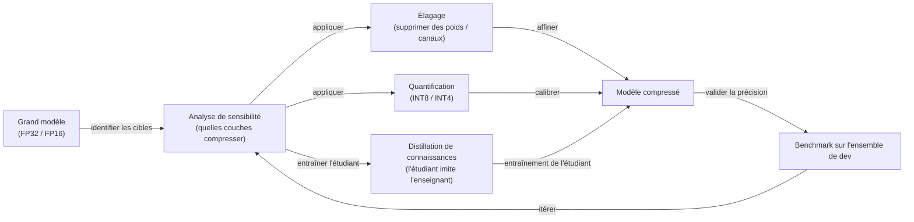

# Compression de modèle

## Définition

La compression de modèle est le terme collectif désignant une famille de techniques qui réduisent la taille, l'empreinte mémoire, la latence d'inférence ou la consommation d'énergie des réseaux de neurones entraînés sans dégrader substantiellement leur précision. Les méthodes principales sont l'[élagage](/docs/pruning) (suppression des paramètres redondants), la [quantification](/docs/quantization) (réduction de la précision numérique) et la [distillation de connaissances](/docs/knowledge-distillation) (entraîner un modèle plus petit à imiter un plus grand). Ces techniques sont souvent combinées — par exemple, un modèle distillé qui est ensuite quantifié et élagué atteint une taille significativement plus petite qu'avec une seule méthode.

La motivation pour la compression de modèle s'est intensifiée avec la croissance des [LLM](/docs/llms) : un modèle frontier en FP16 peut nécessiter 80–320 Go de mémoire GPU, rendant le déploiement sur autre chose qu'un serveur haut de gamme impraticable. La compression permet d'exprimer les mêmes connaissances ou similaires dans une forme qui tient dans un GPU grand public (16–48 Go), un appareil mobile (4–12 Go de RAM), voire un microcontrôleur (centaines de Ko). Le défi est de gérer le compromis précision-compression sur diverses tâches en aval.

La compression est appliquée à différentes étapes : **post-entraînement** (appliquée après la fin de l'entraînement, pas d'accès aux données d'entraînement requis), **consciente de l'entraînement** (simulation de la compression pendant l'entraînement pour que le modèle s'adapte) et **recherche structurée** (recherche d'architecture neuronale ou élagage itératif avec affinement). Le choix de la méthode dépend du matériel cible, du budget de précision acceptable et de la faisabilité du réentraînement.

## Comment ça fonctionne

### Pipeline de compression



### Comparaison des méthodes

| Méthode | Comment elle réduit la taille | Entraînement requis | Type d'accélération |
|--------|-------------------|-------------------|-------------|
| Élagage non structuré | Met à zéro les poids individuels | Affiner après | Mémoire (stockage sparse) |
| Élagage structuré | Supprime des canaux, têtes ou couches | Affiner après | Temps réel (opérations denses) |
| Quantification (PTQ) | Précision inférieure (INT8, INT4) | Non (calibration uniquement) | Mémoire + calcul |
| Quantification (QAT) | Précision inférieure avec adaptation d'entraînement | Oui | Mémoire + calcul |
| Distillation de connaissances | Entraîner un modèle plus petit de bout en bout | Oui (entraînement complet) | Toutes les dimensions |

## Quand utiliser / Quand NE PAS utiliser

| Scénario | Utiliser la compression de modèle | NE PAS utiliser la compression de modèle |
|----------|----------------------|------------------------------|
| Déployer des LLM sur des GPU grand public ou des appareils en périphérie | Oui — la quantification le rend faisable | |
| Réduire la latence d'inférence en production | Oui — INT8 ou l'élagage structuré réduisent la latence | |
| Partager un modèle distillé pour l'affinement en aval | Oui — la distillation transfère les connaissances efficacement | |
| La précision est la contrainte principale (pas de limite matérielle) | | Servir le modèle complet ; la compression introduit un risque de précision |
| Le modèle sera réentraîné fréquemment sur de nouvelles données | | Les frais généraux de réentraînement peuvent dépasser les gains de compression |
| Le matériel prend en charge FP16 efficacement en natif | | La quantification peut offrir un bénéfice minimal sur le matériel FP16 |

## Avantages et inconvénients

| Avantages | Inconvénients |
|------|------|
| Permet le déploiement sur du matériel contraint | Dégradation de la précision — en particulier à des ratios de compression agressifs |
| Réduit le coût d'inférence et la consommation d'énergie | La calibration et l'affinement nécessitent des efforts et de l'expertise |
| Plusieurs méthodes peuvent être combinées pour une compression maximale | L'élagage structuré nécessite souvent un réglage spécifique à l'architecture |
| PTQ ne nécessite pas de réentraînement (rapide à appliquer) | QAT et la distillation nécessitent l'accès aux données d'entraînement et au calcul |

## Exemples de code

```python
# Quantification post-entraînement avec PyTorch (INT8 dynamique)
import torch
import torch.quantization

# Charger un modèle entraîné
model = MyModel()
model.load_state_dict(torch.load("model.pt"))
model.eval()

# Appliquer la quantification dynamique aux couches Linear (pas de données de calibration nécessaires)
quantized_model = torch.quantization.quantize_dynamic(
    model,
    qconfig_spec={torch.nn.Linear},
    dtype=torch.qint8,
)

# Vérifier la réduction de taille
original_size = sum(p.numel() for p in model.parameters()) * 4  # octets FP32
quantized_size = sum(p.numel() for p in quantized_model.parameters()) * 1  # octets INT8
print(f"Réduction de taille : {original_size / quantized_size:.1f}x")

# Sauvegarder le modèle compressé
torch.save(quantized_model.state_dict(), "quantized_model.pt")
```

## Conseils pour une utilisation efficace

- Effectuez une analyse de sensibilité avant de compresser : toutes les couches ne tolèrent pas le même ratio de compression — les couches initiales et finales sont généralement plus sensibles.
- Combinez les méthodes en séquence : distillez d'abord (nouvelle architecture), puis élaquez (supprimez la structure redondante), puis quantifiez (réduisez la précision) pour une compression maximale.
- Validez toujours sur un ensemble de dev retenu après chaque étape de compression — la précision peut se dégrader de façon non monotone.
- Utilisez la quantification INT8 comme première étape par défaut ; elle est la plus facile à appliquer et récupère la plupart du bénéfice mémoire avec une perte de précision minimale.
- Pour les LLM, la quantification GPTQ ou AWQ INT4 offre souvent un meilleur ratio précision-compression que l'élagage par magnitude.

## Ressources pratiques

- [PyTorch — Quantification](https://pytorch.org/docs/stable/quantization.html) — PTQ, QAT et quantification dynamique
- [TensorFlow — Toolkit d'optimisation de modèle](https://www.tensorflow.org/model_optimization) — Élagage, quantification et clustering
- [HuggingFace — PEFT et GPTQ](https://huggingface.co/docs/peft) — Affinement efficace en paramètres avec des LLM quantifiés
- [Article llm.int8()](https://arxiv.org/abs/2208.07339) — Inférence en 8 bits pour les grands modèles de langage

## Voir aussi

- [Quantification](/docs/quantization)
- [Élagage](/docs/pruning)
- [Distillation de connaissances](/docs/knowledge-distillation)
- [Inférence locale](/docs/local-inference)
- [Raisonnement en périphérie](/docs/edge-reasoning)
- [Infrastructure](/docs/infrastructure)
