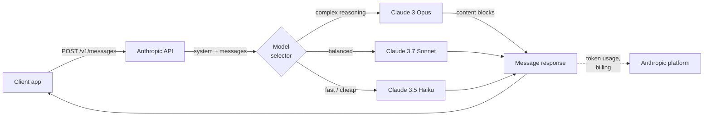
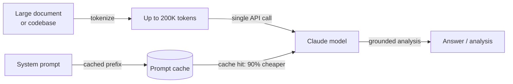

# Anthropic

## Définition

**Anthropic** est une entreprise de sécurité IA et fournisseur de modèles fondée en 2021 par d'anciens chercheurs d'OpenAI. Sa thèse fondamentale est que la construction de modèles d'IA capables et la résolution du problème d'alignement sont des objectifs inséparables — l'entreprise poursuit des capacités de pointe en parallèle avec la recherche en sécurité telle que Constitutional AI, l'interprétabilité et la compréhension mécaniste des internals des modèles. Le produit commercial de cette recherche est la famille de modèles **Claude**, disponible via l'API Anthropic et les produits entreprise.

La gamme de modèles Claude suit une convention de nomenclature à trois niveaux reflétant les compromis entre capacité et coût : **Opus** (qualité maximale, raisonnement complexe), **Sonnet** (qualité et vitesse équilibrées) et **Haiku** (le plus rapide et le plus rentable). En 2025, la génération actuelle est **Claude 3.7 Sonnet** — le modèle phare avec des capacités de réflexion étendue — ainsi que **Claude 3 Opus**, **Claude 3.5 Sonnet** et **Claude 3.5 Haiku**. Tous les modèles Claude 3+ prennent en charge l'entrée d'images, et toute la famille est conçue autour d'une fenêtre de contexte de 200K tokens pouvant traiter des livres, de grandes bases de code et de longs historiques de conversation sans troncature.

D'un point de vue plateforme, l'API d'Anthropic est centrée sur la **Messages API** — une interface propre et dédiée aux conversations multi-tours. La plateforme inclut l'utilisation d'outils (le terme d'Anthropic pour les appels de fonctions), la réflexion étendue (raisonnement en chaîne de pensée visible), la mise en cache des prompts (réduit les coûts et la latence pour les grands contextes répétés) et le traitement par lots. Le SDK Python (`anthropic`) et le SDK TypeScript sont les bibliothèques client principales. Les modèles Claude sont également disponibles via Amazon Bedrock, Google Cloud Vertex AI et des contrats entreprise avec des options de résidence des données.

## Fonctionnement

### Messages API

La Messages API (`POST /v1/messages`) est l'interface principale d'Anthropic. Contrairement à certaines API qui utilisent une chaîne `prompt` plate, la Messages API est orientée conversation : vous envoyez un tableau `messages` d'échanges alternant `user` et `assistant`, avec un paramètre `system` optionnel pour le contexte et la persona. Le modèle renvoie un objet `Message` contenant une liste `content` — des blocs de texte par défaut, des blocs d'utilisation d'outils quand le modèle décide d'appeler un outil. Le streaming est pris en charge et recommandé pour une utilisation interactive ; le SDK fournit à la fois des assistants de streaming et un accès SSE brut.



### Utilisation d'outils

L'utilisation d'outils permet à Claude d'appeler des fonctions externes en émettant des blocs de contenu `tool_use` structurés. Vous déclarez les outils comme des schémas JSON dans le paramètre `tools`. Quand Claude décide qu'un outil est nécessaire, la réponse contient un bloc `tool_use` avec le nom de l'outil et son entrée ; votre code exécute la fonction et retourne un `tool_result` dans le tour utilisateur suivant. Claude utilise ensuite le résultat pour compléter sa réponse. Ce modèle permet les agents, les environnements d'exécution de code, les requêtes de base de données et les intégrations d'API sans que le modèle ait besoin d'accès direct à un système.


### Réflexion étendue

La réflexion étendue est un mode disponible sur Claude 3.7 Sonnet qui permet au modèle de raisonner longuement avant de produire sa réponse finale. Lorsque vous définissez `thinking: {type: "enabled", budget_tokens: N}`, le modèle émet des blocs de contenu `thinking` contenant son bloc-notes interne — similaire à la chaîne de pensée mais natif et structuré. La réflexion étendue améliore significativement les performances sur les compétitions de mathématiques, le code complexe, le raisonnement en plusieurs étapes et les tâches nécessitant une analyse minutieuse étape par étape. Les tokens de réflexion comptent dans le budget de tokens mais sont visibles dans la réponse, vous donnant de la transparence sur la façon dont le modèle est parvenu à sa réponse.

### Mise en cache des prompts

La mise en cache des prompts réduit considérablement les coûts et la latence pour les charges de travail qui utilisent répétitivement de grands prompts système ou des contextes de documents. Vous marquez les sections de préfixe de votre requête avec `cache_control: {type: "ephemeral"}`. Lors du premier appel, Anthropic met en cache le préfixe du prompt sur son infrastructure ; les appels suivants qui correspondent au préfixe sont servis depuis le cache à 90% moins de coût de tokens d'entrée et un temps jusqu'au premier token significativement réduit. Cela est particulièrement utile pour les pipelines RAG (grand contexte transmis avec chaque requête), les boucles d'agents (grands prompts système répétés à chaque tour) et le traitement de documents par lots.

### Long contexte (200K tokens)

Tous les modèles Claude 3 et ultérieurs prennent en charge une fenêtre de contexte de 200K tokens — équivalent à environ 150 000 mots ou ~500 pages de texte. Le long contexte permet de traiter des bases de code entières, des documents juridiques, des articles de recherche ou des historiques de conversation complets en un seul appel sans fragmentation. La recherche d'Anthropic sur les performances en long contexte (évaluations "aiguille dans une botte de foin") montre que Claude maintient une précision de rappel élevée sur toute la plage de 200K, le rendant fiable pour les questions-réponses sur des documents, l'analyse de contrats et la révision de code sur de grands référentiels. C'est l'un des différenciateurs les plus clairs d'Anthropic par rapport à la fenêtre de 128K de GPT-4o.



## Quand utiliser / Quand NE PAS utiliser

| Utiliser Anthropic quand | Éviter ou envisager des alternatives quand |
|--------------------------|---------------------------------------------|
| Vous avez besoin d'une fenêtre de contexte de 200K pour traiter de longs documents, des bases de code ou des conversations étendues sans fragmentation | Votre charge de travail nécessite de la génération d'images, de la transcription audio ou de la synthèse vocale — Claude est texte/vision uniquement ; OpenAI couvre l'audio |
| Les contraintes de sécurité et le comportement de refus prévisible sont critiques (conformité, santé, finance) | Vous avez besoin de modèles à poids ouverts pour l'auto-hébergement, le fine-tuning ou la résidence des données — Anthropic n'offre pas d'option poids ouverts |
| Vous souhaitez une réflexion étendue pour des tâches de raisonnement profond (mathématiques, code complexe, analyse en plusieurs étapes) | Votre cas d'usage principal est la génération d'embeddings à haut volume — Anthropic ne propose pas d'API d'embeddings |
| La mise en cache des prompts réduira significativement les coûts (grands contextes répétés, prompts système d'agents) | Vous dépendez fortement des outils spécifiques à OpenAI (Assistants API, DALL-E, Whisper) qui n'ont pas d'équivalent Anthropic |
| Vous construisez des flux de travail d'utilisation d'outils ou d'utilisation d'ordinateur et souhaitez un modèle bien calibré pour les sorties structurées | Vous avez besoin du coût absolu le plus bas par token à grande échelle — Claude Haiku est compétitif sur le prix mais GPT-4o-mini et les modèles ouverts sont moins chers |

## Comparaisons

| Critère | Anthropic | OpenAI | Google Gemini |
|---------|-----------|--------|---------------|
| Modèle phare | Claude 3.7 Sonnet | GPT-4o | Gemini 2.5 Pro |
| Fenêtre de contexte | 200K (tous Claude 3+) | 128K (GPT-4o) | Jusqu'à 1M (Gemini 1.5 Pro) |
| Raisonnement / réflexion | Réflexion étendue (CoT natif) | Série o1, o3 | Réflexion Gemini 2.5 Pro |
| Entrée multimodale | Texte, image | Texte, image, audio, vidéo | Texte, image, audio, vidéo |
| Audio / parole | Non | Oui (Whisper, TTS) | Oui (Gemini) |
| Génération d'images | Non | Oui (DALL-E 3) | Oui (Imagen) |
| API d'embeddings | Non | Oui | Oui |
| Poids ouverts | Non | Non | Gemma (partiel) |
| Mise en cache des prompts | Oui (natif, 90% de réduction) | Mise en cache de contexte (limitée) | Oui (Gemini) |
| Utilisation d'outils / appel de fonctions | Mature, support computer use | Mature, largement adopté | Mature |
| Philosophie de sécurité | Constitutional AI, ajusté pour les refus | API de modération, politique d'utilisation | Directives d'IA responsable |
| Options de résidence des données | Contrat entreprise | Contrat entreprise | Régions Google Cloud |

## Avantages et inconvénients

| Avantages | Inconvénients |
|-----------|---------------|
| Fenêtre de contexte de 200K sur tous les modèles — meilleure de sa catégorie pour les longs documents | Pas d'API audio, vocale ou de génération d'images |
| La réflexion étendue offre une chaîne de pensée transparente pour les tâches de raisonnement difficiles | Pas d'API d'embeddings — vous avez besoin d'un second fournisseur pour RAG |
| La mise en cache des prompts réduit significativement les coûts pour les grands contextes répétés | Modèle fermé sans option poids ouverts |
| Conception axée sur la sécurité avec une calibration soigneuse des refus et Constitutional AI | Écosystème plus petit qu'OpenAI — moins de tutoriels et d'intégrations tiers |
| Computer use (bêta) permet le contrôle agentique des GUI de bureau | Les prix peuvent être plus élevés que GPT-4o-mini ou les alternatives poids ouverts pour les tâches simples |

## Exemples de code

### Messages API — finalisation de base et prompt système

```python
import anthropic

client = anthropic.Anthropic(api_key="sk-ant-...")  # or set ANTHROPIC_API_KEY env var

# Basic message
message = client.messages.create(
    model="claude-3-7-sonnet-20250219",
    max_tokens=1024,
    system="You are a concise technical assistant. Answer in plain English.",
    messages=[
        {"role": "user", "content": "What is the Anthropic Messages API?"}
    ],
)
print(message.content[0].text)

# Multi-turn conversation
messages = [
    {"role": "user", "content": "What is prompt caching?"},
    {"role": "assistant", "content": "Prompt caching stores repeated large context..."},
    {"role": "user", "content": "How much does it save?"},
]
response = client.messages.create(
    model="claude-3-5-haiku-20241022",
    max_tokens=512,
    messages=messages,
)
print(response.content[0].text)
```

### Utilisation d'outils

```python
import json
import anthropic

client = anthropic.Anthropic()

# Define tools as JSON schemas
tools = [
    {
        "name": "search_docs",
        "description": "Search the documentation for a given query and return relevant passages.",
        "input_schema": {
            "type": "object",
            "properties": {
                "query": {"type": "string", "description": "Search query"},
                "max_results": {"type": "integer", "default": 3},
            },
            "required": ["query"],
        },
    }
]

messages = [{"role": "user", "content": "How do I enable prompt caching?"}]

# First call — Claude may request a tool
response = client.messages.create(
    model="claude-3-7-sonnet-20250219",
    max_tokens=1024,
    tools=tools,
    messages=messages,
)

# Process tool calls
if response.stop_reason == "tool_use":
    messages.append({"role": "assistant", "content": response.content})

    tool_results = []
    for block in response.content:
        if block.type == "tool_use":
            # Simulated tool execution
            result = f"Prompt caching docs for '{block.input['query']}': use cache_control param..."
            tool_results.append({
                "type": "tool_result",
                "tool_use_id": block.id,
                "content": result,
            })

    messages.append({"role": "user", "content": tool_results})

    # Final call with tool result
    final = client.messages.create(
        model="claude-3-7-sonnet-20250219",
        max_tokens=1024,
        tools=tools,
        messages=messages,
    )
    print(final.content[0].text)
```

### Réflexion étendue

```python
import anthropic

client = anthropic.Anthropic()

response = client.messages.create(
    model="claude-3-7-sonnet-20250219",
    max_tokens=16000,
    thinking={
        "type": "enabled",
        "budget_tokens": 10000,  # tokens allocated for internal reasoning
    },
    messages=[{
        "role": "user",
        "content": (
            "A train leaves city A at 9am traveling at 80 km/h. "
            "Another train leaves city B (320 km away) at 10am traveling at 100 km/h. "
            "At what time do they meet, and how far from city A?"
        ),
    }],
)

for block in response.content:
    if block.type == "thinking":
        print("=== Model's internal reasoning ===")
        print(block.thinking[:500], "...")  # first 500 chars for brevity
    elif block.type == "text":
        print("=== Final answer ===")
        print(block.text)
```

### Mise en cache des prompts pour un grand contexte répété

```python
import anthropic

client = anthropic.Anthropic()

# Large document loaded once — cached after first call
large_document = open("contract.txt").read()  # e.g., 50K tokens

response = client.messages.create(
    model="claude-3-5-sonnet-20241022",
    max_tokens=1024,
    system=[
        {
            "type": "text",
            "text": "You are a legal document analyst. Answer questions based solely on the document provided.",
        },
        {
            "type": "text",
            "text": large_document,
            "cache_control": {"type": "ephemeral"},  # mark for caching
        },
    ],
    messages=[{"role": "user", "content": "What are the termination clauses?"}],
)

print(response.content[0].text)
# usage.cache_creation_input_tokens — tokens cached this call (full price)
# usage.cache_read_input_tokens — tokens served from cache (10% price)
print(response.usage)
```

## Ressources pratiques

- [Référence API Anthropic](https://docs.anthropic.com/en/api/getting-started) — Documentation complète des endpoints avec schémas de requête/réponse et référence des paramètres
- [Guide d'ingénierie des prompts Anthropic](https://docs.anthropic.com/en/docs/build-with-claude/prompt-engineering/overview) — Meilleures pratiques officielles pour les prompts système, la chaîne de pensée et les techniques spécifiques aux tâches
- [Anthropic Cookbook](https://github.com/anthropics/anthropic-cookbook) — Notebooks exécutables couvrant l'utilisation d'outils, RAG, multimodal, mise en cache des prompts et agents
- [Vue d'ensemble des modèles Claude](https://docs.anthropic.com/en/docs/about-claude/models) — IDs de modèles actuels, fenêtres de contexte, comparaison des capacités et calendrier de dépréciation
- [SDK Python Anthropic sur GitHub](https://github.com/anthropics/anthropic-sdk-python) — Code source, journal des modifications, stubs de types et guides de migration

## Voir aussi

- [Fournisseurs de modèles](/docs/model-providers) — Vue d'ensemble et comparaison de tous les fournisseurs
- [Étude de cas : Claude](/docs/case-studies/claude) — Pour un examen approfondi de l'architecture du modèle et de la méthodologie d'entraînement
- [OpenAI](/docs/model-providers/openai) — GPT-4o, raisonnement de la série o, appel de fonctions, DALL-E, Whisper
- [Ingénierie des prompts](/docs/prompt-engineering) — Techniques applicables à tous les modèles Claude
- [Outils](/docs/tools/claude-code) — Claude Code, l'agent de codage IA d'Anthropic
- [Agents](/docs/agents) — Construction de flux de travail agentiques avec l'utilisation d'outils Claude
