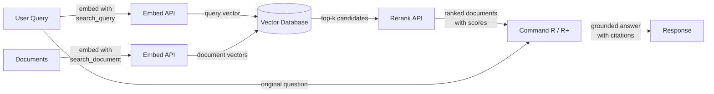

# Cohere

## Définition

**Cohere** est une entreprise d'IA d'entreprise qui développe des modèles de langage et des API conçus spécifiquement pour les applications professionnelles, avec un accent particulier sur la recherche, la récupération d'information et la génération augmentée par récupération (RAG). Contrairement aux fournisseurs généralistes qui proposent une large gamme de fonctionnalités grand public et développeur, Cohere cible les clients entreprise qui ont besoin d'une infrastructure NLP fiable et prête pour la production — notamment pour les cas d'usage où *trouver et remonter la bonne information* est le problème central.

La gamme de modèles de Cohere reflète cet objectif. **Command R** et **Command R+** sont des modèles conversationnels et de suivi d'instructions optimisés spécifiquement pour les workflows RAG — ils prennent en charge de longues fenêtres de contexte et sont entraînés pour suivre de manière fiable les prompts ancrés dans des données récupérées. **Embed** fournit des embeddings vectoriels denses multilingues de pointe dans plus de 100 langues, en faisant le choix privilégié pour les applications de recherche d'entreprise mondiales. **Rerank** est un modèle cross-encoder qui prend un ensemble initial de documents récupérés et les re-score par rapport à la requête originale pour une précision que la récupération sparse et dense seule ne peut pas atteindre.

Ce qui différencie Cohere des fournisseurs généralistes comme OpenAI est que l'ensemble de sa gamme de produits est conçu autour du pipeline de récupération comme workflow de première classe. Les modèles Embed, Rerank et Command R sont conçus pour fonctionner ensemble comme une pile cohérente, et Cohere propose des options de déploiement on-premises et cloud privé qui répondent aux exigences strictes de gouvernance des données et de conformité des entreprises — une distinction critique pour les secteurs réglementés comme la finance, la santé et le gouvernement.

## Comment ça fonctionne

### API Chat et Generate

Les modèles Command R et Command R+ sont accessibles via l'API Chat de Cohere et prennent en charge à la fois les interactions conversationnelles multi-tours et les tâches de génération en un seul tour. Command R+ est la variante plus grande et plus capable, adaptée au raisonnement complexe et au RAG intensif en documents, tandis que Command R est optimisé pour une latence plus faible et un coût inférieur dans les pipelines de production à fort débit. Les deux modèles acceptent un paramètre `documents` qui vous permet de passer du contexte récupéré directement dans le prompt, permettant un mode RAG natif où le modèle est instruit d'ancrer sa réponse dans le contenu fourni et de citer les sources.

### API Embed (embeddings multilingues)

L'API Embed convertit le texte en représentations vectorielles denses adaptées à la recherche par similarité sémantique. Les modèles d'embedding de Cohere prennent en charge plus de 100 langues dans un seul modèle, permettant la recherche multilingue et la récupération de documents multilingues sans modèles séparés par langue. Les embeddings peuvent être générés avec différentes valeurs d'`input_type` — `search_document` pour indexer le contenu au repos, et `search_query` pour encoder les requêtes à l'exécution — une distinction qui applique des signaux d'entraînement asymétriques et améliore généralement la précision de récupération par rapport aux schémas d'embedding symétriques.

### API Rerank

L'API Rerank accepte une requête et une liste de documents candidats (généralement les k premiers résultats d'une recherche vectorielle ou par mots-clés) et renvoie chaque document avec un score de pertinence calculé par un cross-encoder. Les cross-encoders évaluent la requête et le document conjointement en un seul passage, offrant une précision bien supérieure aux bi-encodeurs qui encodent la requête et le document séparément. Le reranking est une étape légère mais très efficace qui améliore considérablement la précision@k — il est le plus utile lorsque la récupération initiale est relativement bon marché (recherche BM25 ou ANN) mais que la précision doit être maximisée avant de passer le contexte à un LLM.

### Intégration RAG

L'intégration RAG de Cohere réunit Embed, Rerank et Command R dans un pipeline unifié. Le flux typique est : embedder la requête, exécuter une recherche de plus proches voisins approximatifs dans une base de données vectorielle, re-classer les meilleurs candidats pour obtenir les documents les plus pertinents, puis passer ces documents à Command R avec la requête originale pour une génération ancrée. Le modèle renvoie une réponse accompagnée d'objets de citation qui référencent des passages spécifiques dans les documents récupérés, facilitant la construction d'applications IA auditables avec des sources citées.



## Quand utiliser / Quand NE PAS utiliser

| Utiliser quand | Éviter quand |
|----------|------------|
| Vous construisez une recherche d'entreprise ou une Q&A sur une base de connaissances où la précision de récupération est critique | Vous avez besoin d'une assistance conversationnelle générale sans composant de récupération |
| Votre contenu couvre plusieurs langues et vous avez besoin d'un seul modèle d'embedding pour toutes | Votre cas d'usage est principalement image, audio ou multimodal — Cohere est uniquement texte |
| Vous souhaitez ajouter une étape de reranking pour améliorer la précision après une recherche vectorielle ou BM25 initiale | Vous avez besoin d'un raisonnement très performant, mathématiques ou codage pour des tâches autonomes (GPT-4o ou Claude peuvent être plus performants) |
| Les exigences de gouvernance des données imposent un déploiement on-premises ou en cloud privé | Votre projet est un prototype rapide et vous souhaitez l'écosystème d'intégrations le plus large |
| Vous avez besoin de citations de sources et d'ancrage dans les documents nativement dans la sortie du modèle | Le budget est extrêmement limité — la tarification entreprise de Cohere est plus élevée que certaines alternatives |

## Comparaisons

| Critère | Cohere | OpenAI | Mistral |
|----------|--------|--------|---------|
| Qualité d'embedding (MTEB) | Premier rang multilingue, 100+ langues | Fort en anglais en premier (text-embedding-3-large) | Compétitif ; mistral-embed disponible |
| Reranking | API Rerank native (cross-encoder) | Pas d'endpoint de reranking natif | Pas d'endpoint de reranking natif |
| Modèles natifs RAG | Command R/R+ conçus pour le RAG avec citations | GPT-4o fonctionne bien avec les prompts RAG mais n'est pas RAG-natif | Mixtral/Mistral fonctionnent avec les prompts RAG |
| Poids ouverts | Non (API propriétaire uniquement) | Non (API propriétaire uniquement) | Oui (modèles Mistral sur Hugging Face) |
| On-premises / cloud privé | Oui (contrats d'entreprise) | Azure OpenAI (limité) | Oui (auto-hébergement des poids ouverts) |
| Embedding multilingue | Modèle unique, 100+ langues | Support multilingue séparé ou limité | Support d'embedding multilingue limité |
| Modèle de tarification | Entreprise / par token | Par token, bien documenté | Par token ; option auto-hébergement gratuite |

## Avantages et inconvénients

| Avantages | Inconvénients |
|------|------|
| Embeddings multilingues de première classe dans un seul modèle | Écosystème général plus petit comparé à OpenAI |
| L'API Rerank native améliore significativement la précision de récupération | Pas d'option à poids ouverts pour l'auto-hébergement |
| Command R/R+ sont conçus spécifiquement pour le RAG ancré et cité | Moins performant que GPT-4o / Claude pour le raisonnement autonome complexe |
| Options de déploiement de qualité entreprise incluant le cloud privé | Documentation et ressources communautaires plus limitées qu'OpenAI |
| Les composants du pipeline RAG (Embed + Rerank + Command R) fonctionnent comme une pile cohérente | La tarification peut être plus élevée pour les expériences à petite échelle |

## Exemples de code

### Chat avec Command R

```python
import cohere

co = cohere.Client("YOUR_COHERE_API_KEY")

response = co.chat(
    model="command-r-plus",
    message="Explain retrieval-augmented generation in plain English.",
)
print(response.text)
```

### Embeddings pour la recherche sémantique

```python
import cohere

co = cohere.Client("YOUR_COHERE_API_KEY")

# Embed documents at indexing time
documents = [
    "Cohere specializes in enterprise NLP and semantic search.",
    "RAG combines retrieval with language model generation.",
    "Multilingual embeddings support over 100 languages.",
]
doc_embeddings = co.embed(
    texts=documents,
    model="embed-multilingual-v3.0",
    input_type="search_document",
).embeddings

# Embed a query at search time
query_embedding = co.embed(
    texts=["What does Cohere specialize in?"],
    model="embed-multilingual-v3.0",
    input_type="search_query",
).embeddings[0]

# Compute cosine similarity (or use a vector DB)
import numpy as np

doc_array = np.array(doc_embeddings)
query_array = np.array(query_embedding)
scores = doc_array @ query_array / (
    np.linalg.norm(doc_array, axis=1) * np.linalg.norm(query_array)
)
top_idx = int(np.argmax(scores))
print(f"Most relevant: '{documents[top_idx]}' (score: {scores[top_idx]:.4f})")
```

### Re-classement des candidats récupérés

```python
import cohere

co = cohere.Client("YOUR_COHERE_API_KEY")

query = "How does multilingual embedding work?"
candidates = [
    "Cohere Embed supports over 100 languages in a single model.",
    "Command R+ is optimized for RAG workflows with long context.",
    "Rerank re-scores retrieved documents with a cross-encoder.",
    "BM25 is a classic keyword-based retrieval algorithm.",
]

results = co.rerank(
    model="rerank-multilingual-v3.0",
    query=query,
    documents=candidates,
    top_n=3,
)

for hit in results.results:
    print(f"[{hit.relevance_score:.4f}] {candidates[hit.index]}")
```

### Pipeline RAG complet avec citations Command R+

```python
import cohere

co = cohere.Client("YOUR_COHERE_API_KEY")

# Documents retrieved from your vector store (simplified)
retrieved_docs = [
    {"id": "doc1", "text": "Cohere Embed supports 100+ languages for multilingual search."},
    {"id": "doc2", "text": "Command R+ is designed for grounded generation with source citations."},
    {"id": "doc3", "text": "Rerank improves precision by re-scoring candidates with a cross-encoder."},
]

response = co.chat(
    model="command-r-plus",
    message="How does Cohere's pipeline improve search quality?",
    documents=retrieved_docs,
)

print(response.text)
print("\n--- Citations ---")
for citation in response.citations:
    print(f"  [{citation.start}:{citation.end}] → {[doc['id'] for doc in citation.documents]}")
```

## Ressources pratiques

- [Documentation API Cohere](https://docs.cohere.com/) — Référence complète pour toutes les API Cohere incluant Chat, Embed et Rerank
- [Documentation Cohere Embed](https://docs.cohere.com/docs/embeddings) — Guide détaillé sur les modèles d'embedding, les types d'entrée et le support multilingue
- [Documentation Cohere Rerank](https://docs.cohere.com/docs/reranking) — Guide de l'API Rerank avec des exemples et des conseils de sélection de modèle
- [Guide RAG Cohere](https://docs.cohere.com/docs/retrieval-augmented-generation-rag) — Présentation de bout en bout de la construction d'un pipeline RAG avec Command R
- [Classement MTEB](https://huggingface.co/spaces/mteb/leaderboard) — Benchmark indépendant comparant les modèles d'embedding incluant Cohere Embed

## Voir aussi

- [Fournisseurs de modèles](/docs/model-providers)
- [RAG](/docs/rag)
- [Embeddings](/docs/rag/embeddings)
- [Recherche sémantique](/docs/semantic-search)
