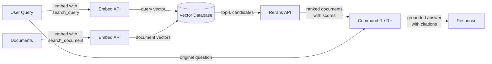

# Cohere

## Définition

**Cohere** est une entreprise d'IA entreprise qui construit des modèles de langage et des API conçus spécifiquement pour les applications métier, avec un accent particulier sur la recherche, la récupération d'information et la génération augmentée par récupération (RAG). Contrairement aux fournisseurs polyvalents qui proposent une large gamme de fonctionnalités pour les consommateurs et les développeurs, Cohere cible les clients entreprise ayant besoin d'une infrastructure NLP fiable et prête pour la production — en particulier pour les cas d'usage où *trouver et présenter la bonne information* est le problème central.

La gamme de modèles de Cohere reflète cet objectif. **Command R** et **Command R+** sont des modèles conversationnels et de suivi d'instructions optimisés spécifiquement pour les flux de travail RAG — ils prennent en charge de larges fenêtres de contexte et sont entraînés à suivre de manière fiable les prompts ancrés dans la récupération. **Embed** fournit des embeddings vectoriels denses multilingues de pointe dans plus de 100 langues, en faisant le choix privilégié pour les applications de recherche entreprise mondiale. **Rerank** est un modèle cross-encoder qui prend un ensemble initial de documents récupérés et les reclasse par rapport à la requête originale pour atteindre une précision que la récupération sparse et dense seule ne peut atteindre.

Ce qui distingue Cohere des fournisseurs polyvalents comme OpenAI, c'est que toute sa suite de produits est conçue autour du pipeline de récupération comme flux de travail de première classe. Les modèles Embed, Rerank et Command R sont construits pour fonctionner ensemble comme une pile cohésive, et Cohere propose des options de déploiement sur site et en cloud privé qui répondent aux exigences strictes de gouvernance des données entreprise et de conformité — une distinction critique pour les secteurs réglementés comme la finance, la santé et le gouvernement.

## Fonctionnement

### API Chat et Generate

Les modèles Command R et Command R+ sont accessibles via l'API Chat de Cohere et prennent en charge à la fois les interactions conversationnelles multi-tours et les tâches de génération en un seul tour. Command R+ est la variante plus grande et plus capable, adaptée au raisonnement complexe et au RAG intensif en documents, tandis que Command R est optimisé pour une latence et un coût inférieurs dans les pipelines de production à haut débit. Les deux modèles acceptent un paramètre `documents` qui vous permet de passer le contexte récupéré directement dans le prompt, activant un mode RAG natif où le modèle reçoit l'instruction d'ancrer sa réponse dans le contenu fourni et de citer les sources.

### API Embed (embeddings multilingues)

L'API Embed convertit le texte en représentations vectorielles denses adaptées à la recherche de similarité sémantique. Les modèles d'embedding de Cohere prennent en charge plus de 100 langues dans un seul modèle, rendant possible la recherche interlinguistique et la récupération multilingue de documents sans modèles spécifiques à chaque langue. Les embeddings peuvent être générés avec différentes valeurs `input_type` — `search_document` pour indexer le contenu au repos et `search_query` pour encoder les requêtes à l'exécution — une distinction qui applique des signaux d'entraînement asymétriques et améliore généralement la précision de récupération par rapport aux schémas d'embedding symétriques.

### API Rerank

L'API Rerank accepte une requête et une liste de documents candidats (généralement les résultats top-k d'une recherche vectorielle ou par mots-clés) et renvoie chaque document avec un score de pertinence calculé par un cross-encoder. Les cross-encoders évaluent la requête et le document conjointement dans un seul passage avant, offrant une précision bien supérieure aux bi-encoders qui encodent la requête et le document séparément. Le reranking est une étape légère mais très efficace qui améliore considérablement la précision@k — elle est plus précieuse lorsque la récupération initiale est relativement peu coûteuse (BM25 ou recherche ANN) mais que la précision doit être maximisée avant de transmettre le contexte à un LLM.

### Intégration RAG

L'intégration RAG de Cohere relie Embed, Rerank et Command R dans un pipeline unifié. Le flux typique est : intégrer la requête, exécuter une recherche des voisins les plus proches approximatifs dans une base de données vectorielle, reclasser les meilleurs candidats pour obtenir les documents les plus pertinents, puis transmettre ces documents à Command R avec la requête originale pour la génération ancrée. Le modèle renvoie une réponse accompagnée d'objets de citation référençant des passages spécifiques dans les documents récupérés, ce qui facilite la construction d'applications d'IA auditables avec citations de sources.



## Quand utiliser / Quand NE PAS utiliser

| Utiliser quand | Éviter quand |
|----------------|--------------|
| Construction d'une recherche entreprise ou d'un Q&A de base de connaissances où la précision de récupération est critique | Vous avez besoin d'une assistance chat polyvalente sans composant de récupération |
| Votre contenu couvre plusieurs langues et vous avez besoin d'un seul modèle d'embedding pour toutes | Votre cas d'usage est principalement l'image, l'audio ou le multimodal — Cohere est texte uniquement |
| Vous souhaitez ajouter une étape de reranking pour améliorer la précision après une recherche vectorielle ou BM25 initiale | Vous avez besoin d'un raisonnement, de mathématiques ou d'un codage très capables pour des tâches autonomes |
| Les exigences de gouvernance des données imposent un déploiement sur site ou en cloud privé | Votre projet est un prototype rapide et vous souhaitez l'écosystème d'intégrations le plus large |
| Vous avez besoin de citations de sources et d'un ancrage documentaire nativement dans la sortie du modèle | Le budget est extrêmement serré — les prix entreprise de Cohere sont plus élevés que certaines alternatives |

## Comparaisons

| Critère | Cohere | OpenAI | Mistral |
|---------|--------|--------|---------|
| Qualité des embeddings (MTEB) | Multilingue de premier niveau, 100+ langues | Fort en anglais en premier (text-embedding-3-large) | Compétitif ; mistral-embed disponible |
| Reranking | API Rerank native (cross-encoder) | Pas d'endpoint de reranking natif | Pas d'endpoint de reranking natif |
| Modèles RAG natifs | Command R/R+ conçus pour RAG avec citations | GPT-4o fonctionne bien avec les prompts RAG mais pas natif RAG | Mixtral/Mistral fonctionnent avec les prompts RAG |
| Poids ouverts | Non (API propriétaire uniquement) | Non (API propriétaire uniquement) | Oui (modèles Mistral sur Hugging Face) |
| Sur site / cloud privé | Oui (contrats entreprise) | Azure OpenAI (limité) | Oui (auto-héberger les poids ouverts) |
| Embedding multilingue | Modèle unique, 100+ langues | Support multilingue séparé ou limité | Support d'embedding multilingue limité |
| Modèle de tarification | Entreprise / paiement par token | Paiement par token, bien documenté | Paiement par token ; option auto-hébergement gratuite |

## Avantages et inconvénients

| Avantages | Inconvénients |
|-----------|---------------|
| Embeddings multilingues de premier niveau dans un seul modèle | Écosystème général plus petit par rapport à OpenAI |
| L'API Rerank native améliore considérablement la précision de récupération | Pas d'option poids ouverts pour l'auto-hébergement |
| Command R/R+ sont spécialement conçus pour le RAG ancré avec citations | Moins capable que GPT-4o / Claude pour le raisonnement autonome complexe |
| Options de déploiement entreprise incluant le cloud privé | Documentation et ressources communautaires plus limitées qu'OpenAI |
| Les composants du pipeline RAG (Embed + Rerank + Command R) fonctionnent comme une pile cohésive | Les prix peuvent être plus élevés pour les petits projets |

## Exemples de code

### Chat avec Command R

```python
import cohere

co = cohere.Client("YOUR_COHERE_API_KEY")

response = co.chat(
    model="command-r-plus",
    message="Explain retrieval-augmented generation in plain English.",
)
print(response.text)
```

### Embeddings pour la recherche sémantique

```python
import cohere

co = cohere.Client("YOUR_COHERE_API_KEY")

# Embed documents at indexing time
documents = [
    "Cohere specializes in enterprise NLP and semantic search.",
    "RAG combines retrieval with language model generation.",
    "Multilingual embeddings support over 100 languages.",
]
doc_embeddings = co.embed(
    texts=documents,
    model="embed-multilingual-v3.0",
    input_type="search_document",
).embeddings

# Embed a query at search time
query_embedding = co.embed(
    texts=["What does Cohere specialize in?"],
    model="embed-multilingual-v3.0",
    input_type="search_query",
).embeddings[0]

# Compute cosine similarity (or use a vector DB)
import numpy as np

doc_array = np.array(doc_embeddings)
query_array = np.array(query_embedding)
scores = doc_array @ query_array / (
    np.linalg.norm(doc_array, axis=1) * np.linalg.norm(query_array)
)
top_idx = int(np.argmax(scores))
print(f"Most relevant: '{documents[top_idx]}' (score: {scores[top_idx]:.4f})")
```

### Reranking des candidats récupérés

```python
import cohere

co = cohere.Client("YOUR_COHERE_API_KEY")

query = "How does multilingual embedding work?"
candidates = [
    "Cohere Embed supports over 100 languages in a single model.",
    "Command R+ is optimized for RAG workflows with long context.",
    "Rerank re-scores retrieved documents with a cross-encoder.",
    "BM25 is a classic keyword-based retrieval algorithm.",
]

results = co.rerank(
    model="rerank-multilingual-v3.0",
    query=query,
    documents=candidates,
    top_n=3,
)

for hit in results.results:
    print(f"[{hit.relevance_score:.4f}] {candidates[hit.index]}")
```

### Pipeline RAG complet avec citations Command R+

```python
import cohere

co = cohere.Client("YOUR_COHERE_API_KEY")

# Documents retrieved from your vector store (simplified)
retrieved_docs = [
    {"id": "doc1", "text": "Cohere Embed supports 100+ languages for multilingual search."},
    {"id": "doc2", "text": "Command R+ is designed for grounded generation with source citations."},
    {"id": "doc3", "text": "Rerank improves precision by re-scoring candidates with a cross-encoder."},
]

response = co.chat(
    model="command-r-plus",
    message="How does Cohere's pipeline improve search quality?",
    documents=retrieved_docs,
)

print(response.text)
print("\n--- Citations ---")
for citation in response.citations:
    print(f"  [{citation.start}:{citation.end}] → {[doc['id'] for doc in citation.documents]}")
```

## Ressources pratiques

- [Documentation de l'API Cohere](https://docs.cohere.com/) — Référence complète pour toutes les API Cohere incluant Chat, Embed et Rerank
- [Documentation Cohere Embed](https://docs.cohere.com/docs/embeddings) — Guide détaillé sur les modèles d'embedding, les types d'entrée et le support multilingue
- [Documentation Cohere Rerank](https://docs.cohere.com/docs/reranking) — Guide de l'API Rerank avec exemples et conseils de sélection de modèles
- [Guide RAG de Cohere](https://docs.cohere.com/docs/retrieval-augmented-generation-rag) — Parcours complet pour construire un pipeline RAG avec Command R
- [MTEB Leaderboard](https://huggingface.co/spaces/mteb/leaderboard) — Benchmark indépendant comparant les modèles d'embedding incluant Cohere Embed

## Voir aussi

- [Fournisseurs de modèles](/docs/model-providers)
- [RAG](/docs/rag)
- [Embeddings](/docs/rag/embeddings)
- [Recherche sémantique](/docs/semantic-search)
