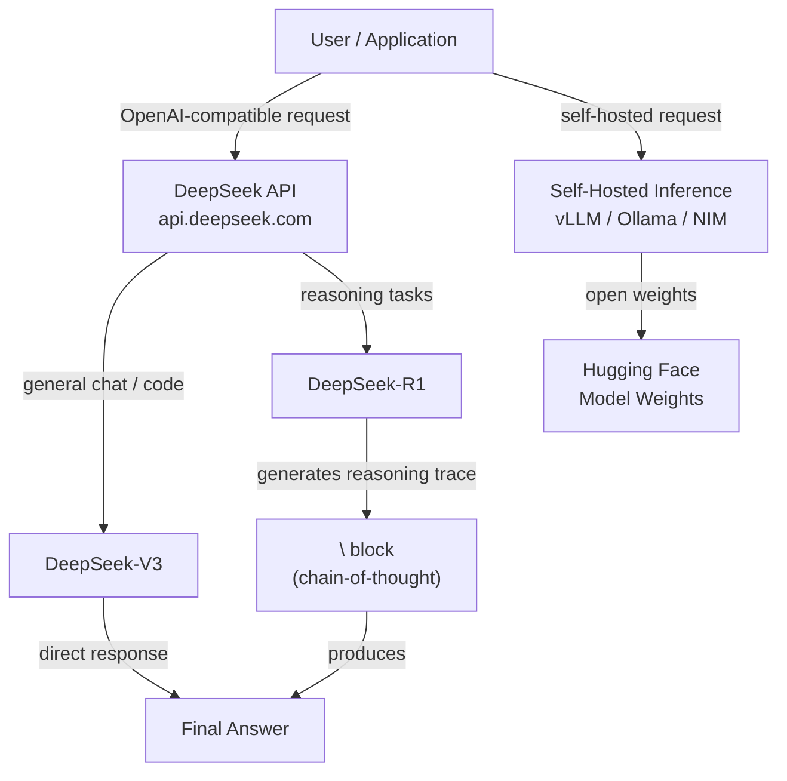

# DeepSeek

## Définition

**DeepSeek** est un laboratoire de recherche en IA chinois et une plateforme commerciale qui a attiré une attention internationale considérable en produisant des modèles dont les performances sont compétitives avec les meilleurs modèles propriétaires tout en publiant les poids ouvertement et en opérant à une fraction du coût. Fondé en 2023 en tant que filiale de High-Flyer (un fonds spéculatif quantitatif), l'approche de DeepSeek se caractérise par une recherche rigoureuse sur l'efficacité de l'entraînement — notamment des innovations dans les architectures mixture-of-experts (MoE), l'apprentissage par renforcement à partir de retours humains, et de nouvelles approches du raisonnement qui ne dépendent pas de budgets de calcul massifs.

La gamme de modèles couvre trois domaines de capacité principaux. **DeepSeek-V3** est un modèle de chat et de suivi d'instructions polyvalent qui rivalise avec GPT-4o et Claude 3.5 Sonnet sur les benchmarks standard tout en étant considérablement moins cher via l'API. **DeepSeek-R1** est un modèle de raisonnement dédié qui utilise la chaîne de pensée étendue (CoT) — le modèle génère des traces de raisonnement explicites avant de produire une réponse finale — ce qui le rend particulièrement fort en mathématiques, en déduction logique et en résolution de problèmes en plusieurs étapes. **DeepSeek-Coder** (et ses variantes successeurs intégrées dans V3/R1) se spécialise dans la génération, la complétion et le débogage de code dans une large gamme de langages de programmation.

L'approche poids ouverts de DeepSeek signifie que tous les grands modèles sont disponibles sur Hugging Face et peuvent être auto-hébergés sur leur propre infrastructure — une capacité critique pour les organisations ayant des exigences de souveraineté des données ou cherchant à éviter les coûts par token d'API à grande échelle. La plateforme DeepSeek expose également une API qui est wire-compatible avec le format d'API OpenAI, ce qui signifie que toute application construite avec le SDK Python d'OpenAI peut passer aux modèles DeepSeek en changeant la `base_url` et la clé API sans autres modifications de code.

## Fonctionnement

### Plateforme API

DeepSeek héberge une API d'inférence cloud sur `api.deepseek.com` qui accepte les requêtes au format OpenAI Chat Completions. Cette couche de compatibilité signifie que les coûts d'intégration sont minimes — les développeurs familiers avec le SDK OpenAI peuvent migrer ou tester des modèles DeepSeek en quelques minutes. La plateforme prend en charge les réponses en streaming, les appels de fonctions et les prompts système. La tarification est basée sur les tokens et listée publiquement, avec des tarifs généralement 90–95% inférieurs aux modèles OpenAI de niveau équivalent, rendant les déploiements en production à haut volume substantiellement moins chers.

### Modèles de raisonnement (DeepSeek-R1)

DeepSeek-R1 est entraîné en utilisant un processus en plusieurs étapes qui incorpore l'apprentissage par renforcement pour récompenser le modèle pour la production de réponses finales correctes — de manière cruciale, sans s'appuyer sur des données supervisées de chaîne de pensée à l'étape centrale d'entraînement. Le modèle génère un bloc `<think>` contenant sa trace de raisonnement avant la réponse finale. Ce bloc-notes explicite permet au modèle d'effectuer une déduction en plusieurs étapes, de vérifier son travail et de revenir en arrière depuis des chemins incorrects — des comportements qui améliorent considérablement les performances sur les problèmes d'olympiades mathématiques, la logique formelle et les tâches de codage complexes nécessitant une planification sur de nombreuses étapes.

### Modèles de code et DeepSeek-Coder

Les modèles spécialisés dans le code de DeepSeek sont pré-entraînés sur de grands corpus de code source (GitHub, plateformes de programmation compétitive, documentation) et ajustés pour suivre les instructions sur des tâches de codage. Ils prennent en charge la complétion fill-in-the-middle (FIM), qui est le format standard utilisé par les outils d'autocomplétion d'IDE comme Copilot. DeepSeek-Coder atteint des performances de premier plan sur HumanEval, MBPP et SWE-bench, surpassant souvent des modèles plusieurs fois plus grands d'autres fournisseurs. Les capacités de codage sont également intégrées dans DeepSeek-V3 et R1, de sorte que les modèles polyvalents fonctionnent également bien sur les tâches de code.

### Déploiement poids ouverts

Tous les grands modèles DeepSeek ont leurs poids publiés sur Hugging Face sous des licences permissives, permettant l'inférence auto-hébergée sur du matériel GPU grand public ou entreprise. DeepSeek-V3 utilise une architecture mixture-of-experts où seul un sous-ensemble de paramètres est activé par token, réduisant considérablement le coût d'inférence par rapport aux modèles denses de capacité comparable. Les options de déploiement populaires incluent vLLM, Ollama (pour les versions quantifiées) et les conteneurs NVIDIA NIM. Le déploiement auto-hébergé est particulièrement attractif pour les charges de travail par lots à grande échelle, l'ajustement fin sur des données propriétaires, ou les scénarios où toutes les données doivent rester sur site.



## Quand utiliser / Quand NE PAS utiliser

| Utiliser quand | Éviter quand |
|----------------|--------------|
| Le coût est une contrainte principale — l'API DeepSeek est plus de 90% moins chère que GPT-4o à qualité comparable | Vous avez besoin d'un fournisseur avec un SLA entreprise établi, des certifications de conformité (SOC 2, HIPAA) ou un traitement des données basé aux États-Unis |
| Les tâches nécessitent un raisonnement profond en plusieurs étapes : mathématiques, logique, preuves formelles, codage complexe | Votre tâche est principalement multimodale — DeepSeek-V3/R1 sont des modèles texte uniquement |
| Vous souhaitez auto-héberger des modèles à poids ouverts pour la souveraineté des données ou un ajustement fin personnalisé | Vous avez besoin de l'écosystème le plus large possible de plugins/outils et d'intégrations tierces |
| Construction de pipelines de lots à haut volume où la réduction du coût par token s'accumule significativement | Applications grand public critiques pour la latence où la trace de raisonnement de R1 ajoute du temps de réponse |
| La génération de code, la révision de code ou le débogage sont vos cas d'usage principaux | Vous êtes dans une juridiction avec des exigences réglementaires concernant l'origine des modèles d'IA |

## Comparaisons

| Critère | DeepSeek (V3 / R1) | OpenAI (GPT-4o / o1) | Meta / Llama |
|---------|--------------------|----------------------|--------------|
| Performance de raisonnement | R1 compétitif avec o1 sur les benchmarks maths/logique | o1 est de premier niveau ; GPT-4o fort en raisonnement général | Llama 3.x compétitif mais en dessous de R1/o1 pour le raisonnement difficile |
| Qualité générale du chat | V3 compétitif avec GPT-4o | GPT-4o meilleure qualité générale | Llama 3.3 70B compétitif pour sa taille |
| Poids ouverts | Oui (tous les modèles sur Hugging Face) | Non (propriétaire uniquement) | Oui (Meta open-source Llama) |
| Coût de l'API | Très bas (~0,27$/M tokens d'entrée pour V3) | Élevé (~2,50$/M pour l'entrée GPT-4o) | Gratuit (auto-hébergé) ; API Fireworks/Together abordable |
| Écosystème et intégrations | En croissance ; API compatible OpenAI facilite l'adoption | Plus grand écosystème, plus d'intégrations | Grand écosystème open-source |
| Souveraineté des données | Auto-hébergement possible ; données API traitées en Chine | Azure OpenAI pour le traitement en région US | Auto-hébergement complet possible |
| Multimodal | Texte uniquement (V3/R1) | Oui (GPT-4o, DALL-E) | Llama 3.2 a des capacités de vision |

## Avantages et inconvénients

| Avantages | Inconvénients |
|-----------|---------------|
| Coût de l'API considérablement plus bas qu'OpenAI/Anthropic | Les données de l'API transitent par des serveurs chinois — préoccupation pour certains secteurs réglementés |
| R1 offre des performances de raisonnement de niveau frontier | Les traces de raisonnement de R1 ajoutent de la latence et de l'utilisation de tokens |
| API compatible OpenAI — coût de migration quasi nul | Moindre reconnaissance de confiance/marque dans les cycles de vente entreprise occidentaux |
| Les poids ouverts permettent l'auto-hébergement et l'ajustement fin | V3/R1 sont texte uniquement ; pas de capacités natives d'image ou d'audio |
| Forte génération de code dans la plupart des langages de programmation courants | La communauté et la documentation sont principalement en chinois ; les ressources en anglais rattrapent leur retard |

## Exemples de code

### Complétion de chat avec DeepSeek-V3 (compatible OpenAI)

```python
from openai import OpenAI

# DeepSeek uses the OpenAI SDK with a custom base_url
client = OpenAI(
    api_key="YOUR_DEEPSEEK_API_KEY",
    base_url="https://api.deepseek.com",
)

response = client.chat.completions.create(
    model="deepseek-chat",  # maps to DeepSeek-V3
    messages=[
        {"role": "system", "content": "You are a helpful AI assistant."},
        {"role": "user", "content": "Explain the difference between MoE and dense transformer architectures."},
    ],
    temperature=0.7,
    max_tokens=1024,
)

print(response.choices[0].message.content)
```

### Raisonnement avec DeepSeek-R1 (chaîne de pensée)

```python
from openai import OpenAI

client = OpenAI(
    api_key="YOUR_DEEPSEEK_API_KEY",
    base_url="https://api.deepseek.com",
)

response = client.chat.completions.create(
    model="deepseek-reasoner",  # maps to DeepSeek-R1
    messages=[
        {
            "role": "user",
            "content": (
                "A train leaves City A at 08:00 and travels at 120 km/h. "
                "Another train leaves City B (300 km away) at 09:00 and travels "
                "toward City A at 80 km/h. At what time do they meet?"
            ),
        }
    ],
)

# R1 exposes the reasoning trace in reasoning_content
message = response.choices[0].message
if hasattr(message, "reasoning_content") and message.reasoning_content:
    print("=== Reasoning trace ===")
    print(message.reasoning_content)
    print()

print("=== Final answer ===")
print(message.content)
```

### Réponse en streaming avec DeepSeek-V3

```python
from openai import OpenAI

client = OpenAI(
    api_key="YOUR_DEEPSEEK_API_KEY",
    base_url="https://api.deepseek.com",
)

stream = client.chat.completions.create(
    model="deepseek-chat",
    messages=[
        {"role": "user", "content": "Write a Python function that implements binary search."},
    ],
    stream=True,
)

for chunk in stream:
    delta = chunk.choices[0].delta
    if delta.content:
        print(delta.content, end="", flush=True)
print()
```

### Inférence auto-hébergée avec vLLM

```python
# Start vLLM server (run in terminal):
# vllm serve deepseek-ai/DeepSeek-V3 --tensor-parallel-size 4 --port 8000

from openai import OpenAI

# Point to your local vLLM server instead of DeepSeek cloud
client = OpenAI(
    api_key="not-needed",  # vLLM does not require a real key
    base_url="http://localhost:8000/v1",
)

response = client.chat.completions.create(
    model="deepseek-ai/DeepSeek-V3",
    messages=[
        {"role": "user", "content": "Summarize the key advantages of mixture-of-experts models."},
    ],
)

print(response.choices[0].message.content)
```

## Ressources pratiques

- [Documentation de l'API DeepSeek](https://platform.deepseek.com/api-docs/) — Référence officielle pour l'API de la plateforme DeepSeek incluant les modèles, les paramètres et les prix
- [GitHub DeepSeek](https://github.com/deepseek-ai) — Référentiels open-source pour les modèles DeepSeek, le code d'entraînement et les articles de recherche
- [DeepSeek-R1 sur Hugging Face](https://huggingface.co/deepseek-ai/DeepSeek-R1) — Fiche du modèle avec poids, résultats de benchmark et instructions de déploiement
- [Rapport technique DeepSeek-V3](https://arxiv.org/abs/2412.19437) — Article de recherche détaillant l'architecture V3, l'approche d'entraînement et les comparaisons de benchmarks
- [Guide de déploiement DeepSeek avec vLLM](https://docs.vllm.ai/en/latest/models/supported_models.html) — Instructions pour auto-héberger des modèles DeepSeek avec vLLM pour l'inférence en production

## Voir aussi

- [Fournisseurs de modèles](/docs/model-providers)
- [Étude de cas DeepSeek](/docs/case-studies/deepseek)
- [Modèles de raisonnement](/docs/reasoning-patterns)
