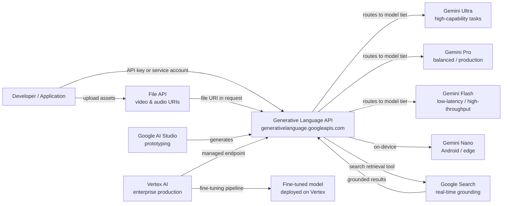

# Google Gemini

## Définition

Google Gemini est la famille phare de grands modèles de langage multimodaux de Google et la plateforme qui les entoure. Annoncé fin 2023 et succédant à la famille PaLM 2, Gemini a été conçu dès le départ pour raisonner sur du texte, des images, des vidéos, de l'audio et du code au sein d'une architecture de modèle unique et unifiée. Contrairement aux systèmes qui ajoutent la vision via des pipelines séparés, la multimodalité native de Gemini signifie que le modèle traite toutes les modalités conjointement pendant l'entraînement et l'inférence, permettant un raisonnement cross-modal plus riche.

La famille Gemini s'étend sur quatre niveaux ajustés pour différents cas d'usage : **Gemini Ultra** (le plus capable, ciblant les tâches d'entreprise et de recherche complexes), **Gemini Pro** (le cheval de bataille équilibré pour un usage commercial large), **Gemini Flash** (optimisé pour les applications à faible latence et fort débit à coût réduit) et **Gemini Nano** (inférence sur appareil pour Android et matériel edge). Chaque niveau est versionné (par ex., Gemini 1.5 Pro, Gemini 2.0 Flash), et Google publie de nouvelles versions en continu.

Les développeurs accèdent à Gemini via deux surfaces complémentaires. **Google AI Studio** est un environnement de prototypage gratuit et basé sur un navigateur qui fournit des clés API et vous permet d'expérimenter avec des prompts, des instructions système et des entrées multimodales sans aucune configuration d'infrastructure. **Vertex AI** est la plateforme ML gérée de Google Cloud et le chemin recommandé pour les charges de travail en production — elle ajoute des contrôles d'entreprise comme les contrôles de service VPC, IAM, la journalisation d'audit, les pipelines de fine-tuning et les endpoints avec SLA. Les deux surfaces consomment les mêmes modèles Gemini sous-jacents via l'API Generative Language.

## Comment ça fonctionne

### API Generative Language

L'API Generative Language (`generativelanguage.googleapis.com`) est l'interface REST unifiée pour tous les modèles Gemini. Les requêtes sont structurées en tant que tableau `contents` — chaque élément a un `role` (`user` ou `model`) et une ou plusieurs `parts` (texte, données inline ou URI de fichier). L'API renvoie un tableau `candidates` avec `content`, `finishReason` et `safetyRatings`. Les comptages de tokens, les métadonnées d'ancrage et les réponses aux appels de fonctions sont renvoyés dans la même enveloppe. Les clés API d'AI Studio fonctionnent pour le développement ; les charges de travail en production utilisent des credentials de compte de service via Vertex AI.

### Entrées multimodales — image, vidéo et audio

Gemini accepte des images (JPEG, PNG, WebP, HEIC), des vidéos (MP4, MOV, AVI jusqu'à plusieurs heures) et de l'audio (MP3, WAV, FLAC) directement aux côtés du texte dans une seule requête. Les images peuvent être envoyées en données base64 inline ou via des URI Cloud Storage. Pour les longues vidéos, l'API File télécharge l'actif de manière asynchrone et renvoie un URI de fichier pouvant être référencé dans les appels `generateContent` suivants. Le modèle tokenise en interne les modalités non textuelles de sorte que la même comptabilité de fenêtre de contexte et les mêmes mécanismes d'attention s'appliquent uniformément, permettant des tâches comme "résumer la piste audio de cette vidéo et identifier quand le locuteur change de sujet."

### Ancrage avec Google Search

Gemini prend en charge la génération ancrée dans la récupération via un paramètre `tools` optionnel qui active `google_search_retrieval`. Lorsque cet outil est actif, le modèle peut émettre des requêtes de recherche en cours de génération, récupérer des résultats web en temps réel et les synthétiser dans sa réponse — renvoyant des citations aux côtés du texte généré. Ceci est particulièrement utile pour les requêtes factuellement denses ou sensibles au temps où un modèle paramétrique statique hallucinerait ou renverrait des informations périmées. L'ancrage est disponible dans AI Studio et Vertex AI et peut être combiné avec d'autres outils.

### Intégration Vertex AI

Sur Vertex AI, Gemini est accessible via le SDK Python `vertexai` (`aiplatform`). Vertex ajoute le fine-tuning (pipelines de fine-tuning supervisé et RLHF), les ensembles de données d'évaluation des modèles, les jardins de modèles pour comparer les modèles, le déploiement sur des endpoints dédiés avec mise à l'échelle automatique et les Vertex AI Pipelines pour orchestrer les workflows ML de bout en bout. Les clients entreprise bénéficient de garanties de résidence des données, de réseaux privés via les contrôles de service VPC et de Cloud Audit Logs pour chaque appel API — des fonctionnalités non disponibles dans AI Studio.



## Quand utiliser / Quand NE PAS utiliser

| Utiliser quand | Éviter quand |
|----------|------------|
| Vous avez besoin d'un raisonnement multimodal natif sur des images, vidéos ou audio aux côtés du texte | Votre charge de travail est uniquement textuelle et vous préférez un fournisseur avec un historique API public plus long |
| Vous êtes déjà sur Google Cloud et souhaitez une intégration profonde Vertex AI / GCP (IAM, VPC, Logs d'audit) | Vous avez des exigences strictes de résidence des données dans des régions où Vertex AI n'est pas encore disponible |
| Vous avez besoin d'un ancrage en temps réel via Google Search | Votre application nécessite des sorties déterministes et reproductibles (l'ancrage introduit de la variabilité depuis la recherche en direct) |
| L'efficacité des coûts à grande échelle est importante — Gemini Flash est très compétitif sur le prix par token | Vous avez besoin d'un modèle à poids ouverts bien documenté que vous pouvez exécuter en local |
| Vous souhaitez un environnement de prototypage gratuit et sans friction sans carte de crédit (niveau gratuit AI Studio) | Votre équipe est déjà profondément investie dans la surface API OpenAI et le coût de migration est élevé |

## Comparaisons

| Critère | Google Gemini | OpenAI GPT-4o | Anthropic Claude 3.5 |
|-----------|--------------|--------------|----------------------|
| Capacité multimodale | Native — texte, image, vidéo, audio dans un seul modèle | Texte + image (GPT-4V) ; audio via des API Whisper/TTS séparées | Texte + image (Claude 3) ; pas de vidéo/audio natif |
| Intégration entreprise / cloud | Intégration GCP profonde via Vertex AI — IAM, VPC, Logs d'audit, fine-tuning | Azure OpenAI Service pour entreprise ; portabilité cloud non-Azure limitée | AWS Bedrock et API directe ; pas d'intégration GCP native |
| Ancrage / récupération en temps réel | Outil d'ancrage Google Search intégré | Plugin de navigation web (ChatGPT) ; pas d'ancrage API natif | Pas de recherche intégrée ; repose sur le RAG fourni par l'utilisateur |
| Fenêtre de contexte | Jusqu'à 1M de tokens (Gemini 1.5 Pro) | 128k tokens (GPT-4o) | 200k tokens (Claude 3.5 Sonnet) |
| Disponibilité des poids ouverts | API fermée uniquement | API fermée uniquement | API fermée uniquement |
| Modèle de tarification | Par token ; niveau Flash très compétitif | Par token ; GPT-4o milieu de gamme | Par token ; comparable à GPT-4o |
| Fine-tuning | Fine-tuning supervisé sur Vertex AI | API de fine-tuning pour GPT-3.5/4o-mini | Pas d'API de fine-tuning publique |

## Exemples de code

```python
# google_gemini_examples.py
# Demonstrates text generation, multimodal image input, and embeddings
# using the google-generativeai SDK.
# pip install google-generativeai pillow

import google.generativeai as genai
import pathlib

# ── Configuration ─────────────────────────────────────────────────────────────
# Set your API key from https://aistudio.google.com/app/apikey
genai.configure(api_key="YOUR_API_KEY")


# ── 1. Text generation ────────────────────────────────────────────────────────
def text_generation_example():
    """Simple single-turn text completion with Gemini Flash."""
    model = genai.GenerativeModel(
        model_name="gemini-1.5-flash",
        system_instruction="You are a concise technical writer.",
    )

    response = model.generate_content(
        "Explain the difference between supervised and unsupervised learning "
        "in three sentences.",
        generation_config=genai.GenerationConfig(
            temperature=0.4,
            max_output_tokens=256,
        ),
    )

    print("=== Text Generation ===")
    print(response.text)
    print(f"Finish reason : {response.candidates[0].finish_reason}")
    print(f"Total tokens  : {response.usage_metadata.total_token_count}")


# ── 2. Multimodal — image input ───────────────────────────────────────────────
def multimodal_image_example(image_path: str):
    """
    Send a local image alongside a text prompt to Gemini Pro.
    The model reasons over both modalities jointly.
    """
    model = genai.GenerativeModel("gemini-1.5-pro")

    image_data = pathlib.Path(image_path).read_bytes()
    # Inline image part
    image_part = {
        "mime_type": "image/jpeg",  # adjust to image/png, image/webp as needed
        "data": image_data,
    }

    response = model.generate_content(
        [image_part, "Describe this image and identify any text present in it."]
    )

    print("\n=== Multimodal Image Input ===")
    print(response.text)


# ── 3. Embeddings ─────────────────────────────────────────────────────────────
def embeddings_example(texts: list[str]):
    """
    Generate text embeddings using the text-embedding-004 model.
    Embeddings can be used for semantic search, clustering, and classification.
    """
    result = genai.embed_content(
        model="models/text-embedding-004",
        content=texts,
        task_type="retrieval_document",  # or retrieval_query, semantic_similarity
    )

    print("\n=== Embeddings ===")
    for text, embedding in zip(texts, result["embedding"]):
        print(f"Text    : {text[:60]}...")
        print(f"Dims    : {len(embedding)}")
        print(f"First 5 : {embedding[:5]}\n")


# ── 4. Multi-turn chat ────────────────────────────────────────────────────────
def multi_turn_chat_example():
    """Maintain conversational context using the chat interface."""
    model = genai.GenerativeModel("gemini-1.5-flash")
    chat = model.start_chat(history=[])

    turns = [
        "What is gradient descent?",
        "How does the learning rate affect it?",
        "What is Adam optimizer and how does it improve on basic gradient descent?",
    ]

    print("\n=== Multi-turn Chat ===")
    for user_message in turns:
        response = chat.send_message(user_message)
        print(f"User  : {user_message}")
        print(f"Model : {response.text}\n")


# ── Entry point ───────────────────────────────────────────────────────────────
if __name__ == "__main__":
    text_generation_example()

    # Provide a path to a local JPEG/PNG for multimodal demo
    # multimodal_image_example("path/to/your/image.jpg")

    embeddings_example([
        "Machine learning is a subset of artificial intelligence.",
        "Deep learning uses neural networks with many layers.",
        "Reinforcement learning trains agents through reward signals.",
    ])

    multi_turn_chat_example()
```

## Ressources pratiques

- [Google AI Studio](https://aistudio.google.com/) — Environnement gratuit basé sur un navigateur pour le prototypage avec Gemini ; génère des clés API et vous permet d'ajuster les prompts de manière interactive sans infrastructure requise.
- [Documentation API Gemini](https://ai.google.dev/gemini-api/docs) — Référence officielle couvrant tous les modèles, endpoints, formats d'entrée multimodale, ancrage, appel de fonctions et l'API File.
- [Vertex AI — Documentation IA générative](https://cloud.google.com/vertex-ai/generative-ai/docs/overview) — Chemin entreprise : fine-tuning, évaluation des modèles, déploiement et contrôles de sécurité GCP.
- [SDK Python google-generativeai sur PyPI](https://pypi.org/project/google-generativeai/) — Source du SDK, journal des modifications et exemples d'utilisation.

## Voir aussi

- [Fournisseurs de modèles](/docs/model-providers)
- [IA multimodale](/docs/multimodal-ai)
- [Études de cas — Gemini](/docs/case-studies/gemini)
