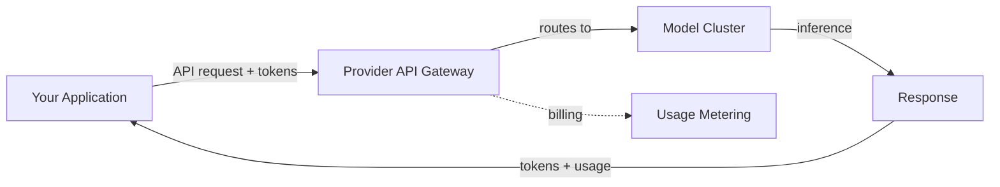
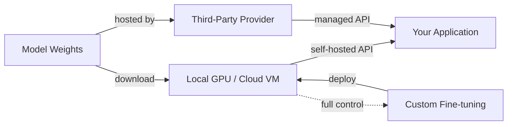

# Fournisseurs de modèles

## Définition

Un fournisseur de modèles est une organisation qui propose l'accès à des grands modèles de langage, que ce soit via des API hébergées, des poids téléchargeables en accès libre, ou les deux. Le choix du fournisseur détermine les capacités de votre application, sa structure de coûts, sa posture en matière de confidentialité des données et sa flexibilité de déploiement. Comprendre le paysage des fournisseurs est un prérequis pour tout système d'IA en production.

Le marché se divise en trois catégories. Les **fournisseurs basés sur les API** comme OpenAI, Anthropic et Google proposent des modèles exclusivement via des API gérées — vous envoyez des requêtes et ils s'occupent de l'infrastructure d'inférence. Les **fournisseurs de poids ouverts** comme Meta et Mistral publient des fichiers de poids que vous pouvez télécharger et exécuter sur votre propre matériel ou via un hébergement tiers. Les **fournisseurs hybrides** comme Mistral et DeepSeek proposent à la fois des modèles à poids ouverts et un accès commercial à l'API, offrant aux développeurs la flexibilité de choisir selon leurs besoins.

Choisir un fournisseur implique des compromis sur plusieurs dimensions : qualité du modèle, tarification, taille de la fenêtre de contexte, capacités multimodales, confidentialité des données, support du fine-tuning et maturité de l'écosystème. Aucun fournisseur ne domine sur tous les critères, c'est pourquoi la plupart des systèmes en production évaluent plusieurs options et utilisent parfois différents fournisseurs pour différentes tâches au sein d'une même application.

## Fonctionnement

### Fournisseurs basés sur les API

Les fournisseurs d'API hébergent des modèles sur leur infrastructure et les exposent via des API REST. Vous vous authentifiez avec une clé API, envoyez une requête avec votre prompt et vos paramètres de configuration, et recevez une réponse. Le fournisseur gère la mise à l'échelle, l'allocation GPU, les mises à jour des modèles et la disponibilité. C'est le chemin le plus simple vers la production — aucune infrastructure à gérer — mais vous envoyez vos données à un tiers et payez par token.



### Fournisseurs de poids ouverts

Les fournisseurs de poids ouverts publient des fichiers de modèles (généralement sur Hugging Face) que vous téléchargez et exécutez localement ou sur votre infrastructure cloud. Vous contrôlez toute la pile : sélection du matériel, quantification, framework de service (vLLM, TGI, llama.cpp) et mise à l'échelle. Cela offre une confidentialité et une personnalisation maximales, mais nécessite une expertise en infrastructure ML. Les fournisseurs d'inférence tiers (Together AI, Groq, Fireworks) proposent un juste milieu — ils hébergent des modèles ouverts avec une interface API.



### Choisir un fournisseur

L'arbre de décision dépend de vos contraintes. Commencez par vos exigences — confidentialité des données, budget, latence, qualité du modèle — et affinez à partir de là. De nombreuses équipes commencent avec des fournisseurs d'API pour le prototypage et évaluent des alternatives à poids ouverts pour l'optimisation des coûts en production ou les exigences de souveraineté des données.

## Quand utiliser / Quand NE PAS utiliser

| Utiliser quand | Éviter quand |
|----------------|--------------|
| **Fournisseurs d'API** : prototypage rapide, pas d'équipe d'infrastructure ML, besoin immédiat de modèles de pointe | Les données ne peuvent pas quitter votre infrastructure (secteurs réglementés, données personnelles) |
| **Poids ouverts** : exigences de confidentialité des données, contrôle du fine-tuning, optimisation des coûts à volume élevé | Vous manquez d'infrastructure GPU et d'expertise ML ops |
| **Modèles ouverts hébergés par des tiers** : flexibilité des modèles ouverts sans gérer l'infrastructure | Vous avez besoin de SLA garantis et d'un support entreprise (utilisez les API des fournisseurs principaux) |
| **Plusieurs fournisseurs** : différentes tâches ont des exigences différentes en matière de qualité/coût | Votre cas d'usage est suffisamment simple pour qu'un seul fournisseur couvre tout |

## Comparaisons

| Critère | OpenAI | Anthropic | Google Gemini | Meta Llama | Mistral | Cohere | DeepSeek |
|---------|--------|-----------|---------------|------------|---------|--------|----------|
| Accès au modèle | API uniquement | API uniquement | API + Vertex AI | Poids ouverts | Ouvert + API | API uniquement | Ouvert + API |
| Modèle de premier niveau | GPT-4o, o3 | Claude Opus/Sonnet | Gemini Ultra/Pro | Llama 3.1 405B | Mistral Large | Command R+ | DeepSeek-V3 |
| Fenêtre de contexte | 128K | 200K | 1M+ | 128K | 128K | 128K | 128K |
| Multimodal | Vision, audio, génération d'images | Vision | Vision, audio, vidéo | Vision (3.2) | Vision | Axé sur le texte | Axé sur le texte |
| Spécialité | Usage général, écosystème | Sécurité, long contexte | Multimodal, ancrage dans la recherche | Poids ouverts, personnalisation | Efficacité, multilingue | Embeddings, RAG, reranking | Raisonnement, efficacité des coûts |
| Fine-tuning | Fine-tuning via API | Non disponible | Fine-tuning Vertex AI | Accès complet aux poids | Fine-tuning via API | Non disponible | Accès complet aux poids |
| Modèle de tarification | Par token | Par token | Par token + niveau gratuit | Gratuit (auto-hébergé) ou tiers | Par token + modèles gratuits | Par token | Par token (coût très faible) |

## Exemples de code

### Appels API côte à côte (Python)

```python
# OpenAI
from openai import OpenAI

openai_client = OpenAI()
openai_response = openai_client.chat.completions.create(
    model="gpt-4o",
    messages=[{"role": "user", "content": "Explain RAG in one sentence."}],
)
print("OpenAI:", openai_response.choices[0].message.content)
```

```python
# Anthropic
import anthropic

anthropic_client = anthropic.Anthropic()
anthropic_response = anthropic_client.messages.create(
    model="claude-sonnet-4-20250514",
    max_tokens=256,
    messages=[{"role": "user", "content": "Explain RAG in one sentence."}],
)
print("Anthropic:", anthropic_response.content[0].text)
```

```python
# Google Gemini
import google.generativeai as genai

model = genai.GenerativeModel("gemini-1.5-pro")
gemini_response = model.generate_content("Explain RAG in one sentence.")
print("Gemini:", gemini_response.text)
```

### Interface unifiée avec LiteLLM (Python)

```python
from litellm import completion

# Same interface, different providers
providers = {
    "OpenAI": "gpt-4o",
    "Anthropic": "claude-sonnet-4-20250514",
    "Gemini": "gemini/gemini-1.5-pro",
}

for name, model in providers.items():
    response = completion(
        model=model,
        messages=[{"role": "user", "content": "Explain RAG in one sentence."}],
    )
    print(f"{name}: {response.choices[0].message.content}")
```

## Ressources pratiques

- [Artificial Analysis](https://artificialanalysis.ai/) — Benchmarks indépendants LLM et comparaison des prix
- [LiteLLM](https://docs.litellm.ai/) — API unifiée pour plus de 100 fournisseurs de LLM
- [OpenRouter](https://openrouter.ai/) — Passerelle API unique vers plusieurs fournisseurs
- [Hugging Face Open LLM Leaderboard](https://huggingface.co/spaces/open-llm-leaderboard/open_llm_leaderboard) — Benchmarks de modèles ouverts
- [LMSYS Chatbot Arena](https://chat.lmsys.org/) — Classements LLM par évaluation humaine aveugle collaborative

## Voir aussi

- [OpenAI](/docs/model-providers/openai)
- [Anthropic](/docs/model-providers/anthropic)
- [Google Gemini](/docs/model-providers/google-gemini)
- [Meta Llama](/docs/model-providers/meta-llama)
- [Mistral](/docs/model-providers/mistral)
- [Cohere](/docs/model-providers/cohere)
- [DeepSeek](/docs/model-providers/deepseek)
- [LLMs](/docs/llms)
- [Infrastructure](/docs/infrastructure)
- [Local inference](/docs/local-inference)
