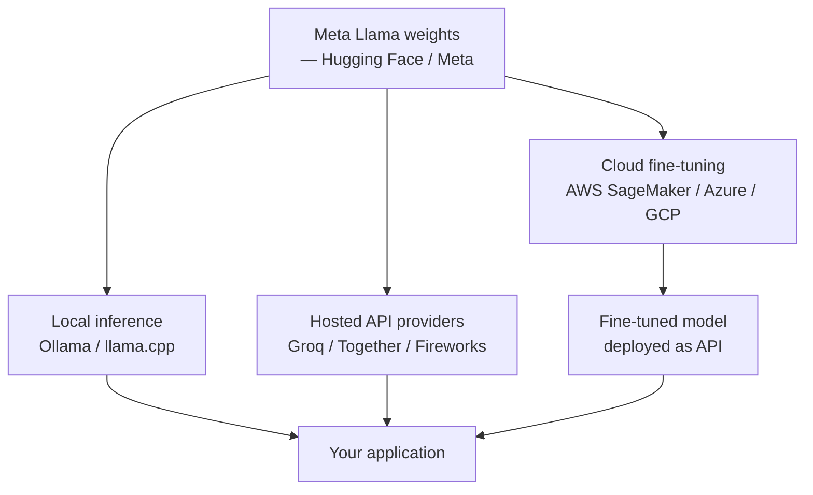

# Meta Llama

## Définition

**Meta Llama** est la famille de modèles de langage à poids ouverts de Meta AI, publiée sous des licences qui permettent généralement une utilisation commerciale avec certaines restrictions. Contrairement aux modèles fermés d'Anthropic ou d'OpenAI, les modèles Llama sont disponibles sous forme de téléchargements de poids — vous pouvez les exécuter sur votre propre matériel, les affiner sur vos propres données, ou les déployer derrière votre propre API sans passer par un service tiers. Ce modèle de distribution "poids ouverts" (par opposition à "open-source" au sens plein, car les données d'entraînement ne sont généralement pas publiées) est devenu une alternative importante à l'IA générative fermée.

La lignée Llama à partir de 2025 inclut : **Llama 2** (les modèles 7B, 13B, 70B originaux publiés en 2023 avec une licence commerciale), **Llama 3** (modèles 8B et 70B publiés en avril 2024 avec une fenêtre de contexte améliorée à 8K tokens et des jeux de données d'entraînement de meilleure qualité), **Llama 3.1** (modèles 8B, 70B et 405B avec des fenêtres de contexte de 128K), **Llama 3.2** (ajout de modèles vision et de petits modèles edge 1B/3B), et **Llama 3.3** (améliorations du 70B). Meta publie également des variantes spécialisées : **Code Llama** (optimisé pour la génération de code) et **Llama Guard** (classification de sécurité du contenu). Les modèles sont disponibles sur [Hugging Face](https://huggingface.co/meta-llama), [Meta AI](https://ai.meta.com/llama/) et via des fournisseurs de cloud comme AWS, Azure et Google Cloud.

## Comment ça fonctionne

### Poids ouverts et écosystème de déploiement

Contrairement aux modèles d'API fermés, vous interagissez avec Llama en téléchargeant les poids du modèle et en exécutant l'inférence localement ou sur votre propre infrastructure. Il existe plusieurs voies :



**Inférence locale** : Des outils comme [Ollama](https://ollama.com/) et [llama.cpp](https://github.com/ggerganov/llama.cpp) permettent d'exécuter des modèles Llama sur un MacBook, un PC de bureau ou un serveur Linux avec un GPU NVIDIA. Ollama télécharge et gère les modèles quantifiés ; llama.cpp fournit une compilation C++ multiplateforme pour un déploiement bare-metal. Des modèles plus petits (8B quantifié) fonctionnent sur du matériel grand public ; des modèles plus grands nécessitent des GPU professionnels ou du multi-GPU.

**Fournisseurs hébergés** : Groq, Together AI, Fireworks AI et d'autres proposent des points de terminaison d'inférence Llama qui imitent le format de l'API OpenAI, permettant une intégration par remplacement direct dans du code existant.

**Fine-tuning** : Les poids ouverts permettent un fine-tuning complet ou basé sur LoRA (Low-Rank Adaptation) sur vos propres données en utilisant des frameworks comme Hugging Face TRL, Unsloth ou torchtune de Meta. Ceci est un avantage clé par rapport aux modèles fermés.

### Quantification et déploiement edge

Les modèles Llama peuvent être quantifiés pour réduire les exigences mémoire avec une dégradation de performance minimale. GGUF (format utilisé par llama.cpp) supporte 4-bit, 5-bit et 8-bit quantification. Un Llama 3.1 8B quantifié en 4-bit nécessite ~5 GB de RAM et peut s'exécuter sur un Apple Silicon M-series Mac.

## Quand utiliser / Quand NE PAS utiliser

| Utiliser Llama quand | Éviter ou considérer des alternatives quand |
|----------------------|---------------------------------------------|
| La confidentialité des données est primordiale — les données ne quittent pas votre infrastructure | Vous avez besoin des meilleures performances absolues sur des tâches de raisonnement complexes — les modèles fermés de pointe surpassent encore Llama |
| Vous avez besoin d'un fine-tuning sur un domaine propriétaire ou une voix de marque spécifique | Vous construisez un prototype rapide — les API fermées ont moins de friction opérationnelle |
| Les coûts à grande échelle sont prohibitifs sur les API commerciales | Vous n'avez pas d'expertise en infrastructure pour déployer et maintenir des modèles |
| Vous opérez dans des régions ou industries avec des exigences strictes de résidence des données | La latence est critique et vous ne pouvez pas vous permettre l'overhead d'inférence local |
| Vous voulez inspecter, modifier ou redistribuer les poids du modèle | Votre cas d'utilisation nécessite des fonctionnalités multimodales avancées — Llama a un support limité comparé à GPT-4o |

## Comparaisons

| Critères | Llama 3.1 70B | GPT-4o | Claude 3.7 Sonnet | Mistral Large |
|----------|---------------|--------|-------------------|---------------|
| Disponibilité des poids | Oui (licence commerciale) | Non | Non | Certains modèles (Mistral 7B) |
| Fenêtre de contexte | 128K | 128K | 200K | 128K |
| Meilleur pour | Fine-tuning, auto-hébergement | Multimodal, agents | Documents longs, sécurité | Efficacité, multilingue |
| Prix (hébergé) | ~$0,9/1M tokens (Together) | ~$2,5/1M tokens | ~$3/1M tokens | ~$2/1M tokens |
| Inférence locale | Oui | Non | Non | Oui (modèles open) |
| Score MMLU | ~82% (70B) | ~88% | ~88% | ~83% |

## Exemples de code

### Inférence locale avec Ollama

```python
# Local inference with Ollama
# Install Ollama from https://ollama.com, then: ollama pull llama3.1

import requests

def chat_ollama(prompt: str, model: str = "llama3.1") -> str:
    response = requests.post(
        "http://localhost:11434/api/generate",
        json={
            "model": model,
            "prompt": prompt,
            "stream": False,
        },
    )
    return response.json()["response"]

if __name__ == "__main__":
    answer = chat_ollama("Explain transformer attention in two sentences.")
    print(answer)
```

### API Llama via Together AI (compatible OpenAI)

```python
# Llama via Together AI — OpenAI-compatible endpoint
# pip install openai

import os
from openai import OpenAI

client = OpenAI(
    api_key=os.environ["TOGETHER_API_KEY"],
    base_url="https://api.together.xyz/v1",
)

response = client.chat.completions.create(
    model="meta-llama/Meta-Llama-3.1-70B-Instruct-Turbo",
    messages=[
        {"role": "system", "content": "You are a concise technical assistant."},
        {"role": "user", "content": "What is LoRA fine-tuning and when should I use it?"},
    ],
    temperature=0.3,
    max_tokens=256,
)
print(response.choices[0].message.content)
```

### Fine-tuning LoRA avec Hugging Face TRL

```python
# LoRA fine-tuning with Hugging Face TRL
# pip install transformers trl peft datasets accelerate bitsandbytes

from datasets import load_dataset
from transformers import AutoModelForCausalLM, AutoTokenizer, BitsAndBytesConfig
from peft import LoraConfig
from trl import SFTTrainer, SFTConfig
import torch

model_name = "meta-llama/Meta-Llama-3.1-8B-Instruct"

# Load in 4-bit quantization
bnb_config = BitsAndBytesConfig(
    load_in_4bit=True,
    bnb_4bit_quant_type="nf4",
    bnb_4bit_compute_dtype=torch.bfloat16,
)
model = AutoModelForCausalLM.from_pretrained(
    model_name, quantization_config=bnb_config, device_map="auto"
)
tokenizer = AutoTokenizer.from_pretrained(model_name)
tokenizer.pad_token = tokenizer.eos_token

# LoRA configuration
lora_config = LoraConfig(
    r=16,
    lora_alpha=32,
    target_modules=["q_proj", "v_proj"],
    lora_dropout=0.05,
    bias="none",
    task_type="CAUSAL_LM",
)

# Small demo dataset
dataset = load_dataset("json", data_files="train.jsonl", split="train")

training_args = SFTConfig(
    output_dir="./llama-finetuned",
    num_train_epochs=1,
    per_device_train_batch_size=2,
    gradient_accumulation_steps=4,
    learning_rate=2e-4,
    fp16=True,
    max_seq_length=512,
)

trainer = SFTTrainer(
    model=model,
    args=training_args,
    train_dataset=dataset,
    peft_config=lora_config,
)
trainer.train()
trainer.save_model()
```

## Ressources pratiques

- [Site officiel Meta Llama](https://ai.meta.com/llama/) — Téléchargements de modèles officiels, documentation et accord de licence
- [Modèles Llama sur Hugging Face](https://huggingface.co/meta-llama) — Hub pour les poids, les cartes de modèle et les intégrations de la communauté
- [Ollama](https://ollama.com/) — Le moyen le plus simple d'exécuter Llama localement sur Mac, Windows ou Linux
- [llama.cpp](https://github.com/ggerganov/llama.cpp) — Inférence C++ multiplateforme avec support de quantification pour le déploiement bare-metal
- [Hugging Face TRL](https://huggingface.co/docs/trl/index) — Fine-tuning supervisé, RLHF et fine-tuning DPO pour les modèles Llama

## Voir aussi

- [Fournisseurs de modèles](/docs/model-providers)
- [OpenAI](/docs/model-providers/openai)
- [Mistral AI](/docs/model-providers/mistral)
- [Ingénierie des prompts](/docs/prompt-engineering)
- [Ajustement fin](/docs/fine-tuning)
- [MLOps](/docs/mlops)
