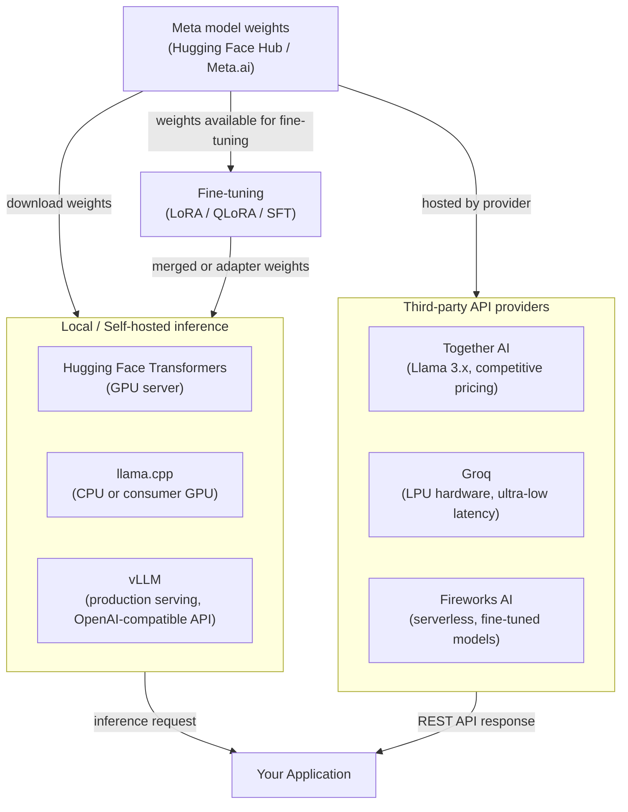

# Meta Llama

## Définition

Llama (Large Language Model Meta AI) de Meta est une famille de grands modèles de langage à poids ouverts publiée par Meta AI Research. Contrairement aux modèles entièrement propriétaires distribués uniquement via une API payante, les modèles Llama sont publiés avec des poids que les développeurs peuvent télécharger, inspecter, modifier et redistribuer sous la licence communautaire personnalisée de Meta. Cela signifie que les organisations peuvent exécuter l'inférence entièrement au sein de leur propre infrastructure, sans acheminer les données via un service cloud tiers — un avantage significatif pour les charges de travail sensibles à la confidentialité. La série a commencé en 2023 avec Llama 1 et Llama 2, et a atteint une étape majeure avec la génération **Llama 3**.

La **famille Llama 3** couvre de multiples tailles et spécialisations. La version de base de Llama 3 incluait des variantes instruct et de base à 8B et 70B paramètres. Les versions ultérieures ont introduit **Llama 3.1** (avec 405B paramètres, une fenêtre de contexte étendue à 128k et des améliorations multilingues), **Llama 3.2** (modèles légers de 1B et 3B pour une utilisation sur appareil, plus des variantes vision multimodale de 11B et 90B) et **Llama 3.3** (un modèle 70B avec des performances multilingues et de raisonnement significativement améliorées). Ensemble, ceux-ci couvrent un large spectre allant du déploiement edge aux performances near-frontier.

L'espace des modèles à poids ouverts se situe à l'intersection d'un débat philosophique et pratique : **ouvert vs fermé**. Les partisans des poids ouverts soutiennent que la transparence, l'auditabilité, l'innovation communautaire et le contrôle des coûts l'emportent sur la commodité d'une API gérée. Les critiques soulignent que les grands modèles à poids ouverts sont coûteux à servir à grande échelle, nécessitent une expertise en ingénierie pour déployer et sécuriser, et que "poids ouverts" n'est pas la même chose qu'"open source" — les données d'entraînement et la méthodologie complète restent propriétaires. En pratique, la plupart des organisations finissent dans une approche hybride : utilisant des modèles à poids ouverts pour les charges de travail sensibles ou coûteuses tout en s'appuyant encore sur des fournisseurs d'API fermés pour les capacités de pointe.

## Comment ça fonctionne

### Déploiement local — transformers, llama.cpp, vLLM

La façon la plus directe d'exécuter les modèles Llama est en local en utilisant Hugging Face **Transformers**, qui fournit une interface Python unifiée sur des centaines d'architectures de modèles. Pour les modèles plus petits (7B–13B) sur du matériel grand public, **llama.cpp** est la référence : c'est un moteur d'inférence pur C/C++ avec support de quantification GGUF qui peut exécuter Llama 3 8B en quantification 4 bits sur un CPU de laptop ou un GPU modeste avec une latence acceptable. Pour un service en production à grande échelle, **vLLM** est la solution recommandée — il implémente PagedAttention pour une gestion efficace du cache KV, permet le batching continu et expose une API REST compatible OpenAI, facilitant le remplacement de Llama pour toute intégration GPT-4 avec des modifications de code minimales. Chaque option occupe un point différent sur la courbe de compromis latence/débit/matériel.

### Fournisseurs API tiers — Together AI, Groq, Fireworks AI

Pour les équipes qui souhaitent la flexibilité des modèles à poids ouverts sans la charge d'infrastructure, plusieurs fournisseurs spécialisés hébergent les modèles Llama via des API gérées. **Together AI** propose des modèles Llama 3.x avec une tarification par token compétitive et un SDK Python qui reproduit l'interface OpenAI. **Groq** exécute des modèles Llama sur du matériel LPU (Language Processing Unit) personnalisé, offrant une latence extrêmement basse (souvent en millisecondes à un chiffre par token) adaptée aux applications interactives. **Fireworks AI** se concentre sur les déploiements de modèles fine-tunés et serverless avec un fort accent sur l'expérience développeur. Ces fournisseurs sont particulièrement utiles pour le travail de preuve de concept, les charges de travail en rafale ou les équipes sans infrastructure GPU.

### Fine-tuning des poids ouverts

L'un des avantages les plus convaincants des modèles à poids ouverts est l'accès complet au fine-tuning. Les organisations peuvent adapter Llama aux tâches spécifiques au domaine, aux exigences de style ou aux profils de sécurité en utilisant le fine-tuning supervisé (SFT) et l'apprentissage par renforcement à partir des retours humains (RLHF). En pratique, la plupart des praticiens utilisent le fine-tuning à efficacité paramétrique via **LoRA** (Low-Rank Adaptation) ou **QLoRA** (LoRA sur poids quantifiés), ce qui réduit les besoins en mémoire GPU de 4 à 10x. Les poids de l'adaptateur fine-tuné sont minuscules comparés au modèle de base et peuvent être fusionnés ou chargés séparément. Des outils comme **Hugging Face TRL**, **Axolotl** et **LLaMA-Factory** fournissent des boucles d'entraînement de haut niveau pour le fine-tuning de Llama avec un minimum de boilerplate.



## Quand utiliser / Quand NE PAS utiliser

| Utiliser quand | Éviter quand |
|----------|------------|
| La confidentialité des données est primordiale — secteurs réglementés, données personnelles, propriété intellectuelle confidentielle ne pouvant pas quitter votre infrastructure | Vous avez besoin de capacités frontier de pointe (GPT-4o / Claude 3.5 surpassent encore Llama 3 sur de nombreux benchmarks de raisonnement complexe) |
| Contrôle des coûts à fort volume — les coûts d'API par token s'accumulent rapidement ; l'auto-hébergement de grands modèles peut être significativement moins cher au-delà de certains seuils QPS | Vous manquez de la capacité d'ingénierie ML pour gérer l'infrastructure GPU, maintenir les modèles à jour et gérer les correctifs de sécurité |
| Vous devez fine-tuner le modèle sur des données propriétaires pour personnaliser profondément le comportement ou le style | Vous avez besoin d'une API gérée prête pour la production avec des SLA, une mise à l'échelle automatique et zéro surcharge opérationnelle aujourd'hui |
| Vous souhaitez une auditabilité complète et la capacité d'inspecter les poids du modèle pour la conformité ou le red-teaming | Votre charge de travail nécessite un ancrage web en temps réel ou un multimodal vidéo/audio natif (Llama 3.2 ajoute la vision mais n'est pas au niveau de Gemini 1.5) |
| Vous voulez exécuter l'inférence sur appareil sans dépendance réseau (Llama 3.2 1B/3B, llama.cpp) | Votre équipe évalue les modèles rapidement et la vitesse d'itération compte plus que le contrôle des données |

## Comparaisons

| Critère | Meta Llama 3.x | OpenAI GPT-4o | Mistral (poids ouverts) |
|-----------|---------------|--------------|------------------------|
| Disponibilité des poids | Téléchargement des poids ouverts (licence communautaire) | API fermée uniquement | Poids ouverts pour 7B / Mixtral ; fermé pour Mistral Large |
| Taille maximale du modèle | 405B (Llama 3.1) | Non divulguée | ~141B effectifs (Mixtral 8x22B) |
| Auto-hébergement | Entièrement pris en charge ; llama.cpp, vLLM, Transformers | Impossible | Entièrement pris en charge ; même toolchain que Llama |
| Options API gérées | Together AI, Groq, Fireworks, AWS Bedrock, Azure AI | OpenAI direct, Azure OpenAI | La Plateforme (mistral.ai), Together AI |
| Fine-tuning | Oui — LoRA, QLoRA, SFT sur les poids complets | API de fine-tuning pour GPT-3.5/4o-mini uniquement | Oui — même toolchain à poids ouverts |
| Multimodal | Llama 3.2 (vision 11B/90B) | GPT-4o (texte + image, audio nativement) | Texte uniquement pour les modèles ouverts ; Pixtral via API |
| Souveraineté des données européenne | Possible avec auto-hébergement en région UE | Limité (régions Azure UE uniquement) | Fournisseur natif UE (siège à Paris) |

## Exemples de code

```python
# meta_llama_examples.py
# Demonstrates two deployment paths:
#   1. Local inference with Hugging Face Transformers
#   2. Third-party API via Together AI (OpenAI-compatible interface)
#
# pip install transformers accelerate torch together

# ─────────────────────────────────────────────────────────────────────────────
# Path 1: Local inference with Hugging Face Transformers
# Requires a GPU with enough VRAM (e.g. RTX 3090 for 8B in bfloat16,
# or use load_in_4bit=True with bitsandbytes for lower VRAM).
# ─────────────────────────────────────────────────────────────────────────────
from transformers import AutoTokenizer, AutoModelForCausalLM
import torch


def local_llama_inference(prompt: str, model_id: str = "meta-llama/Meta-Llama-3.1-8B-Instruct"):
    """
    Run Llama 3.1 8B Instruct locally.
    Requires a Hugging Face token with access granted at meta-llama/Meta-Llama-3.1-8B-Instruct.
    Set HF_TOKEN environment variable or pass token= to from_pretrained.
    """
    tokenizer = AutoTokenizer.from_pretrained(model_id)
    model = AutoModelForCausalLM.from_pretrained(
        model_id,
        torch_dtype=torch.bfloat16,
        device_map="auto",          # automatically distribute across available GPUs
        # load_in_4bit=True,        # uncomment for QLoRA / low VRAM inference
    )

    # Llama 3 instruct models use a chat template
    messages = [
        {"role": "system", "content": "You are a helpful data science assistant."},
        {"role": "user", "content": prompt},
    ]
    input_ids = tokenizer.apply_chat_template(
        messages,
        add_generation_prompt=True,
        return_tensors="pt",
    ).to(model.device)

    outputs = model.generate(
        input_ids,
        max_new_tokens=512,
        temperature=0.6,
        top_p=0.9,
        do_sample=True,
        eos_token_id=tokenizer.eos_token_id,
    )

    # Decode only the generated tokens (skip the input)
    generated = outputs[0][input_ids.shape[-1]:]
    return tokenizer.decode(generated, skip_special_tokens=True)


# ─────────────────────────────────────────────────────────────────────────────
# Path 2: Together AI — managed Llama API (OpenAI-compatible)
# Requires a Together AI account: https://api.together.ai
# pip install together
# ─────────────────────────────────────────────────────────────────────────────
from together import Together


def together_ai_inference(prompt: str):
    """
    Call Llama 3.1 405B via Together AI's managed inference API.
    Together AI uses an OpenAI-compatible interface, so the openai SDK
    also works — just point base_url at https://api.together.xyz/v1.
    """
    client = Together(api_key="YOUR_TOGETHER_API_KEY")

    response = client.chat.completions.create(
        model="meta-llama/Meta-Llama-3.1-405B-Instruct-Turbo",
        messages=[
            {"role": "system", "content": "You are a helpful data science assistant."},
            {"role": "user", "content": prompt},
        ],
        max_tokens=512,
        temperature=0.6,
        top_p=0.9,
    )

    return response.choices[0].message.content


# ─────────────────────────────────────────────────────────────────────────────
# Path 3: vLLM — production-grade OpenAI-compatible server (run separately)
# Start server: vllm serve meta-llama/Meta-Llama-3.1-8B-Instruct --port 8000
# Then query it as if it were the OpenAI API:
# ─────────────────────────────────────────────────────────────────────────────
from openai import OpenAI


def vllm_server_inference(prompt: str, base_url: str = "http://localhost:8000/v1"):
    """
    Query a locally running vLLM server.
    vLLM exposes an OpenAI-compatible API at /v1/chat/completions.
    """
    client = OpenAI(api_key="not-needed-for-local", base_url=base_url)

    response = client.chat.completions.create(
        model="meta-llama/Meta-Llama-3.1-8B-Instruct",
        messages=[{"role": "user", "content": prompt}],
        max_tokens=256,
        temperature=0.7,
    )
    return response.choices[0].message.content


# ─────────────────────────────────────────────────────────────────────────────
if __name__ == "__main__":
    test_prompt = "Explain the bias-variance tradeoff in machine learning."

    # Uncomment to run local inference (requires GPU + HF access)
    # print("=== Local (Transformers) ===")
    # print(local_llama_inference(test_prompt))

    print("=== Together AI ===")
    print(together_ai_inference(test_prompt))

    # Uncomment if you have a vLLM server running
    # print("=== vLLM Server ===")
    # print(vllm_server_inference(test_prompt))
```

## Ressources pratiques

- [Dépôt GitHub Llama (Meta)](https://github.com/meta-llama/llama-models) — Fiches de modèles officielles, instructions de téléchargement et licence communautaire pour toute la famille Llama 3.
- [Llama 3 sur Hugging Face](https://huggingface.co/meta-llama) — Poids des modèles, fichiers de tokenizer et fine-tunes communautaires ; nécessite un compte Hugging Face avec accès accordé.
- [llama.cpp](https://github.com/ggerganov/llama.cpp) — Moteur d'inférence léger C/C++ avec quantification GGUF ; l'outil de référence pour le déploiement sur CPU et GPU grand public.
- [Documentation Together AI](https://docs.together.ai/) — Référence API Llama gérée, tarification et guides de fine-tuning pour les modèles à poids ouverts hébergés.
- [Documentation vLLM](https://docs.vllm.ai/) — Framework de service en production avec PagedAttention, batching continu et serveur compatible OpenAI.

## Voir aussi

- [Fournisseurs de modèles](/docs/model-providers)
- [Inférence locale](/docs/local-inference)
- [Infrastructure](/docs/infrastructure)
- [LLMs — Fine-tuning](/docs/llms/fine-tuning)
- [Comparaison Meta Llama → Mistral](/docs/model-providers/mistral)
