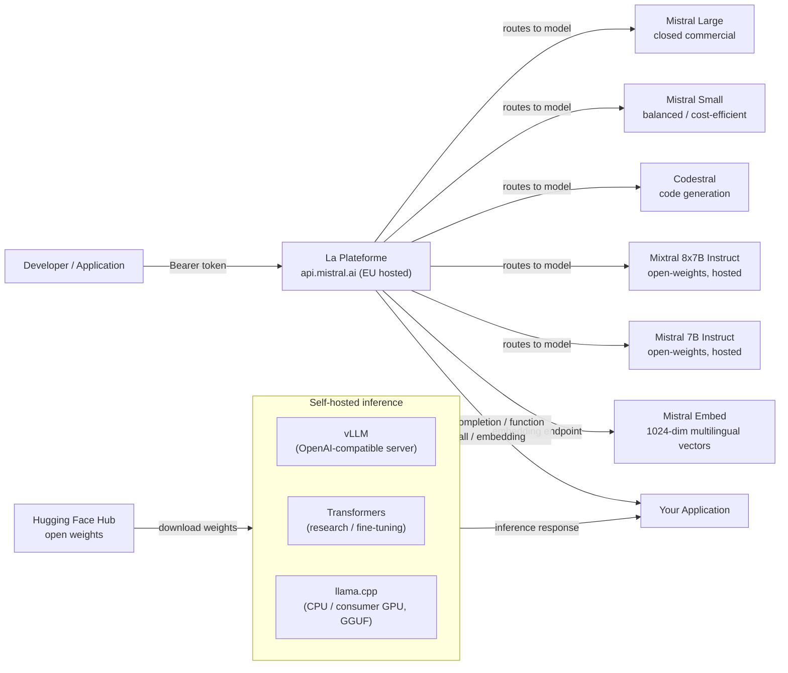

# Mistral AI

## Définition

Mistral AI est une startup française d'IA fondée en 2023 qui s'est rapidement imposée comme l'un des acteurs les plus influents de l'écosystème européen de l'IA. La philosophie définissante de l'entreprise est une **double approche** : publier des modèles à poids ouverts efficaces pour la communauté de recherche et l'écosystème développeur, tout en proposant simultanément une plateforme API commerciale (**La Plateforme**) avec des modèles premium et des fonctionnalités d'entreprise. Cette combinaison a rendu Mistral particulièrement populaire auprès des développeurs qui souhaitent expérimenter librement avant de s'engager dans un déploiement payant, et auprès des entreprises européennes cherchant un fournisseur d'IA souverain avec une infrastructure conforme au RGPD hébergée dans des centres de données UE.

Les publications à poids ouverts de Mistral ont été notamment efficaces pour leur nombre de paramètres. **Mistral 7B**, publié en septembre 2023, a surpassé Llama 2 13B sur la plupart des benchmarks malgré sa taille presque deux fois inférieure — principalement en utilisant la Grouped-Query Attention (GQA) pour une inférence rapide et une fenêtre de contexte de 32k inhabituelle à cette échelle. **Mixtral 8x7B** a introduit une architecture Mixture of Experts (MoE) avec huit réseaux feed-forward experts par couche, activant seulement deux par token. Cela donne à Mixtral le nombre effectif de paramètres actifs de 13B lors de l'inférence tout en ayant 47B paramètres au total — offrant une qualité proche d'un modèle 70B à un coût computationnel inférieur. Les versions suivantes ont étendu la gamme commerciale avec **Mistral Small**, **Mistral Medium** et **Mistral Large**, ce dernier rivalisant avec les modèles de classe GPT-4 sur les tâches de raisonnement et de codage complexes.

Les forces de Mistral se concentrent autour de l'efficacité, des performances multilingues (notamment dans les langues européennes — français, espagnol, allemand, italien) et d'une API conviviale pour les développeurs qui suit de près l'interface OpenAI. L'entreprise est également notable dans le paysage de la gouvernance de l'IA pour sa participation active aux discussions sur l'AI Act de l'UE et son positionnement comme alternative européenne responsable aux API des laboratoires frontier américains.

## Comment ça fonctionne

### API La Plateforme

La Plateforme (`api.mistral.ai`) est l'API d'inférence gérée de Mistral, construite autour de l'interface de chat completions OpenAI. Les requêtes sont structurées sous la forme `{"model": "...", "messages": [...]}` — toute bibliothèque cliente construite pour l'API OpenAI peut être redirigée avec un simple changement de `base_url`. L'API sert à la fois les modèles commerciaux propriétaires de Mistral (Mistral Large, Mistral Small, Mistral Medium, Codestral) et les modèles à poids ouverts (Mistral 7B Instruct, Mixtral 8x7B Instruct, Mixtral 8x22B Instruct). L'authentification utilise des tokens Bearer. La Plateforme est hébergée dans des centres de données européens, en faisant un choix naturel pour les organisations ayant des exigences de résidence des données UE. Les limites de taux, la facturation et la gestion des clés API sont accessibles via la console Mistral à `console.mistral.ai`.

### Modèles à poids ouverts — Mistral 7B, Mixtral 8x7B, Mistral Large

Les modèles phares à poids ouverts sont distribués via Hugging Face et peuvent être auto-hébergés en utilisant la toolchain standard Transformers, vLLM ou llama.cpp (format GGUF). **Mistral 7B** est idéal pour les expériences de fine-tuning, le déploiement on-premise et les environnements à ressources limitées. **Mixtral 8x7B** offre une qualité significativement supérieure avec seulement un coût marginalement plus élevé de paramètres actifs et est un choix populaire pour l'auto-hébergement en production. **Mixtral 8x22B** monte encore en puissance pour les tâches nécessitant un raisonnement plus profond. **Mistral Large** est un modèle commercial fermé disponible uniquement via La Plateforme et certains partenaires cloud sélectionnés (Azure AI, AWS Bedrock, Google Cloud). Les modèles à poids ouverts utilisent un mécanisme d'attention à fenêtre glissante avec une fenêtre de contexte de 32k, une tokenisation BPE avec un vocabulaire de 32k et un tokenizer basé sur sentencepiece compatible avec le SDK officiel mistralai Python.

### Appel de fonctions

Mistral prend en charge l'appel de fonctions structuré (également appelé utilisation d'outils) sur les modèles instruct à poids ouverts et tous les modèles La Plateforme. L'interface reproduit le paramètre `tools` d'OpenAI : vous passez une liste de définitions d'outils en JSON Schema, le modèle renvoie un tableau `tool_calls` spécifiant quelle fonction invoquer et avec quels arguments, votre application exécute la fonction et le résultat est renvoyé comme message de rôle `tool` pour continuer la conversation. L'appel de fonctions de Mistral est particulièrement utile pour construire des workflows agentiques, des pipelines d'extraction de données et des couches d'orchestration API sans surcharge supplémentaire d'ingénierie des prompts.

### Embeddings

La Plateforme fournit un endpoint d'embedding de texte (`/v1/embeddings`) soutenu par Mistral Embed, un modèle d'embedding dédié produisant des vecteurs denses de 1024 dimensions. Le modèle d'embedding excelle dans les tâches de similarité sémantique, de récupération et de classification dans plusieurs langues européennes. L'interface est identique à l'API d'embeddings OpenAI : passez une chaîne ou une liste de chaînes, recevez des vecteurs à virgule flottante. Mistral Embed est l'un des endpoints d'embedding les plus économiques disponibles, le rendant bien adapté à l'indexation de documents à grande échelle dans des pipelines RAG multilingues.



## Quand utiliser / Quand NE PAS utiliser

| Utiliser quand | Éviter quand |
|----------|------------|
| Vous avez besoin de la résidence des données UE et d'une infrastructure IA conforme au RGPD | Vous avez besoin d'une entrée image/vidéo/audio multimodale native (Mistral est uniquement texte, sauf Pixtral qui est API uniquement et en phase précoce) |
| Vous souhaitez une API compatible OpenAI avec un coût de migration minimal depuis les intégrations GPT existantes | Vous avez besoin des capacités absolument les plus élevées sur le raisonnement complexe multi-étapes — Mistral Large est en retrait par rapport à GPT-4o et Claude 3.5 Sonnet sur certains benchmarks difficiles |
| L'efficacité est importante — Mixtral 8x7B offre une haute qualité à un coût de calcul actif inférieur par rapport aux modèles denses d'équivalente performance | Vous avez besoin d'un vaste écosystème de fine-tunes tiers et de support communautaire (Meta Llama a une communauté plus grande) |
| Les langues européennes multilingues (français, espagnol, allemand, italien) sont essentielles à votre cas d'usage | Votre charge de travail nécessite un long contexte supérieur à 32k tokens dans les modèles à poids ouverts (Llama 3.1 offre 128k) |
| Vous souhaitez auto-héberger un modèle à poids ouverts et potentiellement le fine-tuner sur des données propriétaires | Vous avez besoin d'une inférence sur appareil / edge avec des modèles de moins d'1B de paramètres (Llama 3.2 1B/3B remplit mieux ce créneau) |

## Comparaisons

| Critère | Mistral AI | Meta Llama 3.x | OpenAI GPT-4o |
|-----------|-----------|---------------|--------------|
| Disponibilité des poids | Ouvert pour 7B, Mixtral 8x7B, 8x22B ; fermé pour Mistral Large | Ouvert pour toutes les tailles (8B à 405B) | API fermée uniquement |
| Localisation du fournisseur API | UE (Paris) ; natif RGPD | Hébergeurs tiers basés aux États-Unis (Together, Groq) | États-Unis (régions Azure UE disponibles) |
| Architecture MoE | Oui (Mixtral 8x7B, 8x22B) | Non (transformeur dense) | Non divulguée |
| Appel de fonctions | Utilisation complète des outils sur tous les modèles instruct/API | Oui (Llama 3.x) | Oui (mature, le plus documenté) |
| Multilingue (langues UE) | Fort — objectif de conception principal | Bon mais accent d'entraînement centré sur les États-Unis | Fort dans toutes les langues principales |
| Support de fine-tuning | Poids ouverts : LoRA/QLoRA ; fine-tuning API bêta | Poids ouverts : fine-tuning complet disponible | API de fine-tuning pour les modèles plus petits uniquement |
| API d'embedding | Mistral Embed (1024-dim, multilingue) | Non disponible via Meta directement | text-embedding-3-small/large |
| Fenêtre de contexte (modèles ouverts) | 32k tokens | 128k tokens (Llama 3.1+) | 128k tokens |

## Avantages et inconvénients

| Avantages | Inconvénients |
|------|------|
| Excellent rapport efficacité/qualité, notamment Mixtral 8x7B vs modèles denses de qualité similaire | Fenêtre de contexte des poids ouverts (32k) plus courte que les 128k de Llama 3.1 |
| API hébergée en UE avec un fort positionnement RGPD ; attire les clients entreprise européens | Écosystème communautaire plus petit et moins de fine-tunes communautaires comparé à Llama |
| Interface compatible OpenAI minimise l'effort de migration | Pas de capacité multimodale native dans les modèles à poids ouverts prêts pour la production |
| Publications à poids ouverts genuinement utiles qui dépassent leur classe | Mistral Large reste en retrait par rapport aux modèles de premier rang d'OpenAI et Anthropic sur les benchmarks les plus difficiles |

## Exemples de code

```python
# mistral_examples.py
# Demonstrates chat completion and function calling with the mistralai Python SDK.
# pip install mistralai

from mistralai import Mistral
import json

# ── Configuration ─────────────────────────────────────────────────────────────
# Get your API key at: https://console.mistral.ai/api-keys
client = Mistral(api_key="YOUR_MISTRAL_API_KEY")


# ── 1. Chat completion ─────────────────────────────────────────────────────────
def chat_completion_example():
    """Standard multi-turn chat with Mistral Large."""
    response = client.chat.complete(
        model="mistral-large-latest",
        messages=[
            {
                "role": "system",
                "content": (
                    "You are a senior machine learning engineer. "
                    "Provide concise, technically accurate answers."
                ),
            },
            {
                "role": "user",
                "content": "What are the key differences between MoE and dense transformer architectures?",
            },
        ],
        temperature=0.4,
        max_tokens=512,
    )

    print("=== Chat Completion ===")
    print(response.choices[0].message.content)
    print(f"\nModel : {response.model}")
    print(f"Usage : {response.usage}")


# ── 2. Function calling ────────────────────────────────────────────────────────
def function_calling_example():
    """
    Mistral function calling (tool use).
    The model decides which tool to call and with what arguments.
    Your application executes the function and returns the result.
    """
    # Define available tools with JSON Schema
    tools = [
        {
            "type": "function",
            "function": {
                "name": "get_model_benchmark",
                "description": (
                    "Retrieves benchmark scores for a specified language model "
                    "on a given benchmark suite."
                ),
                "parameters": {
                    "type": "object",
                    "properties": {
                        "model_name": {
                            "type": "string",
                            "description": "The name of the model, e.g. 'mixtral-8x7b'",
                        },
                        "benchmark": {
                            "type": "string",
                            "enum": ["MMLU", "HumanEval", "GSM8K", "HellaSwag"],
                            "description": "The benchmark suite to query.",
                        },
                    },
                    "required": ["model_name", "benchmark"],
                },
            },
        }
    ]

    # First turn — model decides to call a tool
    messages = [
        {
            "role": "user",
            "content": "What is Mixtral 8x7B's score on the MMLU benchmark?",
        }
    ]

    response = client.chat.complete(
        model="mistral-large-latest",
        messages=messages,
        tools=tools,
        tool_choice="auto",
    )

    assistant_message = response.choices[0].message
    print("=== Function Calling — Step 1: model requests tool call ===")
    print(f"Tool calls: {assistant_message.tool_calls}")

    # Simulate executing the tool
    if assistant_message.tool_calls:
        tool_call = assistant_message.tool_calls[0]
        function_args = json.loads(tool_call.function.arguments)
        print(f"\nExecuting: {tool_call.function.name}({function_args})")

        # Simulated function result
        tool_result = {
            "model": function_args["model_name"],
            "benchmark": function_args["benchmark"],
            "score": 70.6,
            "source": "Open LLM Leaderboard (Hugging Face)",
        }

        # Second turn — return the tool result and get the final response
        messages.append({"role": "assistant", "content": None, "tool_calls": assistant_message.tool_calls})
        messages.append({
            "role": "tool",
            "tool_call_id": tool_call.id,
            "content": json.dumps(tool_result),
        })

        final_response = client.chat.complete(
            model="mistral-large-latest",
            messages=messages,
            tools=tools,
        )

        print("\n=== Function Calling — Step 2: final answer ===")
        print(final_response.choices[0].message.content)


# ── 3. Embeddings ──────────────────────────────────────────────────────────────
def embeddings_example(texts: list[str]):
    """
    Generate multilingual embeddings with Mistral Embed.
    Returns 1024-dimensional dense vectors suitable for semantic search and RAG.
    """
    response = client.embeddings.create(
        model="mistral-embed",
        inputs=texts,
    )

    print("\n=== Embeddings ===")
    for i, embedding_obj in enumerate(response.data):
        vec = embedding_obj.embedding
        print(f"Text    : {texts[i][:60]}...")
        print(f"Dims    : {len(vec)}")
        print(f"First 5 : {vec[:5]}\n")


# ── Entry point ────────────────────────────────────────────────────────────────
if __name__ == "__main__":
    chat_completion_example()
    function_calling_example()
    embeddings_example([
        "L'intelligence artificielle transforme l'industrie.",
        "Machine learning models require careful evaluation.",
        "Die Verarbeitung natürlicher Sprache verbessert sich rasant.",
    ])
```

## Ressources pratiques

- [Documentation Mistral AI](https://docs.mistral.ai/) — Référence API complète couvrant le chat, les embeddings, l'appel de fonctions, le fine-tuning et tous les modèles disponibles.
- [Console La Plateforme](https://console.mistral.ai/) — Gestion des clés API, tableaux de bord d'utilisation et playground de modèles pour des tests interactifs.
- [Modèles Mistral sur Hugging Face](https://huggingface.co/mistralai) — Poids officiels des modèles pour Mistral 7B, Mixtral 8x7B et Mixtral 8x22B avec instructions de téléchargement et fiches de modèles.
- [SDK Python mistralai sur PyPI](https://pypi.org/project/mistralai/) — Source du SDK, journal des modifications et exemples de code pour toutes les fonctionnalités de l'API.

## Voir aussi

- [Fournisseurs de modèles](/docs/model-providers)
- [Meta Llama](/docs/model-providers/meta-llama)
- [Inférence locale](/docs/local-inference)
- [RAG — Embeddings](/docs/rag/embeddings)
