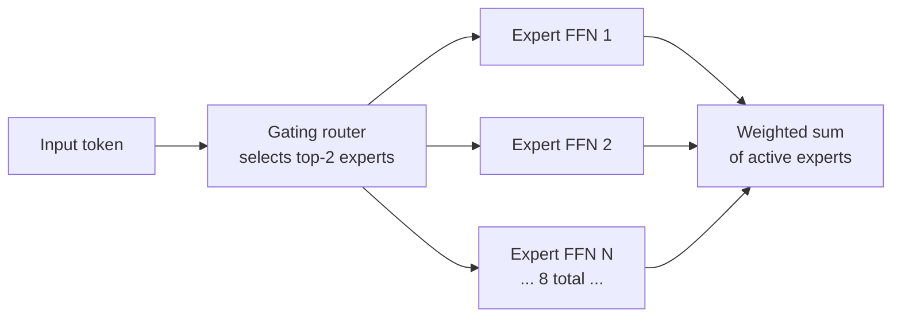

# Mistral AI

## Définition

**Mistral AI** est une entreprise d'IA française fondée en 2023 qui propose à la fois des modèles à poids ouverts et une plateforme API commerciale. La stratégie distincte de Mistral consiste à publier des modèles open-weights de haute qualité (permettant l'auto-hébergement et le fine-tuning) tout en proposant une API commerciale pour les déploiements d'entreprise. Cette dualité leur permet de s'adresser aux développeurs qui souhaitent un contrôle total, aux entreprises qui ont besoin de services gérés, et aux équipes de recherche qui veulent s'appuyer sur des modèles de base ouverts.

La famille de modèles de Mistral comprend : **Mistral 7B** (leur modèle de référence initial qui surpasse Llama 2 13B tout en étant plus petit), **Mixtral 8x7B** (un modèle Mixture-of-Experts open-weights qui atteint des performances équivalentes à GPT-3.5 tout en n'activant que 2 experts sur 8 à l'inférence, réduisant considérablement la charge de calcul), **Mistral Small** et **Mistral Large** (modèles API commerciaux optimisés pour différents points de tarification), **Codestral** (spécialisé dans la génération de code), **Mistral Embed** (modèles d'embeddings), et **Mistral NeMo** (un modèle 12B développé en collaboration avec NVIDIA). Mistral se distingue par ses fortes performances multilingues, particulièrement en français, espagnol, allemand et italien, reflétant son origine européenne.

## Comment ça fonctionne

### L'architecture Mixture of Experts (MoE)

Mixtral 8x7B présente l'architecture MoE de Mistral, qui est fondamentale pour comprendre pourquoi les modèles Mistral sont efficaces :



Dans une architecture transformer standard, chaque token passe par la même couche Feed-Forward Network (FFN). MoE remplace la FFN par N "experts" (réseaux plus petits) et un routeur appris qui sélectionne les K meilleurs experts pour chaque token. Avec 8 experts et K=2, Mixtral 8x7B a ~47B de paramètres au total mais n'utilise que ~13B à l'inférence — offrant une qualité proche de celle d'un modèle 40B avec la vitesse d'un modèle 13B.

### API La Plateforme

L'API commerciale de Mistral (La Plateforme) expose les modèles Mistral via un format compatible OpenAI, simplifiant la migration depuis OpenAI. Elle prend en charge les complétions de chat, les embeddings, le mode JSON et les appels de fonctions. Le fine-tuning est disponible pour Mistral Small et d'autres modèles.

### Modèles open-weights

Les modèles open-weights de Mistral (Mistral 7B, Mixtral 8x7B, Mistral NeMo) sont publiés sur Hugging Face sous des licences Apache 2.0, permettant une utilisation commerciale sans restrictions de redistribution. Ils peuvent être exécutés localement via Ollama, llama.cpp ou vLLM.

## Quand utiliser / Quand NE PAS utiliser

| Utiliser Mistral quand | Éviter ou considérer des alternatives quand |
|------------------------|---------------------------------------------|
| Les performances multilingues sont importantes, en particulier pour les langues européennes | Vous avez besoin de multimodalité (vision, audio) — Mistral se concentre sur le texte |
| Vous voulez des poids ouverts mais avez besoin d'un support de qualité commerciale | Vous avez besoin de fenêtres de contexte très longues — les fenêtres de contexte de Mistral (8K–128K selon le modèle) peuvent être plus courtes que Gemini ou Claude |
| L'efficacité est critique — Mixtral est l'un des meilleurs modèles par watt/dollar | Les tâches de raisonnement complexes nécessitent les dernières capacités de pointe |
| Résidence des données en Europe requise — Mistral propose des options d'hébergement EU | Vous avez besoin d'un écosystème large avec beaucoup d'intégrations tierces |
| Déploiement edge nécessite des petits modèles efficaces | — |

## Comparaisons

| Critères | Mistral Large 2 | GPT-4o | Claude 3.7 Sonnet | Llama 3.1 70B |
|----------|-----------------|--------|-------------------|---------------|
| Disponibilité des poids | Certains modèles (7B, Mixtral) | Non | Non | Oui |
| Fenêtre de contexte | 128K | 128K | 200K | 128K |
| Multilingue | Excellent (focus européen) | Bon | Bon | Bon |
| Prix API (modèle principal) | ~$2/1M tokens | ~$2.5/1M tokens | ~$3/1M tokens | ~$0.9/1M tokens (hébergé) |
| Architecture | Dense + MoE | Dense | Dense | Dense |
| Code | Codestral spécialisé | Fort | Fort | Code Llama |

## Exemples de code

### API Mistral via La Plateforme

```python
# Mistral API via La Plateforme
# pip install mistralai

import os
from mistralai import Mistral

client = Mistral(api_key=os.environ["MISTRAL_API_KEY"])

# Basic chat completion
response = client.chat.complete(
    model="mistral-large-latest",
    messages=[
        {"role": "system", "content": "You are a helpful assistant."},
        {"role": "user", "content": "Explain the Mixture of Experts architecture in 3 sentences."},
    ],
    temperature=0.3,
    max_tokens=256,
)
print(response.choices[0].message.content)
```

### Mode JSON avec Mistral

```python
# JSON mode with Mistral API
# pip install mistralai

import os, json
from mistralai import Mistral

client = Mistral(api_key=os.environ["MISTRAL_API_KEY"])

response = client.chat.complete(
    model="mistral-small-latest",
    messages=[
        {
            "role": "user",
            "content": (
                "Extract the following from this text as JSON with keys "
                "'company', 'founded', 'country': "
                "Mistral AI was founded in 2023 in Paris, France."
            ),
        }
    ],
    response_format={"type": "json_object"},
    temperature=0,
)

data = json.loads(response.choices[0].message.content)
print(data)
```

### Mistral open-weights avec Ollama

```python
# Mistral open-weights via Ollama
# Install Ollama from https://ollama.com, then: ollama pull mistral

import requests

def chat_mistral(prompt: str) -> str:
    response = requests.post(
        "http://localhost:11434/api/generate",
        json={"model": "mistral", "prompt": prompt, "stream": False},
    )
    return response.json()["response"]

if __name__ == "__main__":
    answer = chat_mistral("What are the main differences between MoE and dense transformer models?")
    print(answer)
```

### Appel de fonctions avec Mistral

```python
# Function calling with Mistral
# pip install mistralai

import os, json
from mistralai import Mistral
from mistralai.models import UserMessage, ToolMessage

client = Mistral(api_key=os.environ["MISTRAL_API_KEY"])

tools = [
    {
        "type": "function",
        "function": {
            "name": "get_exchange_rate",
            "description": "Get the current exchange rate between two currencies",
            "parameters": {
                "type": "object",
                "properties": {
                    "from_currency": {"type": "string", "description": "Source currency code"},
                    "to_currency": {"type": "string", "description": "Target currency code"},
                },
                "required": ["from_currency", "to_currency"],
            },
        },
    }
]

messages = [{"role": "user", "content": "What is the EUR to USD exchange rate?"}]

# First call
response = client.chat.complete(
    model="mistral-large-latest",
    messages=messages,
    tools=tools,
    tool_choice="auto",
)

msg = response.choices[0].message
messages.append(msg)

# Execute tool and add result
if msg.tool_calls:
    for tc in msg.tool_calls:
        # Simulated result
        result = {"from": "EUR", "to": "USD", "rate": 1.08}
        messages.append(
            ToolMessage(tool_call_id=tc.id, content=json.dumps(result))
        )

# Final answer
final = client.chat.complete(model="mistral-large-latest", messages=messages)
print(final.choices[0].message.content)
```

## Ressources pratiques

- [Documentation Mistral AI](https://docs.mistral.ai/) — Documentation complète des API incluant endpoints, paramètres et guides de fine-tuning
- [Mistral sur Hugging Face](https://huggingface.co/mistralai) — Poids open-weights, cartes de modèle et contributions de la communauté
- [SDK Python Mistral](https://github.com/mistralai/client-python) — Client officiel avec exemples de streaming, appels de fonctions et mode JSON
- [Tarification Mistral](https://mistral.ai/technology/#pricing) — Tarification par token pour tous les modèles API incluant Mistral Small, Large et Codestral

## Voir aussi

- [Fournisseurs de modèles](/docs/model-providers)
- [Meta Llama](/docs/model-providers/meta-llama)
- [OpenAI](/docs/model-providers/openai)
- [Ingénierie des prompts](/docs/prompt-engineering)
- [Ajustement fin](/docs/fine-tuning)
- [MLOps](/docs/mlops)
