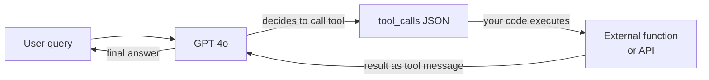

# OpenAI

## Définition

**OpenAI** est une entreprise de recherche en IA et une plateforme développeur dont le siège est à San Francisco. Fondée en 2015 et largement connue pour avoir lancé ChatGPT fin 2022, OpenAI exploite l'une des API de modèles les plus largement utilisées du secteur. La plateforme donne aux développeurs un accès programmatique à une famille de modèles couvrant le langage, la vision, l'audio et la génération d'images — en faisant un guichet unique pour la plupart des cas d'usage de l'IA générative.

La gamme de modèles OpenAI en 2025 comprend : **GPT-4o** (modèle multimodal phare gérant texte, images et audio dans un seul modèle), **GPT-4o-mini** (variante optimisée pour les coûts pour les tâches à fort volume), la **série o** de modèles de raisonnement — **o1**, **o1-mini**, **o3** et **o3-mini** — qui utilisent un raisonnement étendu en chaîne de pensée pour les mathématiques, le codage et l'analyse complexe, **DALL-E 3** pour la génération d'images à partir de texte, **Whisper** pour la transcription parole-texte et **TTS** (text-to-speech) pour la synthèse audio. Les modèles d'embeddings (text-embedding-3-small et text-embedding-3-large) alimentent la recherche sémantique et les pipelines RAG.

Du point de vue de la plateforme, OpenAI propose une API à plusieurs niveaux avec une tarification basée sur l'utilisation, un Playground pour les tests interactifs, une API Batch pour l'inférence en masse asynchrone avec une réduction de coût de 50%, le fine-tuning pour GPT-4o-mini et GPT-3.5-turbo, une API Assistants pour des interactions de type agent avec état, et un framework Evals pour l'évaluation systématique des modèles. Le SDK Python (`openai`) et un SDK TypeScript/Node.js sont les principales bibliothèques clientes, et le format d'API est devenu un standard de facto que d'autres fournisseurs (Mistral, Together, Groq) reproduisent partiellement.

## Comment ça fonctionne

### API Chat completions

L'endpoint de chat completions (`POST /v1/chat/completions`) est le cœur de la plateforme OpenAI. Vous envoyez un tableau de messages avec des rôles (`system`, `user`, `assistant`) et recevez une complétion. Le message `system` définit la persona et les contraintes de l'assistant ; les messages `user` portent les entrées utilisateur ; les messages `assistant` représentent les tours précédents du modèle pour une conversation multi-tours. Le streaming est pris en charge via les server-sent events pour que la réponse puisse être affichée token par token. La température et top-p contrôlent l'aléatoire des réponses ; `max_tokens` limite la longueur de la sortie.

```mermaid
flowchart LR
  Client[Client app] -->|POST messages array| ChatAPI[/v1/chat/completions]
  ChatAPI -->|model routing| Selector{Model\nselector}
  Selector -->|standard| GPT4o[GPT-4o]
  Selector -->|reasoning| O3[o3 / o1]
  Selector -->|budget| Mini[GPT-4o-mini]
  GPT4o -->|stream or complete| Resp[JSON response]
  O3 --> Resp
  Mini --> Resp
  Resp --> Client
```

### Appel de fonctions et outils

L'appel de fonctions (également appelé "utilisation d'outils") permet au modèle d'invoquer des outils externes en produisant du JSON structuré au lieu du texte libre. Vous déclarez les schémas d'outils dans la requête ; le modèle décide quand appeler un outil et remplit ses arguments. Votre code exécute la fonction et renvoie le résultat comme message `tool` ; le modèle utilise ensuite ce résultat pour produire sa réponse finale. C'est le fondement de la plupart des frameworks agentiques : le modèle agit comme une couche de raisonnement et de routage tandis que le calcul réel se produit dans votre code.



### API Embeddings

L'endpoint d'embeddings (`POST /v1/embeddings`) convertit le texte en vecteurs numériques denses. Ces vecteurs encodent le sens sémantique : les textes similaires produisent des vecteurs similaires. `text-embedding-3-large` (3072 dimensions) offre la meilleure qualité de récupération ; `text-embedding-3-small` (1536 dimensions) est plus rapide et moins cher. Les embeddings sont l'épine dorsale des pipelines [RAG](/docs/rag) : vous embedez les documents au moment de l'indexation et les requêtes au moment de la recherche, puis récupérez les documents par similarité cosinus.

### APIs Image et Audio

**DALL-E 3** (`POST /v1/images/generations`) génère des images à partir de prompts textuels. Vous spécifiez la taille (1024×1024, 1792×1024 ou 1024×1792), la qualité (standard ou HD) et le style (vif ou naturel). **Whisper** (`POST /v1/audio/transcriptions`) transcrit des fichiers audio avec une haute précision dans plus de 57 langues. **TTS** (`POST /v1/audio/speech`) convertit le texte en parole naturelle avec six voix intégrées. Ces APIs partagent le même modèle d'authentification et de facturation que les APIs texte, facilitant la construction de pipelines multimodaux dans une seule application.

## Quand utiliser / Quand NE PAS utiliser

| Utiliser OpenAI quand | Éviter ou considérer des alternatives quand |
|-----------------|--------------------------------------|
| Vous avez besoin du plus large écosystème : bibliothèques, tutoriels et support communautaire qui utilisent OpenAI par défaut | Votre charge de travail implique des données hautement sensibles ou réglementées que vous ne pouvez pas envoyer à un fournisseur tiers américain |
| Vous souhaitez un support multimodal (texte + image + audio) d'un seul fournisseur | Vous devez fine-tuner en profondeur ou contrôler chaque aspect du modèle — les modèles à poids ouverts offrent plus de flexibilité |
| Vous avez besoin d'un raisonnement avancé sur des mathématiques, du code ou des problèmes logiques (série o1, o3) | Les coûts à grande échelle sont prohibitifs — à de très grands volumes de tokens, l'hébergement de poids ouverts bat souvent la tarification par token |
| Vous construisez des workflows d'appel de fonctions ou agentiques — les sorties structurées et l'appel d'outils d'OpenAI sont matures | Vous avez besoin d'une expérience non-anglophone en premier — Qwen ou Mistral peuvent surpasser sur certaines langues |
| Vous souhaitez l'API Assistants pour des agents avec état et support de fichiers sans construire la couche d'état vous-même | Vous avez besoin de sorties déterministes reproductibles d'une version de modèle figée — OpenAI met à jour les modèles en continu |

## Comparaisons

| Critère | OpenAI | Anthropic | Google Gemini |
|----------|--------|-----------|---------------|
| Modèle phare | GPT-4o | Claude 3.7 Sonnet / Opus | Gemini 2.5 Pro |
| Modèle de raisonnement | o3, o1 | Réflexion étendue (Claude 3.7) | Gemini 2.5 Pro (thinking) |
| Fenêtre de contexte | 128K (GPT-4o), 200K (o1) | 200K | Jusqu'à 1M (Gemini 1.5 Pro) |
| Entrée multimodale | Texte, image, audio, vidéo | Texte, image | Texte, image, audio, vidéo, code |
| Option à poids ouverts | Non | Non | Gemma (partiel) |
| Appel de fonctions / outils | Mature, largement adopté | Solide, avec utilisation d'ordinateur | Mature, écosystème Google |
| Tarification (modèle phare) | ~2,50$/1M tokens d'entrée (GPT-4o) | ~3$/1M tokens d'entrée (Sonnet) | ~1,25$/1M tokens d'entrée (Gemini 1.5 Pro) |
| Approche sécurité | API de modération, politiques d'utilisation | IA constitutionnelle, réglage des refus | Directives d'IA responsable |
| Résidence des données | États-Unis (par défaut), options entreprise | États-Unis (par défaut), options entreprise | Multi-région, Google Cloud |
| Meilleur pour | Plus large écosystème, outillage agentique, raisonnement | Longs docs, sécurité, instruction nuancée | Long contexte, multimodal, utilisateurs Google Cloud |

## Avantages et inconvénients

| Avantages | Inconvénients |
|------|------|
| API standard du secteur adoptée par la plupart des frameworks et bibliothèques | Modèle fermé — pas de visibilité sur les poids ou les données d'entraînement |
| Plus large gamme de modèles : langage, vision, audio, image dans une seule plateforme | Hébergé aux États-Unis par défaut ; la résidence des données est limitée |
| Les modèles de raisonnement o-series excellent en mathématiques, code et logique | La tarification peut être élevée à grande échelle comparée aux modèles open source auto-hébergés |
| Fort écosystème : cookbook, evals, fine-tuning, API Batch | Les versions de modèles changent en continu — le comportement peut évoluer sans préavis |
| Limites de taux fiables et SLA d'entreprise | Pas de véritable offre à poids ouverts |

## Exemples de code

### Complétion de chat avec streaming

```python
from openai import OpenAI

client = OpenAI(api_key="sk-...")  # or set OPENAI_API_KEY env var

# Basic completion
response = client.chat.completions.create(
    model="gpt-4o",
    messages=[
        {"role": "system", "content": "You are a concise technical assistant."},
        {"role": "user", "content": "Explain embeddings in two sentences."},
    ],
    temperature=0.2,
    max_tokens=256,
)
print(response.choices[0].message.content)

# Streaming response
with client.chat.completions.stream(
    model="gpt-4o",
    messages=[{"role": "user", "content": "Write a haiku about APIs."}],
) as stream:
    for text in stream.text_stream:
        print(text, end="", flush=True)
```

### Appel de fonctions

```python
import json
from openai import OpenAI

client = OpenAI()

# Define a tool schema
tools = [
    {
        "type": "function",
        "function": {
            "name": "get_weather",
            "description": "Get the current weather for a city",
            "parameters": {
                "type": "object",
                "properties": {
                    "city": {"type": "string", "description": "City name"},
                    "unit": {"type": "string", "enum": ["celsius", "fahrenheit"]},
                },
                "required": ["city"],
            },
        },
    }
]

messages = [{"role": "user", "content": "What's the weather in Tokyo?"}]

# First call — model may decide to call a tool
response = client.chat.completions.create(
    model="gpt-4o",
    messages=messages,
    tools=tools,
    tool_choice="auto",
)

msg = response.choices[0].message
messages.append(msg)

# If the model called a tool, execute it and return the result
if msg.tool_calls:
    for tc in msg.tool_calls:
        args = json.loads(tc.function.arguments)
        # Simulated function execution
        result = {"city": args["city"], "temp": "18°C", "condition": "Partly cloudy"}
        messages.append({
            "role": "tool",
            "tool_call_id": tc.id,
            "content": json.dumps(result),
        })

# Second call — model uses the tool result to answer
final = client.chat.completions.create(model="gpt-4o", messages=messages)
print(final.choices[0].message.content)
```

### Embeddings pour la recherche sémantique

```python
from openai import OpenAI
import numpy as np

client = OpenAI()

def embed(texts: list[str], model: str = "text-embedding-3-small") -> list[list[float]]:
    response = client.embeddings.create(input=texts, model=model)
    return [item.embedding for item in response.data]

# Index documents
docs = [
    "Python is a high-level programming language.",
    "OpenAI provides a REST API for language models.",
    "RAG combines retrieval with generation.",
]
doc_vectors = embed(docs)

# Query
query = "How do I call OpenAI from Python?"
query_vector = embed([query])[0]

# Cosine similarity
def cosine_sim(a, b):
    a, b = np.array(a), np.array(b)
    return float(np.dot(a, b) / (np.linalg.norm(a) * np.linalg.norm(b)))

scores = [(cosine_sim(query_vector, dv), doc) for dv, doc in zip(doc_vectors, docs)]
scores.sort(reverse=True)
for score, doc in scores:
    print(f"{score:.3f}  {doc}")
```

## Ressources pratiques

- [Référence API OpenAI](https://platform.openai.com/docs/api-reference) — Documentation complète des endpoints avec schémas de requête/réponse
- [Tarification OpenAI](https://openai.com/api/pricing/) — Tarification par token pour tous les modèles incluant les remises par lot
- [OpenAI Cookbook](https://cookbook.openai.com/) — Exemples pratiques couvrant l'appel de fonctions, le RAG, le fine-tuning, les evals et plus
- [Vue d'ensemble des modèles OpenAI](https://platform.openai.com/docs/models) — IDs de modèles, fenêtres de contexte, capacités et calendriers de dépréciation
- [SDK Python OpenAI sur GitHub](https://github.com/openai/openai-python) — Source, journal des modifications et guides de migration

## Voir aussi

- [Fournisseurs de modèles](/docs/model-providers) — Vue d'ensemble et comparaison de tous les fournisseurs
- [Étude de cas : ChatGPT](/docs/case-studies/chatgpt) — Pour un regard plus approfondi sur l'architecture du modèle
- [Anthropic](/docs/model-providers/anthropic) — Famille de modèles Claude, utilisation d'outils, long contexte
- [Ingénierie des prompts](/docs/prompt-engineering) — Techniques applicables à tous les modèles OpenAI
- [Agents](/docs/agents) — Construction de workflows agentiques avec l'appel de fonctions
- [RAG](/docs/rag) — Utilisation des embeddings OpenAI dans la génération augmentée par récupération
