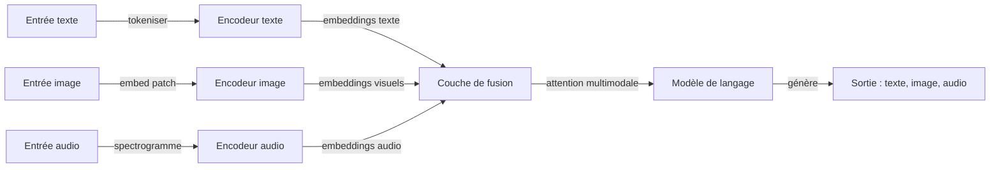

# IA multimodale

## Définition

L'IA multimodale désigne les systèmes capables de traiter, comprendre et générer du contenu à travers plusieurs modalités de données — texte, images, audio, vidéo et plus — au sein d'un seul modèle ou pipeline. Contrairement aux systèmes unimodaux qui ne gèrent qu'un seul type d'entrée, les modèles multimodaux apprennent à aligner les représentations entre modalités, permettant des tâches comme la légende d'image, la réponse à des questions visuelles, la transcription audio et la recherche multimodale.

Le domaine a évolué à travers plusieurs phases. Les approches précoces utilisaient des encodeurs séparés pour chaque modalité avec une couche de fusion par-dessus (par ex. CLIP alignant les embeddings texte et image via l'apprentissage contrastif). Les architectures modernes comme GPT-4V, Gemini et Claude intègrent la compréhension multimodale nativement dans les grands modèles de langage — les images, l'audio et la vidéo sont tokenisés ou projetés dans le même espace de représentation que les tokens texte, permettant au modèle de raisonner sur les modalités dans un seul passage avant.

L'IA multimodale devient de plus en plus importante alors que les applications réelles exigent des interactions plus riches. La compréhension de documents nécessite de traiter texte, tableaux et figures ensemble. Les assistants vocaux combinent la transcription de la parole, la compréhension du langage et la synthèse vocale. Les systèmes autonomes fusionnent les données de caméra, lidar et capteurs. À mesure que les modèles de fondation deviennent nativement multimodaux, la frontière entre « modèle de langage » et « modèle de vision » se dissout en systèmes multimodaux polyvalents.

## Comment ça fonctionne

### Encodage et alignement

Chaque modalité nécessite sa propre stratégie d'encodage. Le texte est tokenisé en tokens de sous-mots. Les images sont divisées en patchs (par ex. embeddings de patchs de style ViT) ou traitées par un encodeur convolutif. L'audio est converti en spectrogrammes ou en caractéristiques de fréquence mel. Le défi clé est l'**alignement** — mapper ces différentes représentations dans un espace partagé où le contenu sémantiquement similaire entre modalités est proche.



### Stratégies de fusion

Il existe trois approches principales pour combiner les modalités. La **fusion précoce** concatène les entrées brutes ou légèrement traitées avant qu'un modèle partagé les traite — c'est ce que font les VLM modernes en projetant les patchs d'image dans l'espace de tokens. La **fusion tardive** traite chaque modalité indépendamment et les combine au niveau décisionnel — utilisée dans les systèmes de récupération comme CLIP. La **fusion par attention croisée** utilise des mécanismes d'attention pour laisser une modalité s'occuper d'une autre aux couches intermédiaires — courante dans les architectures encodeur-décodeur pour la légende et la traduction.

### Génération entre modalités

La génération multimodale va au-delà de la sortie textuelle. Les **modèles de génération d'images** (DALL-E, Stable Diffusion) produisent des images à partir d'invites textuelles en utilisant des approches de diffusion ou autorégressive. Les systèmes de **synthèse vocale (TTS)** convertissent le texte en audio au son naturel. Les modèles de **transcription vocale (STT)** comme Whisper transcrivent l'audio en texte. Certains modèles deviennent véritablement multimodaux en entrée et en sortie — générant du texte, des images et de l'audio à partir de n'importe quelle combinaison d'entrées.

## Quand utiliser / Quand NE PAS utiliser

| Utiliser quand | Éviter quand |
|----------|------------|
| La tâche implique intrinsèquement plusieurs modalités (par ex. QA image + texte, légende vidéo) | La tâche est purement textuelle et l'ajout de vision/audio n'apporte pas de valeur |
| Vous avez besoin d'une compréhension multimodale (par ex. « décrire cette image », « que montre ce graphique ») | Vous avez besoin d'une performance spécialisée à une seule modalité qu'un modèle dédié fait mieux |
| Construire une interface unifiée gérant texte, images et audio (par ex. un assistant général) | La latence est critique et l'encodage multimodal ajoute une surcharge inacceptable |
| La compréhension de documents nécessite de traiter texte, tableaux, figures et mise en page ensemble | Vos données sont structurées/tabulaires — SQL ou le ML traditionnel peut être plus approprié |
| Les fonctionnalités d'accessibilité nécessitent une traduction de modalité (image→texte, texte→parole) | Les contraintes de confidentialité empêchent d'envoyer des images ou de l'audio à des API externes |

## Comparaisons

| Critère | LLM multimodal (GPT-4V, Gemini) | Style CLIP (contrastif) | Modèles de diffusion (DALL-E, SD) |
|----------|----------------------------------|--------------------------|-------------------------------|
| Tâche principale | Compréhension + raisonnement | Récupération + classification | Génération |
| Modalités d'entrée | Texte, image, audio, vidéo | Texte + image | Texte (invite) |
| Sortie | Texte (analyse, réponses) | Embeddings (scores de similarité) | Images |
| Objectif d'entraînement | Prédiction du prochain token | Alignement contrastif | Débruitage |
| Capacité zero-shot | Forte | Forte | N/A (génératif) |
| Coût de calcul | Élevé (grand modèle) | Modéré | Élevé (débruitage itératif) |

## Avantages et inconvénients

| Avantages | Inconvénients |
|------|------|
| Un seul modèle gère des types d'entrée divers sans pipelines séparés | Coût et latence d'inférence plus élevés que les modèles unimodaux |
| Fort raisonnement multimodal zero-shot | L'affinement spécifique à une modalité peut surpasser les modèles multimodaux généraux |
| Permet des interactions riches et naturelles (voix + vision + texte) | Modes d'échec complexes plus difficiles à déboguer que les erreurs unimodales |
| Les modèles de fondation se transfèrent bien entre les tâches multimodales | Les préoccupations de confidentialité et de conformité se multiplient entre les modalités |

## Exemples de code

### Chat multimodal avec OpenAI GPT-4o (Python)

```python
from openai import OpenAI
import base64

client = OpenAI()

# Encoder une image locale en base64
with open("chart.png", "rb") as f:
    image_data = base64.standard_b64encode(f.read()).decode("utf-8")

response = client.chat.completions.create(
    model="gpt-4o",
    messages=[
        {
            "role": "user",
            "content": [
                {"type": "text", "text": "Quelles tendances ce graphique montre-t-il ? Résumez les principales conclusions."},
                {
                    "type": "image_url",
                    "image_url": {"url": f"data:image/png;base64,{image_data}"},
                },
            ],
        }
    ],
    max_tokens=500,
)

print(response.choices[0].message.content)
```

### Multimodal avec Anthropic Claude (Python)

```python
import anthropic
import base64

client = anthropic.Anthropic()

with open("diagram.png", "rb") as f:
    image_data = base64.standard_b64encode(f.read()).decode("utf-8")

message = client.messages.create(
    model="claude-sonnet-4-20250514",
    max_tokens=1024,
    messages=[
        {
            "role": "user",
            "content": [
                {
                    "type": "image",
                    "source": {"type": "base64", "media_type": "image/png", "data": image_data},
                },
                {
                    "type": "text",
                    "text": "Expliquez l'architecture montrée dans ce diagramme. Quels sont les composants clés ?",
                },
            ],
        }
    ],
)

print(message.content[0].text)
```

## Ressources pratiques

- [Article CLIP — Radford et al. (2021)](https://arxiv.org/abs/2103.00020) — Approche d'apprentissage contrastif fondamentale pour l'alignement texte-image
- [Guide de vision OpenAI](https://platform.openai.com/docs/guides/vision) — Utiliser GPT-4o avec des entrées image
- [Documentation multimodale Google Gemini](https://ai.google.dev/gemini-api/docs/vision) — Capacités multimodales natives de Gemini
- [Modèles multimodaux Hugging Face](https://huggingface.co/docs/transformers/main/en/tasks/image_text_to_text) — VLM open-source et pipelines
- [Article Whisper — Radford et al. (2022)](https://arxiv.org/abs/2212.04356) — Reconnaissance vocale robuste via supervision faible à grande échelle

## Voir aussi

- [LLMs](/docs/llms)
- [Vision par ordinateur](/docs/cv)
- [NLP](/docs/nlp)
- [Modèles de diffusion](/docs/diffusion-models)
- [Inférence locale](/docs/local-inference)
- [Raisonnement en périphérie](/docs/edge-reasoning)
