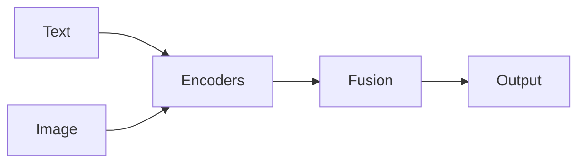

# IA multimodale

## Définition

L'IA multimodale gère plusieurs modalités d'entrée (et parfois de sortie) dans un seul système: par ex. vision-language models (VLMs) for image QA, captioning, or embodied agents that use vision and language.

Il étend [NLP](/docs/nlp) and [computer vision](/docs/cv) by aligning or fusing modalities (text, image, audio, video). CLIP-style models learn a shared embedding space for récupération and zero-shot classification; generative VLMs (par ex. LLaVA, GPT-4V) do captioning, QA, and raisonnement over images. Used in [agents](/docs/agents), [RAG](/docs/rag) with images, and accessibility tools.

## Comment ça fonctionne

Chaque modalité (**texte**, **image** et optionnellement autres) passe par des **encodeurs** (séparés ou partagés). **La fusion** can be a shared embedding space (par ex. CLIP: contrastive loss so matching text-image pairs are close) or a unified [transformer](/docs/transformers) that attends over all modalities. **Output** can be a classification, caption, answer, or next token. Alignment is learned via contrastive (CLIP) or generative (captioning, VLM) objectives on paired data. Inference: embed or encode all inputs, then run the fusion model to get the output.

## Cas d'utilisation

Multimodal models fit when the task combines two or more modalities (par ex. text and image) in input or output.

- Image captioning, visual QA, and document understanding (text + image)
- Cross-modal récupération (par ex. search images by text, or vice versa)
- Embodied agents and robots that use vision and language

## Documentation externe

- [CLIP (Radford et al.)](https://arxiv.org/abs/2103.00020)
- [Hugging Face – Multimodal](https://huggingface.co/docs/transformers/main_classes/processing_automatic)

## Voir aussi

- [LLMs](/docs/llms)
- [Computer vision](/docs/cv)
- [NLP](/docs/nlp)
- [Local inference](/docs/local-inference) — Running multimodal models on-device
- [Edge raisonnement](/docs/edge-reasoning) — Multimodal at the edge
