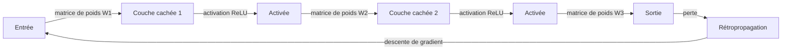

# Réseaux de neurones

## Définition

Les réseaux de neurones sont des approximateurs de fonctions construits à partir de couches d'unités (neurones) avec des poids apprenables et des activations non linéaires. Ils peuvent approximer des mappings complexes des entrées aux sorties lorsqu'ils sont entraînés sur des données.

Ils sont les blocs de construction de l'[apprentissage profond](/docs/fundamentals/deep-learning). Des variantes comme les [CNN](/docs/neural-networks/cnn) et les [RNN](/docs/neural-networks/rnn) ajoutent des biais inductifs (par ex. localité, récurrence) pour des types de données spécifiques ; la même machinerie d'entraînement (rétropropagation, descente de gradient) s'applique.

Le théorème d'approximation universelle garantit qu'un réseau suffisamment large à une seule couche cachée peut approximer toute fonction continue — mais en pratique, la **profondeur** (empiler plusieurs couches) est bien plus efficace en paramètres que la largeur seule. Chaque couche supplémentaire augmente la capacité du modèle à composer des caractéristiques plus simples en des caractéristiques plus complexes. Les réseaux de neurones modernes vont de quelques centaines de paramètres (petits modèles edge) à des centaines de milliards (LLMs de pointe), partageant tous les mêmes blocs de construction fondamentaux : transformations linéaires, fonctions d'activation et optimisation basée sur les gradients.

## Fonctionnement



### Passe forward

L'**entrée** est passée à la première couche. Chaque **couche** calcule une combinaison linéaire de ses entrées (poids + biais) puis une activation non linéaire (par ex. ReLU, sigmoïde, GELU). La sortie d'une couche devient l'entrée de la suivante ; empiler des couches permet au réseau d'apprendre des caractéristiques hiérarchiques.

### Perte et rétropropagation

La couche de **sortie** finale mappe vers des prédictions (par ex. scores de classe ou un scalaire). Une **fonction de perte** (par ex. entropie croisée pour la classification, MSE pour la régression) mesure à quel point les prédictions sont éloignées des cibles. La **rétropropagation** calcule les gradients via la règle des chaînes depuis la sortie jusqu'à l'entrée.

### Descente de gradient et régularisation

La **descente de gradient** (ou ses variantes stochastiques : SGD, Adam, AdamW) met à jour les poids pour minimiser la perte. La profondeur et la largeur déterminent la capacité ; la régularisation (dropout, décroissance des poids, normalisation par lots) et la taille des données contrôlent le surapprentissage.

## Quand utiliser / Quand NE PAS utiliser

| Scénario | Utiliser les réseaux de neurones ? | Notes |
|---|---|---|
| Données non structurées (images, texte, audio) | Oui | Les RN apprennent les caractéristiques automatiquement |
| Petits ensembles de données tabulaires | Non | Le gradient boosting surpasse souvent les RN |
| Besoin d'un modèle interprétable | Non | Les RN sont en grande partie des boîtes noires |
| Données étiquetées abondantes + calcul | Oui | Les RN évoluent bien avec les deux |
| Inférence en temps réel sur matériel contraint | Avec précaution | Quantifier ou utiliser des architectures plus petites |
| Apprentissage par transfert disponible pour votre domaine | Oui | Affiner un RN pré-entraîné surpasse l'entraînement depuis zéro |

## Comparaisons

| Architecture | Biais inductif | Meilleur pour | Limitation clé |
|---|---|---|---|
| Feedforward (MLP) | Aucun | Tabulaire, général | Ignore la structure spatiale/temporelle |
| CNN | Localité spatiale | Images, grilles | Moins efficace pour les longues séquences |
| RNN / LSTM | Ordre temporel | Séquences, séries temporelles | Lent à entraîner, gradients qui disparaissent |
| Transformer | Attention globale | Texte, multimodal | Mémoire élevée avec contexte long |

## Avantages et inconvénients

| Avantages | Inconvénients |
|---|---|
| Approximation universelle de fonctions | Nécessite des données significatives |
| Évolue avec les données et le calcul | Coûteux en calcul |
| L'apprentissage par transfert réduit les besoins en données étiquetées | Difficile à interpréter |
| Conception d'architecture flexible | Sensible aux hyperparamètres |

## Exemples de code

```python
# Basic feedforward neural network with PyTorch
import torch
import torch.nn as nn

# Define a simple two-hidden-layer network
class FeedForward(nn.Module):
    def __init__(self, input_dim: int, hidden_dim: int, output_dim: int):
        super().__init__()
        self.layers = nn.Sequential(
            nn.Linear(input_dim, hidden_dim),
            nn.ReLU(),
            nn.Dropout(0.2),
            nn.Linear(hidden_dim, hidden_dim),
            nn.ReLU(),
            nn.Linear(hidden_dim, output_dim),
        )

    def forward(self, x: torch.Tensor) -> torch.Tensor:
        return self.layers(x)

# Instantiate, pass a dummy batch, inspect output shape
model = FeedForward(input_dim=20, hidden_dim=64, output_dim=3)
x = torch.randn(32, 20)          # batch of 32 samples, 20 features
logits = model(x)
print(f"Output shape: {logits.shape}")  # (32, 3)

# Count parameters
n_params = sum(p.numel() for p in model.parameters() if p.requires_grad)
print(f"Trainable parameters: {n_params:,}")
```

## Ressources pratiques

- [Réseaux de Neurones et Apprentissage Profond (Nielsen)](http://neuralnetworksanddeeplearning.com/) — Livre en ligne gratuit avec profondeur mathématique
- [3Blue1Brown – Réseaux de neurones](https://www.youtube.com/playlist?list=PLZHQObOWTQDNU6R1_67000Dx_ZCJB-3pi) — Introduction visuelle et intuitive
- [Tutoriels PyTorch](https://pytorch.org/tutorials/) — Tutoriels officiels pratiques du simple à l'avancé

## Voir aussi

- [CNN](/docs/neural-networks/cnn)
- [RNN](/docs/neural-networks/rnn)
- [Apprentissage profond](/docs/fundamentals/deep-learning)
