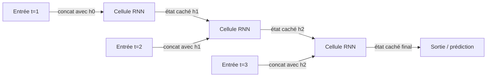

# Réseaux de neurones récurrents (RNN)

## Définition

Les RNN traitent les séquences en maintenant un état caché qui est mis à jour à chaque étape. Eux (et les variantes comme LSTM) étaient la norme pour la modélisation de séquences avant les Transformers.

Ils conviennent naturellement au [NLP](/docs/nlp), aux séries temporelles et à toute donnée ordonnée où le contexte du passé est important. Les [Transformers](/docs/transformers) les ont largement remplacés dans la modélisation du langage grâce à la parallélisation et à la gestion des dépendances à longue portée, mais les RNN apparaissent encore dans les contextes de streaming ou de faible latence.

L'idée fondamentale est de partager les paramètres dans le temps : les mêmes matrices de poids sont utilisées à chaque étape, rendant le modèle équivariant à la longueur de l'entrée. Les variantes **LSTM** (Long Short-Term Memory) et **GRU** (Gated Recurrent Unit) traitent le problème du gradient qui disparaît des RNN simples avec des mécanismes de porte qui contrôlent quelle information est stockée, oubliée ou transmise. Ces architectures restent compétitives dans les contextes à ressources contraintes, les scénarios d'apprentissage en ligne et tout cas d'usage où un modèle séquentiel compact avec une mémoire bornée est préférable à l'attention quadratique des transformers.

## Fonctionnement



### Calcul récurrent

À chaque **étape**, le modèle reçoit l'entrée actuelle (par ex. un token ou une trame) et l'**état caché** précédent. Il calcule un nouvel état caché : `h_t = tanh(W_h * h_{t-1} + W_x * x_t + b)`. L'état caché résume toutes les informations depuis le début de la séquence jusqu'à l'étape t.

### Portes LSTM

Les variantes **LSTM** et **GRU** remplacent la cellule tanh simple par des unités de porte. La porte d'oubli décide quoi supprimer de l'état de la cellule ; la porte d'entrée contrôle quelles nouvelles informations stocker ; la porte de sortie détermine quoi exposer comme état caché. Cela permet au réseau d'apprendre des dépendances à longue portée que les RNN simples ne peuvent pas.

### Entraînement : rétropropagation dans le temps

La récurrence est déroulée dans le temps pour l'entraînement (**rétropropagation dans le temps**, BPTT). Lors de l'inférence, l'état caché est passé en avant étape par étape. Les entrées et sorties peuvent être un-à-un, un-à-plusieurs ou plusieurs-à-un selon la tâche (par ex. étiquetage de séquence vs. classification).

## Quand utiliser / Quand NE PAS utiliser

| Scénario | Utiliser RNN ? | Notes |
|---|---|---|
| Inférence en streaming avec peu de mémoire | Oui | Les RNN traitent étape par étape avec un état borné |
| Très longues séquences avec contexte global | Non | Les Transformers gèrent mieux cela |
| Prévision de séries temporelles (longueur modérée) | Oui | Les LSTM sont compétitifs avec moins de calcul |
| Entraînement parallélisable requis | Non | Les RNN sont intrinsèquement séquentiels |
| Tâches NLP à grande échelle | Non | Les Transformers dominent le NLP moderne |
| Appareils embarqués / edge | Oui | Les petits modèles LSTM/GRU sont efficaces à l'inférence |

## Comparaisons

| Aspect | RNN / LSTM | CNN | Transformer |
|---|---|---|---|
| Cas d'usage principal | Séquences, séries temporelles | Images, grilles | Texte, multimodal |
| Entraînement parallélisable | Non (séquentiel) | Oui | Oui |
| Dépendances à longue portée | Modérées (avec LSTM) | Faibles | Excellentes |
| Empreinte mémoire (inférence) | Très faible (état fixe) | Faible | Élevée (cache KV) |
| Inférence streaming / en ligne | Excellente | N/A | Difficile |
| Performance NLP état de l'art | Non | Non | Oui |

## Avantages et inconvénients

| Avantages | Inconvénients |
|---|---|
| Convient naturellement aux données séquentielles | Ne peut pas être parallélisé pendant l'entraînement |
| Empreinte mémoire fixe à l'inférence | Difficultés avec les très longues dépendances |
| Efficace pour les cas d'usage streaming / en ligne | Largement supplanté par les transformers pour le NLP |
| Modèles compacts pour le déploiement edge | Gradient qui disparaît (atténué par LSTM/GRU) |

## Exemples de code

```python
# LSTM for sentiment classification with PyTorch
import torch
import torch.nn as nn

class LSTMClassifier(nn.Module):
    def __init__(self, vocab_size: int, embed_dim: int, hidden_dim: int, num_classes: int):
        super().__init__()
        self.embedding = nn.Embedding(vocab_size, embed_dim, padding_idx=0)
        self.lstm = nn.LSTM(embed_dim, hidden_dim, batch_first=True, num_layers=2, dropout=0.3)
        self.classifier = nn.Linear(hidden_dim, num_classes)

    def forward(self, token_ids: torch.Tensor) -> torch.Tensor:
        x = self.embedding(token_ids)           # (batch, seq_len, embed_dim)
        _, (h_n, _) = self.lstm(x)              # h_n: (num_layers, batch, hidden_dim)
        return self.classifier(h_n[-1])         # use last layer's final hidden state

# Dummy batch: 8 sequences, each 20 tokens, vocab of 5000
model   = LSTMClassifier(vocab_size=5000, embed_dim=64, hidden_dim=128, num_classes=2)
tokens  = torch.randint(0, 5000, (8, 20))
logits  = model(tokens)
print(f"Output shape: {logits.shape}")          # (8, 2)

n_params = sum(p.numel() for p in model.parameters() if p.requires_grad)
print(f"Trainable parameters: {n_params:,}")
```

## Ressources pratiques

- [Comprendre les réseaux LSTM (Olah)](https://colah.github.io/posts/2015-08-Understanding-LSTMs/) — Explication visuelle claire des portes LSTM
- [PyTorch – Modèles de séquence et RNN](https://pytorch.org/tutorials/beginner/sequence_models_tutorial.html) — Tutoriel officiel avec un exemple d'étiquetage POS
- [L'Efficacité Déraisonnable des Réseaux de Neurones Récurrents (Karpathy)](http://karpathy.github.io/2015/05/21/rnn-effectiveness/) — Article de blog classique avec des exemples de RNN au niveau des caractères

## Voir aussi

- [Transformers](/docs/transformers)
- [NLP](/docs/nlp)
- [CNN](/docs/neural-networks/cnn)
