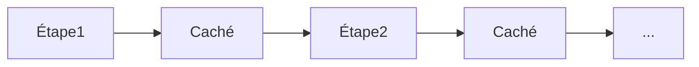

# Réseaux de neurones récurrents (RNN)

## Définition

Les RNN traitent les séquences en maintenant un état caché mis à jour à chaque étape. Ils (et les variantes comme LSTM) étaient le standard pour la modélisation de séquences avant les Transformers.

Ils sont naturellement adaptés au [NLP](/docs/nlp), aux séries temporelles et à toute donnée ordonnée où le contexte passé compte. Les [Transformers](/docs/transformers) les ont largement remplacés en modélisation du langage grâce à la parallélisation et la gestion des dépendances à longue portée, mais les RNN apparaissent encore dans les contextes de streaming ou de faible latence.

## Comment ça marche

À chaque **étape**, le modèle reçoit l'entrée courante (p. ex. un token ou une trame) et l'**état caché** précédent. Il calcule une sortie (p. ex. une prédiction ou la prochaine représentation cachée) et met à jour l'état caché pour l'étape suivante. La récurrence est déroulée dans le temps pour l'entraînement (rétropropagation à travers le temps) ; à l'inférence, l'état caché est transmis étape par étape. Les variantes **LSTM** et **GRU** ajoutent des portes pour atténuer les gradients évanescents. Les entrées et sorties peuvent être un-à-un, un-à-plusieurs ou plusieurs-à-un selon la tâche (p. ex. étiquetage de séquence vs séquence à séquence).

## Cas d'utilisation

Les RNN conviennent aux problèmes avec des entrées ou sorties séquentielles où l'ordre et le contexte temporel comptent.

- Étiquetage de séquences (p. ex. reconnaissance d'entités nommées, étiquetage POS)
- Prévision de séries temporelles et détection d'anomalies
- Modélisation de séquences vocales et textuelles (avant la domination des Transformers)

## Documentation externe

- [Comprendre les réseaux LSTM (Olah)](https://colah.github.io/posts/2015-08-Understanding-LSTMs/)
- [PyTorch – Modèles séquentiels et RNN](https://pytorch.org/tutorials/beginner/sequence_models_tutorial.html)

## Voir aussi

- [Transformers](/docs/transformers)
- [NLP](/docs/nlp)
