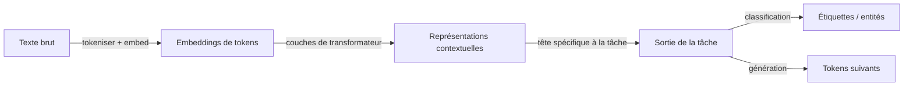

# Traitement du langage naturel (NLP)

## Définition

Le traitement du langage naturel (NLP) est la branche de l'IA qui traite de l'intersection des ordinateurs et du langage humain — permettant aux machines de lire, comprendre, interpréter et générer du texte et de la parole. Le domaine couvre un large spectre de tâches : classification de texte (détection de spam, analyse de sentiment), extraction structurée (reconnaissance d'entités nommées, extraction de relations), réponse aux questions, résumé, traduction et génération en texte libre. Chaque tâche nécessite un modèle capable de mapper des entrées en langage naturel de longueur variable vers des sorties utiles.

Le NLP moderne est dominé par des modèles de [transformateur](/docs/transformers) pré-entraînés. Le paradigme pré-entraînement-affinement — entraîner un grand modèle sur des corpus massifs pour apprendre des représentations générales du langage, puis l'adapter à des tâches spécifiques — a remplacé les pipelines de caractéristiques manuelles et les architectures spécifiques aux tâches. Les modèles comme BERT (bidirectionnel, bon pour la classification et l'extraction) et GPT (autorégressif, bon pour la génération) représentent les deux extrémités du spectre des transformateurs. Les [LLM](/docs/llms) comme GPT-4, Claude et Llama 3 vont encore plus loin : un seul modèle gère de nombreuses tâches avec la bonne invite, réduisant le besoin de modèles affinés séparément par tâche.

Les entrées des modèles NLP sont des tokens discrets (sous-mots ou mots) produits par la tokenisation. Les modèles apprennent des embeddings contextuels riches où la représentation d'un mot dépend de son contexte. [RAG](/docs/rag) et les [agents](/docs/agents) étendent les systèmes NLP en ajoutant de la récupération et l'utilisation d'outils par-dessus les modèles de langage, permettant une réponse aux questions fondée et l'accomplissement de tâches multi-étapes au-delà de ce qui tient dans une seule fenêtre de contexte.

## Comment ça fonctionne

### Tokenisation et embedding

Le texte brut est d'abord divisé en tokens de sous-mots en utilisant des algorithmes comme BPE (encodage par paires de bytes) ou WordPiece. Chaque token est mappé vers un vecteur d'embedding appris. Des encodages positionnels sont ajoutés pour préserver l'ordre des mots. Le résultat est une séquence de vecteurs que le transformateur traite.

### Encodage du transformateur et têtes de tâche



Les couches du transformateur appliquent une auto-attention multi-têtes et des sous-couches feed-forward pour produire des représentations contextuelles — l'embedding de chaque token reflète maintenant tout son contexte. Une tête de tâche mappe ces représentations vers les sorties : une tête de classification ajoute une couche linéaire sur le token `[CLS]` ; une tête de génération prédit le prochain token de façon autorégressive ; une tête de span prédit les positions de début et de fin pour la QA.

### Pré-entraînement et adaptation

Les modèles sont pré-entraînés sur de grands corpus en utilisant des objectifs auto-supervisés (modélisation du langage masqué pour le style BERT, prédiction du prochain token pour le style GPT). L'adaptation aux tâches en aval se fait via l'affinement (mise à jour de tout ou partie des poids sur des données étiquetées) ou le prompting (fournir des instructions et des exemples en contexte sans mises à jour des poids). Les méthodes efficaces en paramètres comme LoRA permettent l'affinement avec bien moins de paramètres entraînables.

## Quand utiliser / Quand NE PAS utiliser

| Utiliser quand | Éviter quand |
|----------|------------|
| L'entrée ou la sortie est du texte en langage naturel à n'importe quelle échelle | Les données sont purement numériques, tabulaires ou structurées — le ML classique peut suffire |
| Les tâches incluent classification, extraction, QA, résumé ou génération | Des contraintes strictes de latence ou mémoire excluent l'inférence de transformateur |
| Vous souhaitez exploiter des modèles pré-entraînés pour réduire les besoins en données étiquetées | Vous avez besoin d'un traitement symbolique, basé sur des règles, qui doit être auditab à 100% |
| Construction de chatbots, recherche ou pipelines de compréhension de documents | Le vocabulaire du domaine est si spécialisé que les modèles pré-entraînés nécessitent un réentraînement extensif |

## Comparaisons

| Approche | Forces | Limites |
|----------|-----------|-------------|
| Encodeurs style BERT | Classification et extraction robustes | Pas génératif ; nécessite un affinement par tâche |
| Décodeurs style GPT (LLM) | Généraliste, few-shot, génératif | Calcul plus élevé ; format de sortie plus difficile à contraindre |
| Modèles de tâche affinés | Haute performance sur des tâches spécifiques | Nécessite des données étiquetées ; un modèle par tâche |
| Ingénierie de prompt (zero/few-shot) | Itération rapide, pas d'entraînement | Moins fiable pour les tâches structurées complexes |

## Avantages et inconvénients

| Avantages | Inconvénients |
|------|------|
| Les modèles pré-entraînés se transfèrent bien entre tâches et domaines | Les grands modèles sont coûteux en calcul à exécuter et affiner |
| Un seul LLM gère de nombreuses tâches avec le prompting | La qualité de sortie dépend fortement de la conception de l'invite et du contexte |
| Riche écosystème de modèles open-source et d'outillage | La tokenisation introduit des artefacts et limite la gestion des mots rares |
| Fortes capacités zero-shot et few-shot | Les hallucinations et l'incohérence restent des défis pour les tâches de génération |

## Exemples de code

### Classification de texte avec Hugging Face Transformers (Python)

```python
from transformers import pipeline

# Classification zero-shot — pas d'affinement nécessaire
classifier = pipeline(
    "zero-shot-classification",
    model="facebook/bart-large-mnli",
)

text = "La nouvelle mise à jour du firmware a corrigé le problème de consommation de batterie sur le smartphone."
candidate_labels = ["technologie", "sports", "finance", "politique"]

result = classifier(text, candidate_labels)
print(f"Texte : {text}")
for label, score in zip(result["labels"], result["scores"]):
    print(f"  {label} : {score:.3f}")
```

## Ressources pratiques

- [Hugging Face – Cours NLP](https://huggingface.co/learn/nlp-course/) — Cours pratique couvrant les transformateurs, l'affinement et le déploiement
- [Stanford CS224N – NLP avec l'apprentissage profond](http://web.stanford.edu/class/cs224n/) — Cours universitaire avec notes de cours et devoirs
- [Hugging Face Model Hub](https://huggingface.co/models) — Des milliers de modèles pré-entraînés pour chaque tâche NLP
- [Livre NLTK](https://www.nltk.org/book/) — Introduction classique aux fondamentaux du NLP
- [The Illustrated Transformer (Jay Alammar)](https://jalammar.github.io/illustrated-transformer/) — Explication visuelle de l'architecture du transformateur

## Voir aussi

- [Transformateurs](/docs/transformers)
- [LLMs](/docs/llms)
- [RAG](/docs/rag)
