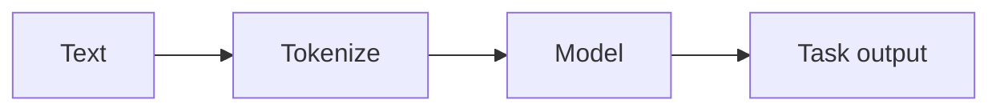

# Traitement du langage naturel (NLP)

## Définition

Le NLP couvre les tâches sur le texte : classification, NER, QA, résumé, traduction et génération. Modern NLP is dominated by pretrained [transformers](/docs/transformers) (BERT, GPT, etc.) and [LLMs](/docs/llms).

Inputs are discrete (tokens); models learn from large corpora and are then adapted via [fine-tuning](/docs/llms/fine-tuning) or [prompting](/docs/prompt-engineering). [RAG](/docs/rag) and [agents](/docs/agents) add récupération and tools on top of NLP models for grounded QA and task completion.

## Comment ça fonctionne

**Text** is **tokenized** (divisé en sous-mots ou mots) and optionally normalized. The **model** (par ex. BERT, GPT) processes token IDs through embeddings and [transformer](/docs/transformers) layers to produce contextual representations. A **task output** head (par ex. classifier, span predictor, or next-token decoder) maps those to the final prediction. Models sont pré-entraînés sur large corpora (masked LM or prédiction du prochain token), then fine-tuned or prompted for downstream tasks. Pipelines often combine tokenization, embedding, and task-specific heads; [LLMs](/docs/llms) can do many tasks with a single model and the right prompt.

## Cas d'utilisation

NLP applies to any product or pipeline that needs to understand or generate text at scale.

- Machine translation, summarization, and question answering
- Named entity recognition, sentiment analysis, and text classification
- Chatbots, code generation, and document understanding

## Documentation externe

- [Hugging Face – NLP course](https://huggingface.co/learn/nlp-course/)
- [Stanford CS224N – NLP with Deep Learning](http://web.stanford.edu/class/cs224n/)

## Voir aussi

- [Transformers](/docs/transformers)
- [LLMs](/docs/llms)
- [RAG](/docs/rag)
