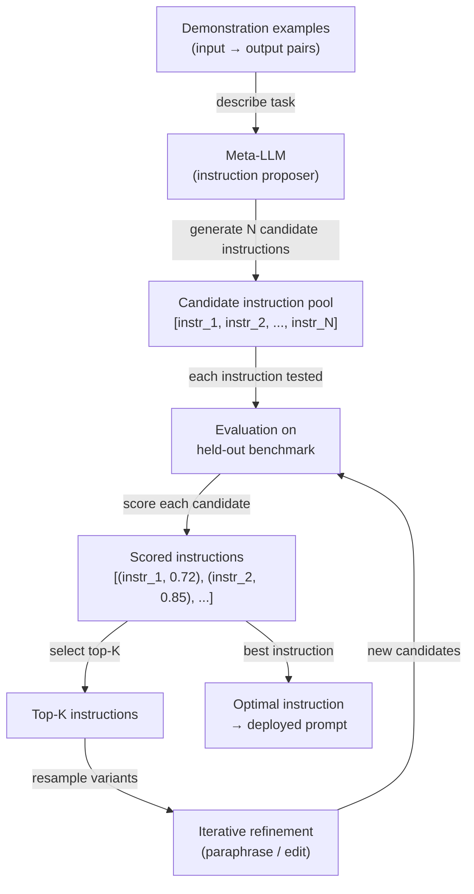

# Automatic Prompt Engineering (APE)

## Définition

L'Automatic Prompt Engineering (APE) est la pratique d'utiliser un modèle de langage pour générer et optimiser des instructions de prompt plutôt que de les écrire manuellement. Introduit par Zhou et al. (2022) dans l'article *Large Language Models Are Human-Level Prompt Engineers*, l'APE formule la conception de prompts comme un problème de synthèse de programmes : étant donné un ensemble de paires de démonstration entrée-sortie, trouver l'instruction en langage naturel qui, lorsqu'elle est ajoutée au début d'un prompt, maximise les performances de la tâche sur un ensemble d'évaluation retenu. La recherche, l'évaluation et le raffinement des instructions candidates sont tous effectués de manière programmatique — le rôle de l'humain passe d'auteur de prompt à définisseur de tâche et concepteur de métriques.

La motivation pour automatiser la conception de prompts est pratique. L'ingénierie de prompt manuelle est chronophage, fragile et biaisée par les intuitions de l'ingénieur sur la façon dont les modèles de langage traitent le texte. De petites modifications de formulation — « Pense étape par étape » vs « Réfléchissons soigneusement étape par étape » — produisent des différences de précision mesurables impossibles à prédire sans tests empiriques. L'APE remplace ces approximations par une recherche systématique : générer un grand pool d'instructions candidates, évaluer chacune sur un benchmark et conserver les meilleures. C'est la même philosophie de conception que la recherche d'hyperparamètres en ML classique — les humains spécifient l'objectif, les machines effectuent la recherche.

L'APE se distingue du soft prompt tuning (qui optimise des embeddings de tokens continus via la descente de gradient) et du fine-tuning (qui met à jour les poids du modèle). L'APE opère entièrement dans l'espace du langage naturel en utilisant des modèles figés. Cela le rend indépendant du modèle, interprétable — on peut lire et comprendre l'instruction gagnante — et déployable sans aucune infrastructure d'entraînement. La contrepartie est que l'espace de recherche discret du langage naturel est vaste et non différentiable, donc l'APE s'appuie sur l'échantillonnage, des heuristiques d'évaluation et un raffinement itératif plutôt que sur une optimisation basée sur le gradient.

## Fonctionnement



### Génération de candidats

La boucle APE commence par un ensemble d'exemples de démonstration — des paires entrée-sortie illustrant la tâche cible. Ces exemples sont transmis à un méta-LLM (le même ou un modèle différent) avec un méta-prompt lui demandant d'inférer l'instruction qui produirait les sorties données à partir des entrées données. Les méta-prompts typiques ressemblent à : *« Voici des paires entrée-sortie. Quelle est l'instruction qui produit ces sorties ? Générez 10 instructions candidates diversifiées. »* En échantillonnant à température > 0, le méta-LLM produit un pool diversifié d'instructions candidates qui diffèrent par la formulation, l'encadrement et la spécificité. La qualité et la diversité de ce pool initial déterminent directement le plafond de l'optimisation.

### Évaluation

Chaque instruction candidate est instanciée comme préfixe dans le prompt (ou comme message système) et évaluée sur un benchmark retenu. La fonction d'évaluation est spécifique à la tâche : précision pour la classification, exactitude d'exécution pour la génération de code, ROUGE ou BERTScore pour la résumé, ou un juge LLM secondaire pour les tâches ouvertes. La décision de conception clé est de savoir si le score est calculé avec le méta-LLM lui-même (en utilisant des estimations de log-probabilité des sorties correctes) ou avec un évaluateur séparé spécifique à la tâche. L'évaluation par log-probabilité est plus rapide mais peut surajuster à la calibration du méta-LLM. L'évaluation par évaluateur séparé est plus fiable mais nécessite des données étiquetées.

### Raffinement itératif

Après l'évaluation initiale, les Top-K instructions candidates sont sélectionnées pour le raffinement. Le méta-LLM est invité à paraphraser, étendre ou combiner les meilleurs candidats — produisant un nouveau pool de variantes sémantiquement liées mais textuellement distinctes. Cette boucle de raffinement s'exécute pour un nombre fixe d'itérations ou jusqu'à ce qu'un seuil de score cible soit atteint. Chaque itération resserre la recherche autour de régions prometteuses de l'espace d'instructions, analogue à la recherche évolutionnaire ou à la montée de colline sur un paysage discret. En pratique, un ou deux tours de raffinement après un grand pool initial (N ≥ 50) tend à récupérer la majeure partie du gain réalisable.

## Comparaisons

| Critère | APE | Ingénierie de prompt manuelle | Fine-tuning |
|---------|-----|-------------------------------|-------------|
| Effort humain | Faible — définir la tâche et la métrique | Élevé — authoring et tests itératifs | Élevé — collecte de données et runs d'entraînement |
| Nécessite des données étiquetées | Oui — pour l'évaluation | Non — peut être fait empiriquement | Oui — typiquement des milliers d'exemples |
| Poids du modèle mis à jour | Non | Non | Oui |
| Sortie interprétable | Oui — instruction en langage naturel | Oui | Non — les changements de poids sont opaques |
| Généralise entre modèles | Oui — relancer la recherche par modèle | Partiellement | Non — lié au modèle de base |
| Latence à l'inférence | Aucune — pas de surcharge à l'exécution | Aucune | Aucune |
| Coût | Moyen — N × M appels d'évaluation | Faible | Élevé — temps GPU |
| Idéal pour | Tâches avec une métrique claire et ≥ 50 exemples | Nouvelles tâches sans métrique | Tâches à volume élevé où les gains de précision justifient l'entraînement |

## Quand utiliser / Quand NE PAS utiliser

| Utiliser quand | Éviter quand |
|----------------|--------------|
| Vous avez un ensemble d'évaluation étiqueté et pouvez définir une métrique d'évaluation claire | La tâche n'a pas de métrique automatisée fiable — l'APE ne peut pas rechercher sans signal |
| L'itération manuelle de prompts prend plus d'une journée et la précision plafonne encore | Vous avez besoin d'un résultat immédiatement — l'APE nécessite plusieurs appels LLM API pour l'évaluation |
| Vous déployez le même prompt à de nombreux utilisateurs et même 1–2% de gain de précision importe | Votre pool de démonstrations est trop petit (< 10 exemples) — l'évaluation sera bruitée |
| Vous voulez auditer l'instruction trouvée pour la sécurité avant déploiement | La tâche nécessite de la créativité ou un jugement subjectif où une seule métrique est trompeuse |
| Vous utilisez DSPy ou un framework similaire où l'optimisation de prompt est intégrée | Le fine-tuning est déjà planifié — l'APE optimise les prompts, pas les poids |

## Exemples de code

### Boucle APE de base avec OpenAI

```python
# Minimal APE implementation: generate instructions, score, return best
# pip install openai

import os
import re
from openai import OpenAI

client = OpenAI(api_key=os.environ["OPENAI_API_KEY"])

# ----- Task definition --------------------------------------------------------
# Demonstrations: pairs of (input, expected_output)
DEMOS = [
    ("The movie was absolutely fantastic, I loved every minute.", "positive"),
    ("Terrible film, waste of time and money.", "negative"),
    ("It was okay, nothing special but not bad either.", "neutral"),
    ("A masterpiece of modern cinema.", "positive"),
    ("I walked out after 20 minutes.", "negative"),
]

# Held-out evaluation set for scoring
EVAL_SET = [
    ("A stunning visual experience with weak writing.", "positive"),  # debatable but positive
    ("Boring, predictable, and too long.", "negative"),
    ("I enjoyed it more than I expected.", "positive"),
    ("Neither good nor bad — forgettable.", "neutral"),
    ("One of the best films of the decade.", "positive"),
]


# ----- Step 1: Generate candidate instructions --------------------------------
def generate_instructions(demos: list[tuple[str, str]], n: int = 10) -> list[str]:
    """Ask a meta-LLM to infer N candidate instructions from demo pairs."""
    demo_text = "\n".join(f'Input: "{inp}"\nOutput: "{out}"' for inp, out in demos)
    meta_prompt = (
        f"Here are input-output example pairs for a text classification task:\n\n"
        f"{demo_text}\n\n"
        f"Generate {n} diverse natural-language instructions that, when prepended to "
        f"an input text, would cause a language model to produce the correct output. "
        f"Return one instruction per line, numbered."
    )
    resp = client.chat.completions.create(
        model="gpt-4o-mini",
        messages=[{"role": "user", "content": meta_prompt}],
        temperature=0.9,
        max_tokens=800,
    )
    raw = resp.choices[0].message.content
    lines = [re.sub(r"^\d+[\.\)]\s*", "", l).strip() for l in raw.splitlines()]
    return [l for l in lines if len(l) > 20]  # filter out empty / too-short lines


# ----- Step 2: Score an instruction on the eval set --------------------------
def score_instruction(instruction: str, eval_set: list[tuple[str, str]]) -> float:
    """Return accuracy of the instruction on the eval set."""
    correct = 0
    for text, expected in eval_set:
        prompt = f"{instruction}\n\nText: {text}\nLabel:"
        resp = client.chat.completions.create(
            model="gpt-4o-mini",
            messages=[{"role": "user", "content": prompt}],
            temperature=0,
            max_tokens=5,
        )
        prediction = resp.choices[0].message.content.strip().lower()
        if expected.lower() in prediction:
            correct += 1
    return correct / len(eval_set)


# ----- Step 3: Iterative refinement of top-K instructions --------------------
def refine_instructions(top_instructions: list[str], n_variants: int = 5) -> list[str]:
    """Ask the meta-LLM to paraphrase the top instructions to get variants."""
    instr_text = "\n".join(f"- {i}" for i in top_instructions)
    refine_prompt = (
        f"Here are high-performing instructions for a sentiment classification task:\n"
        f"{instr_text}\n\n"
        f"Generate {n_variants} new instructions that paraphrase or combine the above "
        f"to potentially improve performance. Return one per line."
    )
    resp = client.chat.completions.create(
        model="gpt-4o-mini",
        messages=[{"role": "user", "content": refine_prompt}],
        temperature=0.7,
        max_tokens=500,
    )
    raw = resp.choices[0].message.content
    lines = [l.strip().lstrip("- ") for l in raw.splitlines()]
    return [l for l in lines if len(l) > 20]


# ----- APE main loop ---------------------------------------------------------
def run_ape(
    demos: list[tuple[str, str]],
    eval_set: list[tuple[str, str]],
    n_candidates: int = 10,
    top_k: int = 3,
    n_refinement_rounds: int = 1,
) -> dict:
    print("=== APE: Generating initial candidates ===")
    candidates = generate_instructions(demos, n=n_candidates)
    print(f"Generated {len(candidates)} candidates.\n")

    all_scored: list[tuple[str, float]] = []

    for round_num in range(n_refinement_rounds + 1):
        print(f"--- Round {round_num + 1}: Scoring {len(candidates)} instructions ---")
        round_scores = []
        for instr in candidates:
            score = score_instruction(instr, eval_set)
            round_scores.append((instr, score))
            print(f"  [{score:.0%}] {instr[:80]}{'...' if len(instr) > 80 else ''}")
        all_scored.extend(round_scores)

        if round_num < n_refinement_rounds:
            top = [i for i, _ in sorted(round_scores, key=lambda x: -x[1])[:top_k]]
            candidates = refine_instructions(top, n_variants=n_candidates // 2)
            print()

    best_instr, best_score = max(all_scored, key=lambda x: x[1])
    return {"instruction": best_instr, "score": best_score, "all_scored": all_scored}


if __name__ == "__main__":
    result = run_ape(DEMOS, EVAL_SET, n_candidates=8, top_k=3, n_refinement_rounds=1)
    print(f"\n=== Best instruction (accuracy {result['score']:.0%}) ===")
    print(result["instruction"])
```

### Utilisation de DSPy pour l'APE structuré

```python
# DSPy provides a higher-level abstraction for automatic prompt optimization.
# pip install dspy-ai

import dspy

# Configure DSPy with your LLM backend
lm = dspy.LM("openai/gpt-4o-mini", api_key=os.environ["OPENAI_API_KEY"])
dspy.configure(lm=lm)


# Define the task as a DSPy signature
class SentimentClassifier(dspy.Signature):
    """Classify the sentiment of a movie review as positive, negative, or neutral."""
    review: str = dspy.InputField(desc="A movie review text")
    sentiment: str = dspy.OutputField(desc="One of: positive, negative, neutral")


# Wrap in a module
class SentimentModule(dspy.Module):
    def __init__(self):
        self.classify = dspy.Predict(SentimentClassifier)

    def forward(self, review: str) -> dspy.Prediction:
        return self.classify(review=review)


# Training examples
trainset = [
    dspy.Example(review=inp, sentiment=out).with_inputs("review")
    for inp, out in [
        ("Absolutely loved it!", "positive"),
        ("Worst movie ever.", "negative"),
        ("It was fine, nothing memorable.", "neutral"),
    ]
]


# Use MIPROv2 optimizer to automatically engineer the prompt
def optimize_with_dspy():
    module = SentimentModule()
    optimizer = dspy.MIPROv2(metric=dspy.evaluate.answer_exact_match, auto="light")
    optimized = optimizer.compile(module, trainset=trainset)
    print(optimized.classify.extended_signature)  # shows the optimized instruction
    return optimized


if __name__ == "__main__":
    optimized_module = optimize_with_dspy()
    result = optimized_module(review="A surprisingly moving and well-acted drama.")
    print(result.sentiment)
```

## Ressources pratiques

- [Large Language Models Are Human-Level Prompt Engineers (Zhou et al., 2022)](https://arxiv.org/abs/2211.01910) — L'article APE original ; introduit la formulation d'induction d'instructions, la recherche itérative par Monte Carlo et les résultats de benchmarks sur 24 tâches NLP.
- [DSPy: Compiling Declarative Language Model Calls into Self-Improving Pipelines (Khattab et al., 2023)](https://arxiv.org/abs/2310.03714) — Le framework qui opérationnalise l'optimisation de style APE comme abstraction de premier ordre ; voir aussi [dspy.ai](https://dspy.ai).
- [Automatic Prompt Optimization with "Gradient Descent" and Beam Search (Pryzant et al., 2023)](https://arxiv.org/abs/2305.03495) — Étend l'APE avec une approche de « gradient textuel » qui utilise le retour d'information généré par LLM comme signal de gradient de substitution.
- [PromptBreeder: Self-Referential Self-Improvement Via Prompt Evolution (Fernando et al., 2023)](https://arxiv.org/abs/2309.16797) — Une approche APE évolutionnaire qui fait également évoluer les méta-prompts utilisés pour la génération d'instructions.

## Voir aussi

- [Prompt engineering](/docs/prompt-engineering)
- [Auto-évaluation et calibration](/docs/prompt-engineering/self-evaluation-calibration)
- [Fine-tuning](/docs/llms/fine-tuning)
