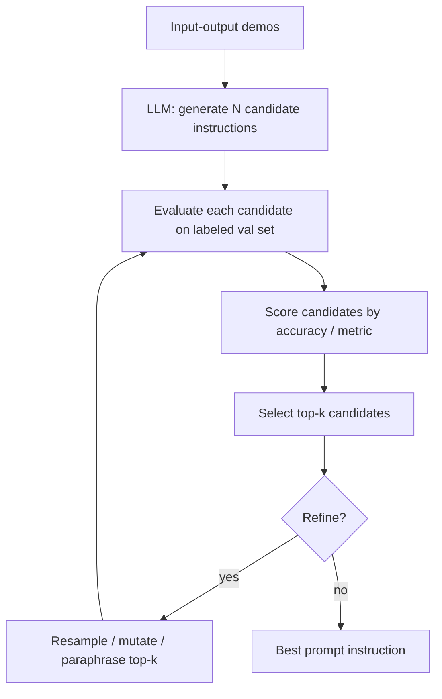

# Ingénierie automatique des prompts (APE)

## Définition

L'ingénierie automatique des prompts (APE) est l'ensemble des méthodes qui utilisent des LLM pour générer, évaluer et sélectionner automatiquement des instructions de prompts, remplaçant l'itération humaine manuelle par une optimisation systématique. Au lieu de formuler les prompts à la main, vous définissez une fonction objective — généralement la précision sur un ensemble de validation — et laissez un algorithme rechercher dans l'espace des prompts possibles pour trouver celui qui maximise cette métrique.

L'APE traite les prompts comme des hyperparamètres et les optimise par un processus en trois étapes : un LLM génère des instructions candidates à partir d'exemples de démonstration entrée-sortie ; chaque candidat est évalué sur un ensemble d'exemples étiquetés ; et les meilleurs candidats sont sélectionnés, optionnellement affinés par ré-échantillonnage, de meilleures stratégies de recherche ou d'une optimisation basée sur le gradient via des représentations de tokens souples.

En pratique, l'APE va d'outils légers comme la génération de variations de prompts dans un LLM et la sélection de la meilleure sur un ensemble de validation, à des frameworks complets comme DSPy (qui optimise les chaînes de prompts de bout en bout), TextGrad (gradient textuel via LLM) et OPRO (optimisation par prompting) de Google DeepMind. L'APE est particulièrement précieuse quand l'ingénierie manuelle des prompts plafonne, quand vous avez des données étiquetées disponibles, ou quand vous devez systématiquement adapter les prompts à un nouveau modèle ou domaine.

## Comment ça fonctionne



### Génération de candidats

Compte tenu d'un ensemble de paires démonstration entrée-sortie, un LLM générateur (qui peut être le même modèle que la cible ou un modèle différent) est invité à synthétiser des instructions qui correspondraient à ces exemples. Des prompts typiques de génération ressemblent à : *"Voici des exemples de tâches. Écrivez une instruction qui décrit le mieux la tâche."* Vous pouvez générer des dizaines à des centaines de candidats en une seule passe.

### Évaluation et scoring

Chaque instruction candidate est insérée dans un template de prompt et testée sur un ensemble de validation étiquetée. Le score de performance (précision, F1, BLEU, exactitude d'exécution du code — toute métrique qui correspond à votre objectif) détermine le classement de la candidate. Cette boucle d'évaluation est la partie coûteuse en calcul : N candidats × M exemples de validation = N×M appels LLM.

### Raffinement

Les frameworks APE avancés ajoutent des boucles de raffinement : reprendre les meilleures instructions, les paraphraser ou les muter, et réévaluer. DSPy compile les programmes entiers avec des modules interconnectés, permettant l'optimisation de chaînes complexes et pas seulement d'instructions uniques. OPRO maintient un historique de tous les prompts précédents et leurs scores dans le méta-prompt, encourageant le LLM optimiseur à construire itérativement de meilleures instructions.

## Quand utiliser / Quand NE PAS utiliser

| Scénario | APE recommandée | Éviter APE |
|----------|-----------------|------------|
| Vous avez ≥ 50 paires entrée-sortie étiquetées | Oui — l'ensemble de validation rend le scoring fiable | Données d'entraînement inexistantes — vous ne pouvez pas scorer les candidats |
| L'ingénierie manuelle des prompts a plafonné | Oui — l'APE explore des formulations que les humains manquent | Prototype précoce — l'itération manuelle est plus rapide et plus instructive |
| Vous devez porter des prompts vers un nouveau modèle | Oui — réoptimisez automatiquement au lieu de reformuler manuellement | Tâche de production à appel unique — le surcoût de l'APE n'est pas justifié |
| Contraintes de coût strictes | Non — N×M appels LLM peuvent être coûteux | — |
| Chaînes de raisonnement complexes | Oui (DSPy) — optimise les pipelines de bout en bout | — |

## Exemples de code

### APE légère — générer et scorer des instructions candidates

```python
# Lightweight APE: generate candidate prompt instructions and pick the best one
# pip install openai

import os, itertools
from openai import OpenAI

client = OpenAI(api_key=os.environ["OPENAI_API_KEY"])

DEMOS = [
    {"input": "The food was terrible and the service was slow.", "output": "negative"},
    {"input": "Absolutely loved the ambiance and the pasta!", "output": "positive"},
    {"input": "It was okay, nothing special.", "output": "neutral"},
]

VAL_SET = [
    ("Best meal I've had in years!", "positive"),
    ("Never going back, rude staff.", "negative"),
    ("Decent place, a bit pricey.", "neutral"),
    ("Outstanding desserts and friendly service.", "positive"),
    ("Food was cold and tasteless.", "negative"),
]


def generate_candidates(demos: list[dict], n: int = 5) -> list[str]:
    demo_text = "\n".join(
        f"Input: {d['input']}\nOutput: {d['output']}" for d in demos
    )
    prompt = (
        f"Here are example input-output pairs for a task:\n\n{demo_text}\n\n"
        f"Write {n} distinct one-sentence instructions that describe this task. "
        "Output one instruction per line, no numbering."
    )
    resp = client.chat.completions.create(
        model="gpt-4o",
        messages=[{"role": "user", "content": prompt}],
        temperature=0.9,
        max_tokens=300,
    )
    return [line.strip() for line in resp.choices[0].message.content.splitlines() if line.strip()]


def score_instruction(instruction: str, val_set: list[tuple]) -> float:
    correct = 0
    for text, label in val_set:
        resp = client.chat.completions.create(
            model="gpt-4o",
            messages=[
                {"role": "system", "content": instruction},
                {"role": "user", "content": text},
            ],
            temperature=0,
            max_tokens=10,
        )
        pred = resp.choices[0].message.content.strip().lower()
        if label in pred:
            correct += 1
    return correct / len(val_set)


if __name__ == "__main__":
    candidates = generate_candidates(DEMOS, n=6)
    print(f"Generated {len(candidates)} candidates\n")

    results = []
    for inst in candidates:
        acc = score_instruction(inst, VAL_SET)
        results.append((acc, inst))
        print(f"  {acc:.2f}  {inst}")

    best_acc, best_inst = max(results)
    print(f"\nBest instruction (acc={best_acc:.2f}):\n{best_inst}")
```

### DSPy — optimisation automatique de prompt de bout en bout

```python
# DSPy: compile a prompt program with automatic instruction optimization
# pip install dspy-ai

import dspy

# Configure the LM
lm = dspy.LM("openai/gpt-4o", api_key="YOUR_KEY")
dspy.configure(lm=lm)

# Define a typed signature
class SentimentClassifier(dspy.Signature):
    """Classify the sentiment of a customer review."""
    review: str = dspy.InputField()
    sentiment: str = dspy.OutputField(desc="positive, negative, or neutral")

# Wrap in a module
class SentimentModule(dspy.Module):
    def __init__(self):
        self.classify = dspy.Predict(SentimentClassifier)

    def forward(self, review: str) -> dspy.Prediction:
        return self.classify(review=review)

# Training and validation examples
trainset = [
    dspy.Example(review="Best meal I've had in years!", sentiment="positive").with_inputs("review"),
    dspy.Example(review="Never going back, rude staff.", sentiment="negative").with_inputs("review"),
    dspy.Example(review="Decent place, a bit pricey.", sentiment="neutral").with_inputs("review"),
]

# Define metric
def exact_match(example, prediction, trace=None):
    return example.sentiment.lower() == prediction.sentiment.lower()

# Compile with MIPROv2 optimizer (automatic prompt generation + selection)
optimizer = dspy.MIPROv2(metric=exact_match, num_candidates=8, init_temperature=0.9)
module = SentimentModule()
compiled = optimizer.compile(module, trainset=trainset)

# Use the optimized module
result = compiled(review="The waiter was incredibly attentive and the food divine.")
print(result.sentiment)  # positive
```

## Ressources pratiques

- [Zhou et al., 2022 — APE original paper](https://arxiv.org/abs/2211.01910) — Article fondateur introduisant l'APE : générer des instructions via LLM et sélectionner via la performance sur l'ensemble de validation
- [Documentation DSPy](https://dspy-docs.vercel.app/) — Framework pour la programmation plutôt que le prompting ; les optimiseurs comme MIPRO et BootstrapFewShotWithRandomSearch automatisent l'APE pour des pipelines entiers
- [OPRO — DeepMind, 2023](https://arxiv.org/abs/2309.03409) — "Optimisation par prompting" : le LLM voit l'historique des prompts précédents + scores et génère des instructions améliorées de manière itérative
- [TextGrad](https://github.com/zou-group/textgrad) — Rétropropagation via du texte : utilise le feedback LLM comme "gradients textuels" pour affiner les composants du pipeline
- [PromptBreeder (Google DeepMind)](https://arxiv.org/abs/2309.16797) — Algorithme évolutif auto-référentiel qui fait muter et sélectionne simultanément les prompts tâche et les prompts mutation

## Voir aussi

- [Ingénierie des prompts](/docs/prompt-engineering)
- [Température, Top-K, Top-P](/docs/prompt-engineering/temperature-top-k-top-p)
- [Autocohérence](/docs/prompt-engineering/self-consistency)
- [Auto-évaluation et calibration](/docs/prompt-engineering/self-evaluation-calibration)
- [Assemblage de prompts](/docs/prompt-engineering/prompt-ensembling)
- [LLMs](/docs/llms)
