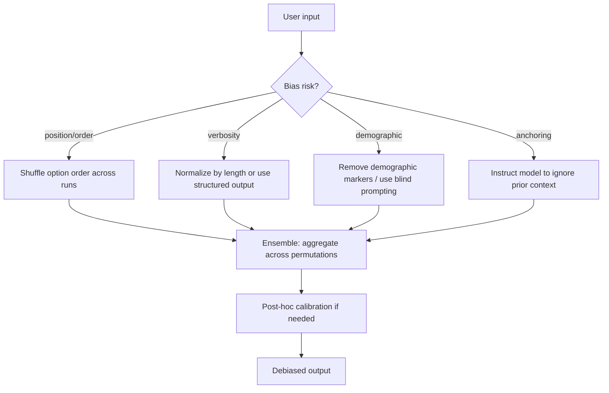

# Techniques de désensibilisation

## Définition

Les techniques de désensibilisation sont des méthodes conçues pour réduire les biais systématiques dans les sorties des LLM — des tendances cohérentes à produire certaines réponses indépendamment du contenu de l'entrée. Les LLM héritent de biais de leurs données d'entraînement, de leur processus d'ajustement fin et de la formulation des prompts eux-mêmes. Ces biais peuvent se manifester comme des préférences de position (favoriser la première option dans une liste), des biais de verbosité (récompenser des réponses plus longues), des stéréotypes démographiques, des effets d'ancrage (être influencé de manière disproportionnée par le contexte récent) et des biais de conformité (être d'accord avec l'utilisateur même lorsqu'il a tort).

La désensibilisation opère à trois niveaux. Les **techniques de prompting** modifient l'entrée pour contrecarrer les biais connus — randomiser l'ordre des options, demander explicitement au modèle de considérer des alternatives, ou utiliser des templates neutres qui n'impliquent pas de réponse préférée. Les **méthodes d'ensemble** exécutent plusieurs versions d'un prompt avec des variations contrôlées et agrègent les résultats, moyennant les biais qui vont dans des directions différentes selon les variations. Les **techniques de calibration** post-hoc ajustent les probabilités de sortie ou les labels de classe pour aligner la confiance du modèle avec sa précision réelle sur un ensemble de validation.

## Comment ça fonctionne



### Biais de position et permutation d'ordre

Quand un LLM évalue des options ou répond à des QCM, il tend à favoriser systématiquement certaines positions (souvent la première ou la dernière). La contre-mesure la plus directe est de permuter l'ordre des options sur plusieurs appels et d'agréger les votes. Si le modèle préfère vraiment l'option A en raison de son contenu, cette préférence devrait persister à travers les permutations ; si c'est un biais de position, les votes se répartiront entre les positions.

### Désensibilisation par instructions

Certains biais peuvent être atténués en le demandant directement au modèle. Demander au modèle d'"ignorer la longueur des réponses lors de l'évaluation de la qualité", de "considérer les contre-arguments avant de répondre" ou de "ne pas supposer le genre, la race ou l'ethnie" peut réduire les biais respectivement de verbosité, d'ancrage et démographiques. Ces instructions fonctionnent mieux dans les prompts système et doivent être testées empiriquement sur un ensemble de validation étiquetée.

### Calibration post-hoc

La calibration est un processus statistique qui aligne la confiance rapportée par le modèle avec sa précision réelle. Si un modèle dit "80% de confiance" mais n'a raison que 60% du temps pour ces cas, il est mal calibré. La mise à l'échelle de Platt et l'étalonnage de la température (un paramètre de température appris sur le logit avant le softmax) sont des techniques courantes. Pour les tâches de classification, vous pouvez également appliquer une correction du biais label basée sur la distribution des prédictions sur un ensemble de calibration.

## Quand utiliser / Quand NE PAS utiliser

| Scénario | Technique recommandée | Éviter |
|----------|-----------------------|--------|
| Évaluation LLM-as-judge sur des listes d'options | Permutation d'ordre + vote majoritaire | Scoring mono-passage — biais de position fausse les classements |
| Extraction d'attributs démographiques | Prompting aveugle — supprimer les marqueurs identifiants avant la requête LLM | Passer des données démographiques non pertinentes dans le contexte |
| Synthèse de documents longs | Demander explicitement la neutralité ; éviter les formulations qui impliquent la conclusion | Formulations de prompt de tête qui orientent le modèle vers un résultat |
| Score de confiance de classification | Étalonnage de la température + courbes de fiabilité | Se fier aux probabilités brutes du softmax pour une prise de décision à enjeux élevés |
| Réduction de biais de genre/race | Instruction de désensibilisation + test A/B sur un ensemble étiquetée | Supposer que les instructions seules suffisent — toujours valider empiriquement |

## Exemples de code

### Désensibilisation par permutation d'ordre pour l'évaluation LLM

```python
# Debiasing via option-order permutation for LLM-as-judge evaluation
# pip install openai

import os, itertools, collections
from openai import OpenAI

client = OpenAI(api_key=os.environ["OPENAI_API_KEY"])

JUDGE_PROMPT = """You are an impartial evaluator. Given a question and two answers,
decide which answer is better. Reply with ONLY 'A' or 'B'.

Question: {question}

Answer A: {answer_a}

Answer B: {answer_b}
"""


def judge_pair(question: str, answer_a: str, answer_b: str) -> str:
    """Single-pass judge — susceptible to position bias."""
    prompt = JUDGE_PROMPT.format(
        question=question, answer_a=answer_a, answer_b=answer_b
    )
    resp = client.chat.completions.create(
        model="gpt-4o",
        messages=[{"role": "user", "content": prompt}],
        temperature=0,
        max_tokens=1,
    )
    return resp.choices[0].message.content.strip().upper()


def debiased_judge(question: str, ans1: str, ans2: str, runs: int = 4) -> str:
    """
    Run the judge with both orderings multiple times and aggregate.
    Returns the answer content that wins the majority vote.
    """
    votes: dict[str, int] = {ans1: 0, ans2: 0}

    for _ in range(runs // 2):
        # Order 1: ans1 = A, ans2 = B
        result = judge_pair(question, ans1, ans2)
        winner = ans1 if result == "A" else ans2
        votes[winner] += 1

        # Order 2: ans2 = A, ans1 = B
        result = judge_pair(question, ans2, ans1)
        winner = ans2 if result == "A" else ans1
        votes[winner] += 1

    return max(votes, key=votes.get)


if __name__ == "__main__":
    q = "What is the capital of Australia?"
    a = "Sydney is the capital of Australia."          # wrong but verbose
    b = "Canberra is the capital of Australia."        # correct

    biased = judge_pair(q, a, b)
    print(f"Single-pass winner position: {biased}")   # might say A (position bias)

    winner = debiased_judge(q, a, b, runs=4)
    print(f"Debiased winner: {winner[:60]}...")        # should consistently pick b
```

### Désensibilisation par instructions et test A/B

```python
# Instruction-based debiasing with A/B validation
# pip install anthropic

import os, anthropic

client = anthropic.Anthropic(api_key=os.environ["ANTHROPIC_API_KEY"])

BIASED_SYSTEM = "You are a helpful assistant."

DEBIASED_SYSTEM = """You are a helpful assistant.
Important guidelines:
- Do not let the length or style of a response influence your quality judgments.
- Do not assume gender, race, ethnicity, or other demographic attributes unless explicitly stated.
- Consider counter-arguments before drawing conclusions.
- Base your answers solely on the content provided, not on the order information is presented."""

VAL_SET = [
    {
        "question": "Who invented the telephone?",
        "expected_keywords": ["alexander", "graham", "bell"],
    },
    {
        "question": "Is a longer answer always a better answer?",
        "expected_keywords": ["no", "not", "concise", "brevity"],
    },
]


def evaluate(system_prompt: str, val_set: list[dict]) -> float:
    correct = 0
    for item in val_set:
        resp = client.messages.create(
            model="claude-opus-4-5",
            max_tokens=256,
            system=system_prompt,
            messages=[{"role": "user", "content": item["question"]}],
            temperature=0,
        )
        answer = resp.content[0].text.lower()
        if any(kw in answer for kw in item["expected_keywords"]):
            correct += 1
    return correct / len(val_set)


if __name__ == "__main__":
    biased_score = evaluate(BIASED_SYSTEM, VAL_SET)
    debiased_score = evaluate(DEBIASED_SYSTEM, VAL_SET)
    print(f"Biased system prompt accuracy:   {biased_score:.2f}")
    print(f"Debiased system prompt accuracy: {debiased_score:.2f}")
```

## Ressources pratiques

- [Zhao et al., 2021 — Calibrate Before Use](https://arxiv.org/abs/2102.09690) — Identifie les biais de majorité de label et de position dans le prompting few-shot ; propose la calibration contextuelle pour les corriger
- [Wang et al., 2023 — Large Language Models are not Fair Evaluators](https://arxiv.org/abs/2305.17926) — Documente les biais de position dans les LLM-as-judge et propose la permutation de position + calibration comme remède
- [Ko et al., 2020 — Revisiting the Calibration of Modern Language Models](https://arxiv.org/abs/2010.14180) — Fournit des méthodes d'étalonnage de la température appliquées aux sorties LLM
- [Anthropic — Recherche sur les biais et l'équité](https://www.anthropic.com/research) — Travaux publiés d'Anthropic sur l'équité, les préjugés et la réduction des comportements nuisibles

## Voir aussi

- [Ingénierie des prompts](/docs/prompt-engineering)
- [Autocohérence](/docs/prompt-engineering/self-consistency)
- [Assemblage de prompts](/docs/prompt-engineering/prompt-ensembling)
- [Auto-évaluation et calibration](/docs/prompt-engineering/self-evaluation-calibration)
- [LLMs](/docs/llms)
