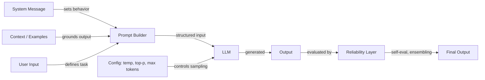

# Ingénierie des prompts

## Définition

L'ingénierie des prompts est la pratique qui consiste à élaborer un texte d'entrée — instructions, exemples, contraintes et contexte — pour contrôler le comportement des grands modèles de langage sans modifier leurs poids. C'est l'interface principale entre l'intention humaine et la sortie du modèle, couvrant tout, de la formulation d'instructions simples aux stratégies de raisonnement sophistiquées en plusieurs étapes.

La discipline couvre trois domaines interconnectés. La **configuration** comprend les paramètres d'échantillonnage (température, Top-K, Top-P) et les contrôles de génération (nombre maximal de tokens, séquences d'arrêt) qui déterminent comment le modèle produit des tokens. Les **techniques** incluent des approches structurées comme la chaîne de pensée, l'autocohérence, le prompting par recul et le prompting système/rôle qui guident le processus de raisonnement du modèle. La **fiabilité** aborde les méthodes pour rendre les sorties plus dignes de confiance — désensibilisation, assemblage de prompts et auto-évaluation.

À mesure que les LLM s'intègrent dans les systèmes de production, l'ingénierie des prompts a évolué d'une expérimentation ad hoc vers une pratique systématique. Des outils comme [DSPy](https://dspy-docs.vercel.app/) et l'[Ingénierie automatique des prompts](/docs/prompt-engineering/automatic-prompt-engineering) automatisent même certaines parties du processus. Que vous construisiez un chatbot, un assistant de code ou un pipeline d'extraction de données, l'ingénierie des prompts est le premier levier — et le plus accessible — pour améliorer la qualité des sorties.

## Comment ça fonctionne

### Le pipeline de prompts

Chaque interaction avec un LLM commence par un prompt — une entrée structurée pouvant inclure un message système, des instructions utilisateur, des exemples et un contexte récupéré. Le modèle traite cette entrée et génère la sortie token par token, façonnée à la fois par le contenu du prompt et par la configuration d'échantillonnage.

### Configuration vs. technique

Les paramètres de configuration (température, Top-K, Top-P, nombre maximal de tokens) opèrent au niveau de l'échantillonnage des tokens — ils influencent *comment* le modèle sélectionne chaque token. Les techniques (chaîne de pensée, autocohérence, recul) opèrent au niveau de la conception du prompt — elles influencent *sur quoi* le modèle raisonne. Ces deux couches interagissent : l'autocohérence nécessite une température élevée pour générer des chemins de raisonnement diversifiés, tandis que l'extraction de sorties structurées fonctionne mieux avec une température basse pour le déterminisme.

### La couche de fiabilité

L'ingénierie avancée des prompts ajoute une couche de fiabilité par-dessus le prompting de base. Cela inclut l'exécution de plusieurs prompts en parallèle (assemblage), la demande au modèle de critiquer sa propre sortie (auto-évaluation) et l'application de stratégies de désensibilisation pour réduire les erreurs systématiques. Ces méthodes échangent du coût de calcul contre de la qualité de sortie et sont particulièrement importantes dans les applications à enjeux élevés.

## Ressources pratiques

- [OpenAI — Guide d'ingénierie des prompts](https://platform.openai.com/docs/guides/prompt-engineering) — Guide complet couvrant les meilleures pratiques et les stratégies
- [Anthropic — Conception de prompts](https://docs.anthropic.com/en/docs/build-with-claude/prompt-engineering/overview) — Documentation officielle de prompting d'Anthropic
- [Learn Prompting](https://learnprompting.org/) — Cours open source couvrant les techniques d'ingénierie des prompts
- [Prompt Engineering Guide (DAIR.AI)](https://www.promptingguide.ai/) — Guide maintenu par la communauté avec des articles et des techniques
- [Documentation DSPy](https://dspy-docs.vercel.app/) — Framework pour l'optimisation programmatique des prompts

## Voir aussi

- [Température, Top-K, Top-P](/docs/prompt-engineering/temperature-top-k-top-p)
- [Nombre maximal de tokens et séquences d'arrêt](/docs/prompt-engineering/max-tokens-stop-sequences)
- [Sorties structurées](/docs/prompt-engineering/structured-outputs)
- [Prompts système, de rôle et contextuels](/docs/prompt-engineering/system-role-contextual-prompting)
- [Autocohérence](/docs/prompt-engineering/self-consistency)
- [Prompting par recul](/docs/prompt-engineering/step-back-prompting)
- [Ingénierie automatique des prompts (APE)](/docs/prompt-engineering/automatic-prompt-engineering)
- [Techniques de désensibilisation](/docs/prompt-engineering/debiasing-techniques)
- [Assemblage de prompts](/docs/prompt-engineering/prompt-ensembling)
- [Auto-évaluation et calibration](/docs/prompt-engineering/self-evaluation-calibration)
- [LLMs](/docs/llms)
- [Chaîne de pensée](/docs/reasoning-patterns/cot)
- [RAG](/docs/rag)
- [Agents IA](/docs/agents)
