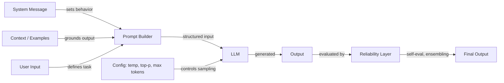

# Prompt engineering

## Définition

Le prompt engineering est la pratique consistant à concevoir du texte d'entrée — instructions, exemples, contraintes et contexte — pour contrôler le comportement des grands modèles de langage sans modifier leurs poids. C'est l'interface principale entre l'intention humaine et la sortie du modèle, englobant tout, de la simple formulation d'instructions aux stratégies de raisonnement multi-étapes sophistiquées.

La discipline couvre trois domaines interconnectés. La **configuration** englobe les paramètres d'échantillonnage (température, Top-K, Top-P) et les contrôles de génération (nombre maximal de tokens, séquences d'arrêt) qui déterminent comment le modèle produit des tokens. Les **techniques** incluent des approches structurées comme la chaîne de pensée (chain-of-thought), la self-consistency, le step-back prompting et le system/role prompting qui guident le processus de raisonnement du modèle. La **fiabilité** aborde les méthodes pour rendre les sorties plus dignes de confiance — débiaisage, prompt ensembling et auto-évaluation.

À mesure que les LLM s'intègrent dans des systèmes de production, le prompt engineering a évolué d'une expérimentation ad hoc vers une pratique systématique. Des outils comme [DSPy](https://dspy-docs.vercel.app/) et l'[Automatic Prompt Engineering](/docs/prompt-engineering/automatic-prompt-engineering) automatisent même certaines parties du processus. Que vous construisiez un chatbot, un assistant de code ou un pipeline d'extraction de données, le prompt engineering est le premier levier, et le plus accessible, pour améliorer la qualité des sorties.

## Fonctionnement

### Le pipeline de prompt

Chaque interaction avec un LLM commence par un prompt — une entrée structurée qui peut inclure un message système, des instructions utilisateur, des exemples et du contexte récupéré. Le modèle traite cette entrée et génère la sortie token par token, influencée à la fois par le contenu du prompt et la configuration d'échantillonnage.

### Configuration versus technique

Les paramètres de configuration (température, Top-K, Top-P, max tokens) opèrent au niveau de l'échantillonnage des tokens — ils affectent *comment* le modèle sélectionne chaque token. Les techniques (chaîne de pensée, self-consistency, step-back) opèrent au niveau de la conception du prompt — elles affectent *sur quoi* le modèle raisonne. Ces deux couches interagissent : la self-consistency nécessite une température élevée pour générer des chemins de raisonnement diversifiés, tandis que l'extraction de sorties structurées fonctionne mieux avec une température basse pour le déterminisme.

### La couche de fiabilité

Le prompt engineering avancé ajoute une couche de fiabilité par-dessus le prompting de base. Cela inclut l'exécution de plusieurs prompts en parallèle (ensembling), la critique par le modèle de sa propre sortie (auto-évaluation) et l'application de stratégies de débiaisage pour réduire les erreurs systématiques. Ces méthodes échangent du coût de calcul contre de la qualité de sortie et sont particulièrement importantes dans les applications à enjeux élevés.

## Ressources pratiques

- [OpenAI — Guide de prompt engineering](https://platform.openai.com/docs/guides/prompt-engineering) — Guide complet couvrant les meilleures pratiques et stratégies
- [Anthropic — Conception de prompts](https://docs.anthropic.com/en/docs/build-with-claude/prompt-engineering/overview) — Documentation officielle de prompting d'Anthropic
- [Learn Prompting](https://learnprompting.org/) — Cours open source couvrant les techniques de prompt engineering
- [Prompt Engineering Guide (DAIR.AI)](https://www.promptingguide.ai/) — Guide maintenu par la communauté avec articles et techniques
- [Documentation DSPy](https://dspy-docs.vercel.app/) — Framework pour l'optimisation programmatique des prompts

## Voir aussi

- [Température, Top-K, Top-P](/docs/prompt-engineering/temperature-top-k-top-p)
- [Max tokens et séquences d'arrêt](/docs/prompt-engineering/max-tokens-stop-sequences)
- [Sorties structurées](/docs/prompt-engineering/structured-outputs)
- [System, role et contextual prompting](/docs/prompt-engineering/system-role-contextual-prompting)
- [Self-consistency](/docs/prompt-engineering/self-consistency)
- [Step-back prompting](/docs/prompt-engineering/step-back-prompting)
- [Automatic Prompt Engineering (APE)](/docs/prompt-engineering/automatic-prompt-engineering)
- [Techniques de débiaisage](/docs/prompt-engineering/debiasing-techniques)
- [Prompt ensembling](/docs/prompt-engineering/prompt-ensembling)
- [Auto-évaluation et calibration](/docs/prompt-engineering/self-evaluation-calibration)
- [LLMs](/docs/llms)
- [Chaîne de pensée](/docs/reasoning-patterns/cot)
- [RAG](/docs/rag)
- [Agents IA](/docs/agents)
