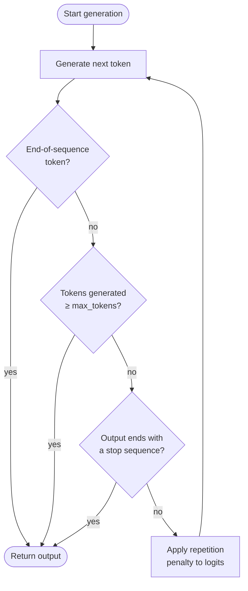

# Nombre maximal de tokens et séquences d'arrêt

## Définition

Le nombre maximal de tokens, les séquences d'arrêt et les pénalités de répétition sont des paramètres de contrôle de génération qui déterminent quand le modèle cesse de générer et comment il gère le contenu répété. Tandis que les paramètres d'échantillonnage comme la température façonnent *ce que* dit le modèle, les paramètres de contrôle de génération façonnent *combien* il dit, *où* il s'arrête et *à quel point* il reste varié au cours d'une longue réponse. Chaque API de LLM expose une version de ces contrôles, et les comprendre est essentiel pour construire des pipelines fiables et rentables.

Le **nombre maximal de tokens** fixe une limite supérieure stricte sur le nombre de tokens que le modèle peut générer dans une seule réponse. Il agit comme un plafond de sécurité : le modèle s'arrête dès qu'il émettrait un token qui dépasse ce budget. Ce n'est pas une longueur cible — le modèle peut s'arrêter plus tôt s'il génère naturellement un token de fin de séquence. Choisir une valeur appropriée de nombre maximal de tokens est important à la fois pour le coût (vous êtes généralement facturé par token de sortie) et pour la correction (une réponse tronquée peut laisser des objets JSON ouverts, interrompre une chaîne de raisonnement, ou livrer des résultats partiels aux systèmes en aval).

Les **séquences d'arrêt** fournissent des conditions d'arrêt sémantiques : une ou plusieurs chaînes qui, une fois générées, font immédiatement s'arrêter le modèle (la chaîne d'arrêt elle-même est exclue de la sortie). Elles sont indispensables pour la génération structurée — entourer la sortie du LLM dans un délimiteur connu et utiliser le délimiteur de fermeture comme séquence d'arrêt rend l'extraction triviale et robuste. Les **pénalités de répétition** (pénalité de fréquence et pénalité de présence dans OpenAI ; non exposées nativement dans l'API messages d'Anthropic) réduisent la probabilité de regénérer des tokens qui sont déjà apparus, décourageant les boucles et le texte de remplissage qui peuvent émerger dans les générations longues.

## Comment ça fonctionne



Chaque token généré passe par trois points de contrôle en séquence : détection de fin de séquence, application du budget maximal de tokens et correspondance des séquences d'arrêt. Si aucune des conditions d'arrêt ne se déclenche, la pénalité de répétition est appliquée aux logits du prochain token avant que l'échantillonnage ne reprenne.

### Nombre maximal de tokens

Le paramètre `max_tokens` (appelé `max_tokens_to_sample` dans les anciens SDK Anthropic, maintenant `max_tokens`) est un champ requis ou fortement recommandé dans la plupart des API de LLM. Le fixer trop bas risque de tronquer la sortie ; le fixer inutilement haut gaspille du calcul et augmente la latence sur les endpoints de streaming. Une heuristique pratique : estimer la longueur de sortie attendue, puis fixer `max_tokens` à 1,5–2× cette estimation comme plafond de sécurité. Pour les sorties structurées comme JSON, profiler le nombre de tokens dans le pire cas de votre schéma et ajouter une marge de 20 %.

### Séquences d'arrêt

Les séquences d'arrêt sont définies comme une liste de chaînes. Le modèle scanne sa sortie après chaque token et s'arrête dès que le texte généré se termine par une entrée de la liste. Les patterns courants incluent `["###", "\n\n", "</answer>", "```"]` pour les templates de prompts structurés, `["\nHuman:", "\nUser:"]` pour les simulateurs de chat qui ne doivent pas générer le prochain tour de l'utilisateur, et des délimiteurs de fermeture comme `["</json>"]` pour l'extraction balisée. Les séquences d'arrêt sont comparées au texte brut généré, pas aux limites tokenisées, donc les chaînes multi-tokens fonctionnent correctement. Un point important : la séquence d'arrêt n'est *pas* incluse dans le texte retourné, donc votre logique d'analyse doit tenir compte de son absence.

### Pénalités de répétition

L'API d'OpenAI expose deux paramètres de pénalité distincts. La **pénalité de fréquence** (`frequency_penalty`, plage −2,0 à 2,0) réduit le logit d'un token proportionnellement au nombre de fois qu'il est déjà apparu dans le texte généré — décourageant la répétition des mots fréquemment utilisés. La **pénalité de présence** (`presence_penalty`, plage −2,0 à 2,0) applique une réduction de logit forfaitaire à tout token apparu au moins une fois, indépendamment de la fréquence — décourageant la réutilisation de tout token déjà vu. Les valeurs positives réduisent la répétition ; les valeurs négatives l'encouragent. Des valeurs dans la plage 0,1–0,5 sont généralement suffisantes pour supprimer les boucles sans dégrader significativement la qualité de la sortie. Les valeurs supérieures à 1,0 peuvent amener le modèle à éviter des mots de liaison utiles et dégrader la cohérence.

## Quand utiliser / Quand NE PAS utiliser

| Scénario | Paramètres recommandés | Éviter |
|----------|------------------------|--------|
| Réponses factuelles courtes ou classifications | `max_tokens=50–150` ; pas besoin de séquences d'arrêt | `max_tokens` très élevé ; gaspille le budget et peut inviter au rembourrage |
| Extraction JSON structurée ou balisée | Arrêt sur le délimiteur de fermeture (ex. `["</json>"]`) ; `max_tokens` dimensionné au schéma du pire cas | Omission des séquences d'arrêt ; le modèle peut ajouter de la prose après l'accolade fermante |
| Simulation de chat multi-tours | Séquences d'arrêt `["\nHuman:", "\nUser:"]` pour empêcher le modèle de générer le prochain tour de l'utilisateur | Pas de séquences d'arrêt ; le modèle va halluciner le prochain tour de conversation |
| Génération longue forme (essais, rapports) | `max_tokens` élevé (2048–4096+) ; `frequency_penalty=0,2` léger pour éviter les formulations répétitives | `frequency_penalty > 1,0` ; casse la cohérence stylistique et évite les termes répétés légitimes |
| Génération de code | Arrêt sur des délimiteurs appropriés au langage (ex. triple backtick) ; `max_tokens` dimensionné à la longueur de la fonction | `presence_penalty > 0,5` ; les noms de variables et les mots-clés doivent se répéter — les pénalités nuisent à la correction |
| Inférence par lot sensible aux coûts | Fixer `max_tokens` au plus proche du 95e percentile de la longueur de sortie attendue | Laisser `max_tokens` au maximum de l'API (ex. 4096) quand la sortie typique est de 100 tokens |

## Exemples de code

### OpenAI — max_tokens, stop et frequency_penalty

```python
# OpenAI SDK: max_tokens, stop sequences, and repetition penalties
# pip install openai

import os
from openai import OpenAI

client = OpenAI(api_key=os.environ["OPENAI_API_KEY"])


def extract_with_controls(
    text: str,
    max_tokens: int = 512,
    stop: list[str] | None = None,
    frequency_penalty: float = 0.0,
    presence_penalty: float = 0.0,
) -> str:
    """Call the chat API with full generation-control parameters."""
    response = client.chat.completions.create(
        model="gpt-4o",
        messages=[
            {
                "role": "system",
                "content": (
                    "You are a structured data extractor. "
                    "Output only valid JSON between <json> and </json> tags."
                ),
            },
            {"role": "user", "content": f"Extract key facts from:\n\n{text}"},
        ],
        max_tokens=max_tokens,
        stop=stop or ["</json>"],
        frequency_penalty=frequency_penalty,
        presence_penalty=presence_penalty,
        temperature=0,
    )
    raw = response.choices[0].message.content
    # Strip the opening tag; closing tag was consumed by stop sequence
    return raw.replace("<json>", "").strip()


if __name__ == "__main__":
    article = (
        "SpaceX launched its Starship rocket on March 14, 2024. "
        "The vehicle reached an altitude of 210 km before completing a controlled reentry. "
        "It was the third integrated flight test of the system."
    )

    # Tight budget extraction
    result = extract_with_controls(
        article,
        max_tokens=256,
        stop=["</json>"],
        frequency_penalty=0.1,
    )
    print(result)

    # Long-form summary with anti-repetition penalty
    summary_resp = client.chat.completions.create(
        model="gpt-4o",
        messages=[{"role": "user", "content": f"Write a 3-paragraph summary of: {article}"}],
        max_tokens=600,
        frequency_penalty=0.4,
        presence_penalty=0.1,
        temperature=0.6,
    )
    print(summary_resp.choices[0].message.content)
```

### Anthropic — max_tokens et stop_sequences

```python
# Anthropic SDK: max_tokens and stop_sequences
# pip install anthropic

import os
import anthropic

client = anthropic.Anthropic(api_key=os.environ["ANTHROPIC_API_KEY"])


def generate_with_controls(
    prompt: str,
    max_tokens: int = 512,
    stop_sequences: list[str] | None = None,
) -> tuple[str, str]:
    """
    Returns (text_content, stop_reason).
    stop_reason is 'end_turn', 'max_tokens', or 'stop_sequence'.
    """
    message = client.messages.create(
        model="claude-opus-4-5",
        max_tokens=max_tokens,
        stop_sequences=stop_sequences or [],
        messages=[{"role": "user", "content": prompt}],
        temperature=0,
    )
    text = "".join(block.text for block in message.content if hasattr(block, "text"))
    return text, message.stop_reason


if __name__ == "__main__":
    # JSON extraction with stop sequence on closing delimiter
    json_prompt = (
        "Extract the event name, date, and location from the following text as JSON "
        "between <json> and </json> tags:\n\n"
        "The annual PyCon US conference will be held in Pittsburgh, PA on May 14-22, 2025."
    )
    output, reason = generate_with_controls(
        json_prompt,
        max_tokens=256,
        stop_sequences=["</json>"],
    )
    print(f"Stop reason: {reason}")
    print(output)

    # Constrained generation — stop before model generates a second answer
    answer_prompt = "Answer in one sentence: What is gradient descent?"
    answer, reason = generate_with_controls(
        answer_prompt,
        max_tokens=100,
        stop_sequences=["\n\n"],
    )
    print(f"Stop reason: {reason}")
    print(answer)
```

## Ressources pratiques

- [OpenAI — Référence API : chat completions](https://platform.openai.com/docs/api-reference/chat/create) — Référence complète des paramètres pour `max_tokens`, `stop`, `frequency_penalty` et `presence_penalty`
- [Anthropic — Référence API : messages](https://docs.anthropic.com/en/api/messages) — Référence pour `max_tokens` et `stop_sequences` dans l'API Messages
- [OpenAI — Gestion des tokens](https://platform.openai.com/docs/guides/text-generation/managing-tokens) — Guide pour compter les tokens, comprendre les fenêtres de contexte et dimensionner `max_tokens` de manière appropriée
- [Hugging Face — Contrôle de la génération de texte](https://huggingface.co/docs/transformers/main_classes/text_generation) — Documentation bas niveau sur `max_new_tokens`, `eos_token_id`, `repetition_penalty` et les paramètres associés dans la bibliothèque Transformers
- [tiktoken (tokeniseur OpenAI)](https://github.com/openai/tiktoken) — Bibliothèque de comptage de tokens pour estimer les budgets de tokens de sortie avant les appels API

## Voir aussi

- [Ingénierie des prompts](/docs/prompt-engineering)
- [Température, Top-K, Top-P](/docs/prompt-engineering/temperature-top-k-top-p)
- [Sorties structurées](/docs/prompt-engineering/structured-outputs)
- [Autocohérence](/docs/prompt-engineering/self-consistency)
- [LLMs](/docs/llms)
- [Chaîne de pensée](/docs/reasoning-patterns/cot)
