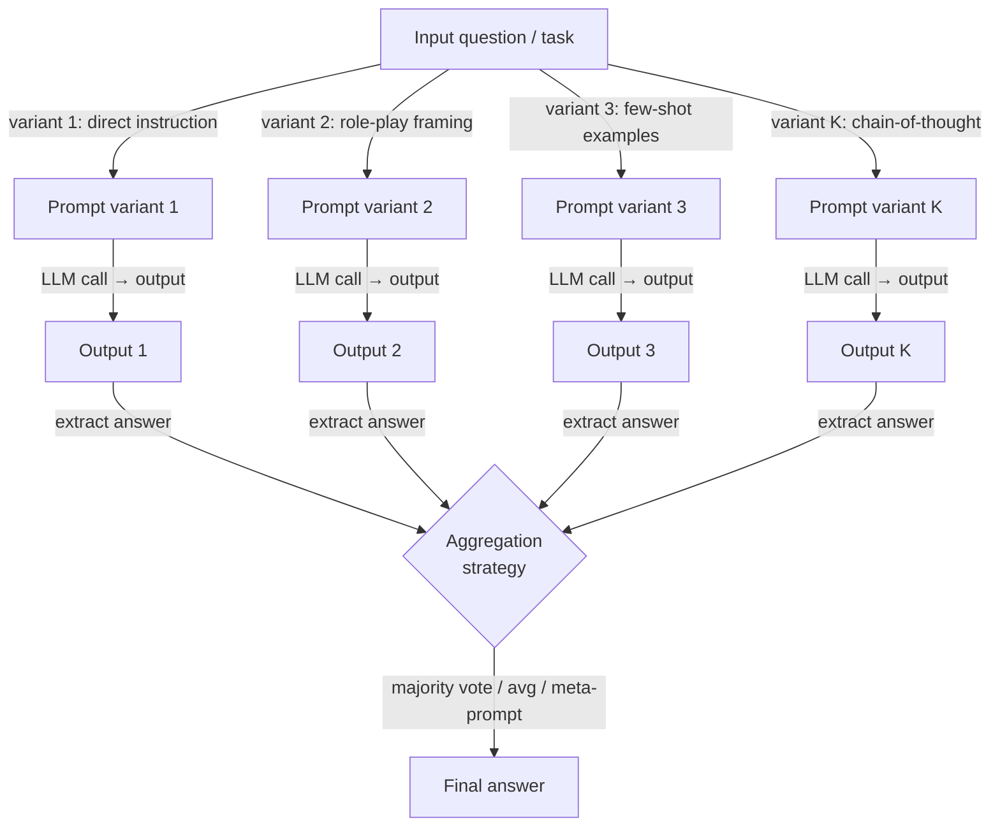

# Prompt ensembling

## Définition

Le prompt ensembling est une technique de prompting qui génère plusieurs formulations structurellement différentes de la même question ou tâche, les soumet toutes à un modèle de langage, puis combine les sorties résultantes en une seule réponse finale. L'intuition centrale est empruntée aux ensembles classiques de machine learning (bagging, boosting, stacking) : aucun prédicteur unique n'est parfait, mais un comité diversifié de prédicteurs imparfaits tend à être plus fiable que tout membre individuel, car leurs erreurs sont partiellement non corrélées et s'annulent donc dans l'agrégation.

La distinction critique entre le prompt ensembling et la self-consistency est la source de diversité. Dans la self-consistency, vous exécutez le *même* prompt N fois à température > 0 et vous vous appuyez sur l'échantillonnage stochastique pour produire des chemins de raisonnement diversifiés. Dans le prompt ensembling, vous concevez délibérément des prompts *différents* — variant le cadrage, l'assignation de rôle, la formulation des instructions, les exemples few-shot ou le format de sortie — et exécutez chacun (typiquement à température 0 ou basse) pour produire des sorties diversifiées mais déterministes. La self-consistency exploite la variance introduite par l'échantillonnage ; le prompt ensembling exploite la variance introduite par la conception du prompt. En pratique, les deux approches sont complémentaires et peuvent être combinées.

Le prompt ensembling est particulièrement précieux dans deux scénarios. Premièrement, lorsque vous n'êtes pas certain de quelle formulation de prompt est optimale pour une tâche et ne pouvez pas évaluer les alternatives à grande échelle — exécuter plusieurs candidats et voter sur leurs sorties vous donne le bénéfice du meilleur prompt sans avoir à l'identifier à l'avance. Deuxièmement, lorsqu'une tâche est à enjeux élevés et que le mode de défaillance d'un seul prompt est inacceptable — un ensemble fournit une piste d'audit douce, car la dispersion des votes entre différentes réponses est un signal direct d'incertitude du modèle. Le coût principal est la latence et les tokens : K variantes de prompt nécessitent K appels d'inférence, qui peuvent être parallélisés mais pas éliminés.

## Fonctionnement



### Stratégies de variation de prompt

La qualité d'un ensemble dépend fortement de la *diversité* des variantes de prompt. Si toutes les variantes sont superficiellement différentes mais structurellement identiques, l'ensemble dégénère vers un échantillonnage répété. Les stratégies de variation efficaces incluent :

**Variation de rôle et de persona.** Assigner différents personas d'expert (par ex., « Vous êtes un médecin prudent », « Vous êtes un data scientist », « Vous êtes un ingénieur pragmatique ») déplace le prior du modèle sur les réponses plausibles et active différents registres de connaissance. La variation de rôle est particulièrement efficace pour les tâches avec plusieurs cadrages valides.

**Variation de formulation des instructions.** La même tâche peut être formulée comme une question (« Quel est le niveau de risque de... ? »), une commande (« Évaluez le niveau de risque de... »), ou une complétion (« Le niveau de risque de ... est »), et ces différences de surface modifient mesurably la distribution de sortie du modèle. Paraphraser l'instruction centrale est la forme de variation à moindre effort.

**Variation d'exemples few-shot.** Utiliser différents ensembles d'exemples en contexte change quelle partie de la connaissance du modèle le contexte few-shot active. La rotation à travers des ensembles d'exemples tirés de différents sous-domaines de la distribution d'entraînement augmente substantiellement la diversité de l'ensemble, en particulier pour les tâches de classification.

**Variation chaîne de pensée vs réponse directe.** Inclure une ou plusieurs variantes CoT aux côtés de variantes à réponse directe combine les bénéfices de qualité de raisonnement du CoT avec les bénéfices de vitesse du prompting direct. Les variantes CoT reçoivent généralement plus de poids dans l'agrégation car elles sont plus fiables, mais les variantes directes peuvent l'emporter dans les cas où le CoT amène le modèle à sur-réfléchir des questions simples.

**Variation du format de sortie.** Demander la réponse sous forme d'objet JSON, de liste numérotée, ou de phrase en texte libre peut susciter différents niveaux de précision. Les variantes de sortie structurée sont plus faciles à analyser et agréger programmatiquement.

### Méthodes d'agrégation

Une fois que vous avez K sorties, vous devez les réduire à une seule réponse. Le choix de la méthode d'agrégation doit correspondre au type de sortie :

**Le vote majoritaire** fonctionne mieux pour les sorties discrètes (étiquettes de classification, réponses factuelles courtes, sélections à choix multiples). Il est robuste aux variantes adversariales ou confuses, ne nécessite pas d'appels de modèle supplémentaires, et imite directement le fonctionnement de la self-consistency. Les égalités peuvent être résolues par log-probabilité ou en déférant à une variante « de confiance » désignée.

**La moyenne des scores** est appropriée quand chaque variante retourne un score numérique ou une probabilité plutôt qu'une étiquette. La moyenne est sensible aux valeurs aberrantes ; l'agrégation par médiane est plus robuste quand les variantes individuelles peuvent produire des valeurs extrêmes.

**L'agrégation par méta-prompt (LLM-as-judge)** envoie toutes les K sorties à un second appel LLM instruit de synthétiser ou sélectionner la meilleure réponse. C'est la méthode la plus puissante mais la plus coûteuse, et elle introduit un second point de défaillance LLM. Elle est plus utile quand la tâche nécessite une génération ouverte (résumés, code, essais) où le vote majoritaire n'est pas applicable.

**Le vote pondéré** assigne différents poids à différentes variantes basés sur leur précision historique sur un ensemble de validation retenu. Si vous avez des données étiquetées et pouvez mesurer quelles variantes performent le mieux, la pondération surpasse significativement le vote uniforme — mais elle nécessite un effort de calibration au préalable.

## Quand utiliser / Quand NE PAS utiliser

| Utiliser quand | Éviter quand |
|----------------|--------------|
| Vous n'êtes pas certain de quelle formulation de prompt fonctionne le mieux et ne pouvez pas les évaluer individuellement à grande échelle | La latence est une contrainte forte — K appels parallèles ont encore la latence de l'appel le plus lent |
| La tâche est à enjeux élevés et le mode de défaillance d'un seul prompt est inacceptable | Le budget de tokens est sévèrement limité et vous ne pouvez pas vous permettre K complétions |
| Les sorties de différents cadrages de prompt fournissent des perspectives complémentaires (par ex., diagnostic médical depuis plusieurs angles de spécialistes) | Le modèle atteint déjà la précision plafond avec un seul prompt bien affiné — rendements décroissants |
| Vous voulez un signal d'incertitude intégré (dispersion des votes = désaccord du modèle) | L'espace de sortie est continu ou ouvert d'une manière qui rend le vote ou la moyenne sans sens |
| Vous construisez un pipeline de production où la sensibilité au prompt doit être amortie | Vous manquez de l'infrastructure d'ingénierie pour exécuter et agréger des appels LLM parallèles |

## Comparaisons

| Critère | Prompt ensembling | Self-consistency | Prompt unique |
|---------|------------------|-----------------|---------------|
| Source de diversité | Différentes conceptions de prompt | Échantillonnage stochastique d'un prompt | Aucune |
| Nombre d'appels LLM | K (nombre de variantes, typiquement 3–10) | N (typiquement 10–40) | 1 |
| Température | Basse (0–0.3) par variante | Haute (0.5–0.8) | Dépend de la tâche |
| Amélioration de la précision | Haute pour les tâches sensibles à la formulation du prompt | Haute pour le raisonnement multi-étapes | Référence |
| Nécessite un effort d'ingénierie de prompt | Oui — concevoir des variantes diversifiées | Non — un seul prompt nécessaire | Modéré |
| Gère les sorties ouvertes | Oui, via l'agrégation par méta-prompt | Non — le vote majoritaire nécessite des réponses discrètes | Oui |
| Meilleur cas d'utilisation | Tâches avec sensibilité au prompt ou plusieurs cadrages valides | Math, raisonnement symbolique, QA factuel | Tâches simples et bien définies avec un bon prompt connu |

## Exemples de code

### Prompt ensembling avec plusieurs templates via OpenAI

```python
# Prompt ensembling: run K prompt variants and aggregate by majority vote
# pip install openai

import os
from collections import Counter
from openai import OpenAI

client = OpenAI(api_key=os.environ["OPENAI_API_KEY"])

# Five structurally different prompt variants for the same classification task
PROMPT_VARIANTS = [
    # 1. Direct instruction
    "Is the following customer review positive, negative, or neutral? "
    "Reply with exactly one word.\n\nReview: {review}",

    # 2. Role-play framing
    "You are a sentiment analysis expert. Classify the sentiment of the "
    "review below as positive, negative, or neutral. Output only the label.\n\nReview: {review}",

    # 3. Few-shot examples
    "Review: 'The product broke in two days.' → negative\n"
    "Review: 'Decent quality for the price.' → neutral\n"
    "Review: 'Absolutely love it, will buy again!' → positive\n"
    "Review: '{review}' →",

    # 4. Chain-of-thought variant
    "Analyze the sentiment of this review step by step, then state the "
    "final label (positive / negative / neutral) on the last line.\n\nReview: {review}",

    # 5. Completion framing
    "The overall sentiment expressed in the review '{review}' is",
]


def call_variant(prompt: str, model: str = "gpt-4o-mini") -> str:
    """Call the LLM with a single prompt variant and return the raw response."""
    resp = client.chat.completions.create(
        model=model,
        messages=[{"role": "user", "content": prompt}],
        temperature=0.0,
        max_tokens=80,
    )
    return resp.choices[0].message.content.strip()


def extract_label(text: str) -> str | None:
    """Extract a sentiment label from raw model output."""
    text_lower = text.lower()
    for label in ("positive", "negative", "neutral"):
        if label in text_lower:
            return label
    return None


def ensemble_sentiment(review: str) -> dict:
    """Run all prompt variants and aggregate by majority vote."""
    raw_outputs, labels = [], []

    for i, template in enumerate(PROMPT_VARIANTS):
        prompt = template.format(review=review)
        raw = call_variant(prompt)
        label = extract_label(raw)
        raw_outputs.append(raw)
        if label:
            labels.append(label)
        print(f"  Variant {i + 1}: {label!r}  (raw: {raw[:60]!r})")

    if not labels:
        return {"answer": None, "votes": {}}

    counts = Counter(labels)
    winner, top_votes = counts.most_common(1)[0]
    return {
        "answer": winner,
        "confidence": top_votes / len(labels),
        "votes": dict(counts),
        "raw_outputs": raw_outputs,
    }


if __name__ == "__main__":
    review = (
        "The delivery was fast but the item looks nothing like the photos. "
        "I'm disappointed and won't order again."
    )
    result = ensemble_sentiment(review)
    print(f"\nFinal answer : {result['answer']}")
    print(f"Confidence   : {result['confidence']:.0%}")
    print(f"Vote counts  : {result['votes']}")
```

### Ensemble pondéré avec un ensemble de validation retenu

```python
# Weighted prompt ensembling: calibrate variant weights from a validation set
# pip install openai scikit-learn

import os
from collections import defaultdict
from openai import OpenAI
from sklearn.metrics import accuracy_score

client = OpenAI(api_key=os.environ["OPENAI_API_KEY"])


def evaluate_variant(template: str, examples: list[dict]) -> float:
    """Return accuracy of a single prompt variant on a labeled dataset."""
    preds = []
    for ex in examples:
        prompt = template.format(review=ex["text"])
        raw = call_variant(prompt)   # reuse function from above
        preds.append(extract_label(raw) or "neutral")
    return accuracy_score([ex["label"] for ex in examples], preds)


def weighted_ensemble(review: str, templates: list[str], weights: list[float]) -> str:
    """Aggregate variant outputs with per-variant weights."""
    scores: dict[str, float] = defaultdict(float)
    for template, weight in zip(templates, weights):
        raw = call_variant(template.format(review=review))
        label = extract_label(raw)
        if label:
            scores[label] += weight
    return max(scores, key=scores.__getitem__) if scores else "neutral"


if __name__ == "__main__":
    # Dummy validation set — replace with real labeled examples
    val_set = [
        {"text": "Great product!", "label": "positive"},
        {"text": "Terrible quality.", "label": "negative"},
        {"text": "It's okay I guess.", "label": "neutral"},
    ]
    # Calibrate weights (accuracy on val set)
    weights = [evaluate_variant(t, val_set) for t in PROMPT_VARIANTS]
    print("Variant weights:", [f"{w:.2f}" for w in weights])

    review = "Arrived on time but packaging was damaged."
    answer = weighted_ensemble(review, PROMPT_VARIANTS, weights)
    print("Weighted ensemble answer:", answer)
```

## Ressources pratiques

- [Diverse Demonstrations Improve In-context Compositional Generalization (Levy et al., 2022)](https://arxiv.org/abs/2212.06800) — Montre que des exemples few-shot diversifiés, la colonne vertébrale de la variation de prompt, améliorent significativement la généralisation par rapport aux démonstrations échantillonnées aléatoirement.
- [Self-Consistency Improves Chain of Thought Reasoning in Language Models (Wang et al., 2022)](https://arxiv.org/abs/2203.11171) — Le parent le plus proche du prompt ensembling ; contexte essentiel pour comprendre l'agrégation sur plusieurs sorties LLM.
- [Prompt Sensitivity and Prompt Ensembling for LLMs (Mizrahi et al., 2024)](https://arxiv.org/abs/2401.00595) — Étudie directement dans quelle mesure la précision des LLM varie selon les prompts paraphrasés et démontre que l'ensembling sur les paraphrases comble la majeure partie de l'écart.
- [Universal Self-Consistency for Large Language Model Generation (Chen et al., 2023)](https://arxiv.org/abs/2311.17311) — Étend la self-consistency à la génération ouverte via l'agrégation par méta-prompt, comblant le fossé entre l'ensembling par vote majoritaire et les sorties en forme libre.

## Voir aussi

- [Prompt engineering](/docs/prompt-engineering)
- [Self-consistency](/docs/prompt-engineering/self-consistency)
- [Automatic prompt engineering](/docs/prompt-engineering/automatic-prompt-engineering)
