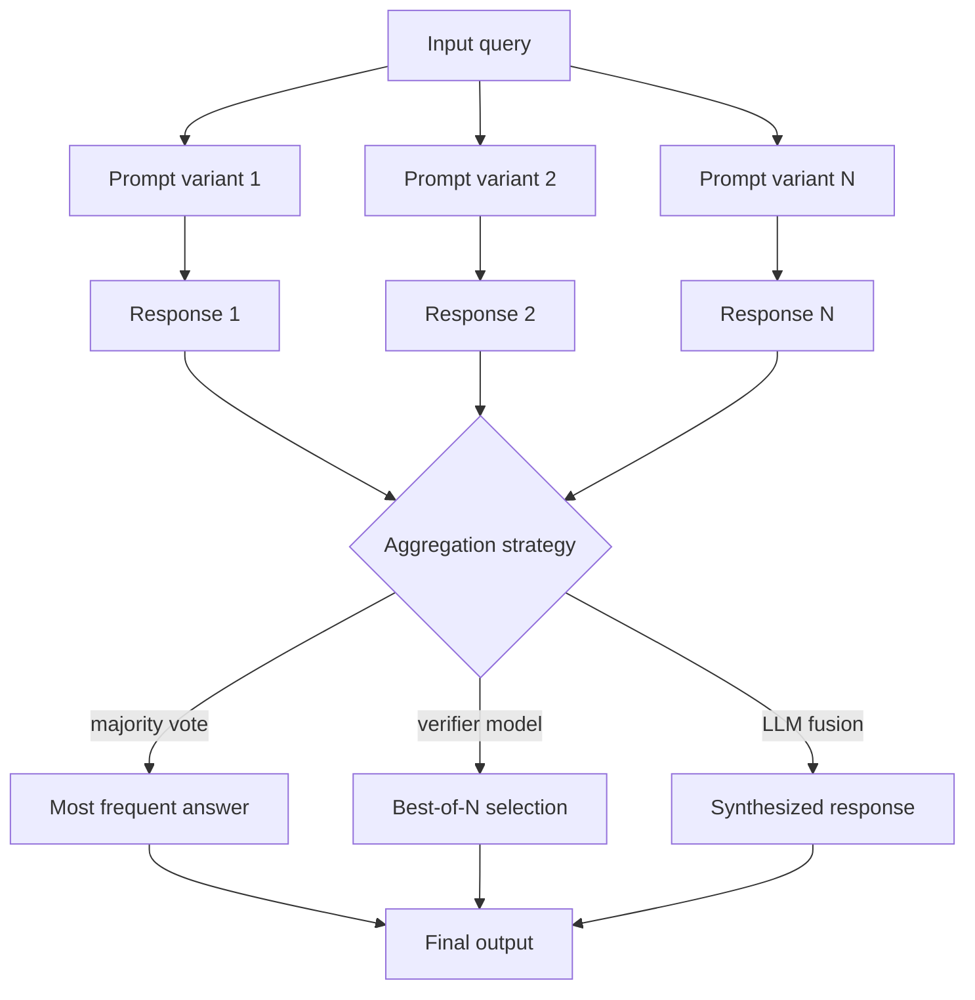

# Assemblage de prompts

## Définition

L'assemblage de prompts est la pratique d'exécuter plusieurs versions d'un prompt — variant la formulation, les exemples few-shot, les paramètres d'échantillonnage ou même les modèles sous-jacents — puis d'agréger leurs sorties pour produire une réponse finale plus fiable. Tout comme les méthodes d'ensemble dans l'apprentissage automatique traditionnel (forêts aléatoires, boosting) réduisent la variance en combinant des prédicteurs faibles, l'assemblage de prompts exploite la diversité des sorties LLM pour atténuer les erreurs systématiques, les biais de position et la variance d'échantillonnage.

La stratégie d'agrégation la plus simple est le vote majoritaire : poser la même question de plusieurs manières et prendre la réponse la plus fréquente. Pour les tâches de génération de texte libre, des stratégies plus sophistiquées incluent la sélection du meilleur résultat par un modèle vérificateur, la fusion de réponses (demander à un LLM de synthétiser les N meilleures réponses en une seule) et la pondération basée sur la confiance (pondérer les réponses selon les probabilités log ou les scores de confiance auto-rapportés).

L'assemblage de prompts est étroitement lié à l'autocohérence (qui est un type d'ensemble pour les tâches de raisonnement) mais est plus général : il s'applique à la classification, à la QR factuelle, à la génération de résumés, à la traduction, à l'annotation de données et à n'importe quel scénario où vous pouvez définir une procédure d'agrégation et vous pouvez vous permettre d'exécuter le pipeline N fois.

## Comment ça fonctionne



### Variants de prompts

La diversité est le moteur de l'assemblage. Les types courants de variation incluent : reformulation des instructions (formelle vs. informelle, directe vs. guidée), différentes sélections d'exemples few-shot (ensembles différents ou aléatoires d'exemples), variation du rôle ou du persona dans le prompt système, différents paramètres de température ou d'ordre de génération, et différents modèles sous-jacents entièrement.

### Stratégies d'agrégation

**Vote majoritaire** : Compter les réponses distinctes et prendre la plus fréquente. Fonctionne bien pour la classification et les QR à réponse courte. Pour les réponses longues, vous devez d'abord normaliser ou résumer avant de voter.

**Meilleur de N (vérificateur)** : Générer N réponses candidates et utiliser un modèle séparé (ou le même modèle avec un prompt différent) pour les évaluer et sélectionner la meilleure. Plus coûteux mais plus précis qu'un vote aveugle lorsqu'un bon signal de vérification est disponible.

**Fusion par LLM** : Fournir toutes les réponses N à un LLM et lui demander de les synthétiser en une seule réponse cohérente. Utile quand les réponses sont partiellement correctes et se complètent.

## Quand utiliser / Quand NE PAS utiliser

| Scénario | Assemblage recommandé | Éviter |
|----------|-----------------------|--------|
| Tâches de classification à enjeux élevés | Vote majoritaire sur \>= 5 variants | Réponse unique — la variance d'un seul essai dégrade les métriques |
| QR factuelle avec ambiguïté connue | Meilleur de N avec vérificateur | Quand la précision ne peut pas être évaluée programmatiquement |
| Génération de résumés | Fusion par LLM des meilleures N sorties | Contenu créatif — l'assemblage homogénéise le style |
| Annotation de données pour l'entraînement | Vote majoritaire + filtre désaccord | Latence temps-réel critique — N appels = N× la latence |
| Contraintes de coût strictes | Non recommandé | — |

## Exemples de code

### Vote majoritaire sur des variants de prompts

```python
# Prompt ensembling with majority vote
# pip install openai

import os, collections
from openai import OpenAI

client = OpenAI(api_key=os.environ["OPENAI_API_KEY"])

QUESTION = "What is the boiling point of water at sea level in Celsius?"

PROMPT_VARIANTS = [
    "Answer in one word or number: {question}",
    "Give only the numeric answer: {question}",
    "You are a science tutor. {question} Reply with just the number.",
    "Fact: {question} Answer concisely.",
    "In exactly one number, answer: {question}",
]


def ask(prompt_template: str, question: str) -> str:
    prompt = prompt_template.format(question=question)
    resp = client.chat.completions.create(
        model="gpt-4o",
        messages=[{"role": "user", "content": prompt}],
        temperature=0.3,
        max_tokens=20,
    )
    return resp.choices[0].message.content.strip()


def majority_vote(answers: list[str]) -> str:
    # Normalize: extract first numeric token if present
    normalized = []
    for a in answers:
        tokens = a.split()
        num = next((t.strip("°C.") for t in tokens if t.strip("°C.").lstrip("-").isdigit()), a)
        normalized.append(num)
    counter = collections.Counter(normalized)
    return counter.most_common(1)[0][0]


if __name__ == "__main__":
    answers = [ask(v, QUESTION) for v in PROMPT_VARIANTS]
    for variant, ans in zip(PROMPT_VARIANTS, answers):
        print(f"  [{ans:>5}]  {variant[:50]}")

    final = majority_vote(answers)
    print(f"\nEnsemble answer: {final}")   # expected: 100
```

### Meilleur de N avec un LLM vérificateur

```python
# Best-of-N ensembling with a verifier
# pip install anthropic

import os
import anthropic

client = anthropic.Anthropic(api_key=os.environ["ANTHROPIC_API_KEY"])

TASK = (
    "Write a one-paragraph explanation of gradient descent "
    "suitable for a high-school student."
)


def generate_candidates(task: str, n: int = 4) -> list[str]:
    candidates = []
    for _ in range(n):
        resp = client.messages.create(
            model="claude-opus-4-5",
            max_tokens=200,
            messages=[{"role": "user", "content": task}],
            temperature=0.8,
        )
        candidates.append(resp.content[0].text.strip())
    return candidates


def select_best(task: str, candidates: list[str]) -> str:
    numbered = "\n\n".join(f"[{i+1}] {c}" for i, c in enumerate(candidates))
    verifier_prompt = (
        f"Task: {task}\n\nCandidates:\n{numbered}\n\n"
        "Which candidate best fulfills the task? "
        "Reply with ONLY the number (e.g. '2')."
    )
    resp = client.messages.create(
        model="claude-opus-4-5",
        max_tokens=5,
        messages=[{"role": "user", "content": verifier_prompt}],
        temperature=0,
    )
    idx_str = resp.content[0].text.strip()
    idx = int(idx_str) - 1
    return candidates[idx]


if __name__ == "__main__":
    candidates = generate_candidates(TASK, n=4)
    best = select_best(TASK, candidates)
    print("Selected best candidate:\n")
    print(best)
```

## Ressources pratiques

- [Wang et al., 2022 — Self-Consistency improves Chain-of-Thought](https://arxiv.org/abs/2203.11171) — Introduit l'autocohérence comme une forme d'assemblage pour le raisonnement ; vote majoritaire sur des chemins de pensée diversifiés
- [Cobbe et al., 2021 — Training Verifiers to Solve Math Word Problems](https://arxiv.org/abs/2110.14168) — Sélection meilleur de N guidée par un vérificateur appris ; montre comment les vérificateurs peuvent améliorer la sélection de l'assemblage
- [Li et al., 2022 — Competition-Level Code Generation](https://arxiv.org/abs/2203.07814) — AlphaCode génère des centaines de milliers de programmes et filtre/cluster pour trouver les meilleurs — assemblage à l'extrême pour la génération de code
- [Liang et al., 2022 — Holistic Evaluation of Language Models](https://arxiv.org/abs/2211.09110) — HELM fournit des benchmarks qui révèlent la variance entre les runs, motivant les approches d'assemblage

## Voir aussi

- [Ingénierie des prompts](/docs/prompt-engineering)
- [Autocohérence](/docs/prompt-engineering/self-consistency)
- [Techniques de désensibilisation](/docs/prompt-engineering/debiasing-techniques)
- [Auto-évaluation et calibration](/docs/prompt-engineering/self-evaluation-calibration)
- [Ingénierie automatique des prompts](/docs/prompt-engineering/automatic-prompt-engineering)
- [LLMs](/docs/llms)
