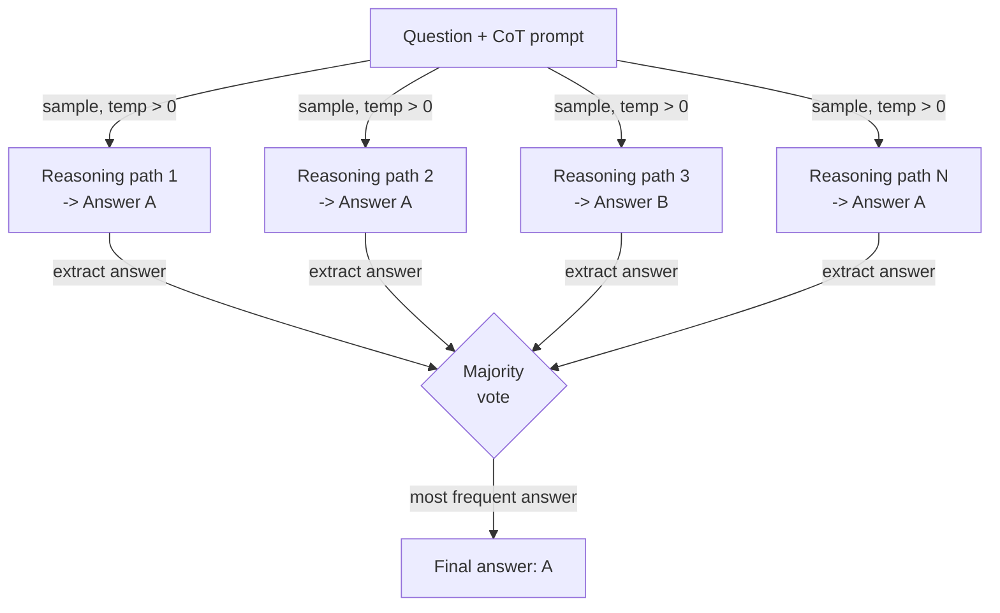

# Self-consistency

## Définition

La self-consistency est une technique de prompting introduite par Wang et al. (2022) qui adresse une faiblesse fondamentale du prompting en chaîne de pensée (CoT) : un seul chemin de raisonnement peut mener à une réponse confiante mais incorrecte. L'intuition est que les réponses correctes tendent à être robustes — plusieurs chemins de raisonnement indépendants qui abordent un problème depuis différents angles devraient converger vers la même réponse — tandis que les réponses incorrectes tendent à être fragiles et inconsistantes selon les chemins. En échantillonnant de nombreuses chaînes de raisonnement à température > 0 et en prenant le vote majoritaire sur leurs réponses finales, la self-consistency agit comme une méthode d'ensemble faible mais pratique qui réduit significativement les erreurs de raisonnement sans aucun fine-tuning du modèle.

La relation avec le CoT est directe : la self-consistency est le CoT avec un échantillonnage répété. Un prompt CoT standard produit une chaîne de raisonnement et une réponse ; la self-consistency produit N chaînes (typiquement 10–40) et N réponses, puis agrège. Le paramètre de température est critique : vous avez besoin de diversité dans les chemins de raisonnement, donc le décodage greedy (température=0) va à l'encontre du but. Une température dans la plage 0.5–0.8 fournit généralement assez de diversité pour un vote efficace tout en gardant chaque chaîne individuelle cohérente. Sur des benchmarks comme GSM8K (problèmes de mots mathématiques), AQuA (raisonnement algébrique) et SVAMP, la self-consistency améliore la précision CoT de 10–20 points de pourcentage au coût de N fois plus d'appels d'inférence.

Ce qui rend la self-consistency pratiquement utile — et distincte du simple ajout d'une étape d'auto-évaluation — est qu'elle ne nécessite pas d'appels de modèle supplémentaires pour « vérifier » ou « critiquer ». Le mécanisme de vote est purement statistique : quelle que soit la réponse qui apparaît le plus fréquemment parmi N échantillons gagne. Cela la rend simple à implémenter, agnostique au modèle et facile à ajuster (il suffit de varier N). La limitation principale est le coût : N complétions coûtent N fois plus. La self-consistency est donc mieux appliquée aux tâches où la précision vaut le budget d'inférence — math, raisonnement multi-étapes et classification à enjeux élevés — plutôt qu'aux applications sensibles à la latence ou au coût des tokens.

## Fonctionnement



### Génération de chemins de raisonnement diversifiés

La première étape est de prompter le modèle avec un prompt CoT few-shot standard — un ensemble de triples exemple (question, raisonnement étape par étape, réponse) suivi de la nouvelle question. La différence clé par rapport au CoT standard est que vous appelez l'API N fois avec température > 0 plutôt qu'une fois avec température 0. Chaque appel est statistiquement indépendant ; le modèle explore une décomposition différente du problème, peut utiliser différentes variables intermédiaires ou ordres de calcul, et peut même faire différentes erreurs intermédiaires — mais si la réponse sous-jacente est correcte, la plupart des chemins y arriveront quand même. Le nombre d'échantillons N est un hyperparamètre : plus d'échantillons réduisent la variance mais augmentent le coût. Dans l'article original, N=40 est utilisé pour la précision maximale ; en pratique, N=10–20 récupère souvent la majeure partie du bénéfice à moindre coût.

### Extraction et normalisation des réponses

Après avoir collecté N complétions, vous devez extraire la réponse finale de chaque chaîne de raisonnement. Pour les prompts CoT bien structurés, la réponse est typiquement dans la dernière phrase après une formule comme « The answer is... » ou « Therefore, X. » Pour les réponses numériques, la normalisation importe : « 3/4 », « 0.75 » et « 75% » sont la même réponse et doivent mapper vers la même forme canonique avant le vote. Pour les tâches de classification ou à réponse courte, l'extraction est généralement une correspondance de sous-chaîne ou une analyse simple. La robustesse de l'extraction est la partie la plus fragile du pipeline — si le modèle produit une chaîne qui ne se termine pas par une réponse clairement analysable, ce chemin doit être écarté ou assigné à un seau « inconnu ».

### Vote majoritaire

L'étape d'agrégation est un comptage de fréquences sur les réponses extraites. La réponse la plus commune gagne. Les égalités peuvent être résolues en choisissant la réponse du chemin avec la log-probabilité la plus élevée, ou simplement en retournant les réponses à égalité avec leurs nombres de votes pour révision humaine. L'intuition statistique est que les erreurs sont diverses (différentes mauvaises réponses pour différentes raisons) tandis que les réponses correctes sont concentrées (la plupart des chemins arrivent à la même bonne réponse). Cette propriété est la plus forte pour les tâches avec une réponse correcte unique, comme l'arithmétique, le raisonnement symbolique et le QA factuel. Pour les tâches de génération ouverte — résumé, écriture créative, code — la self-consistency est moins applicable car le vote majoritaire sur des essais n'est pas bien défini.

## Quand utiliser / Quand NE PAS utiliser

| Utiliser quand | Éviter quand |
|----------------|--------------|
| La tâche a une seule réponse correcte et la précision CoT est insuffisante | La latence est une contrainte forte (N fois les appels d'inférence sont inacceptables) |
| Raisonnement arithmétique ou algébrique multi-étapes avec des taux d'erreur connus | Le coût des tokens est la préoccupation principale et vous ne pouvez pas vous permettre N complétions |
| Classification à enjeux élevés où quelques points de pourcentage de précision importent | La tâche est une génération ouverte où le vote majoritaire n'est pas significatif |
| Vous voulez une amélioration de précision sans fine-tuning ou modèles supplémentaires | Le modèle atteint déjà la précision plafond à N=1 — rendements décroissants |
| Les chemins de raisonnement doivent être auditables (vous pouvez inspecter toutes les N chaînes) | L'extraction de réponses est peu fiable en raison d'un format de sortie inconsistant |

## Comparaisons

| Critère | Self-consistency | Chaîne de pensée (CoT) | Auto-évaluation |
|---------|-----------------|------------------------|-----------------|
| Nombre d'appels LLM | N (typiquement 10–40) | 1 | 2 (générer + critiquer) |
| Amélioration de précision | Haute — 10–20pp sur les benchmarks de raisonnement | Modérée — substantielle par rapport au prompting direct | Modérée — dépend de la qualité d'auto-critique du modèle |
| Coût | Élevé — linéaire en N | Faible | Faible-modéré |
| Complexité d'implémentation | Faible — échantillonner N fois et voter | Très faible | Modérée — nécessite de concevoir un prompt de critique |
| Fonctionne sans retour externe | Oui | Oui | Oui |
| Meilleur type de tâche | Math, raisonnement symbolique, QA factuel | La plupart des tâches de raisonnement | Tâches où le modèle peut détecter ses propres erreurs |
| Note | Plus fiable que le CoT mais proportionnellement plus cher | Référence plus simple — essayer avant la self-consistency | Complémentaire — peut être combiné pour des gains supplémentaires |

## Exemples de code

### Self-consistency avec l'API OpenAI

```python
# Self-consistency: sample N CoT paths and take majority vote
# pip install openai

import os, re
from collections import Counter
from openai import OpenAI

client = OpenAI(api_key=os.environ["OPENAI_API_KEY"])

FEW_SHOT = """Q: Roger has 5 tennis balls. He buys 2 cans with 3 each. How many now?
A: 5 + (2 x 3) = 5 + 6 = 11. The answer is 11.

Q: Cafeteria had 23 apples, used 20, bought 6 more. How many now?
A: 23 - 20 = 3. 3 + 6 = 9. The answer is 9.

Q: {question}
A:"""


def extract_answer(text: str) -> str | None:
    m = re.search(r"[Tt]he answer is\s+([^.\n]+)", text)
    return m.group(1).strip().rstrip(".,;") if m else None


def self_consistency(question: str, n: int = 10, temp: float = 0.7) -> dict:
    """Sample n CoT paths and return majority vote answer with confidence."""
    answers, completions = [], []
    for i in range(n):
        resp = client.chat.completions.create(
            model="gpt-4o-mini",
            messages=[{"role": "user", "content": FEW_SHOT.format(question=question)}],
            temperature=temp,
            max_tokens=300,
        )
        text = resp.choices[0].message.content.strip()
        completions.append(text)
        ans = extract_answer(text)
        if ans:
            answers.append(ans)
        print(f"  Path {i+1:>2}: {ans!r}")

    if not answers:
        return {"answer": None, "votes": {}}
    counts = Counter(answers)
    winner, votes = counts.most_common(1)[0]
    return {"answer": winner, "confidence": votes / len(answers), "votes": dict(counts)}


if __name__ == "__main__":
    q = ("Janet's ducks lay 16 eggs per day. She eats 3 and bakes with 4. "
         "She sells the rest at $2/egg. How much does she make daily?")
    r = self_consistency(q, n=10)
    print(f"\nAnswer    : {r['answer']}")
    print(f"Confidence: {r['confidence']:.0%}")
    print(f"Votes     : {r['votes']}")
```

### Normalisation des réponses numériques pour un vote robuste

```python
# Normalize numeric answers before majority voting
# Handles fractions, decimals, currency, and percentage strings

import re
from collections import Counter
from fractions import Fraction


def normalize_numeric(raw: str) -> str:
    """Canonicalize a raw answer string to a float string for voting."""
    raw = raw.strip().lower()
    raw = re.sub(r"[$%,]", "", raw)
    m = re.match(r"^(\d+)/(\d+)$", raw)
    if m:
        return str(float(Fraction(int(m.group(1)), int(m.group(2)))))
    try:
        return str(float(raw))
    except ValueError:
        return raw


def majority_vote(answers: list[str]) -> str | None:
    normalized = [normalize_numeric(a) for a in answers]
    return Counter(normalized).most_common(1)[0][0] if normalized else None


if __name__ == "__main__":
    raw = ["18", "18.0", "$18", "18", "17", "18", "18", "17", "18", "18"]
    print("Majority:", majority_vote(raw))  # -> "18.0"
```

## Ressources pratiques

- [Self-Consistency Improves Chain of Thought Reasoning in Language Models (Wang et al., 2022)](https://arxiv.org/abs/2203.11171) — Article original avec benchmarks sur GSM8K, AQuA, SVAMP, StrategyQA et ARC.
- [Chain-of-Thought Prompting Elicits Reasoning in Large Language Models (Wei et al., 2022)](https://arxiv.org/abs/2201.11903) — L'article CoT sur lequel se base la self-consistency ; contexte essentiel.
- [OpenAI — Référence API chat completions](https://platform.openai.com/docs/api-reference/chat/create) — Référence pour les paramètres `temperature`, `n` et `logprobs` utilisés dans les implémentations de self-consistency.
- [Anthropic — Vue d'ensemble du prompt engineering](https://docs.anthropic.com/en/docs/build-with-claude/prompt-engineering/overview) — Inclut des conseils sur l'échantillonnage et la chaîne de pensée pour les modèles Claude.

## Voir aussi

- [Prompt engineering](/docs/prompt-engineering)
- [Chaîne de pensée (CoT)](/docs/reasoning-patterns/cot)
- [Prompt ensembling](/docs/prompt-engineering/prompt-ensembling)
