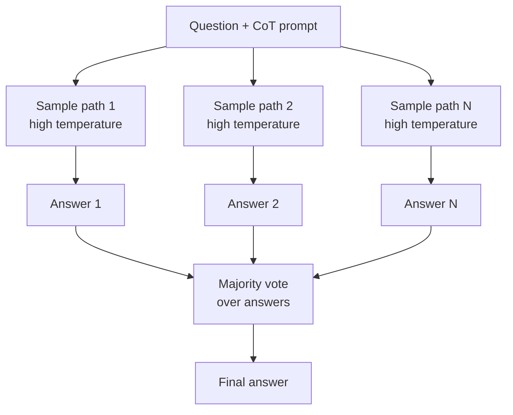

# Autocohérence

## Définition

L'autocohérence est une stratégie de décodage pour les LLM qui remplace la réponse single-path de la chaîne de pensée (CoT) par un ensemble de chemins de raisonnement diversifiés, puis sélectionne la réponse finale par vote majoritaire. Au lieu de se fier à un seul chaîne de pensée (qui peut contenir une erreur de raisonnement fatale), vous échantillonnez N chemins de pensée indépendants à température plus élevée et prenez la réponse qui émerge le plus souvent. Cette simple idée améliore de manière fiable la précision sur l'arithmétique, le raisonnement logique et les tâches de QR factuelle sans nécessiter d'entraînement supplémentaire ou de feedback externe.

L'intuition est que les processus de raisonnement corrects tendent à converger vers la bonne réponse par de multiples routes, tandis que les erreurs sont plus aléatoires. En agrégeant N tentatives, le signal correct s'amplifie et le bruit stochastique se moyenne. La méthode est complémentaire à la CoT de base : vous avez toujours besoin d'un prompt CoT efficace ; l'autocohérence ajoute simplement de la robustesse en exécutant ce prompt plusieurs fois.

## Comment ça fonctionne



### Étape 1 : Prompt CoT

Construire un prompt CoT de base — soit avec des exemples few-shot qui montrent un raisonnement étape par étape, soit avec une instruction zero-shot comme "Raisonnons étape par étape". Ce prompt reste fixe pour tous les chemins.

### Étape 2 : Échantillonnage avec température

Définir une température > 0 (typiquement 0,5–1,0) pour encourager la diversité. Échantillonner N complétions indépendantes — chaque run produit un chemin de raisonnement différent et un label de réponse final. N est typiquement dans la plage 5–40 selon le budget de coût et la complexité de la tâche.

### Étape 3 : Vote majoritaire

Extraire la réponse finale de chaque chemin (souvent la dernière ligne ou un token de réponse clairement délimité). Agréger par vote majoritaire — la réponse qui apparaît le plus souvent gagne. Pour les réponses à texte libre, vous devrez normaliser les réponses (correspondance de chaîne, LLM-as-judge, ou expressions régulières) avant de voter.

## Quand utiliser / Quand NE PAS utiliser

| Scénario | Paramètres recommandés | Éviter |
|----------|------------------------|--------|
| Raisonnement arithmétique et mathématique | N=10–20, température=0,7 | Temperature=0 — tous les chemins seraient identiques |
| QR factuelle à réponse courte | N=5–10, température=0,5 | Sorties très longues — le coût N× est prohibitif |
| Raisonnement logique et symbolique | N=10–20, température=0,8 | Tâches créatives — la cohérence n'est pas un objectif utile ici |
| Problèmes d'algèbre et de preuves | N=20–40, température=0,7 | Contraintes de latence strictes — N appels = N× le délai |
| Annotation de données (auto-étiquetage) | N=5, vote comme label de confiance | Tâches de génération de texte libre — difficile à voter de manière fiable |

## Exemples de code

### Autocohérence avec raisonnement mathématique

```python
# Self-consistency for math reasoning
# pip install openai

import os, re, collections
from openai import OpenAI

client = OpenAI(api_key=os.environ["OPENAI_API_KEY"])

COT_SYSTEM = (
    "You are a math tutor. Solve step by step, then write "
    "'Answer: <number>' on the last line."
)

PROBLEM = (
    "A store sells apples for $0.50 each and oranges for $0.75 each. "
    "If Alice buys 4 apples and 3 oranges, how much does she spend in total?"
)


def sample_path(problem: str) -> str:
    resp = client.chat.completions.create(
        model="gpt-4o",
        messages=[
            {"role": "system", "content": COT_SYSTEM},
            {"role": "user", "content": problem},
        ],
        temperature=0.7,
        max_tokens=300,
    )
    return resp.choices[0].message.content.strip()


def extract_answer(path: str) -> str | None:
    match = re.search(r"Answer:\s*\$?([\d.]+)", path, re.IGNORECASE)
    return match.group(1) if match else None


def self_consistent_answer(problem: str, n: int = 10) -> str:
    paths = [sample_path(problem) for _ in range(n)]
    answers = [extract_answer(p) for p in paths]
    valid = [a for a in answers if a is not None]

    if not valid:
        return "Could not extract a consistent answer."

    counter = collections.Counter(valid)
    winner, count = counter.most_common(1)[0]
    print(f"Vote distribution: {dict(counter)}")
    return f"${winner} (voted by {count}/{n} paths)"


if __name__ == "__main__":
    result = self_consistent_answer(PROBLEM, n=10)
    print(f"\nSelf-consistent answer: {result}")
    # Expected: $4.25 (4×0.50 + 3×0.75 = 2.00 + 2.25)
```

### Autocohérence avec Anthropic

```python
# Self-consistency with Anthropic for logical reasoning
# pip install anthropic

import os, re, collections
import anthropic

client = anthropic.Anthropic(api_key=os.environ["ANTHROPIC_API_KEY"])

SYSTEM = (
    "Solve the following logic problem step by step. "
    "At the very end, write 'Answer: <your answer>' on its own line."
)

PROBLEM = (
    "All mammals are warm-blooded. Dolphins are mammals. "
    "Some warm-blooded animals live in the ocean. "
    "Is it necessarily true that dolphins are warm-blooded? "
    "Answer Yes or No."
)


def sample(problem: str) -> str:
    resp = client.messages.create(
        model="claude-opus-4-5",
        max_tokens=300,
        system=SYSTEM,
        messages=[{"role": "user", "content": problem}],
        temperature=0.6,
    )
    return resp.content[0].text.strip()


def extract(text: str) -> str | None:
    m = re.search(r"Answer:\s*(Yes|No)", text, re.IGNORECASE)
    return m.group(1).capitalize() if m else None


if __name__ == "__main__":
    n = 8
    paths = [sample(PROBLEM) for _ in range(n)]
    answers = [extract(p) for p in paths]
    valid = [a for a in answers if a]

    counter = collections.Counter(valid)
    print("Vote distribution:", dict(counter))

    if valid:
        winner = counter.most_common(1)[0][0]
        print(f"Self-consistent answer: {winner}")   # Expected: Yes
```

## Ressources pratiques

- [Wang et al., 2022 — Self-Consistency improves Chain-of-Thought Reasoning in LLMs](https://arxiv.org/abs/2203.11171) — Article fondateur : démontre des améliorations de précision significatives sur GSM8K, MATH et des benchmarks de raisonnement en remplaçant le décodage vorace par un vote majoritaire d'échantillonnage
- [Wei et al., 2022 — Chain-of-Thought Prompting Elicits Reasoning in LLMs](https://arxiv.org/abs/2201.11903) — L'article CoT original dont l'autocohérence est une extension ; fournit la base et les benchmarks
- [Fu et al., 2022 — Complexity-Based Prompting for Multi-Step Reasoning](https://arxiv.org/abs/2210.00720) — Montre que sélectionner des réponses CoT par complexité de raisonnement (longueur des étapes) améliore encore l'autocohérence
- [Liang et al., 2023 — Encouraging Divergent Thinking in LLMs](https://arxiv.org/abs/2305.19118) — Prompting par décomposition multiple (DECOMP) pour diversifier les chemins de raisonnement au-delà de la variation de température

## Voir aussi

- [Ingénierie des prompts](/docs/prompt-engineering)
- [Chaîne de pensée](/docs/reasoning-patterns/cot)
- [Assemblage de prompts](/docs/prompt-engineering/prompt-ensembling)
- [Température, Top-K, Top-P](/docs/prompt-engineering/temperature-top-k-top-p)
- [Auto-évaluation et calibration](/docs/prompt-engineering/self-evaluation-calibration)
- [LLMs](/docs/llms)
