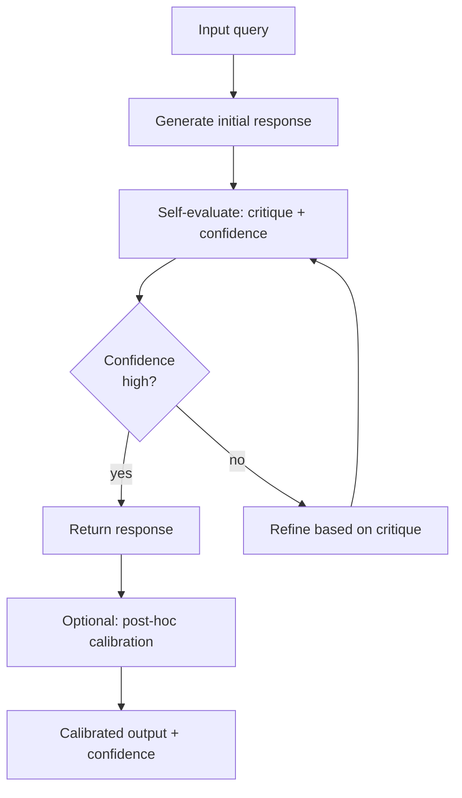

# Auto-évaluation et calibration

## Définition

L'auto-évaluation est la capacité d'un LLM à critiquer, noter ou affiner ses propres sorties sans supervision humaine. La calibration fait référence à l'alignement entre la confiance rapportée par un modèle et sa précision réelle — un modèle bien calibré qui dit "je suis sûr à 80%" devrait être correct 80% du temps pour ces affirmations. Ensemble, ces capacités permettent aux pipelines LLM de s'améliorer itérativement, de marquer les réponses incertaines pour examen humain et de fournir des estimations d'incertitude exploitables.

L'auto-évaluation prend plusieurs formes. Le **self-critique** demande au modèle de revoir sa propre sortie et d'identifier les erreurs ou omissions. La **notation de confiance** incite le modèle à exprimer son incertitude sur sa réponse, soit verbalement ("Je suis assez sûr...") soit numériquement (un score de 0–100). La **correction itérative** utilise ces critiques pour affiner la sortie en plusieurs tours. La **calibration de probabilité** est un processus post-hoc qui ajuste les probabilités de sortie d'un modèle pour qu'elles correspondent à la précision empirique sur un ensemble de validation.

## Comment ça fonctionne



### Auto-critique en un seul tour

La forme la plus simple d'auto-évaluation consiste à demander au modèle de revoir sa propre réponse dans le même tour de conversation. Après avoir généré une réponse initiale, vous ajoutez un suivi : "Examine ta réponse précédente. Y a-t-il des erreurs, omissions ou formulations trompeuses ? Si oui, fournis une version corrigée." Cela coûte un appel LLM supplémentaire mais améliore souvent la qualité pour des tâches factuelles et analytiques.

### Notation de confiance

Inviter explicitement les modèles à exprimer leur incertitude produit souvent des estimations de confiance utiles. Des prompts comme "Réponds, puis évalue ta confiance sur une échelle de 1–10 avec justification" ou "Si tu n'es pas sûr, dis-le clairement" peuvent aider à identifier les cas limites. Cependant, notez que les LLM sont connus pour être mal calibrés — ils peuvent exprimer une haute confiance tout en étant incorrects — donc les scores auto-rapportés doivent être validés empiriquement sur des ensembles de données de référence.

### Calibration post-hoc

La calibration de probabilité tente de corriger la courbe de confiance du modèle. La mise à l'échelle de Platt et le binning de Platt apprennent une transformation monotone sur les scores bruts du modèle pour qu'ils correspondent aux taux de précision empiriques. L'étalonnage de la température divise les logits du modèle par un paramètre de température T appris sur un ensemble de validation (distinct de l'ensemble de test). Ces méthodes sont particulièrement importantes dans les applications à enjeux élevés où la confiance mal calibrée peut avoir de graves conséquences.

## Quand utiliser / Quand NE PAS utiliser

| Scénario | Recommandé | Éviter |
|----------|------------|--------|
| Extraction de faits de haute précision | Auto-critique + étalonnage de la température | Aucun mécanisme d'auto-vérification — les hallucinations passent sans signalétique |
| Annotation automatique de données | Score de confiance + filtre seuil | Accepter toutes les annotations auto-générées sans filtrage par confiance |
| Systèmes à enjeux élevés (médical, juridique) | Calibration post-hoc + règles d'escalade humaine | Se fier aux scores de confiance auto-rapportés sans validation empirique |
| QR en temps réel avec latence contrainte | Auto-critique légère en un seul tour | Boucles de raffinement multi-tours — latence trop élevée |
| Jeu de données de test / fiabilité des évaluations | Calibration + courbes de fiabilité | Utiliser des probabilités brutes non calibrées pour des décisions de seuillage |

## Exemples de code

### Auto-critique et raffinement itératif

```python
# Self-evaluation with iterative refinement
# pip install openai

import os
from openai import OpenAI

client = OpenAI(api_key=os.environ["OPENAI_API_KEY"])


def generate(prompt: str) -> str:
    resp = client.chat.completions.create(
        model="gpt-4o",
        messages=[{"role": "user", "content": prompt}],
        temperature=0.3,
        max_tokens=512,
    )
    return resp.choices[0].message.content.strip()


def self_critique(response: str, task: str) -> str:
    critique_prompt = (
        f"Task: {task}\n\n"
        f"Response to evaluate:\n{response}\n\n"
        "Identify any factual errors, logical gaps, missing important points, "
        "or unclear statements in the response above. "
        "Be specific. If the response is fully correct and complete, say 'No issues found.'"
    )
    return generate(critique_prompt)


def refine(response: str, critique: str, task: str) -> str:
    refine_prompt = (
        f"Task: {task}\n\n"
        f"Original response:\n{response}\n\n"
        f"Critique:\n{critique}\n\n"
        "Write an improved response that addresses all the issues raised in the critique."
    )
    return generate(refine_prompt)


def self_evaluate_pipeline(task: str, max_rounds: int = 2) -> str:
    response = generate(task)
    print(f"Initial response:\n{response}\n")

    for round_num in range(1, max_rounds + 1):
        critique = self_critique(response, task)
        print(f"Round {round_num} critique:\n{critique}\n")

        if "no issues found" in critique.lower():
            print("Self-evaluation: response accepted.")
            break

        response = refine(response, critique, task)
        print(f"Round {round_num} refined response:\n{response}\n")

    return response


if __name__ == "__main__":
    task = (
        "Explain the difference between supervised and unsupervised learning "
        "in machine learning. Include one example of each."
    )
    final = self_evaluate_pipeline(task, max_rounds=2)
    print("=== FINAL RESPONSE ===")
    print(final)
```

### Score de confiance avec Anthropic

```python
# Confidence scoring and calibration check
# pip install anthropic

import os, re
import anthropic

client = anthropic.Anthropic(api_key=os.environ["ANTHROPIC_API_KEY"])

QA_PAIRS = [
    ("What is the chemical symbol for gold?", "Au"),
    ("Who wrote 'Pride and Prejudice'?", "Jane Austen"),
    ("What is the square root of 144?", "12"),
    ("In what year did World War II end?", "1945"),
    ("What is the capital of Brazil?", "Brasília"),
]


def ask_with_confidence(question: str) -> tuple[str, int]:
    prompt = (
        f"Question: {question}\n\n"
        "Answer the question, then on a new line write: "
        "'Confidence: X/10' where X is your confidence (1=very unsure, 10=certain)."
    )
    resp = client.messages.create(
        model="claude-opus-4-5",
        max_tokens=150,
        messages=[{"role": "user", "content": prompt}],
        temperature=0,
    )
    text = resp.content[0].text.strip()
    confidence_match = re.search(r"Confidence:\s*(\d+)/10", text)
    confidence = int(confidence_match.group(1)) if confidence_match else 5
    answer_text = re.sub(r"\nConfidence:.*", "", text).strip()
    return answer_text, confidence


def calibration_report(qa_pairs: list[tuple]) -> None:
    high_conf_correct = 0
    high_conf_total = 0
    low_conf_correct = 0
    low_conf_total = 0

    for question, expected in qa_pairs:
        answer, confidence = ask_with_confidence(question)
        correct = expected.lower() in answer.lower()
        print(f"Q: {question}")
        print(f"A: {answer[:80]} | Confidence: {confidence}/10 | Correct: {correct}")
        print()

        if confidence >= 8:
            high_conf_total += 1
            if correct:
                high_conf_correct += 1
        else:
            low_conf_total += 1
            if correct:
                low_conf_correct += 1

    print("=== Calibration Summary ===")
    if high_conf_total:
        print(f"High confidence (>=8): {high_conf_correct}/{high_conf_total} correct "
              f"({100*high_conf_correct/high_conf_total:.0f}%)")
    if low_conf_total:
        print(f"Lower confidence (<8): {low_conf_correct}/{low_conf_total} correct "
              f"({100*low_conf_correct/low_conf_total:.0f}%)")


if __name__ == "__main__":
    calibration_report(QA_PAIRS)
```

## Ressources pratiques

- [Kadavath et al., 2022 — Language Models (Mostly) Know What They Know](https://arxiv.org/abs/2207.05221) — Article d'Anthropic étudiant l'auto-connaissance des LLM ; les modèles peuvent estimer la probabilité que leurs réponses soient correctes
- [Guo et al., 2017 — On Calibration of Modern Neural Networks](https://arxiv.org/abs/1706.04599) — Introduit les diagrammes de fiabilité et l'étalonnage de la température pour les réseaux neuronaux ; applicable aux sorties LLM
- [Madaan et al., 2023 — Self-Refine: Iterative Refinement with Self-Feedback](https://arxiv.org/abs/2303.17651) — Démontre l'auto-raffinement sur la génération de code, l'essai et la résolution de problèmes mathématiques
- [Shinn et al., 2023 — Reflexion: Language Agents with Verbal Reinforcement Learning](https://arxiv.org/abs/2303.11366) — Les agents utilisent la réflexion verbale sur les tentatives passées pour améliorer les performances futures

## Voir aussi

- [Ingénierie des prompts](/docs/prompt-engineering)
- [Autocohérence](/docs/prompt-engineering/self-consistency)
- [Assemblage de prompts](/docs/prompt-engineering/prompt-ensembling)
- [Techniques de désensibilisation](/docs/prompt-engineering/debiasing-techniques)
- [Chaîne de pensée](/docs/reasoning-patterns/cot)
- [LLMs](/docs/llms)
